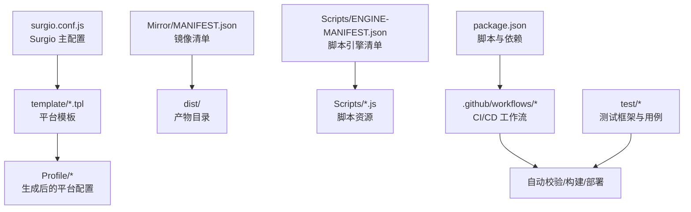
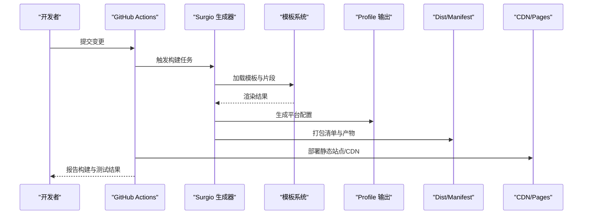
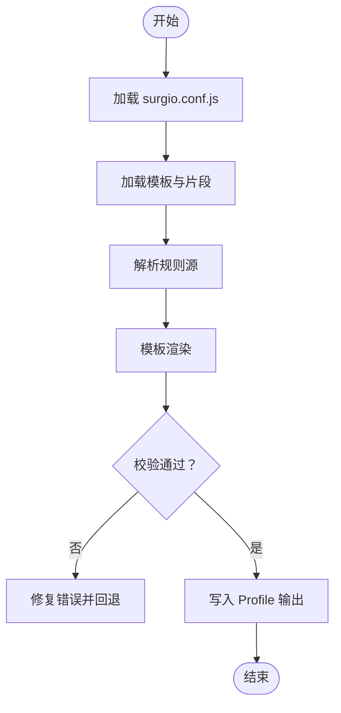
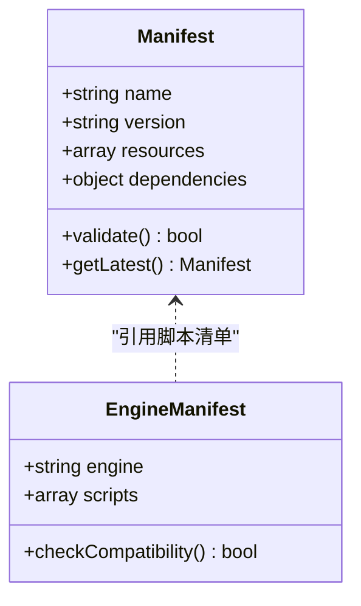
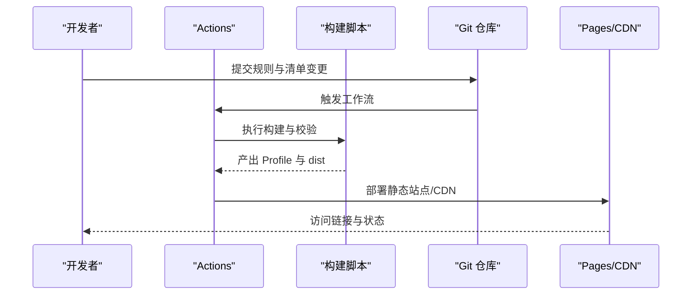
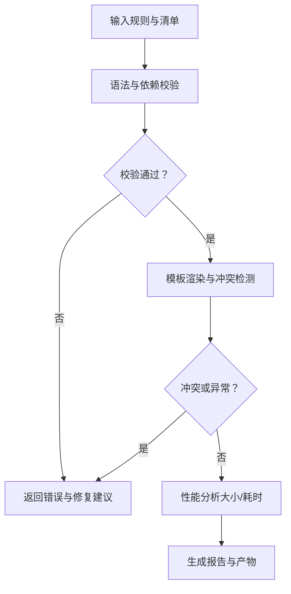
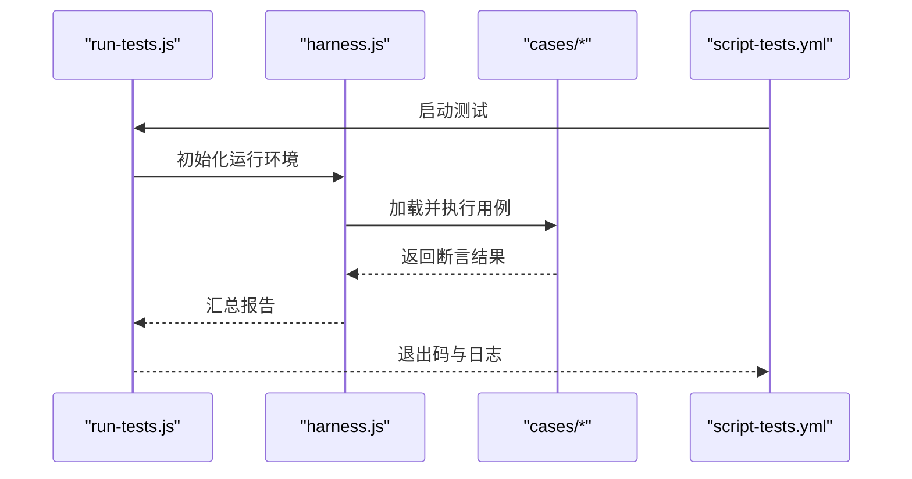
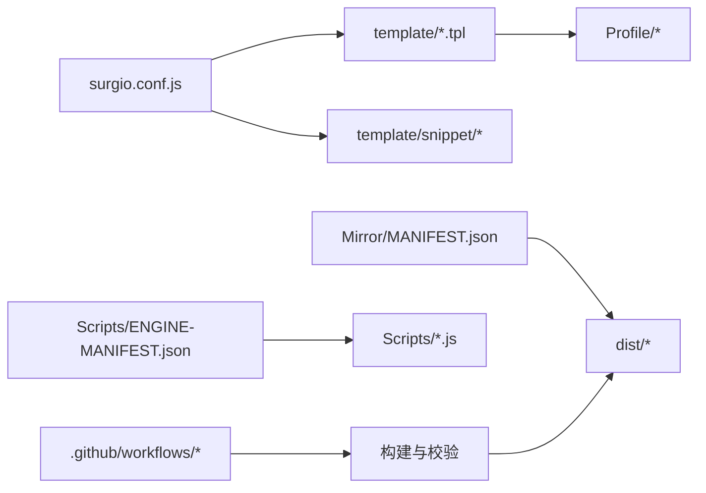

# 规则管理工具

<cite>
**本文引用的文件**   
- [README.md](file://README.md)
- [package.json](file://package.json)
- [surgio.conf.js](file://surgio.conf.js)
- [template/loon.tpl](file://template/loon.tpl)
- [template/quantumultx.tpl](file://template/quantumultx.tpl)
- [template/surge.tpl](file://template/surge.tpl)
- [Profile/Loon.lcf](file://Profile/Loon.lcf)
- [Profile/QX.conf](file://Profile/QX.conf)
- [Profile/Surge.conf](file://Profile/Surge.conf)
- [Mirror/MANIFEST.json](file://Mirror/MANIFEST.json)
- [Scripts/ENGINE-MANIFEST.json](file://Scripts/ENGINE-MANIFEST.json)
- [test/harness.js](file://test/harness.js)
- [test/run-tests.js](file://test/run-tests.js)
- [test/cases/purify-scripts.test.js](file://test/cases/purify-scripts.test.js)
- [test/cases/qidian-wrapper.test.js](file://test/cases/qidian-wrapper.test.js)
- [test/cases/zhihu-cainiao.test.js](file://test/cases/zhihu-cainiao.test.js)
- [test/cases/zhihuifangdong.test.js](file://test/cases/zhihuifangdong.test.js)
- [.github/workflows/config-validate.yml](file://.github/workflows/config-validate.yml)
- [.github/workflows/script-tests.yml](file://.github/workflows/script-tests.yml)
- [.github/workflows/surgio-build.yml](file://.github/workflows/surgio-build.yml)
- [.github/workflows/pages-deploy.yml](file://.github/workflows/pages-deploy.yml)
- [.github/workflows/cdn-verify.yml](file://.github/workflows/cdn-verify.yml)
- [eslint.config.mjs](file://eslint.config.mjs)
</cite>

## 目录
1. [简介](#简介)
2. [项目结构](#项目结构)
3. [核心组件](#核心组件)
4. [架构总览](#架构总览)
5. [详细组件分析](#详细组件分析)
6. [依赖关系分析](#依赖关系分析)
7. [性能考量](#性能考量)
8. [故障排查指南](#故障排查指南)
9. [结论](#结论)
10. [附录](#附录)

## 简介
本仓库是一个面向多平台（Surge、Quantumult X、Loon）的规则管理与配置生成系统。其目标包括：
- 统一的规则清单文件格式与版本管理
- 规则包的发布、更新与部署流程
- 规则验证、冲突检测与性能分析
- 规则集的组织结构与命名规范
- Surgio 配置生成器与多平台兼容性处理
- 规则测试框架与自动化验证流程

该体系通过模板化构建、清单驱动与 CI/CD 流水线，实现从规则定义到多平台分发的全链路自动化。

## 项目结构
仓库采用按功能域划分的目录组织方式：
- Profile：各平台的最终配置文件输出
- template：Surgio 模板与片段，用于生成不同平台配置
- Mirror：镜像与清单（MANIFEST），用于分发与版本控制
- Scripts：脚本引擎清单与脚本资源
- Plugin：插件式规则集合
- test：测试用例与运行器
- .github/workflows：CI/CD 工作流（校验、构建、部署、健康检查）
- surgio.conf.js：Surgio 主配置入口
- package.json：依赖与脚本命令
- eslint.config.mjs：代码质量与风格检查

图表来源
- [surgio.conf.js](file://surgio.conf.js)
- [template/loon.tpl](file://template/loon.tpl)
- [template/quantumultx.tpl](file://template/quantumultx.tpl)
- [template/surge.tpl](file://template/surge.tpl)
- [Profile/Loon.lcf](file://Profile/Loon.lcf)
- [Profile/QX.conf](file://Profile/QX.conf)
- [Profile/Surge.conf](file://Profile/Surge.conf)
- [Mirror/MANIFEST.json](file://Mirror/MANIFEST.json)
- [Scripts/ENGINE-MANIFEST.json](file://Scripts/ENGINE-MANIFEST.json)
- [.github/workflows/config-validate.yml](file://.github/workflows/config-validate.yml)
- [.github/workflows/surgio-build.yml](file://.github/workflows/surgio-build.yml)
- [.github/workflows/pages-deploy.yml](file://.github/workflows/pages-deploy.yml)
- [.github/workflows/cdn-verify.yml](file://.github/workflows/cdn-verify.yml)
- [package.json](file://package.json)

章节来源
- [README.md](file://README.md)
- [package.json](file://package.json)
- [surgio.conf.js](file://surgio.conf.js)

## 核心组件
- Surgio 配置生成器
  - 通过 surgio.conf.js 定义规则源、模板映射与输出路径，将统一规则转换为 Surge、QX、Loon 等平台格式。
- 模板系统
  - template/*.tpl 提供平台特定语法与片段；snippet 目录存放可复用的规则片段。
- 清单与版本管理
  - Mirror/MANIFEST.json 描述镜像包元数据与版本；Scripts/ENGINE-MANIFEST.json 描述脚本引擎清单。
- 测试框架
  - test/harness.js 与 test/run-tests.js 提供测试运行器；test/cases 下为具体用例。
- CI/CD 流水线
  - .github/workflows 下的多个工作流负责配置校验、脚本测试、Surgio 构建与页面部署、CDN 校验等。

章节来源
- [surgio.conf.js](file://surgio.conf.js)
- [template/loon.tpl](file://template/loon.tpl)
- [template/quantumultx.tpl](file://template/quantumultx.tpl)
- [template/surge.tpl](file://template/surge.tpl)
- [Mirror/MANIFEST.json](file://Mirror/MANIFEST.json)
- [Scripts/ENGINE-MANIFEST.json](file://Scripts/ENGINE-MANIFEST.json)
- [test/harness.js](file://test/harness.js)
- [test/run-tests.js](file://test/run-tests.js)
- [.github/workflows/config-validate.yml](file://.github/workflows/config-validate.yml)
- [.github/workflows/script-tests.yml](file://.github/workflows/script-tests.yml)
- [.github/workflows/surgio-build.yml](file://.github/workflows/surgio-build.yml)
- [.github/workflows/pages-deploy.yml](file://.github/workflows/pages-deploy.yml)
- [.github/workflows/cdn-verify.yml](file://.github/workflows/cdn-verify.yml)

## 架构总览
整体架构围绕“规则定义 → 模板渲染 → 多平台输出 → 清单与分发 → CI/CD 校验与部署”展开。Surgio 作为编排中心，读取统一规则与模板，生成各平台配置；清单文件用于版本与依赖声明；测试与校验在 CI 中执行，确保质量与一致性。

图表来源
- [.github/workflows/surgio-build.yml](file://.github/workflows/surgio-build.yml)
- [.github/workflows/pages-deploy.yml](file://.github/workflows/pages-deploy.yml)
- [.github/workflows/cdn-verify.yml](file://.github/workflows/cdn-verify.yml)
- [surgio.conf.js](file://surgio.conf.js)
- [template/loon.tpl](file://template/loon.tpl)
- [template/quantumultx.tpl](file://template/quantumultx.tpl)
- [template/surge.tpl](file://template/surge.tpl)
- [Profile/Loon.lcf](file://Profile/Loon.lcf)
- [Profile/QX.conf](file://Profile/QX.conf)
- [Profile/Surge.conf](file://Profile/Surge.conf)
- [Mirror/MANIFEST.json](file://Mirror/MANIFEST.json)

## 详细组件分析

### Surgio 配置生成器与多平台兼容
- 作用
  - 读取统一规则源与模板，生成 Surge、Quantumult X、Loon 的配置文件。
- 关键文件
  - surgio.conf.js：定义规则源、模板映射、输出路径与构建选项。
  - template/*.tpl：平台模板，包含语法差异与变量替换逻辑。
  - Profile/*：生成的最终配置文件。
- 兼容性处理要点
  - 不同平台对规则语法、字段名、作用域存在差异，模板层进行适配转换。
  - 片段（snippet）提供跨平台复用能力，减少重复与不一致。

图表来源
- [surgio.conf.js](file://surgio.conf.js)
- [template/loon.tpl](file://template/loon.tpl)
- [template/quantumultx.tpl](file://template/quantumultx.tpl)
- [template/surge.tpl](file://template/surge.tpl)
- [Profile/Loon.lcf](file://Profile/Loon.lcf)
- [Profile/QX.conf](file://Profile/QX.conf)
- [Profile/Surge.conf](file://Profile/Surge.conf)

章节来源
- [surgio.conf.js](file://surgio.conf.js)
- [template/loon.tpl](file://template/loon.tpl)
- [template/quantumultx.tpl](file://template/quantumultx.tpl)
- [template/surge.tpl](file://template/surge.tpl)
- [Profile/Loon.lcf](file://Profile/Loon.lcf)
- [Profile/QX.conf](file://Profile/QX.conf)
- [Profile/Surge.conf](file://Profile/Surge.conf)

### 规则清单文件格式与版本管理
- 清单文件
  - Mirror/MANIFEST.json：描述镜像包元数据（名称、版本、依赖、资源列表）。
  - Scripts/ENGINE-MANIFEST.json：描述脚本引擎清单（脚本名、版本、依赖）。
- 版本管理策略
  - 通过清单文件的版本号与资源哈希进行增量更新与回滚。
  - 构建产物输出至 dist，便于发布与回滚。
- 依赖关系
  - 规则与脚本之间通过清单声明依赖，避免循环与缺失。

图表来源
- [Mirror/MANIFEST.json](file://Mirror/MANIFEST.json)
- [Scripts/ENGINE-MANIFEST.json](file://Scripts/ENGINE-MANIFEST.json)

章节来源
- [Mirror/MANIFEST.json](file://Mirror/MANIFEST.json)
- [Scripts/ENGINE-MANIFEST.json](file://Scripts/ENGINE-MANIFEST.json)

### 规则包的发布、更新与部署流程
- 发布流程
  - 本地或 CI 执行构建，生成 Profile 与 dist 产物。
  - 更新 MANIFEST 版本号与资源列表。
  - 推送至 Pages/CDN，供客户端拉取。
- 更新策略
  - 增量更新：仅变更清单与受影响资源。
  - 灰度发布：先小范围验证，再全量发布。
- 部署自动化
  - GitHub Actions 工作流负责构建、校验与部署。

图表来源
- [.github/workflows/surgio-build.yml](file://.github/workflows/surgio-build.yml)
- [.github/workflows/pages-deploy.yml](file://.github/workflows/pages-deploy.yml)
- [.github/workflows/cdn-verify.yml](file://.github/workflows/cdn-verify.yml)
- [package.json](file://package.json)

章节来源
- [.github/workflows/surgio-build.yml](file://.github/workflows/surgio-build.yml)
- [.github/workflows/pages-deploy.yml](file://.github/workflows/pages-deploy.yml)
- [.github/workflows/cdn-verify.yml](file://.github/workflows/cdn-verify.yml)
- [package.json](file://package.json)

### 规则验证工具、冲突检测与性能分析
- 验证工具
  - 配置校验工作流：检查模板语法、字段合法性与依赖完整性。
  - 脚本测试工作流：执行单元测试与集成测试，确保脚本行为正确。
- 冲突检测
  - 基于清单与模板渲染结果进行规则去重与冲突告警。
  - 通过 ESLint 与自定义校验脚本保证代码风格与一致性。
- 性能分析
  - 构建耗时统计与产物大小监控。
  - 规则数量与复杂度阈值限制，避免过大清单影响加载。

图表来源
- [.github/workflows/config-validate.yml](file://.github/workflows/config-validate.yml)
- [.github/workflows/script-tests.yml](file://.github/workflows/script-tests.yml)
- [eslint.config.mjs](file://eslint.config.mjs)

章节来源
- [.github/workflows/config-validate.yml](file://.github/workflows/config-validate.yml)
- [.github/workflows/script-tests.yml](file://.github/workflows/script-tests.yml)
- [eslint.config.mjs](file://eslint.config.mjs)

### 规则集的组织结构与命名规范
- 目录组织
  - Rule 清单：按平台与用途分类（如广告、隐私、地区等）。
  - 插件（Plugin）：按应用或服务划分，便于按需启用。
  - 脚本（Scripts）：按引擎与功能划分，清单化管理。
- 命名规范
  - 使用小写英文与连字符，避免特殊字符。
  - 清单与插件文件名体现用途与平台（如 qx-*.conf、loon-*.list）。
  - 脚本文件以功能命名，并在清单中声明版本与依赖。

章节来源
- [Mirror/rules](file://Mirror/rules)
- [Plugin](file://Plugin)
- [Scripts](file://Scripts)

### 测试框架与自动化验证流程
- 测试框架
  - harness.js：测试运行器，负责加载用例与收集结果。
  - run-tests.js：命令行入口，支持并行与过滤执行。
  - cases/*：具体测试用例，覆盖脚本行为与规则逻辑。
- 自动化流程
  - script-tests.yml：执行测试用例，生成报告。
  - config-validate.yml：校验配置与模板。
  - surgio-build.yml：构建与打包。
  - pages-deploy.yml：部署静态站点。
  - cdn-verify.yml：验证 CDN 可用性。

图表来源
- [test/run-tests.js](file://test/run-tests.js)
- [test/harness.js](file://test/harness.js)
- [test/cases/purify-scripts.test.js](file://test/cases/purify-scripts.test.js)
- [test/cases/qidian-wrapper.test.js](file://test/cases/qidian-wrapper.test.js)
- [test/cases/zhihu-cainiao.test.js](file://test/cases/zhihu-cainiao.test.js)
- [test/cases/zhihuifangdong.test.js](file://test/cases/zhihuifangdong.test.js)
- [.github/workflows/script-tests.yml](file://.github/workflows/script-tests.yml)

章节来源
- [test/harness.js](file://test/harness.js)
- [test/run-tests.js](file://test/run-tests.js)
- [test/cases/purify-scripts.test.js](file://test/cases/purify-scripts.test.js)
- [test/cases/qidian-wrapper.test.js](file://test/cases/qidian-wrapper.test.js)
- [test/cases/zhihu-cainiao.test.js](file://test/cases/zhihu-cainiao.test.js)
- [test/cases/zhihuifangdong.test.js](file://test/cases/zhihuifangdong.test.js)
- [.github/workflows/script-tests.yml](file://.github/workflows/script-tests.yml)

## 依赖关系分析
- 内部依赖
  - surgio.conf.js 依赖 template 与 snippet，生成 Profile。
  - Mirror/MANIFEST.json 与 Scripts/ENGINE-MANIFEST.json 共同管理资源与脚本依赖。
- 外部依赖
  - Node.js 环境与 npm 脚本。
  - GitHub Actions 提供的 CI/CD 服务。
  - ESLint 与测试框架（由 package.json 声明）。

图表来源
- [surgio.conf.js](file://surgio.conf.js)
- [template/loon.tpl](file://template/loon.tpl)
- [template/quantumultx.tpl](file://template/quantumultx.tpl)
- [template/surge.tpl](file://template/surge.tpl)
- [Profile/Loon.lcf](file://Profile/Loon.lcf)
- [Profile/QX.conf](file://Profile/QX.conf)
- [Profile/Surge.conf](file://Profile/Surge.conf)
- [Mirror/MANIFEST.json](file://Mirror/MANIFEST.json)
- [Scripts/ENGINE-MANIFEST.json](file://Scripts/ENGINE-MANIFEST.json)
- [.github/workflows/config-validate.yml](file://.github/workflows/config-validate.yml)
- [.github/workflows/script-tests.yml](file://.github/workflows/script-tests.yml)
- [.github/workflows/surgio-build.yml](file://.github/workflows/surgio-build.yml)
- [.github/workflows/pages-deploy.yml](file://.github/workflows/pages-deploy.yml)
- [.github/workflows/cdn-verify.yml](file://.github/workflows/cdn-verify.yml)

章节来源
- [package.json](file://package.json)
- [eslint.config.mjs](file://eslint.config.mjs)

## 性能考量
- 构建优化
  - 缓存依赖与中间产物，减少重复计算。
  - 并行执行测试与校验任务。
- 清单优化
  - 拆分大清单为模块，按需加载。
  - 使用增量更新，降低带宽与解析开销。
- 运行时性能
  - 规则去重与排序，提升匹配效率。
  - 脚本体积与复杂度限制，避免影响客户端性能。

[本节为通用指导，不直接分析具体文件]

## 故障排查指南
- 常见错误
  - 模板语法错误：检查 template 与 surgio.conf.js 中的变量与占位符。
  - 清单版本不一致：核对 MANIFEST 与 dist 产物版本。
  - 脚本测试失败：查看 test 报告与日志，定位用例失败原因。
- 排查步骤
  - 本地运行测试与构建，确认问题可复现。
  - 检查 CI 日志与工作流状态。
  - 逐步缩小范围，隔离问题模块。

章节来源
- [.github/workflows/config-validate.yml](file://.github/workflows/config-validate.yml)
- [.github/workflows/script-tests.yml](file://.github/workflows/script-tests.yml)
- [.github/workflows/surgio-build.yml](file://.github/workflows/surgio-build.yml)
- [eslint.config.mjs](file://eslint.config.mjs)

## 结论
本规则管理工具通过 Surgio 生成器、模板系统与清单驱动，实现了多平台规则的标准化与自动化。结合测试框架与 CI/CD 流水线，确保了规则质量与发布可靠性。建议持续优化清单结构与构建性能，完善冲突检测与监控机制，以提升整体稳定性与可维护性。

[本节为总结，不直接分析具体文件]

## 附录
- 快速上手
  - 安装依赖：npm install
  - 本地构建：npm run build
  - 运行测试：npm test
  - 代码检查：npm run lint
- 参考文档
  - README.md：项目说明与使用说明
  - doc/*：审计与生态评估文档

章节来源
- [README.md](file://README.md)
- [package.json](file://package.json)