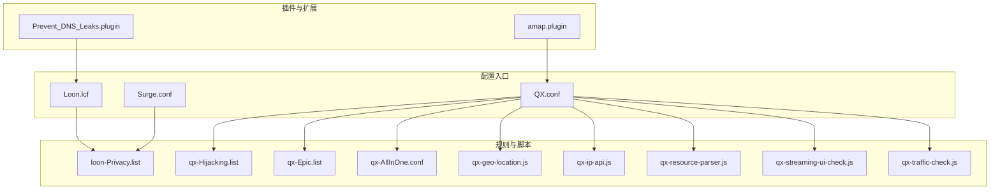
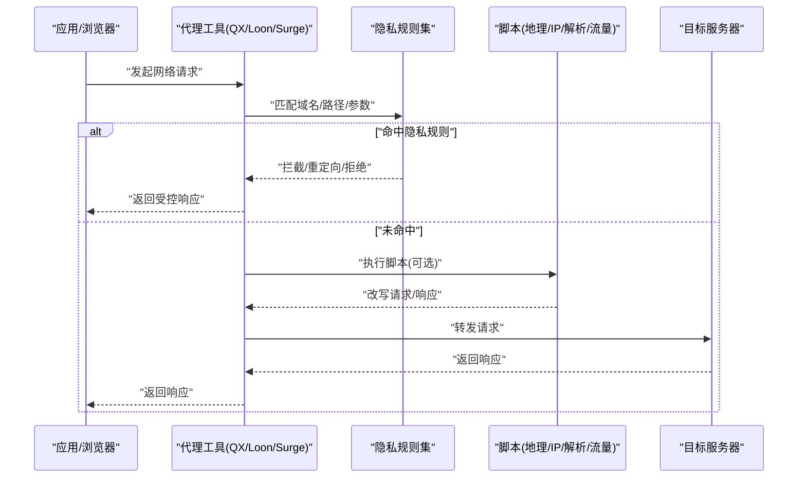
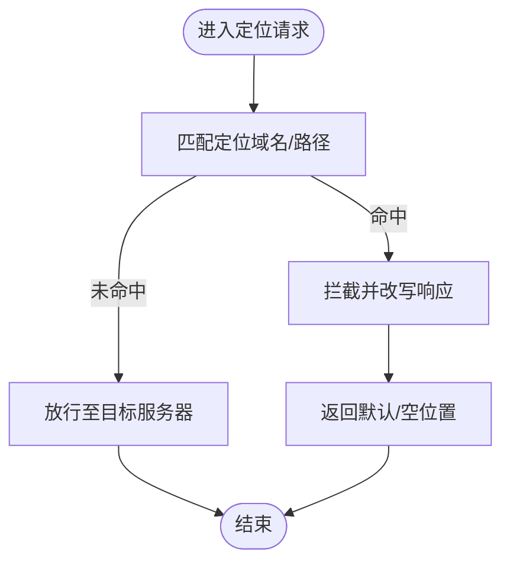
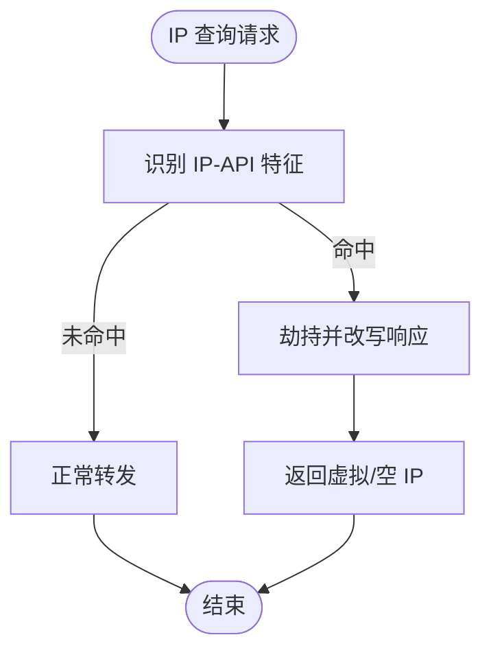
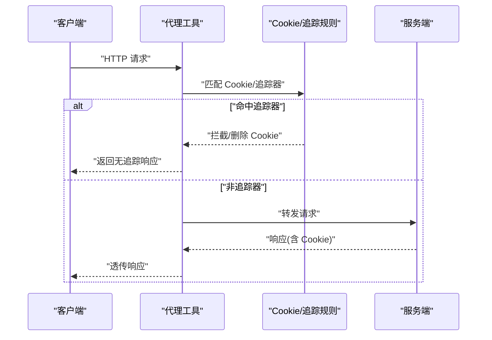
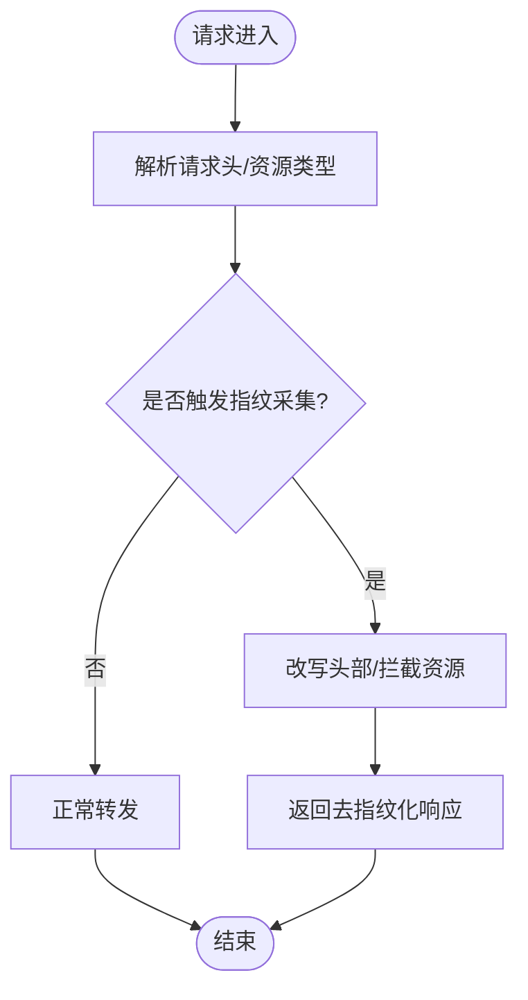
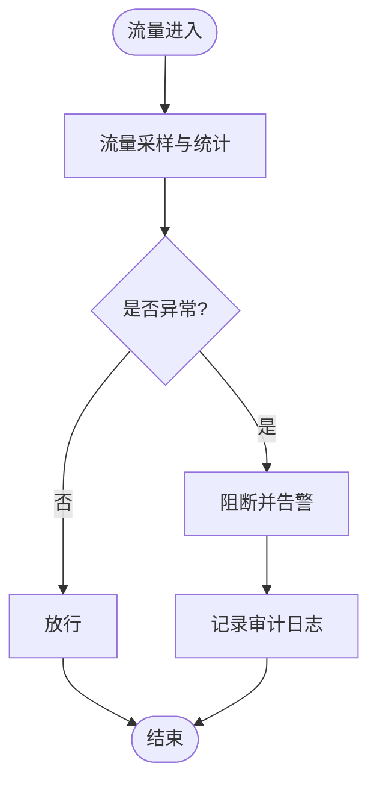
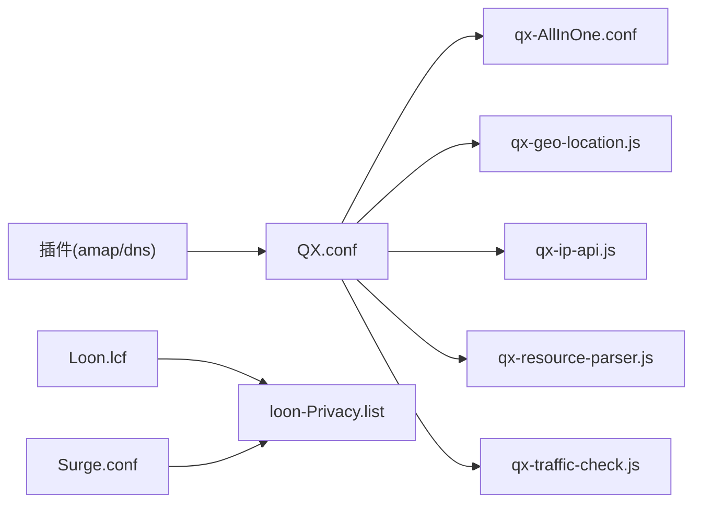

# 隐私保护规则

<cite>
**本文档引用的文件**
- [README.md](file://README.md)
- [surgio.conf.js](file://surgio.conf.js)
- [Mirror/MANIFEST.json](file://Mirror/MANIFEST.json)
- [Profile/Loon.lcf](file://Profile/Loon.lcf)
- [Profile/QX.conf](file://Profile/QX.conf)
- [Profile/Surge.conf](file://Profile/Surge.conf)
- [Mirror/rules/loon-Privacy.list](file://Mirror/rules/loon-Privacy.list)
- [Mirror/rules/qx-Hijacking.list](file://Mirror/rules/qx-Hijacking.list)
- [Mirror/rules/qx-Epic.list](file://Mirror/rules/qx-Epic.list)
- [Mirror/rules/qx-AllInOne.conf](file://Mirror/rules/qx-AllInOne.conf)
- [Mirror/rules/qx-geo-location.js](file://Mirror/rules/qx-geo-location.js)
- [Mirror/rules/qx-ip-api.js](file://Mirror/rules/qx-ip-api.js)
- [Mirror/rules/qx-resource-parser.js](file://Mirror/rules/qx-resource-parser.js)
- [Mirror/rules/qx-streaming-ui-check.js](file://Mirror/rules/qx-streaming-ui-check.js)
- [Mirror/rules/qx-traffic-check.js](file://Mirror/rules/qx-traffic-check.js)
- [Kelee/Prevent_DNS_Leaks.plugin](file://Kelee/Prevent_DNS_Leaks.plugin)
- [Plugin/amap.plugin](file://Plugin/amap.plugin)
</cite>

## 目录
1. [简介](#简介)
2. [项目结构](#项目结构)
3. [核心组件](#核心组件)
4. [架构总览](#架构总览)
5. [详细组件分析](#详细组件分析)
6. [依赖关系分析](#依赖关系分析)
7. [性能考量](#性能考量)
8. [故障排查指南](#故障排查指南)
9. [结论](#结论)
10. [附录](#附录)

## 简介
本仓库提供面向 Loon、Quantumult X（QX）、Surge 等网络工具的隐私保护规则与脚本集合，覆盖以下关键能力：
- 隐私数据收集检测与阻止
- 地理位置信息保护与模拟
- IP 地址隐藏与泄露防护
- Cookie 管理与追踪器拦截
- 网络指纹防护与资源解析增强
- DNS 泄露防护
- 合规性指引（GDPR）与可配置策略

通过集中式清单与脚本化逻辑，用户可按需启用或禁用模块，实现灵活的隐私保护与合规落地。

## 项目结构
本项目采用“规则 + 脚本 + 配置文件”的分层组织方式：
- Profile：各代理工具的主配置文件入口
- Mirror/rules：按工具与场景划分的规则集与脚本
- Plugin：针对特定应用或服务的插件化扩展
- Kelee：轻量级插件（如 DNS 泄露防护）
- surgio.conf.js：构建与分发编排
- MANIFEST.json：镜像与版本元数据

图表来源
- [Profile/Loon.lcf](file://Profile/Loon.lcf)
- [Profile/QX.conf](file://Profile/QX.conf)
- [Profile/Surge.conf](file://Profile/Surge.conf)
- [Mirror/rules/loon-Privacy.list](file://Mirror/rules/loon-Privacy.list)
- [Mirror/rules/qx-Hijacking.list](file://Mirror/rules/qx-Hijacking.list)
- [Mirror/rules/qx-Epic.list](file://Mirror/rules/qx-Epic.list)
- [Mirror/rules/qx-AllInOne.conf](file://Mirror/rules/qx-AllInOne.conf)
- [Mirror/rules/qx-geo-location.js](file://Mirror/rules/qx-geo-location.js)
- [Mirror/rules/qx-ip-api.js](file://Mirror/rules/qx-ip-api.js)
- [Mirror/rules/qx-resource-parser.js](file://Mirror/rules/qx-resource-parser.js)
- [Mirror/rules/qx-streaming-ui-check.js](file://Mirror/rules/qx-streaming-ui-check.js)
- [Mirror/rules/qx-traffic-check.js](file://Mirror/rules/qx-traffic-check.js)
- [Plugin/amap.plugin](file://Plugin/amap.plugin)
- [Kelee/Prevent_DNS_Leaks.plugin](file://Kelee/Prevent_DNS_Leaks.plugin)

章节来源
- [README.md](file://README.md)
- [surgio.conf.js](file://surgio.conf.js)
- [Mirror/MANIFEST.json](file://Mirror/MANIFEST.json)

## 核心组件
- 隐私规则集（Loon/QX/Surge）
  - 用于匹配并拦截隐私相关域名、路径、参数与响应体中的敏感字段
  - 支持按应用、服务维度精细化控制
- 地理位置保护脚本
  - 拦截定位请求，返回受控的默认位置或空结果，避免真实坐标泄露
- IP 地址隐藏脚本
  - 对可能暴露本机 IP 的 API 进行拦截或改写，防止外部探测
- 资源解析与流量检查脚本
  - 解析关键资源、统计异常流量、辅助定位问题
- 插件与扩展
  - DNS 泄露防护插件与应用级插件（如地图服务）

章节来源
- [Mirror/rules/loon-Privacy.list](file://Mirror/rules/loon-Privacy.list)
- [Mirror/rules/qx-Hijacking.list](file://Mirror/rules/qx-Hijacking.list)
- [Mirror/rules/qx-Epic.list](file://Mirror/rules/qx-Epic.list)
- [Mirror/rules/qx-AllInOne.conf](file://Mirror/rules/qx-AllInOne.conf)
- [Mirror/rules/qx-geo-location.js](file://Mirror/rules/qx-geo-location.js)
- [Mirror/rules/qx-ip-api.js](file://Mirror/rules/qx-ip-api.js)
- [Mirror/rules/qx-resource-parser.js](file://Mirror/rules/qx-resource-parser.js)
- [Mirror/rules/qx-streaming-ui-check.js](file://Mirror/rules/qx-streaming-ui-check.js)
- [Mirror/rules/qx-traffic-check.js](file://Mirror/rules/qx-traffic-check.js)
- [Kelee/Prevent_DNS_Leaks.plugin](file://Kelee/Prevent_DNS_Leaks.plugin)
- [Plugin/amap.plugin](file://Plugin/amap.plugin)

## 架构总览
整体流程围绕“请求进入—规则匹配—脚本处理—响应改写—日志与统计”展开。隐私规则优先拦截可疑请求；脚本层对需要复杂判断的场景进行处理；最终由代理工具统一输出。

图表来源
- [Profile/QX.conf](file://Profile/QX.conf)
- [Profile/Loon.lcf](file://Profile/Loon.lcf)
- [Profile/Surge.conf](file://Profile/Surge.conf)
- [Mirror/rules/loon-Privacy.list](file://Mirror/rules/loon-Privacy.list)
- [Mirror/rules/qx-AllInOne.conf](file://Mirror/rules/qx-AllInOne.conf)
- [Mirror/rules/qx-geo-location.js](file://Mirror/rules/qx-geo-location.js)
- [Mirror/rules/qx-ip-api.js](file://Mirror/rules/qx-ip-api.js)

## 详细组件分析

### 地理位置信息保护
- 目标：防止应用获取真实经纬度、基站/Wi-Fi 定位信息
- 机制：
  - 拦截常见定位接口与 SDK 域名
  - 返回固定坐标或空结果，屏蔽高精度定位
  - 结合系统权限提示，降低误判风险
- 适用场景：地图、出行、社交、广告联盟等

图表来源
- [Mirror/rules/qx-geo-location.js](file://Mirror/rules/qx-geo-location.js)
- [Mirror/rules/qx-AllInOne.conf](file://Mirror/rules/qx-AllInOne.conf)

章节来源
- [Mirror/rules/qx-geo-location.js](file://Mirror/rules/qx-geo-location.js)
- [Mirror/rules/qx-AllInOne.conf](file://Mirror/rules/qx-AllInOne.conf)

### IP 地址隐藏与泄露防护
- 目标：避免本机出口 IP、内网地址、设备标识被第三方获取
- 机制：
  - 拦截对外查询 IP 的 API
  - 替换响应为虚拟 IP 或空值
  - 配合 DNS 与路由策略，减少侧信道泄露
- 适用场景：广告、风控、反爬、数据分析平台

图表来源
- [Mirror/rules/qx-ip-api.js](file://Mirror/rules/qx-ip-api.js)
- [Mirror/rules/qx-Hijacking.list](file://Mirror/rules/qx-Hijacking.list)

章节来源
- [Mirror/rules/qx-ip-api.js](file://Mirror/rules/qx-ip-api.js)
- [Mirror/rules/qx-Hijacking.list](file://Mirror/rules/qx-Hijacking.list)

### Cookie 管理与追踪器拦截
- 目标：限制第三方 Cookie 设置、读取与共享，阻断跨站追踪
- 机制：
  - 基于域名与路径的规则拦截 Set-Cookie/删除 Cookie
  - 对已知追踪器域名进行全局屏蔽
  - 在必要时注入白名单以保障功能可用
- 适用场景：广告联盟、统计分析、社交分享、支付跳转

图表来源
- [Mirror/rules/loon-Privacy.list](file://Mirror/rules/loon-Privacy.list)
- [Mirror/rules/qx-Hijacking.list](file://Mirror/rules/qx-Hijacking.list)

章节来源
- [Mirror/rules/loon-Privacy.list](file://Mirror/rules/loon-Privacy.list)
- [Mirror/rules/qx-Hijacking.list](file://Mirror/rules/qx-Hijacking.list)

### 网络指纹防护与资源解析增强
- 目标：降低浏览器/客户端指纹可识别性，减少行为画像
- 机制：
  - 修改 UA、屏幕分辨率、时区、语言等头字段
  - 解析并过滤响应中的追踪脚本与埋点资源
  - 动态调整请求头，规避指纹采集
- 适用场景：网页浏览、H5 应用、小程序 WebView

图表来源
- [Mirror/rules/qx-resource-parser.js](file://Mirror/rules/qx-resource-parser.js)
- [Mirror/rules/qx-AllInOne.conf](file://Mirror/rules/qx-AllInOne.conf)

章节来源
- [Mirror/rules/qx-resource-parser.js](file://Mirror/rules/qx-resource-parser.js)
- [Mirror/rules/qx-AllInOne.conf](file://Mirror/rules/qx-AllInOne.conf)

### 流量监控与异常检测
- 目标：统计异常流量、定位隐私泄露点
- 机制：
  - 记录高频访问与异常响应码
  - 输出结构化日志便于审计
  - 与规则联动，自动阻断可疑流量
- 适用场景：安全审计、合规报告、问题定位

图表来源
- [Mirror/rules/qx-traffic-check.js](file://Mirror/rules/qx-traffic-check.js)
- [Mirror/rules/qx-streaming-ui-check.js](file://Mirror/rules/qx-streaming-ui-check.js)

章节来源
- [Mirror/rules/qx-traffic-check.js](file://Mirror/rules/qx-traffic-check.js)
- [Mirror/rules/qx-streaming-ui-check.js](file://Mirror/rules/qx-streaming-ui-check.js)

### DNS 泄露防护
- 目标：防止 DNS 查询绕过代理导致真实域名/IP 泄露
- 机制：
  - 强制所有 DNS 查询走加密或可信通道
  - 拦截明文 DNS 与 DoH/DoT 外泄
  - 与规则集联动，确保解析结果不泄露
- 适用场景：全量网络流量、企业合规环境

章节来源
- [Kelee/Prevent_DNS_Leaks.plugin](file://Kelee/Prevent_DNS_Leaks.plugin)

### 应用级隐私保护（示例：地图服务）
- 目标：在特定应用中限制定位精度与轨迹上报
- 机制：
  - 针对地图 SDK 域名与接口进行细化拦截
  - 返回低精度坐标或空结果
  - 保留基础导航功能，提升用户体验
- 适用场景：出行、外卖、本地生活类应用

章节来源
- [Plugin/amap.plugin](file://Plugin/amap.plugin)

## 依赖关系分析
- 配置文件依赖
  - QX/Loon/Surge 主配置引入规则与脚本
  - 规则集之间可能存在包含与优先级关系
- 脚本依赖
  - 地理/IP/资源/流量脚本相互独立，按需加载
  - 部分脚本依赖通用库或公共函数（由引擎提供）
- 插件依赖
  - DNS 泄露防护插件与规则集协同工作
  - 应用级插件与规则集互补

图表来源
- [Profile/QX.conf](file://Profile/QX.conf)
- [Profile/Loon.lcf](file://Profile/Loon.lcf)
- [Profile/Surge.conf](file://Profile/Surge.conf)
- [Mirror/rules/qx-AllInOne.conf](file://Mirror/rules/qx-AllInOne.conf)
- [Mirror/rules/loon-Privacy.list](file://Mirror/rules/loon-Privacy.list)
- [Mirror/rules/qx-geo-location.js](file://Mirror/rules/qx-geo-location.js)
- [Mirror/rules/qx-ip-api.js](file://Mirror/rules/qx-ip-api.js)
- [Mirror/rules/qx-resource-parser.js](file://Mirror/rules/qx-resource-parser.js)
- [Mirror/rules/qx-traffic-check.js](file://Mirror/rules/qx-traffic-check.js)
- [Plugin/amap.plugin](file://Plugin/amap.plugin)
- [Kelee/Prevent_DNS_Leaks.plugin](file://Kelee/Prevent_DNS_Leaks.plugin)

章节来源
- [surgio.conf.js](file://surgio.conf.js)
- [Mirror/MANIFEST.json](file://Mirror/MANIFEST.json)

## 性能考量
- 规则匹配开销
  - 使用精确域名与路径前缀，减少正则匹配
  - 将高频规则前置，降低平均匹配时间
- 脚本执行成本
  - 仅对必要请求执行脚本，避免全量解析
  - 缓存热点结果，减少重复计算
- 内存与 CPU
  - 控制日志输出频率与粒度
  - 合理拆分规则集，避免单文件过大
- 网络延迟
  - 拦截与改写尽量在本地完成，避免额外往返
  - 对静态响应使用短 TTL 缓存

[本节为通用指导，无需引用具体文件]

## 故障排查指南
- 常见问题
  - 功能异常：检查规则优先级与白名单
  - 定位失效：确认地理脚本已启用且未被其他规则覆盖
  - IP 泄露：核查 DNS 与出口 IP 查询是否被拦截
  - Cookie 丢失：检查追踪器拦截范围是否过宽
- 诊断步骤
  - 开启流量日志，定位命中规则与脚本
  - 逐步关闭模块，缩小问题范围
  - 对比不同代理工具的行为差异
- 恢复建议
  - 回滚到上一稳定版本
  - 临时放宽规则，验证业务可用性
  - 提交最小复现用例以便修复

章节来源
- [Mirror/rules/qx-traffic-check.js](file://Mirror/rules/qx-traffic-check.js)
- [Mirror/rules/qx-streaming-ui-check.js](file://Mirror/rules/qx-streaming-ui-check.js)
- [Kelee/Prevent_DNS_Leaks.plugin](file://Kelee/Prevent_DNS_Leaks.plugin)

## 结论
本仓库提供了一套完整、可扩展的隐私保护方案，覆盖从规则到脚本再到插件的多层次防护。通过模块化设计与灵活配置，用户可在不影响核心功能的前提下，有效降低隐私泄露风险，满足 GDPR 等合规要求。建议在生产环境中结合流量监控与审计日志，持续优化规则与策略。

[本节为总结性内容，无需引用具体文件]

## 附录

### 隐私规则配置方法
- 启用/禁用模块
  - 在主配置中注释或取消注释对应规则与脚本
  - 使用条件开关控制模块生效范围
- 自定义保护策略
  - 新增域名/路径匹配规则，细化拦截范围
  - 编写脚本处理复杂场景（如动态参数、多端适配）
  - 维护白名单与例外列表，保障业务可用性
- 版本与分发
  - 通过 MANIFEST 管理版本与依赖
  - 使用构建脚本生成各工具兼容配置

章节来源
- [Profile/QX.conf](file://Profile/QX.conf)
- [Profile/Loon.lcf](file://Profile/Loon.lcf)
- [Profile/Surge.conf](file://Profile/Surge.conf)
- [Mirror/MANIFEST.json](file://Mirror/MANIFEST.json)
- [surgio.conf.js](file://surgio.conf.js)

### GDPR 合规要点与实现建议
- 数据最小化
  - 仅收集必要数据，避免过度采集
  - 对敏感字段进行脱敏或丢弃
- 用户同意与撤回
  - 在首次使用时明确告知并获取同意
  - 提供便捷的撤回与删除入口
- 透明性与可审计
  - 公开数据处理政策与规则清单
  - 保留审计日志，支持合规检查
- 跨境传输与安全
  - 使用加密通道与可信解析
  - 限制第三方共享与外链

章节来源
- [Mirror/rules/loon-Privacy.list](file://Mirror/rules/loon-Privacy.list)
- [Mirror/rules/qx-Hijacking.list](file://Mirror/rules/qx-Hijacking.list)
- [Mirror/rules/qx-AllInOne.conf](file://Mirror/rules/qx-AllInOne.conf)