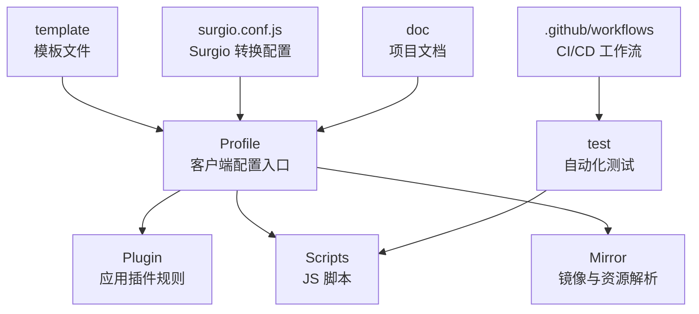
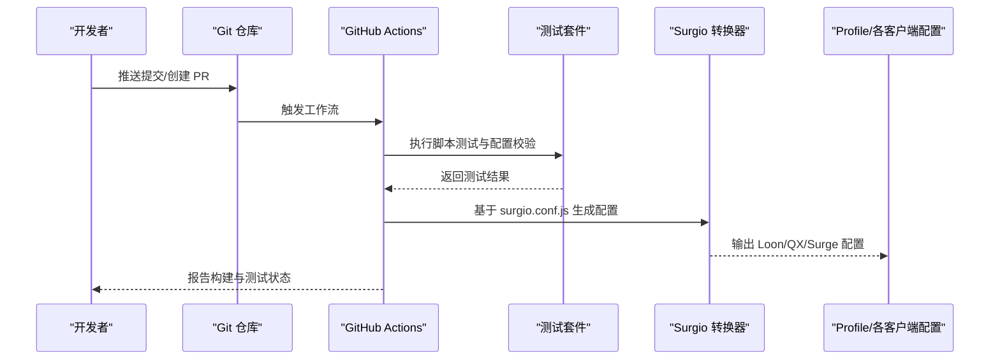
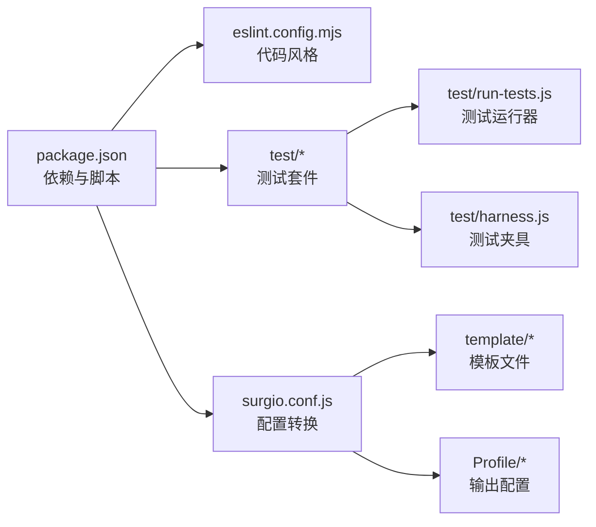

# 贡献指南

<cite>
**本文引用的文件**   
- [README.md](file://README.md)
- [package.json](file://package.json)
- [eslint.config.mjs](file://eslint.config.mjs)
- [surgio.conf.js](file://surgio.conf.js)
- [test/run-tests.js](file://test/run-tests.js)
- [test/harness.js](file://test/harness.js)
- [test/cases/purify-scripts.test.js](file://test/cases/purify-scripts.test.js)
- [test/cases/qidian-wrapper.test.js](file://test/cases/qidian-wrapper.test.js)
- [test/cases/zhihu-cainiao.test.js](file://test/cases/zhihu-cainiao.test.js)
- [test/cases/zhihuifangdong.test.js](file://test/cases/zhihuifangdong.test.js)
- [.github/workflows/config-validate.yml](file://.github/workflows/config-validate.yml)
- [.github/workflows/script-tests.yml](file://.github/workflows/script-tests.yml)
- [.github/workflows/pages-deploy.yml](file://.github/workflows/pages-deploy.yml)
- [.github/workflows/sync-kelee.yml](file://.github/workflows/sync-kelee.yml)
- [.github/workflows/upstream-health.yml](file://.github/workflows/upstream-health.yml)
- [Mirror/MANIFEST.json](file://Mirror/MANIFEST.json)
- [Scripts/ENGINE-MANIFEST.json](file://Scripts/ENGINE-MANIFEST.json)
- [template/loon.tpl](file://template/loon.tpl)
- [template/quantumultx.tpl](file://template/quantumultx.tpl)
- [template/surge.tpl](file://template/surge.tpl)
</cite>

## 目录
1. [简介](#简介)
2. [项目结构](#项目结构)
3. [核心组件](#核心组件)
4. [架构总览](#架构总览)
5. [详细组件分析](#详细组件分析)
6. [依赖分析](#依赖分析)
7. [性能考虑](#性能考虑)
8. [故障排查指南](#故障排查指南)
9. [结论](#结论)
10. [附录](#附录)

## 简介
本贡献指南面向所有希望参与本项目开发与维护的贡献者，涵盖代码规范、提交约定、分支管理策略、开发环境搭建与依赖安装、代码审查流程与合并要求、新功能开发指导原则与最佳实践、文档编写规范与更新流程、测试覆盖率与质量检查要求，以及社区参与和行为准则。目标是让不同背景的贡献者都能高效、一致地协作，确保仓库质量与稳定性持续提升。

## 项目结构
仓库采用按功能域划分的目录组织方式：
- Profile：各客户端（Loon、Quantumult X、Surge）的配置文件入口
- Plugin：应用级插件规则集合
- Scripts：脚本引擎（如 Surge/Loon/QX）使用的 JS 脚本清单与实现
- Mirror：镜像与资源解析相关脚本与清单
- Kelee：特定平台或场景的插件
- template：模板文件，用于生成不同客户端的配置片段
- test：自动化测试用例与测试运行器
- .github/workflows：CI/CD 工作流定义
- doc：项目文档与审计记录
- surgio.conf.js：Surgio 配置，用于将规则集转换为多客户端格式

图表来源
- [surgio.conf.js:1-200](file://surgio.conf.js#L1-L200)
- [test/run-tests.js:1-200](file://test/run-tests.js#L1-L200)
- [.github/workflows/config-validate.yml:1-200](file://.github/workflows/config-validate.yml#L1-L200)

章节来源
- [README.md:1-200](file://README.md#L1-L200)
- [package.json:1-200](file://package.json#L1-L200)

## 核心组件
- 配置与模板系统：通过 surgio.conf.js 统一管理规则到多客户端配置的转换；template 提供 Loon、Quantumult X、Surge 的模板，保证输出一致性。
- 脚本与清单：Scripts 目录下的 JS 脚本配合 ENGINE-MANIFEST.json 进行版本与依赖声明；Mirror 目录包含 amdc.js、applet.js、bilibili-json.js 等工具脚本及 MANIFEST.json 清单。
- 测试框架：test 目录包含测试运行器 harness.js、run-tests.js 与各业务用例，覆盖脚本净化、包装器、跨服务联动等关键路径。
- CI/CD：.github/workflows 下定义配置校验、脚本测试、页面部署、上游健康检查等工作流，保障每次提交的自动化质量门禁。

章节来源
- [surgio.conf.js:1-200](file://surgio.conf.js#L1-L200)
- [Scripts/ENGINE-MANIFEST.json:1-200](file://Scripts/ENGINE-MANIFEST.json#L1-L200)
- [Mirror/MANIFEST.json:1-200](file://Mirror/MANIFEST.json#L1-L200)
- [test/harness.js:1-200](file://test/harness.js#L1-L200)
- [test/run-tests.js:1-200](file://test/run-tests.js#L1-L200)
- [.github/workflows/config-validate.yml:1-200](file://.github/workflows/config-validate.yml#L1-L200)
- [.github/workflows/script-tests.yml:1-200](file://.github/workflows/script-tests.yml#L1-L200)

## 架构总览
整体架构围绕“规则与脚本 -> 模板生成 -> 多客户端配置”展开，并通过 CI/CD 与测试保障质量。

图表来源
- [.github/workflows/config-validate.yml:1-200](file://.github/workflows/config-validate.yml#L1-L200)
- [.github/workflows/script-tests.yml:1-200](file://.github/workflows/script-tests.yml#L1-L200)
- [surgio.conf.js:1-200](file://surgio.conf.js#L1-L200)

## 详细组件分析

### 代码规范与风格
- ESLint 配置：使用 eslint.config.mjs 统一 JavaScript/Node 代码风格与规则，建议本地启用编辑器集成以实时提示问题。
- 命名与结构：脚本与插件遵循清晰命名与分层，避免全局污染；模块职责单一，便于测试与维护。
- 模板规范：template 下的模板需保持语法稳定，变更需同步更新对应客户端的示例与说明。

章节来源
- [eslint.config.mjs:1-200](file://eslint.config.mjs#L1-L200)
- [template/loon.tpl:1-200](file://template/loon.tpl#L1-L200)
- [template/quantumultx.tpl:1-200](file://template/quantumultx.tpl#L1-L200)
- [template/surge.tpl:1-200](file://template/surge.tpl#L1-L200)

### 提交约定与分支管理
- 提交信息：建议使用语义化提交（feat/fix/docs/test/chore），描述变更范围与影响。
- 分支策略：
  - main：稳定发布分支，仅接受经过审查与测试通过的合并
  - develop：日常开发主干，聚合特性分支
  - feature/*：新功能开发分支，完成后发起 PR 至 develop
  - hotfix/*：紧急修复分支，直接合并至 main 并回合并入 develop
- PR 要求：标题清晰、描述完整、关联 Issue、附带测试与截图（如涉及 UI）。

[本节为通用实践说明，不直接分析具体文件]

### 开发环境与依赖安装
- Node.js：建议使用 LTS 版本，确保 npm/yarn 可用。
- 依赖安装：在项目根目录执行包管理器命令安装依赖（详见 package.json scripts）。
- 本地运行：
  - 运行测试：使用测试脚本执行全部用例
  - 生成配置：通过 Surgio 转换配置，验证输出是否符合预期
- 编辑器：推荐启用 ESLint 与 Prettier 插件，保持风格一致。

章节来源
- [package.json:1-200](file://package.json#L1-L200)
- [test/run-tests.js:1-200](file://test/run-tests.js#L1-L200)
- [surgio.conf.js:1-200](file://surgio.conf.js#L1-L200)

### 代码审查流程与合并要求
- 审查要点：
  - 正确性：逻辑无误、边界条件处理完备
  - 可维护性：模块化、注释清晰、命名规范
  - 安全性：无敏感信息泄露、输入校验充分
  - 兼容性：多客户端配置兼容、脚本运行环境差异处理
- 合并要求：
  - 至少一名 Maintainer 批准
  - CI 全绿（测试通过、配置校验通过）
  - 无冲突且符合提交规范

[本节为通用流程说明，不直接分析具体文件]

### 新功能开发指导原则与最佳实践
- 需求澄清：明确目标、范围与验收标准，必要时先创建 Issue 讨论。
- 设计先行：绘制流程图或类图，评估复杂度与风险。
- 增量实现：小步快跑，频繁提交，便于回溯与审查。
- 测试驱动：为新功能编写单元测试与集成测试，覆盖关键路径。
- 文档同步：更新 README、模板说明与 CHANGELOG（如有）。

[本节为通用实践说明，不直接分析具体文件]

### 文档编写规范与更新流程
- 文档位置：doc 目录存放审计与评估文档；README 作为主入口。
- 格式要求：Markdown 语法，标题层级清晰，链接有效，图片路径相对。
- 更新流程：变更涉及配置或行为时，必须同步更新相关文档并附在 PR 中。

章节来源
- [README.md:1-200](file://README.md#L1-L200)
- [doc/audit-v7.7.md:1-200](file://doc/audit-v7.7.md#L1-L200)
- [doc/audit-v7.8.md:1-200](file://doc/audit-v7.8.md#L1-L200)
- [doc/ecosystem-evaluation.md:1-200](file://doc/ecosystem-evaluation.md#L1-L200)
- [doc/infrastructure.md:1-200](file://doc/infrastructure.md#L1-L200)
- [doc/surgio-migration.md:1-200](file://doc/surgio-migration.md#L1-L200)

### 测试覆盖率与质量检查要求
- 测试框架：基于 Node.js 的测试运行器与自定义 harness，支持并行与隔离。
- 用例组织：test/cases 下按功能划分用例，命名体现被测对象与场景。
- 覆盖率目标：核心脚本与工具函数应达到较高覆盖率（建议 >80%），新增代码需补充测试。
- 质量门禁：CI 中执行 lint、测试与配置校验，失败则阻止合并。

章节来源
- [test/harness.js:1-200](file://test/harness.js#L1-L200)
- [test/run-tests.js:1-200](file://test/run-tests.js#L1-L200)
- [test/cases/purify-scripts.test.js:1-200](file://test/cases/purify-scripts.test.js#L1-L200)
- [test/cases/qidian-wrapper.test.js:1-200](file://test/cases/qidian-wrapper.test.js#L1-L200)
- [test/cases/zhihu-cainiao.test.js:1-200](file://test/cases/zhihu-cainiao.test.js#L1-L200)
- [test/cases/zhihuifangdong.test.js:1-200](file://test/cases/zhihuifangdong.test.js#L1-L200)
- [.github/workflows/script-tests.yml:1-200](file://.github/workflows/script-tests.yml#L1-L200)
- [.github/workflows/config-validate.yml:1-200](file://.github/workflows/config-validate.yml#L1-L200)

### 社区参与与行为准则
- 尊重与包容：鼓励多元背景贡献，禁止歧视与骚扰。
- 开放沟通：Issue 与 PR 讨论保持专业与建设性。
- 责任共担：Maintainer 负责最终决策，贡献者积极参与反馈与改进。
- 安全披露：发现安全问题请私下报告，避免公开漏洞细节。

[本节为通用准则说明，不直接分析具体文件]

## 依赖分析
项目依赖集中在 Node.js 生态，通过 package.json 管理脚本与工具链；Surgio 用于配置转换；ESLint 用于代码风格检查；测试框架由自定义 harness 与运行器组成。

图表来源
- [package.json:1-200](file://package.json#L1-L200)
- [eslint.config.mjs:1-200](file://eslint.config.mjs#L1-L200)
- [surgio.conf.js:1-200](file://surgio.conf.js#L1-L200)
- [test/run-tests.js:1-200](file://test/run-tests.js#L1-L200)
- [test/harness.js:1-200](file://test/harness.js#L1-L200)
- [template/loon.tpl:1-200](file://template/loon.tpl#L1-L200)
- [template/quantumultx.tpl:1-200](file://template/quantumultx.tpl#L1-L200)
- [template/surge.tpl:1-200](file://template/surge.tpl#L1-L200)

章节来源
- [package.json:1-200](file://package.json#L1-L200)
- [eslint.config.mjs:1-200](file://eslint.config.mjs#L1-L200)
- [surgio.conf.js:1-200](file://surgio.conf.js#L1-L200)

## 性能考虑
- 脚本优化：避免阻塞式 I/O，合理使用缓存与异步模式。
- 配置生成：Surgio 转换过程应避免重复计算，利用增量构建。
- 测试效率：并行执行用例，减少冷启动开销。
- 资源管理：镜像与资源清单定期清理，减少冗余。

[本节为通用性能建议，不直接分析具体文件]

## 故障排查指南
- 常见问题：
  - 配置校验失败：检查模板语法与变量替换是否正确
  - 脚本测试失败：确认环境变量与依赖版本
  - CI 构建失败：查看日志定位具体步骤失败原因
- 调试技巧：
  - 本地复现：最小化用例复现问题
  - 日志输出：在关键路径添加临时日志
  - 断点调试：使用 IDE 或 Node Inspector

章节来源
- [.github/workflows/config-validate.yml:1-200](file://.github/workflows/config-validate.yml#L1-L200)
- [.github/workflows/script-tests.yml:1-200](file://.github/workflows/script-tests.yml#L1-L200)
- [test/harness.js:1-200](file://test/harness.js#L1-L200)

## 结论
本贡献指南旨在建立统一的开发规范与协作流程，确保项目高质量演进。贡献者应遵循代码规范、提交约定与分支策略，完善测试与文档，积极参与审查与反馈。通过持续改进与社区协作，共同提升项目的稳定性与可用性。

[本节为总结性内容，不直接分析具体文件]

## 附录
- 常用命令：
  - 安装依赖：参考 package.json scripts
  - 运行测试：执行测试运行器脚本
  - 生成配置：通过 Surgio 转换
- 相关链接：
  - GitHub Actions 工作流：.github/workflows 下各 yml 文件
  - 模板与清单：template 与 MANIFEST.json

章节来源
- [package.json:1-200](file://package.json#L1-L200)
- [.github/workflows/pages-deploy.yml:1-200](file://.github/workflows/pages-deploy.yml#L1-L200)
- [.github/workflows/sync-kelee.yml:1-200](file://.github/workflows/sync-kelee.yml#L1-L200)
- [.github/workflows/upstream-health.yml:1-200](file://.github/workflows/upstream-health.yml#L1-L200)
- [Mirror/MANIFEST.json:1-200](file://Mirror/MANIFEST.json#L1-L200)
- [Scripts/ENGINE-MANIFEST.json:1-200](file://Scripts/ENGINE-MANIFEST.json#L1-L200)