# GitHub Actions工作流

<cite>
**本文引用的文件**   
- [cdn-verify.yml](file://.github/workflows/cdn-verify.yml)
- [config-validate.yml](file://.github/workflows/config-validate.yml)
- [mirror-scripts.yml](file://.github/workflows/mirror-scripts.yml)
- [pages-deploy.yml](file://.github/workflows/pages-deploy.yml)
- [script-tests.yml](file://.github/workflows/script-tests.yml)
- [surgio-build.yml](file://.github/workflows/surgio-build.yml)
- [sync-kelee.yml](file://.github/workflows/sync-kelee.yml)
- [upstream-health.yml](file://.github/workflows/upstream-health.yml)
- [package.json](file://package.json)
- [surgio.conf.js](file://surgio.conf.js)
- [README.md](file://README.md)
</cite>

## 目录
1. [简介](#简介)
2. [项目结构](#项目结构)
3. [核心组件](#核心组件)
4. [架构总览](#架构总览)
5. [详细组件分析](#详细组件分析)
6. [依赖关系分析](#依赖关系分析)
7. [性能考虑](#性能考虑)
8. [故障排查指南](#故障排查指南)
9. [结论](#结论)
10. [附录](#附录)

## 简介
本仓库通过GitHub Actions实现自动化构建、校验与发布流程，涵盖CDN验证、配置校验、镜像脚本同步、页面部署、脚本测试、Surgio构建、Kelee插件同步以及上游健康检查等关键环节。每个工作流以YAML定义触发条件、执行步骤与环境变量，确保从代码变更到产物发布的端到端可追溯性与稳定性。

## 项目结构
- .github/workflows：存放所有GitHub Actions工作流定义
- Mirror/Plugin/Profile/Scripts/template/provider/test：各类规则、脚本、模板与测试用例
- dist：构建输出目录（由工作流生成）
- surgio.conf.js：Surgio构建配置
- package.json：Node.js依赖与脚本入口

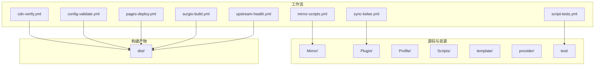

**图表来源** 
- [cdn-verify.yml](file://.github/workflows/cdn-verify.yml)
- [config-validate.yml](file://.github/workflows/config-validate.yml)
- [mirror-scripts.yml](file://.github/workflows/mirror-scripts.yml)
- [pages-deploy.yml](file://.github/workflows/pages-deploy.yml)
- [script-tests.yml](file://.github/workflows/script-tests.yml)
- [surgio-build.yml](file://.github/workflows/surgio-build.yml)
- [sync-kelee.yml](file://.github/workflows/sync-kelee.yml)
- [upstream-health.yml](file://.github/workflows/upstream-health.yml)

**章节来源**
- [README.md](file://README.md)
- [package.json](file://package.json)

## 核心组件
- 触发器：各工作流通过push、pull_request、schedule、workflow_dispatch等事件触发
- 运行环境：通常使用ubuntu-latest或node版本矩阵
- 步骤：checkout、setup-node、install、build/test/validate/deploy等
- 环境变量与密钥：通过env注入敏感信息，如CDN密钥、API Token、SSH私钥等
- 权限：按需授予contents、packages、pages等权限

**章节来源**
- [cdn-verify.yml](file://.github/workflows/cdn-verify.yml)
- [config-validate.yml](file://.github/workflows/config-validate.yml)
- [mirror-scripts.yml](file://.github/workflows/mirror-scripts.yml)
- [pages-deploy.yml](file://.github/workflows/pages-deploy.yml)
- [script-tests.yml](file://.github/workflows/script-tests.yml)
- [surgio-build.yml](file://.github/workflows/surgio-build.yml)
- [sync-kelee.yml](file://.github/workflows/sync-kelee.yml)
- [upstream-health.yml](file://.github/workflows/upstream-health.yml)

## 架构总览
整体流水线分为“质量门禁”和“发布交付”两类：
- 质量门禁：配置校验、脚本测试、CDN验证、上游健康检查
- 发布交付：镜像脚本同步、Surgio构建、Kelee同步、Pages部署

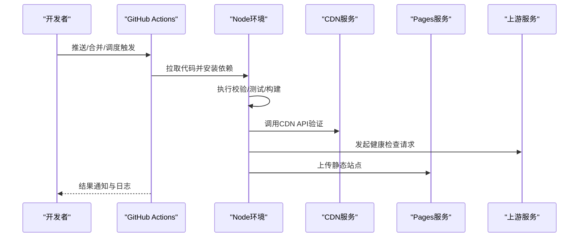

**图表来源** 
- [pages-deploy.yml](file://.github/workflows/pages-deploy.yml)
- [cdn-verify.yml](file://.github/workflows/cdn-verify.yml)
- [upstream-health.yml](file://.github/workflows/upstream-health.yml)

## 详细组件分析

### CDN验证工作流（cdn-verify.yml）
- 触发条件：通常在提交后或手动触发，用于验证CDN可用性
- 执行步骤：
  - 检出代码
  - 设置Node环境
  - 安装依赖
  - 调用CDN接口进行连通性或签名校验
  - 记录结果并失败时中断流水线
- 环境变量与密钥：
  - CDN域名、路径、鉴权参数
  - 密钥通过GitHub Secrets注入
- 权限设置：仅需要读取仓库内容权限

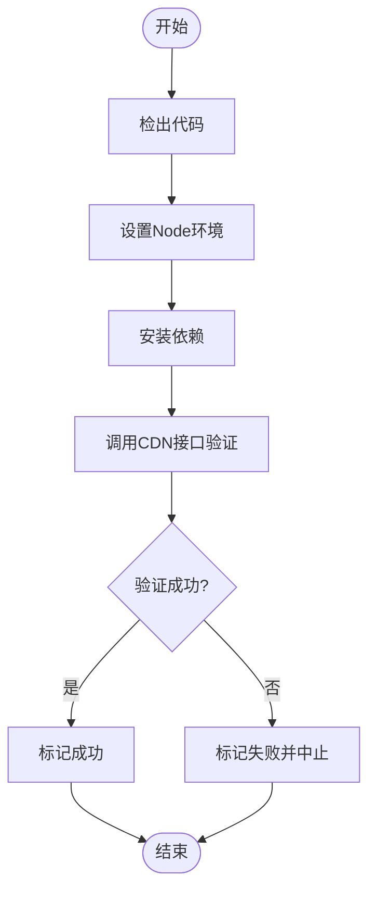

**图表来源** 
- [cdn-verify.yml](file://.github/workflows/cdn-verify.yml)

**章节来源**
- [cdn-verify.yml](file://.github/workflows/cdn-verify.yml)

### 配置校验工作流（config-validate.yml）
- 触发条件：对配置文件变更的PR或push
- 执行步骤：
  - 检出代码
  - 设置Node环境
  - 安装依赖
  - 执行配置校验脚本（JSON/YAML/自定义格式）
  - 报告错误位置与修复建议
- 环境变量与密钥：一般无需敏感信息
- 权限设置：读取仓库内容

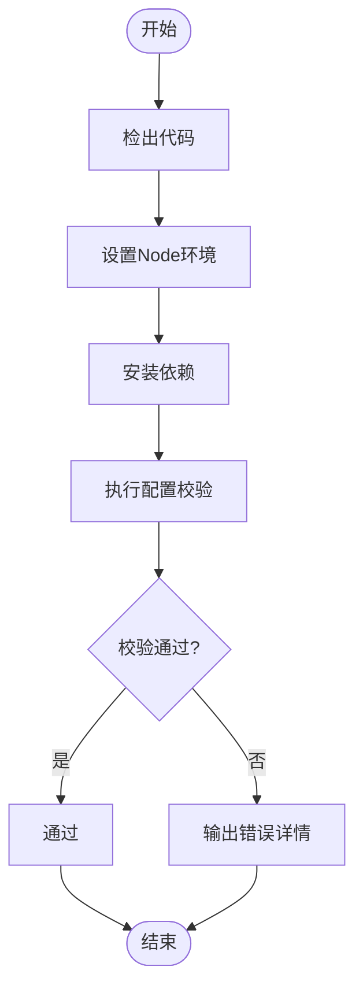

**图表来源** 
- [config-validate.yml](file://.github/workflows/config-validate.yml)

**章节来源**
- [config-validate.yml](file://.github/workflows/config-validate.yml)

### 镜像脚本同步工作流（mirror-scripts.yml）
- 触发条件：当Mirror或Scripts目录发生变更时触发
- 执行步骤：
  - 检出代码
  - 设置Node环境
  - 安装依赖
  - 同步脚本至目标镜像源或分发节点
  - 生成清单或更新索引
- 环境变量与密钥：
  - 镜像源地址、认证凭据
  - SSH私钥或Token
- 权限设置：读取仓库内容，必要时写入远端

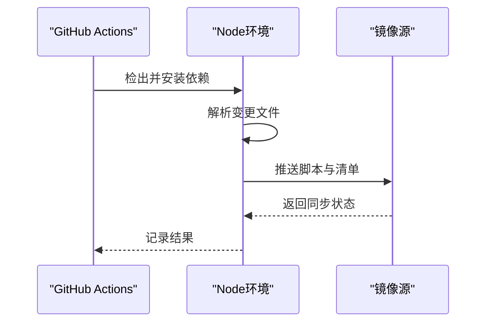

**图表来源** 
- [mirror-scripts.yml](file://.github/workflows/mirror-scripts.yml)

**章节来源**
- [mirror-scripts.yml](file://.github/workflows/mirror-scripts.yml)

### 页面部署工作流（pages-deploy.yml）
- 触发条件：主分支合并或手动触发
- 执行步骤：
  - 检出代码
  - 设置Node环境
  - 安装依赖
  - 构建静态站点（可能基于template与Profile）
  - 部署到GitHub Pages或其他静态托管
- 环境变量与密钥：
  - Pages部署Token或SSH密钥
- 权限设置：需授予pages写入权限

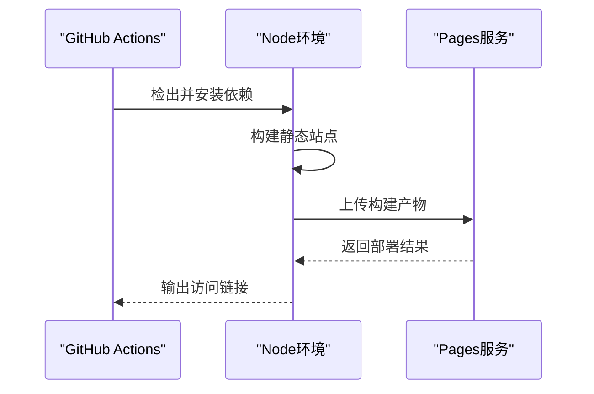

**图表来源** 
- [pages-deploy.yml](file://.github/workflows/pages-deploy.yml)

**章节来源**
- [pages-deploy.yml](file://.github/workflows/pages-deploy.yml)

### 脚本测试工作流（script-tests.yml）
- 触发条件：对Scripts或test目录的变更
- 执行步骤：
  - 检出代码
  - 设置Node环境
  - 安装依赖
  - 运行单元测试与集成测试
  - 生成测试报告
- 环境变量与密钥：一般无需敏感信息
- 权限设置：读取仓库内容

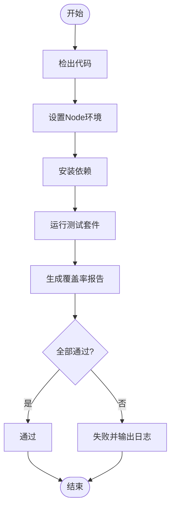

**图表来源** 
- [script-tests.yml](file://.github/workflows/script-tests.yml)

**章节来源**
- [script-tests.yml](file://.github/workflows/script-tests.yml)

### Surgio构建工作流（surgio-build.yml）
- 触发条件：对Profile或template的变更
- 执行步骤：
  - 检出代码
  - 设置Node环境
  - 安装依赖
  - 使用surgio根据surgio.conf.js生成Surge配置
  - 将产物放入dist或发布为附件
- 环境变量与密钥：一般无需敏感信息
- 权限设置：读取仓库内容，必要时写入dist

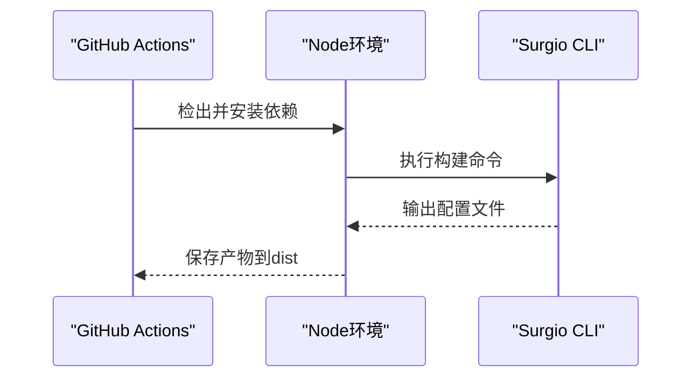

**图表来源** 
- [surgio-build.yml](file://.github/workflows/surgio-build.yml)
- [surgio.conf.js](file://surgio.conf.js)

**章节来源**
- [surgio-build.yml](file://.github/workflows/surgio-build.yml)
- [surgio.conf.js](file://surgio.conf.js)

### Kelee同步工作流（sync-kelee.yml）
- 触发条件：对Kelee目录或相关配置的变更
- 执行步骤：
  - 检出代码
  - 设置Node环境
  - 安装依赖
  - 同步Kelee插件到目标平台或仓库
  - 更新版本或清单
- 环境变量与密钥：
  - 目标平台API Token或SSH私钥
- 权限设置：读取仓库内容，必要时写入远端

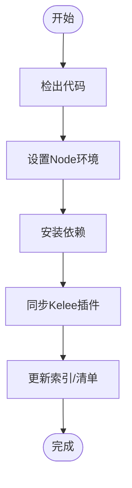

**图表来源** 
- [sync-kelee.yml](file://.github/workflows/sync-kelee.yml)

**章节来源**
- [sync-kelee.yml](file://.github/workflows/sync-kelee.yml)

### 上游健康检查工作流（upstream-health.yml）
- 触发条件：定时任务或手动触发
- 执行步骤：
  - 检出代码
  - 设置Node环境
  - 安装依赖
  - 发起对上游服务的健康检查请求
  - 记录响应状态与延迟
  - 在异常时发出告警
- 环境变量与密钥：
  - 上游服务地址、超时与重试策略
- 权限设置：读取仓库内容

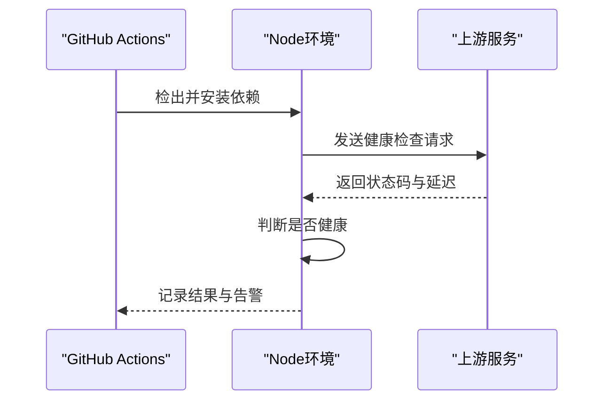

**图表来源** 
- [upstream-health.yml](file://.github/workflows/upstream-health.yml)

**章节来源**
- [upstream-health.yml](file://.github/workflows/upstream-health.yml)

## 依赖关系分析
- Node.js工具链：所有工作流均依赖Node环境，用于执行校验、测试与构建
- Surgio：用于将模板与Profile转换为Surge配置
- 外部服务：CDN、Pages、上游服务、镜像源与Kelee平台
- 仓库内容：配置文件、脚本、模板与测试用例

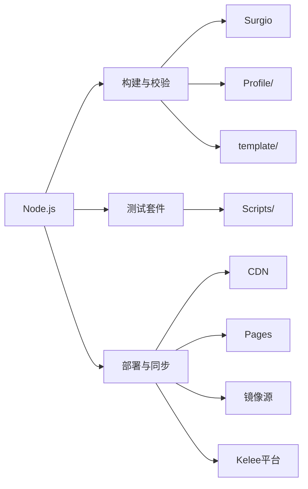

**图表来源** 
- [package.json](file://package.json)
- [surgio.conf.js](file://surgio.conf.js)

**章节来源**
- [package.json](file://package.json)
- [surgio.conf.js](file://surgio.conf.js)

## 性能考虑
- 缓存依赖：利用actions/cache缓存node_modules以提升构建速度
- 并行执行：将独立任务拆分为多作业并行运行
- 增量构建：仅对变更文件执行构建与测试
- 资源限制：合理设置超时与内存上限，避免长时间占用Runner

[本节为通用指导，不直接分析具体文件]

## 故障排查指南
- 查看工作流日志：定位失败步骤与错误堆栈
- 验证环境变量与密钥：确认Secrets是否正确配置且作用域正确
- 网络问题：检查CDN、上游服务可达性与超时设置
- 权限不足：确认Actions权限与远端写入权限
- 调试技巧：在关键步骤添加echo或debug输出，临时启用verbose模式

**章节来源**
- [cdn-verify.yml](file://.github/workflows/cdn-verify.yml)
- [config-validate.yml](file://.github/workflows/config-validate.yml)
- [mirror-scripts.yml](file://.github/workflows/mirror-scripts.yml)
- [pages-deploy.yml](file://.github/workflows/pages-deploy.yml)
- [script-tests.yml](file://.github/workflows/script-tests.yml)
- [surgio-build.yml](file://.github/workflows/surgio-build.yml)
- [sync-kelee.yml](file://.github/workflows/sync-kelee.yml)
- [upstream-health.yml](file://.github/workflows/upstream-health.yml)

## 结论
本工作流体系围绕质量门禁与发布交付两大主线，覆盖从配置校验、脚本测试到构建与部署的全链路自动化。通过明确的环境变量与密钥管理、合理的权限控制与性能优化，确保流程稳定高效。建议在每次变更时优先触发质量门禁工作流，再进入发布阶段，以降低风险并提升交付质量。

[本节为总结性内容，不直接分析具体文件]

## 附录
- 环境变量建议：
  - CDN_DOMAIN、CDN_SECRET、CDN_PATH
  - PAGES_TOKEN、SSH_KEY
  - UPSTREAM_URL、TIMEOUT、RETRY_COUNT
- 密钥管理最佳实践：
  - 使用GitHub Secrets并按作用域隔离
  - 定期轮换密钥并最小化权限
- 常用调试命令：
  - 本地运行测试：npm test
  - 本地构建Surgio：npx surgio build
  - 模拟CDN调用：curl -v <CDN_ENDPOINT>

[本节为补充信息，不直接分析具体文件]