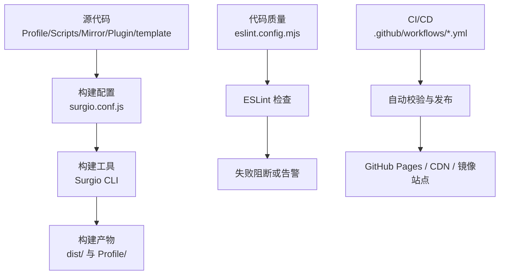
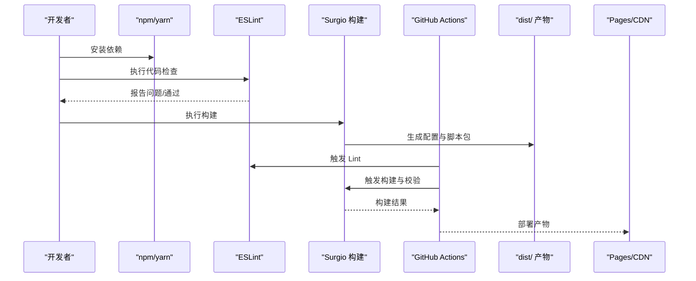
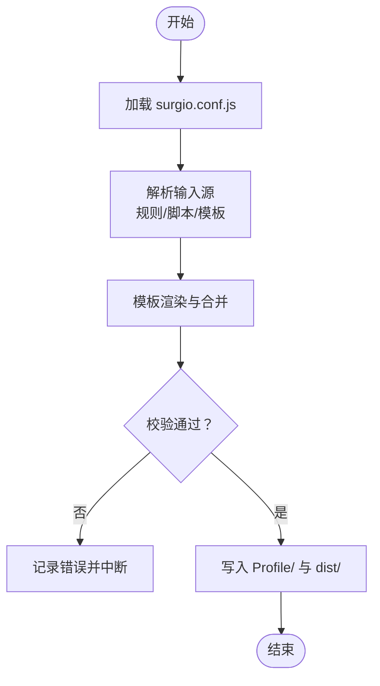
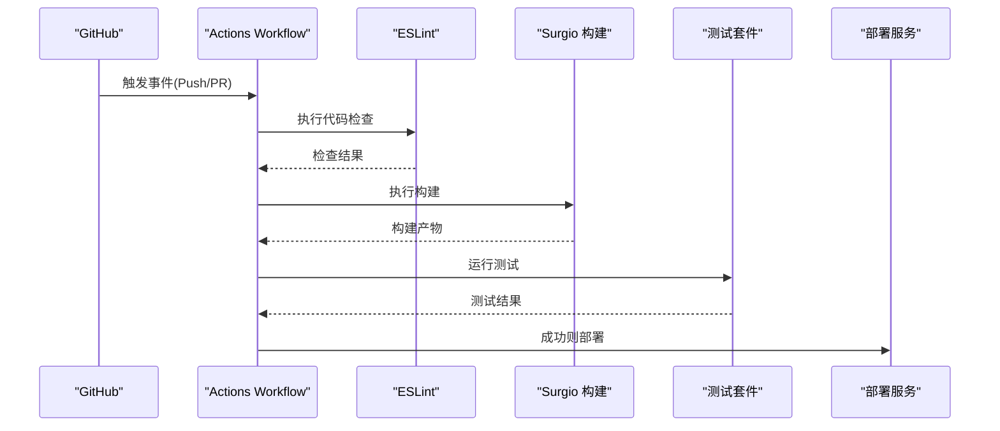

# 构建系统

<cite>
**本文引用的文件**   
- [package.json](file://package.json)
- [surgio.conf.js](file://surgio.conf.js)
- [eslint.config.mjs](file://eslint.config.mjs)
- [.github/workflows/surgio-build.yml](file://.github/workflows/surgio-build.yml)
- [.github/workflows/config-validate.yml](file://.github/workflows/config-validate.yml)
- [.github/workflows/script-tests.yml](file://.github/workflows/script-tests.yml)
- [.github/workflows/pages-deploy.yml](file://.github/workflows/pages-deploy.yml)
- [README.md](file://README.md)
</cite>

## 目录
1. [简介](#简介)
2. [项目结构](#项目结构)
3. [核心组件](#核心组件)
4. [架构总览](#架构总览)
5. [详细组件分析](#详细组件分析)
6. [依赖分析](#依赖分析)
7. [性能考虑](#性能考虑)
8. [故障排查指南](#故障排查指南)
9. [结论](#结论)
10. [附录](#附录)

## 简介
本仓库是一个面向网络规则与脚本的构建系统，围绕 Surgio 配置生成、脚本处理、配置文件校验与发布流程展开。构建系统通过 Node.js 工具链（ESLint、Surgio）实现代码质量检查、模板渲染与产物输出，并通过 GitHub Actions 完成自动化验证与部署。文档将详细说明构建流程、依赖管理、代码质量检查、Surgio 配置语法与作用、本地构建命令与优化技巧、构建产物结构与版本管理策略。

## 项目结构
仓库采用“按功能域组织”的结构：
- Profile/：各客户端（Surge、Loon、Quantumult X）的最终配置文件
- Scripts/：JS 脚本与引擎清单
- Mirror/：镜像与聚合资源
- Plugin/：插件定义
- template/：模板片段与主模板
- test/：测试用例与运行器
- dist/：构建产物输出目录
- .github/workflows/：CI/CD 工作流
- surgio.conf.js：Surgio 构建配置
- eslint.config.mjs：ESLint 规则与格式化标准
- package.json：依赖与脚本入口

图表来源
- [surgio.conf.js](file://surgio.conf.js)
- [eslint.config.mjs](file://eslint.config.mjs)
- [.github/workflows/surgio-build.yml](file://.github/workflows/surgio-build.yml)

章节来源
- [README.md](file://README.md)

## 核心组件
- 构建配置（Surgio）
  - 负责读取模板与规则源，生成目标客户端的配置与脚本包。
  - 关键职责包括：输入源映射、模板渲染、输出路径控制、增量构建与缓存。
- 代码质量（ESLint）
  - 统一 JS 风格与规则，确保脚本与构建脚本的可维护性。
- CI/CD（GitHub Actions）
  - 在 PR 与推送时执行 lint、构建、校验与发布任务。

章节来源
- [surgio.conf.js](file://surgio.conf.js)
- [eslint.config.mjs](file://eslint.config.mjs)
- [.github/workflows/surgio-build.yml](file://.github/workflows/surgio-build.yml)

## 架构总览
下图展示了从源码到产物的端到端流程，以及质量门禁与发布环节。

图表来源
- [.github/workflows/surgio-build.yml](file://.github/workflows/surgio-build.yml)
- [.github/workflows/config-validate.yml](file://.github/workflows/config-validate.yml)
- [.github/workflows/script-tests.yml](file://.github/workflows/script-tests.yml)
- [.github/workflows/pages-deploy.yml](file://.github/workflows/pages-deploy.yml)

## 详细组件分析

### Surgio 构建配置与流程
- 作用
  - 定义输入源（规则、脚本、模板）、输出目标（Profile/、dist/）与构建选项（环境、缓存、并发）。
- 典型流程
  - 解析 surgio.conf.js → 加载模板与规则 → 渲染并合并 → 输出至 Profile/ 与 dist/
- 关键要点
  - 环境变量驱动多环境构建（如 dev/prod）
  - 增量构建与缓存加速二次构建
  - 错误定位与日志级别控制

图表来源
- [surgio.conf.js](file://surgio.conf.js)

章节来源
- [surgio.conf.js](file://surgio.conf.js)

### ESLint 规则与代码格式化
- 作用
  - 统一 JavaScript 编码规范，捕获潜在错误，提升可读性与可维护性。
- 常见规则类别
  - 语法与风格（缩进、引号、分号等）
  - 安全与最佳实践（禁止 with、限制 eval 等）
  - 模块与导入（排序、去重、路径别名）
- 集成方式
  - 通过 npm scripts 调用；CI 中作为质量门禁

章节来源
- [eslint.config.mjs](file://eslint.config.mjs)

### CI/CD 工作流
- surgio-build.yml
  - 触发条件：推送/PR
  - 步骤：安装依赖 → Lint → 构建 → 上传产物
- config-validate.yml
  - 对 Surge/Loon/QX 配置文件进行语法与规则校验
- script-tests.yml
  - 运行 Scripts/ 下的单元测试与集成测试
- pages-deploy.yml
  - 构建成功后部署到 GitHub Pages 或 CDN

图表来源
- [.github/workflows/surgio-build.yml](file://.github/workflows/surgio-build.yml)
- [.github/workflows/config-validate.yml](file://.github/workflows/config-validate.yml)
- [.github/workflows/script-tests.yml](file://.github/workflows/script-tests.yml)
- [.github/workflows/pages-deploy.yml](file://.github/workflows/pages-deploy.yml)

章节来源
- [.github/workflows/surgio-build.yml](file://.github/workflows/surgio-build.yml)
- [.github/workflows/config-validate.yml](file://.github/workflows/config-validate.yml)
- [.github/workflows/script-tests.yml](file://.github/workflows/script-tests.yml)
- [.github/workflows/pages-deploy.yml](file://.github/workflows/pages-deploy.yml)

## 依赖分析
- 运行时与开发依赖
  - 构建工具：Surgio CLI
  - 代码质量：ESLint 及插件
  - 测试框架：Node.js 内置或第三方测试库
- 依赖管理
  - 使用 package.json 声明依赖与脚本
  - 锁定版本以确保可重复构建（package-lock.json）

图表来源
- [package.json](file://package.json)

章节来源
- [package.json](file://package.json)

## 性能考虑
- 构建优化
  - 启用增量构建与缓存，减少重复编译
  - 并行化任务（lint/build/test）
  - 按需加载大体积规则与脚本
- 产物优化
  - 压缩与去重
  - 拆分输出（按客户端或功能域）
- 本地体验
  - 使用热重载（若支持）
  - 合理设置日志级别

[本节为通用建议，不直接分析具体文件]

## 故障排查指南
- Lint 失败
  - 查看 ESLint 输出，修复风格与安全问题
  - 必要时调整规则或忽略特定行
- 构建失败
  - 检查 surgio.conf.js 配置项是否正确
  - 确认模板与规则引用路径有效
  - 清理缓存后重试
- 测试失败
  - 定位测试用例，检查输入数据与断言
  - 隔离问题模块逐步调试
- CI 失败
  - 查看 Actions 日志，复现本地问题
  - 确保依赖版本一致

章节来源
- [eslint.config.mjs](file://eslint.config.mjs)
- [surgio.conf.js](file://surgio.conf.js)
- [.github/workflows/surgio-build.yml](file://.github/workflows/surgio-build.yml)

## 结论
本构建系统以 Surgio 为核心，结合 ESLint 与 GitHub Actions，形成从代码质量到构建产物的完整闭环。通过合理的配置与优化策略，可实现高效、稳定、可追溯的规则与脚本交付。建议在团队内统一遵循 ESLint 规范，并在 CI 中严格把关，以保证构建质量与发布稳定性。

[本节为总结性内容，不直接分析具体文件]

## 附录

### 本地构建命令
- 安装依赖
  - 使用 npm 或 yarn 安装依赖
- 代码检查
  - 执行 ESLint 检查
- 构建
  - 执行 Surgio 构建，生成 Profile/ 与 dist/ 产物
- 测试
  - 运行测试套件

章节来源
- [package.json](file://package.json)

### Surgio 配置文件说明
- 作用
  - 定义输入源、模板、输出路径与环境变量
- 语法要点
  - 对象键值配置、数组集合、函数式钩子
  - 支持条件分支与动态注入
- 常用字段
  - inputs：规则与脚本来源
  - templates：模板映射
  - outputs：输出目标与格式
  - options：构建选项（缓存、并发、日志）

章节来源
- [surgio.conf.js](file://surgio.conf.js)

### 构建产物结构与版本管理
- 产物结构
  - Profile/：各客户端最终配置
  - dist/：打包后的脚本与资源
- 版本管理
  - 通过 Git 标签与提交历史追踪
  - 在 CI 中生成版本号与变更摘要
  - 发布到 Pages/CDN 时附带版本信息

章节来源
- [README.md](file://README.md)
- [.github/workflows/pages-deploy.yml](file://.github/workflows/pages-deploy.yml)