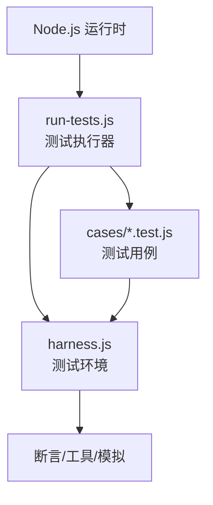
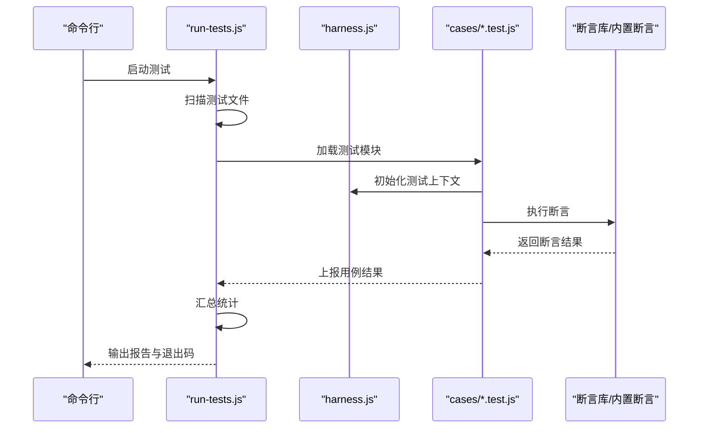
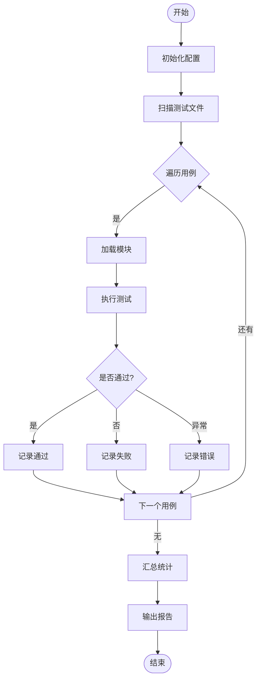
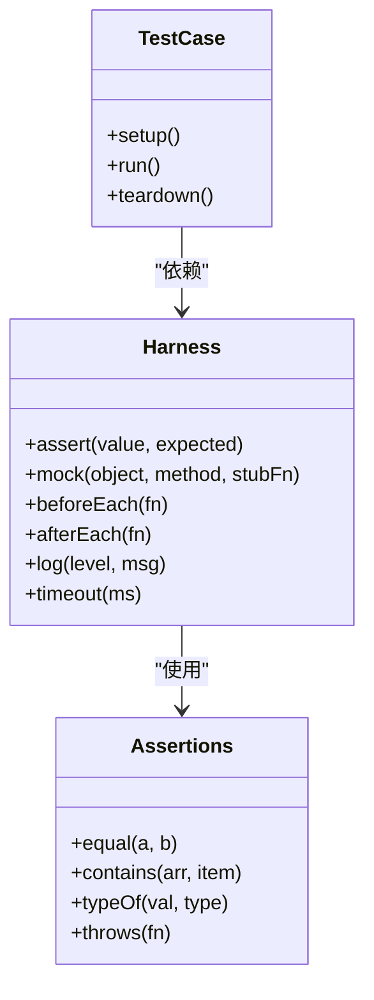
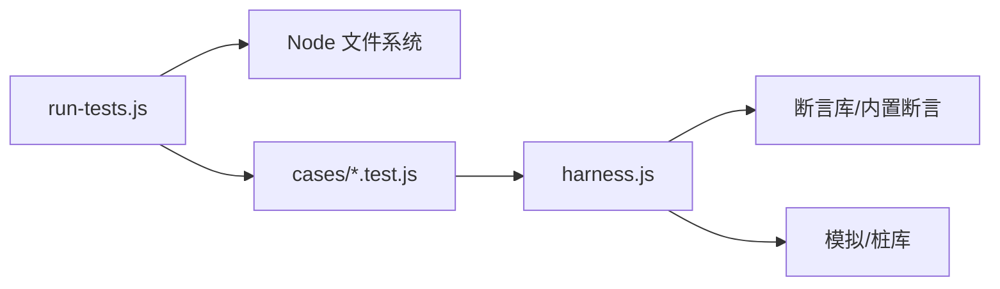

# 测试框架

<cite>
**本文引用的文件**   
- [test/harness.js](file://test/harness.js)
- [test/run-tests.js](file://test/run-tests.js)
- [test/cases/purify-scripts.test.js](file://test/cases/purify-scripts.test.js)
- [test/cases/qidian-wrapper.test.js](file://test/cases/qidian-wrapper.test.js)
- [test/cases/zhihu-cainiao.test.js](file://test/cases/zhihu-cainiao.test.js)
- [test/cases/zhihuifangdong.test.js](file://test/cases/zhihuifangdong.test.js)
- [package.json](file://package.json)
</cite>

## 目录
1. [简介](#简介)
2. [项目结构](#项目结构)
3. [核心组件](#核心组件)
4. [架构总览](#架构总览)
5. [详细组件分析](#详细组件分析)
6. [依赖关系分析](#依赖关系分析)
7. [性能与覆盖率](#性能与覆盖率)
8. [故障排查指南](#故障排查指南)
9. [结论](#结论)
10. [附录](#附录)

## 简介
本测试框架围绕 Node.js 环境构建，用于对脚本、规则与插件进行自动化验证。框架由两部分组成：
- 测试执行器：负责发现并运行测试用例，汇总结果。
- 测试环境（Harness）：为每个测试用例提供统一的断言、模拟与工具函数，屏蔽底层差异，确保可重复性。

通过该框架，开发者可以：
- 快速编写与组织测试用例
- 统一断言与错误处理
- 在 CI/CD 中稳定执行测试
- 统计覆盖率与定位性能瓶颈

## 项目结构
测试相关代码集中在 test 目录下，采用“执行器 + 环境 + 用例”的分层组织方式：
- test/run-tests.js：测试入口与调度器
- test/harness.js：测试环境与工具集
- test/cases/*.test.js：具体业务测试用例

图表来源
- [test/run-tests.js](file://test/run-tests.js)
- [test/harness.js](file://test/harness.js)
- [test/cases/purify-scripts.test.js](file://test/cases/purify-scripts.test.js)
- [test/cases/qidian-wrapper.test.js](file://test/cases/qidian-wrapper.test.js)
- [test/cases/zhihu-cainiao.test.js](file://test/cases/zhihu-cainiao.test.js)
- [test/cases/zhihuifangdong.test.js](file://test/cases/zhihuifangdong.test.js)

章节来源
- [test/run-tests.js](file://test/run-tests.js)
- [test/harness.js](file://test/harness.js)
- [test/cases/purify-scripts.test.js](file://test/cases/purify-scripts.test.js)
- [test/cases/qidian-wrapper.test.js](file://test/cases/qidian-wrapper.test.js)
- [test/cases/zhihu-cainiao.test.js](file://test/cases/zhihu-cainiao.test.js)
- [test/cases/zhihuifangdong.test.js](file://test/cases/zhihuifangdong.test.js)

## 核心组件
- 测试执行器（run-tests.js）
  - 扫描 test/cases 下的 *.test.js 文件
  - 加载并执行每个测试模块
  - 收集测试结果（通过/失败/跳过），输出报告
  - 支持并行或串行执行策略（由实现决定）
- 测试环境（harness.js）
  - 提供断言 API（如相等、包含、类型检查等）
  - 提供模拟/桩（mock/stub）能力，隔离外部依赖
  - 提供测试生命周期钩子（beforeEach/afterEach）
  - 封装日志与调试信息，便于定位问题

章节来源
- [test/run-tests.js](file://test/run-tests.js)
- [test/harness.js](file://test/harness.js)

## 架构总览
下图展示了从命令行触发到测试执行的完整流程，以及各组件之间的交互关系。

图表来源
- [test/run-tests.js](file://test/run-tests.js)
- [test/harness.js](file://test/harness.js)
- [test/cases/purify-scripts.test.js](file://test/cases/purify-scripts.test.js)
- [test/cases/qidian-wrapper.test.js](file://test/cases/qidian-wrapper.test.js)
- [test/cases/zhihu-cainiao.test.js](file://test/cases/zhihu-cainiao.test.js)
- [test/cases/zhihuifangdong.test.js](file://test/cases/zhihuifangdong.test.js)

## 详细组件分析

### 测试执行器（run-tests.js）
职责
- 发现并加载测试用例
- 控制执行顺序与并发度
- 捕获异常与超时，保证稳定性
- 生成结构化结果（JSON/文本）供 CI 消费

关键流程
- 初始化：读取配置（如并发数、超时、过滤条件）
- 扫描：匹配 test/cases/*.test.js
- 执行：逐个加载并调用测试模块的入口
- 聚合：统计通过/失败/跳过数量，计算耗时
- 输出：打印摘要与详细日志，设置进程退出码

图表来源
- [test/run-tests.js](file://test/run-tests.js)

章节来源
- [test/run-tests.js](file://test/run-tests.js)

### 测试环境（harness.js）
职责
- 提供一致的断言 API
- 管理测试生命周期（准备/清理）
- 提供模拟与桩，隔离网络/文件系统/第三方模块
- 提供调试辅助（日志、堆栈、快照对比）

常用能力
- 断言：相等、不等、包含、类型、异步断言
- 模拟：替换全局对象、拦截请求、伪造时间
- 生命周期：在每个用例前后注入资源与清理
- 工具：路径解析、JSON 校验、正则匹配

图表来源
- [test/harness.js](file://test/harness.js)

章节来源
- [test/harness.js](file://test/harness.js)

### 测试用例示例与规范
用例组织
- 按功能域划分文件，命名以 .test.js 结尾
- 每个用例聚焦单一场景，避免耦合
- 使用清晰的描述性名称，便于定位失败原因

编写规范
- 使用 harness 提供的断言 API，保持风格一致
- 对外部依赖进行模拟，确保用例可重复
- 合理设置超时，避免长时间阻塞
- 失败时输出足够上下文（输入、期望、实际）

示例参考
- [purify-scripts.test.js](file://test/cases/purify-scripts.test.js)
- [qidian-wrapper.test.js](file://test/cases/qidian-wrapper.test.js)
- [zhihu-cainiao.test.js](file://test/cases/zhihu-cainiao.test.js)
- [zhihuifangdong.test.js](file://test/cases/zhihuifangdong.test.js)

章节来源
- [test/cases/purify-scripts.test.js](file://test/cases/purify-scripts.test.js)
- [test/cases/qidian-wrapper.test.js](file://test/cases/qidian-wrapper.test.js)
- [test/cases/zhihu-cainiao.test.js](file://test/cases/zhihu-cainiao.test.js)
- [test/cases/zhihuifangdong.test.js](file://test/cases/zhihuifangdong.test.js)

### 添加新测试用例的步骤
- 在 test/cases 下新增一个 *.test.js 文件
- 引入 harness 提供的断言与工具
- 编写 setup/run/teardown 逻辑，覆盖正常与异常路径
- 本地运行 run-tests.js 验证用例通过
- 提交前确保不破坏现有用例

章节来源
- [test/run-tests.js](file://test/run-tests.js)
- [test/harness.js](file://test/harness.js)

## 依赖关系分析
- run-tests.js 依赖 Node.js 文件系统与模块加载机制
- harness.js 可能依赖断言库与模拟工具（由实现决定）
- 测试用例依赖 harness 暴露的 API，不直接访问底层系统

图表来源
- [test/run-tests.js](file://test/run-tests.js)
- [test/harness.js](file://test/harness.js)
- [test/cases/purify-scripts.test.js](file://test/cases/purify-scripts.test.js)
- [test/cases/qidian-wrapper.test.js](file://test/cases/qidian-wrapper.test.js)
- [test/cases/zhihu-cainiao.test.js](file://test/cases/zhihu-cainiao.test.js)
- [test/cases/zhihuifangdong.test.js](file://test/cases/zhihuifangdong.test.js)

章节来源
- [test/run-tests.js](file://test/run-tests.js)
- [test/harness.js](file://test/harness.js)

## 性能与覆盖率
- 性能测试方法
  - 使用 harness 提供的计时工具，测量关键路径耗时
  - 针对热点用例进行基准测试，比较不同实现的差异
  - 在 CI 中记录耗时趋势，识别回归
- 覆盖率统计
  - 若集成覆盖率工具，可在 run-tests.js 启动时注入覆盖率采集
  - 输出行覆盖率与分支覆盖率，关注未覆盖的关键逻辑
  - 将覆盖率阈值纳入质量门禁

[本节为通用指导，不直接分析具体文件]

## 故障排查指南
常见问题与定位步骤
- 用例无法加载
  - 检查文件路径与命名是否符合扫描规则
  - 确认模块导出正确，无语法错误
- 断言失败
  - 查看 harness 输出的期望与实际值
  - 增加日志上下文，复现最小用例
- 超时或卡住
  - 调整超时配置，检查异步回调是否完成
  - 排查死锁或无限循环
- 模拟失效
  - 确认模拟作用域与生命周期是否正确
  - 检查被替换的全局对象是否被重新赋值

章节来源
- [test/harness.js](file://test/harness.js)
- [test/run-tests.js](file://test/run-tests.js)

## 结论
本测试框架通过“执行器 + 环境 + 用例”的分层设计，提供了稳定的测试基础设施。借助统一的断言与模拟能力，开发者可以快速编写高质量用例，并在 CI/CD 中持续验证脚本与规则的正确性与稳定性。建议结合覆盖率与性能基线，持续提升质量与效率。

[本节为总结性内容，不直接分析具体文件]

## 附录
- 运行命令
  - 在项目根目录执行测试：参考 package.json 中的脚本定义
- 配置文件
  - 如需扩展执行参数，可在 run-tests.js 中读取环境变量或配置文件
- 最佳实践
  - 用例粒度适中，避免跨用例共享状态
  - 优先使用确定性数据与固定时间源
  - 失败时保留足够的诊断信息

章节来源
- [package.json](file://package.json)