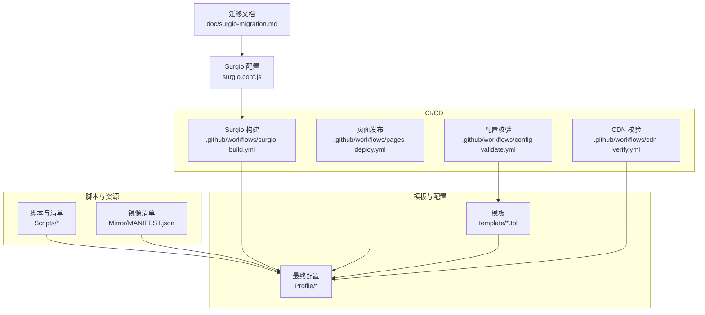
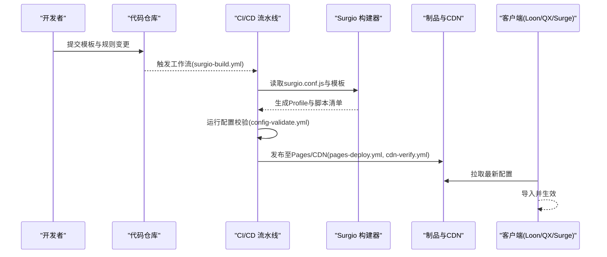
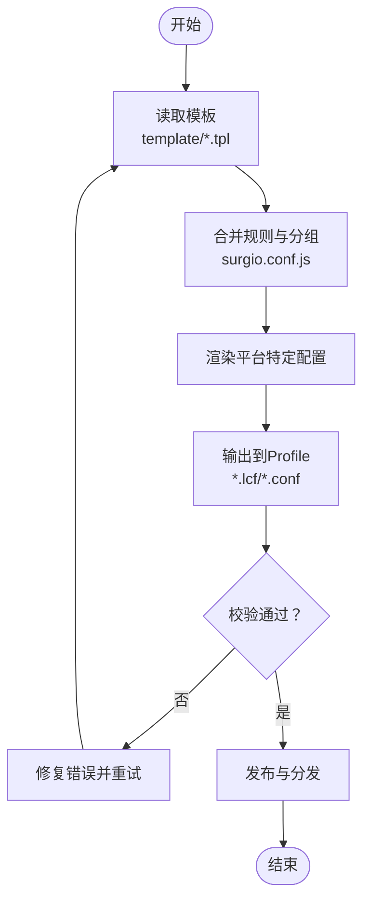
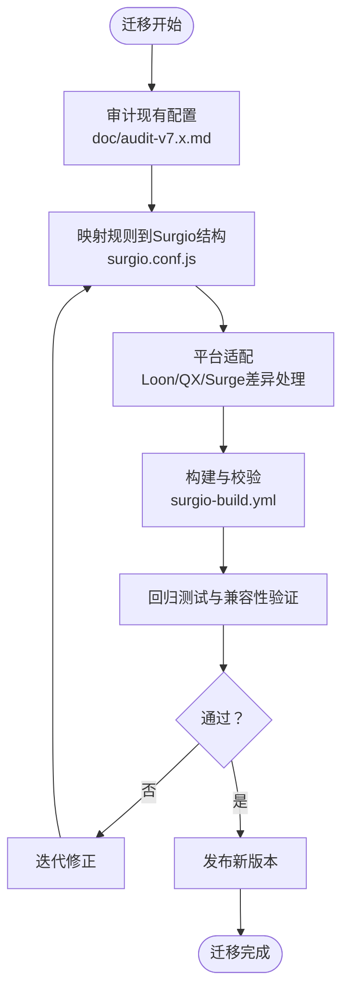
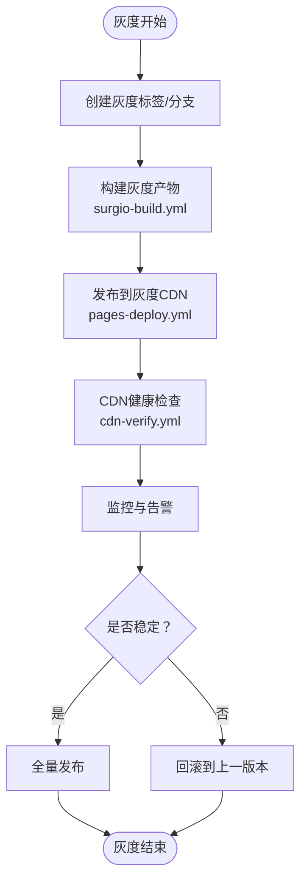
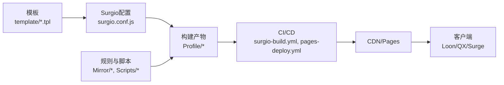

# 部署策略

<cite>
**本文引用的文件**   
- [README.md](file://README.md)
- [package.json](file://package.json)
- [surgio.conf.js](file://surgio.conf.js)
- [template/loon.tpl](file://template/loon.tpl)
- [template/quantumultx.tpl](file://template/quantumultx.tpl)
- [template/surge.tpl](file://template/surge.tpl)
- [Profile/Loon.lcf](file://Profile/Loon.lcf)
- [Profile/QX.conf](file://Profile/QX.conf)
- [Profile/Surge.conf](file://Profile/Surge.conf)
- [Mirror/MANIFEST.json](file://Mirror/MANIFEST.json)
- [Scripts/ENGINE-MANIFEST.json](file://Scripts/ENGINE-MANIFEST.json)
- [doc/surgio-migration.md](file://doc/surgio-migration.md)
- [.github/workflows/surgio-build.yml](file://.github/workflows/surgio-build.yml)
- [.github/workflows/pages-deploy.yml](file://.github/workflows/pages-deploy.yml)
- [.github/workflows/config-validate.yml](file://.github/workflows/config-validate.yml)
- [.github/workflows/cdn-verify.yml](file://.github/workflows/cdn-verify.yml)
</cite>

## 目录
1. [简介](#简介)
2. [项目结构](#项目结构)
3. [核心组件](#核心组件)
4. [架构总览](#架构总览)
5. [详细组件分析](#详细组件分析)
6. [依赖关系分析](#依赖关系分析)
7. [性能与稳定性考虑](#性能与稳定性考虑)
8. [故障排查指南](#故障排查指南)
9. [结论](#结论)
10. [附录](#附录)

## 简介
本文件面向运维与开发者，提供基于该配置管理仓库的完整部署策略说明。内容覆盖：
- 多平台（Loon、Quantumult X、Surge）的配置模板使用与生成流程
- Surgio 迁移流程与兼容性处理
- 灰度发布、回滚策略与监控告警配置建议
- 多环境部署与环境变量管理
- CI/CD 流水线与制品分发要点

## 项目结构
仓库采用“模板 + 配置文件 + 脚本 + 工作流”的分层组织方式：
- template：各客户端平台的通用模板（Loon、QX、Surge）
- Profile：各平台可直接导入的最终配置
- Scripts：引擎脚本与清单，用于功能增强与健康检查
- Mirror：规则与插件资源清单，便于镜像与缓存
- .github/workflows：构建、校验、发布与验证等自动化流程
- surgio.conf.js：Surgio 构建入口与规则映射
- doc：文档与迁移指南

图表来源
- [template/loon.tpl](file://template/loon.tpl)
- [template/quantumultx.tpl](file://template/quantumultx.tpl)
- [template/surge.tpl](file://template/surge.tpl)
- [Profile/Loon.lcf](file://Profile/Loon.lcf)
- [Profile/QX.conf](file://Profile/QX.conf)
- [Profile/Surge.conf](file://Profile/Surge.conf)
- [Scripts/ENGINE-MANIFEST.json](file://Scripts/ENGINE-MANIFEST.json)
- [Mirror/MANIFEST.json](file://Mirror/MANIFEST.json)
- [surgio.conf.js](file://surgio.conf.js)
- [.github/workflows/surgio-build.yml](file://.github/workflows/surgio-build.yml)
- [.github/workflows/pages-deploy.yml](file://.github/workflows/pages-deploy.yml)
- [.github/workflows/config-validate.yml](file://.github/workflows/config-validate.yml)
- [.github/workflows/cdn-verify.yml](file://.github/workflows/cdn-verify.yml)

章节来源
- [README.md](file://README.md)
- [package.json](file://package.json)

## 核心组件
- 模板系统
  - Loon、Quantumult X、Surge 三套模板位于 template 目录，作为统一配置源，支持按平台差异化输出。
- 最终配置
  - Profile 目录存放可直接导入到客户端的最终配置文件（Loon.lcf、QX.conf、Surge.conf）。
- 脚本与清单
  - Scripts 目录包含运行时脚本与 ENGINE-MANIFEST.json 清单，供 QX/Loon/Surge 加载执行。
- 镜像与资源
  - Mirror/MANIFEST.json 描述规则与插件资源的版本与路径，便于 CDN 缓存与一致性校验。
- Surgio 构建
  - surgio.conf.js 定义规则映射、分组与输出目标，驱动跨平台配置生成。
- CI/CD 流水线
  - surgio-build.yml 负责构建与产物校验；pages-deploy.yml 负责发布；config-validate.yml 进行配置语法校验；cdn-verify.yml 对 CDN 内容进行可用性验证。

章节来源
- [surgio.conf.js](file://surgio.conf.js)
- [Scripts/ENGINE-MANIFEST.json](file://Scripts/ENGINE-MANIFEST.json)
- [Mirror/MANIFEST.json](file://Mirror/MANIFEST.json)
- [.github/workflows/surgio-build.yml](file://.github/workflows/surgio-build.yml)
- [.github/workflows/pages-deploy.yml](file://.github/workflows/pages-deploy.yml)
- [.github/workflows/config-validate.yml](file://.github/workflows/config-validate.yml)
- [.github/workflows/cdn-verify.yml](file://.github/workflows/cdn-verify.yml)

## 架构总览
下图展示从源码到客户端配置的端到端流程，包括模板渲染、Surgio 构建、产物校验与发布。

图表来源
- [.github/workflows/surgio-build.yml](file://.github/workflows/surgio-build.yml)
- [.github/workflows/config-validate.yml](file://.github/workflows/config-validate.yml)
- [.github/workflows/pages-deploy.yml](file://.github/workflows/pages-deploy.yml)
- [.github/workflows/cdn-verify.yml](file://.github/workflows/cdn-verify.yml)
- [surgio.conf.js](file://surgio.conf.js)
- [template/loon.tpl](file://template/loon.tpl)
- [template/quantumultx.tpl](file://template/quantumultx.tpl)
- [template/surge.tpl](file://template/surge.tpl)

## 详细组件分析

### 模板系统与多平台配置
- 模板职责
  - template/loon.tpl、template/quantumultx.tpl、template/surge.tpl 分别定义不同客户端的规则、分流、代理与脚本注入点。
- 模板渲染与输出
  - 通过 Surgio 将模板与规则映射转换为 Profile 下的具体配置文件（Loon.lcf、QX.conf、Surge.conf）。
- 使用建议
  - 新增或修改规则时优先更新模板，避免直接编辑 Profile，确保可重复构建与版本一致。

图表来源
- [template/loon.tpl](file://template/loon.tpl)
- [template/quantumultx.tpl](file://template/quantumultx.tpl)
- [template/surge.tpl](file://template/surge.tpl)
- [surgio.conf.js](file://surgio.conf.js)
- [Profile/Loon.lcf](file://Profile/Loon.lcf)
- [Profile/QX.conf](file://Profile/QX.conf)
- [Profile/Surge.conf](file://Profile/Surge.conf)

章节来源
- [template/loon.tpl](file://template/loon.tpl)
- [template/quantumultx.tpl](file://template/quantumultx.tpl)
- [template/surge.tpl](file://template/surge.tpl)
- [Profile/Loon.lcf](file://Profile/Loon.lcf)
- [Profile/QX.conf](file://Profile/QX.conf)
- [Profile/Surge.conf](file://Profile/Surge.conf)

### Surgio 迁移流程与兼容性处理
- 迁移目标
  - 将旧版配置或第三方规则集迁移为 Surgio 可识别的结构，保证在 Loon、QX、Surge 上行为一致。
- 关键步骤
  - 梳理现有规则与分组，映射到 surgio.conf.js 的输入结构
  - 根据目标平台差异调整语法与特性（如脚本注入、域名解析策略）
  - 使用 CI 中的 surgio-build 工作流进行构建与校验
- 兼容性要点
  - 针对 QX 的脚本与 UI 检查逻辑需遵循其引擎规范
  - Surge 的分组与策略组命名需符合其约束
  - Loon 的插件与规则加载顺序需保持稳定

图表来源
- [doc/surgio-migration.md](file://doc/surgio-migration.md)
- [surgio.conf.js](file://surgio.conf.js)
- [.github/workflows/surgio-build.yml](file://.github/workflows/surgio-build.yml)

章节来源
- [doc/surgio-migration.md](file://doc/surgio-migration.md)
- [surgio.conf.js](file://surgio.conf.js)
- [.github/workflows/surgio-build.yml](file://.github/workflows/surgio-build.yml)

### 灰度发布与回滚策略
- 灰度发布
  - 通过分支或标签控制构建产物版本，结合 CDN 版本化路径实现小流量灰度
  - 利用 pages-deploy 与 cdn-verify 工作流对灰度版本进行健康检查
- 回滚策略
  - 保留历史版本的 Profile 与清单，快速切换回稳定版本
  - 在 CI 中维护版本索引，支持一键回滚到上一可用版本
- 风险控制
  - 先在小范围设备或用户群导入灰度配置，观察日志与指标
  - 若出现异常，立即切回上一版本并发布修复补丁

图表来源
- [.github/workflows/pages-deploy.yml](file://.github/workflows/pages-deploy.yml)
- [.github/workflows/cdn-verify.yml](file://.github/workflows/cdn-verify.yml)
- [.github/workflows/surgio-build.yml](file://.github/workflows/surgio-build.yml)

### 监控告警配置
- 脚本级监控
  - Scripts 目录下的 health-notify.js 与 traffic-notify.js 可用于健康检查与流量通知
  - 结合 ENGINE-MANIFEST.json 声明脚本能力与依赖
- 平台级监控
  - 在 QX 中使用 qx-streaming-ui-check.js 与 qx-traffic-check.js 进行 UI 状态与流量统计
  - 在 Surge/Loon 中通过策略组与日志上报实现基础监控
- 告警通道
  - 可通过 notify.plugin 或外部 webhook 集成企业微信、钉钉等告警渠道

章节来源
- [Scripts/health-notify.js](file://Scripts/health-notify.js)
- [Scripts/traffic-notify.js](file://Scripts/traffic-notify.js)
- [Scripts/ENGINE-MANIFEST.json](file://Scripts/ENGINE-MANIFEST.json)
- [Mirror/rules/qx-streaming-ui-check.js](file://Mirror/rules/qx-streaming-ui-check.js)
- [Mirror/rules/qx-traffic-check.js](file://Mirror/rules/qx-traffic-check.js)

### 多环境部署与环境变量管理
- 环境划分
  - 开发、测试、预发、生产等多环境通过分支或环境变量区分
- 变量注入
  - 在模板中使用占位符，由 CI 在工作流中注入环境变量（如 CDN 地址、密钥、开关）
- 配置隔离
  - 不同环境的 Profile 与脚本清单独立构建与发布，避免相互污染
- 最佳实践
  - 敏感信息不入库，使用 CI 密钥管理
  - 所有环境变更通过 PR 审核与自动化校验

章节来源
- [.github/workflows/surgio-build.yml](file://.github/workflows/surgio-build.yml)
- [.github/workflows/pages-deploy.yml](file://.github/workflows/pages-deploy.yml)
- [template/loon.tpl](file://template/loon.tpl)
- [template/quantumultx.tpl](file://template/quantumultx.tpl)
- [template/surge.tpl](file://template/surge.tpl)

## 依赖关系分析
- 构建依赖
  - surgio.conf.js 依赖模板与规则资源，输出 Profile 与脚本清单
- 运行时依赖
  - Profile 依赖 Mirror 中的规则与脚本，依赖 Scripts 中的引擎脚本
- 流水线依赖
  - surgio-build.yml 依赖 Node 环境与 Surgio CLI；pages-deploy.yml 依赖静态站点服务；cdn-verify.yml 依赖 HTTP 可达性

图表来源
- [surgio.conf.js](file://surgio.conf.js)
- [template/loon.tpl](file://template/loon.tpl)
- [template/quantumultx.tpl](file://template/quantumultx.tpl)
- [template/surge.tpl](file://template/surge.tpl)
- [Mirror/MANIFEST.json](file://Mirror/MANIFEST.json)
- [Scripts/ENGINE-MANIFEST.json](file://Scripts/ENGINE-MANIFEST.json)
- [.github/workflows/surgio-build.yml](file://.github/workflows/surgio-build.yml)
- [.github/workflows/pages-deploy.yml](file://.github/workflows/pages-deploy.yml)

章节来源
- [Mirror/MANIFEST.json](file://Mirror/MANIFEST.json)
- [Scripts/ENGINE-MANIFEST.json](file://Scripts/ENGINE-MANIFEST.json)
- [surgio.conf.js](file://surgio.conf.js)

## 性能与稳定性考虑
- 构建优化
  - 增量构建与缓存依赖，减少重复编译时间
  - 并行执行校验与发布任务
- 资源分发
  - 使用 CDN 缓存规则与脚本，降低延迟与带宽消耗
  - 版本号与指纹化文件名提升缓存命中率
- 客户端体验
  - 合理拆分规则与脚本，避免单次加载过大
  - 启用按需加载与懒加载机制（平台支持时）

[本节为通用指导，无需引用具体文件]

## 故障排查指南
- 常见构建问题
  - 模板语法错误：检查 template 目录下的 *.tpl 文件语法
  - 规则冲突：审查 surgio.conf.js 中的分组与优先级
  - 脚本加载失败：核对 ENGINE-MANIFEST.json 与平台兼容列表
- 运行时问题
  - 规则未生效：确认 Profile 已正确导入且版本匹配
  - 脚本报错：查看客户端日志与 health-notify/traffic-notify 输出
- 发布问题
  - CDN 不可达：检查 cdn-verify 工作流结果与网络连通性
  - 版本不一致：核对 Pages 与 CDN 的版本索引

章节来源
- [.github/workflows/config-validate.yml](file://.github/workflows/config-validate.yml)
- [.github/workflows/cdn-verify.yml](file://.github/workflows/cdn-verify.yml)
- [Scripts/health-notify.js](file://Scripts/health-notify.js)
- [Scripts/traffic-notify.js](file://Scripts/traffic-notify.js)
- [Scripts/ENGINE-MANIFEST.json](file://Scripts/ENGINE-MANIFEST.json)

## 结论
本仓库通过模板化与 Surgio 构建体系，实现了 Loon、Quantumult X、Surge 的统一配置管理与跨平台分发。借助 CI/CD 流水线，可实现稳定的构建、校验、发布与验证闭环。配合灰度发布、回滚策略与监控告警，能够保障多环境部署的安全性与可观测性。建议持续完善模板与规则质量，强化自动化校验与监控，以提升整体交付效率与稳定性。

[本节为总结性内容，无需引用具体文件]

## 附录
- 快速上手
  - 安装依赖后，运行构建命令生成 Profile 与脚本清单
  - 导入对应平台的配置文件到客户端即可生效
- 参考文档
  - doc/surgio-migration.md 提供迁移细节与兼容性说明
  - README.md 与 package.json 提供项目概览与脚本命令

章节来源
- [doc/surgio-migration.md](file://doc/surgio-migration.md)
- [README.md](file://README.md)
- [package.json](file://package.json)