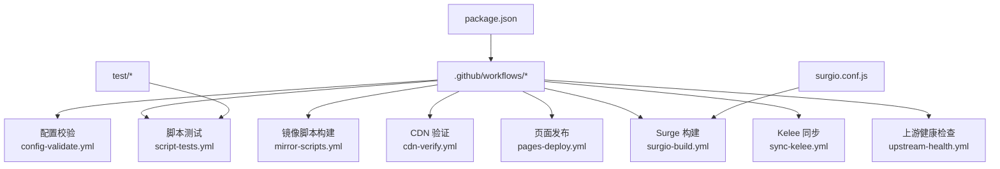
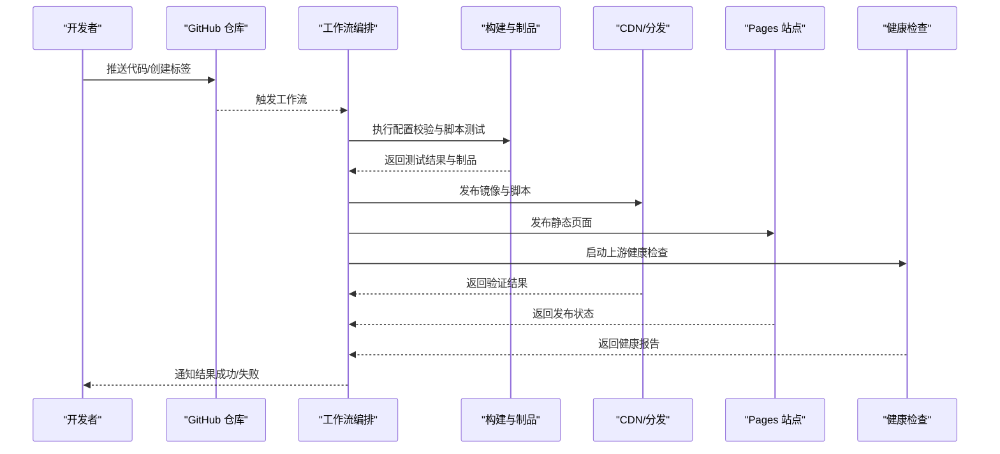
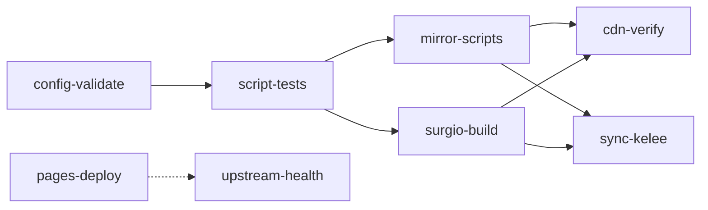

# 部署自动化

<cite>
**本文引用的文件**   
- [README.md](file://README.md)
- [package.json](file://package.json)
- [.github/workflows/cdn-verify.yml](file://.github/workflows/cdn-verify.yml)
- [.github/workflows/config-validate.yml](file://.github/workflows/config-validate.yml)
- [.github/workflows/mirror-scripts.yml](file://.github/workflows/mirror-scripts.yml)
- [.github/workflows/pages-deploy.yml](file://.github/workflows/pages-deploy.yml)
- [.github/workflows/script-tests.yml](file://.github/workflows/script-tests.yml)
- [.github/workflows/surgio-build.yml](file://.github/workflows/surgio-build.yml)
- [.github/workflows/sync-kelee.yml](file://.github/workflows/sync-kelee.yml)
- [.github/workflows/upstream-health.yml](file://.github/workflows/upstream-health.yml)
- [surgio.conf.js](file://surgio.conf.js)
- [test/run-tests.js](file://test/run-tests.js)
- [test/harness.js](file://test/harness.js)
</cite>

## 目录
1. [简介](#简介)
2. [项目结构](#项目结构)
3. [核心组件](#核心组件)
4. [架构总览](#架构总览)
5. [详细组件分析](#详细组件分析)
6. [依赖关系分析](#依赖关系分析)
7. [性能考虑](#性能考虑)
8. [故障排查指南](#故障排查指南)
9. [结论](#结论)
10. [附录](#附录)

## 简介
本仓库提供一套面向规则与脚本的部署自动化系统，覆盖配置校验、脚本测试、镜像构建与同步、CDN 验证、页面发布以及上游健康检查等关键环节。通过 GitHub Actions 编排工作流，实现从代码变更到制品发布的端到端自动化，确保配置正确性、脚本稳定性与分发一致性。

## 项目结构
仓库采用按功能域组织的方式：
- .github/workflows：GitHub Actions 工作流定义，涵盖校验、测试、构建、发布与健康检查。
- Mirror/Scripts/Plugin/Profile/template：规则、脚本、插件与模板资源。
- test：测试用例与运行器。
- surgio.conf.js：Surge 相关构建配置。
- package.json：Node 依赖与脚本入口。
- README.md：项目说明与使用指引。

图表来源
- [.github/workflows/config-validate.yml](file://.github/workflows/config-validate.yml)
- [.github/workflows/script-tests.yml](file://.github/workflows/script-tests.yml)
- [.github/workflows/mirror-scripts.yml](file://.github/workflows/mirror-scripts.yml)
- [.github/workflows/cdn-verify.yml](file://.github/workflows/cdn-verify.yml)
- [.github/workflows/pages-deploy.yml](file://.github/workflows/pages-deploy.yml)
- [.github/workflows/surgio-build.yml](file://.github/workflows/surgio-build.yml)
- [.github/workflows/sync-kelee.yml](file://.github/workflows/sync-kelee.yml)
- [.github/workflows/upstream-health.yml](file://.github/workflows/upstream-health.yml)
- [surgio.conf.js](file://surgio.conf.js)
- [test/run-tests.js](file://test/run-tests.js)
- [test/harness.js](file://test/harness.js)
- [package.json](file://package.json)

章节来源
- [README.md](file://README.md)
- [package.json](file://package.json)

## 核心组件
- 配置校验工作流：对配置文件进行语法与规则完整性校验，确保提交前不引入错误配置。
- 脚本测试工作流：执行单元测试与集成测试，保障脚本行为稳定。
- 镜像脚本构建工作流：生成或更新镜像清单与脚本产物，供分发使用。
- CDN 验证工作流：在发布后对 CDN 可访问性与内容一致性进行验证。
- 页面发布工作流：将静态站点或文档发布至 Pages 服务。
- Surge 构建工作流：基于配置生成 Surge 兼容的制品。
- Kelee 同步工作流：将制品同步至 Kelee 平台。
- 上游健康检查工作流：定期检查上游依赖可用性并告警。

章节来源
- [.github/workflows/config-validate.yml](file://.github/workflows/config-validate.yml)
- [.github/workflows/script-tests.yml](file://.github/workflows/script-tests.yml)
- [.github/workflows/mirror-scripts.yml](file://.github/workflows/mirror-scripts.yml)
- [.github/workflows/cdn-verify.yml](file://.github/workflows/cdn-verify.yml)
- [.github/workflows/pages-deploy.yml](file://.github/workflows/pages-deploy.yml)
- [.github/workflows/surgio-build.yml](file://.github/workflows/surgio-build.yml)
- [.github/workflows/sync-kelee.yml](file://.github/workflows/sync-kelee.yml)
- [.github/workflows/upstream-health.yml](file://.github/workflows/upstream-health.yml)

## 架构总览
整体流程以 GitHub Actions 为编排中心，各工作流之间通过事件触发与工件传递协作，形成“校验→测试→构建→发布→验证”的闭环。

图表来源
- [.github/workflows/config-validate.yml](file://.github/workflows/config-validate.yml)
- [.github/workflows/script-tests.yml](file://.github/workflows/script-tests.yml)
- [.github/workflows/mirror-scripts.yml](file://.github/workflows/mirror-scripts.yml)
- [.github/workflows/cdn-verify.yml](file://.github/workflows/cdn-verify.yml)
- [.github/workflows/pages-deploy.yml](file://.github/workflows/pages-deploy.yml)
- [.github/workflows/upstream-health.yml](file://.github/workflows/upstream-health.yml)

## 详细组件分析

### 配置校验工作流（config-validate）
- 触发机制：代码推送或拉取请求时触发，确保变更符合规范。
- 主要步骤：
  - 检出代码与缓存依赖。
  - 安装 Node 环境及依赖。
  - 执行配置校验脚本（如 JSON/列表/模板语法检查）。
  - 输出校验报告并设置失败条件。
- 关键要点：
  - 使用并行矩阵加速多配置校验。
  - 失败即阻断后续流程，避免错误配置进入分支。

章节来源
- [.github/workflows/config-validate.yml](file://.github/workflows/config-validate.yml)

### 脚本测试工作流（script-tests）
- 触发机制：代码推送或拉取请求时触发。
- 主要步骤：
  - 准备 Node 环境与依赖。
  - 运行测试套件（包含单元测试与集成测试）。
  - 收集测试覆盖率与日志。
  - 失败则标记工作流失败并通知。
- 关键要点：
  - 测试用例位于 test/cases，运行器位于 test/run-tests.js。
  - 通过 harness 统一断言与输出格式。

章节来源
- [.github/workflows/script-tests.yml](file://.github/workflows/script-tests.yml)
- [test/run-tests.js](file://test/run-tests.js)
- [test/harness.js](file://test/harness.js)

### 镜像脚本构建工作流（mirror-scripts）
- 触发机制：代码推送或手动触发。
- 主要步骤：
  - 解析镜像清单与脚本元数据。
  - 生成或更新镜像产物（如清单 JSON、打包脚本）。
  - 上传制品以供后续分发。
- 关键要点：
  - 产物命名遵循版本化策略，便于回滚与追踪。
  - 构建过程可缓存中间产物以提升速度。

章节来源
- [.github/workflows/mirror-scripts.yml](file://.github/workflows/mirror-scripts.yml)

### CDN 验证工作流（cdn-verify）
- 触发机制：发布完成后触发。
- 主要步骤：
  - 等待制品可用。
  - 发起 HTTP 请求验证 CDN 可访问性与内容一致性。
  - 记录响应码、延迟与内容哈希。
  - 失败时触发告警并标记发布异常。
- 关键要点：
  - 支持重试与超时控制。
  - 可对比期望哈希与实际哈希，确保内容未篡改。

章节来源
- [.github/workflows/cdn-verify.yml](file://.github/workflows/cdn-verify.yml)

### 页面发布工作流（pages-deploy）
- 触发机制：代码推送或手动触发。
- 主要步骤：
  - 构建静态站点或文档。
  - 部署至 Pages 服务。
  - 验证站点可访问性。
- 关键要点：
  - 使用缓存减少构建时间。
  - 发布成功后输出站点链接。

章节来源
- [.github/workflows/pages-deploy.yml](file://.github/workflows/pages-deploy.yml)

### Surge 构建工作流（surgio-build）
- 触发机制：代码推送或手动触发。
- 主要步骤：
  - 读取 surgio.conf.js 配置。
  - 生成 Surge 兼容的规则与配置文件。
  - 上传制品。
- 关键要点：
  - 配置变更需通过校验后再构建。
  - 产物命名包含版本号，便于回滚。

章节来源
- [.github/workflows/surgio-build.yml](file://.github/workflows/surgio-build.yml)
- [surgio.conf.js](file://surgio.conf.js)

### Kelee 同步工作流（sync-kelee）
- 触发机制：发布成功后触发。
- 主要步骤：
  - 调用 Kelee API 同步制品。
  - 处理认证与重试逻辑。
  - 记录同步结果与错误信息。
- 关键要点：
  - 使用密钥管理敏感信息。
  - 失败时保留日志以便排查。

章节来源
- [.github/workflows/sync-kelee.yml](file://.github/workflows/sync-kelee.yml)

### 上游健康检查工作流（upstream-health）
- 触发机制：定时触发或手动触发。
- 主要步骤：
  - 探测上游依赖（域名、API、CDN）可用性。
  - 汇总健康状态并生成报告。
  - 失败时发送告警通知。
- 关键要点：
  - 支持多上游并发探测。
  - 阈值与重试策略可配置。

章节来源
- [.github/workflows/upstream-health.yml](file://.github/workflows/upstream-health.yml)

## 依赖关系分析
工作流之间的依赖关系如下：
- config-validate 与 script-tests 作为前置关卡，阻断错误变更。
- mirror-scripts 与 surgio-build 产出制品，供 cdn-verify 与 sync-kelee 消费。
- pages-deploy 独立发布静态内容。
- upstream-health 作为持续监控，独立于发布流程。

图表来源
- [.github/workflows/config-validate.yml](file://.github/workflows/config-validate.yml)
- [.github/workflows/script-tests.yml](file://.github/workflows/script-tests.yml)
- [.github/workflows/mirror-scripts.yml](file://.github/workflows/mirror-scripts.yml)
- [.github/workflows/surgio-build.yml](file://.github/workflows/surgio-build.yml)
- [.github/workflows/cdn-verify.yml](file://.github/workflows/cdn-verify.yml)
- [.github/workflows/sync-kelee.yml](file://.github/workflows/sync-kelee.yml)
- [.github/workflows/pages-deploy.yml](file://.github/workflows/pages-deploy.yml)
- [.github/workflows/upstream-health.yml](file://.github/workflows/upstream-health.yml)

章节来源
- [package.json](file://package.json)

## 性能考虑
- 缓存策略：对 Node 依赖与构建中间产物启用缓存，减少重复下载与编译时间。
- 并行执行：在工作流中使用矩阵策略并行运行多个任务，缩短总耗时。
- 增量构建：仅对变更文件执行校验与测试，避免全量扫描。
- 资源限制：合理设置超时与重试次数，避免长时间阻塞。

[本节为通用指导，无需引用具体文件]

## 故障排查指南
- 配置校验失败：
  - 检查配置文件语法与必填字段。
  - 查看工作流日志中的错误堆栈与行号。
- 脚本测试失败：
  - 定位测试用例失败点，复现本地问题。
  - 确认依赖版本与环境变量。
- 构建失败：
  - 检查构建脚本与配置文件路径。
  - 清理缓存后重试。
- CDN 验证失败：
  - 确认制品已上传且权限正确。
  - 检查网络连通性与代理设置。
- 健康检查告警：
  - 核对上游地址与证书有效性。
  - 调整阈值与重试策略。

章节来源
- [.github/workflows/config-validate.yml](file://.github/workflows/config-validate.yml)
- [.github/workflows/script-tests.yml](file://.github/workflows/script-tests.yml)
- [.github/workflows/mirror-scripts.yml](file://.github/workflows/mirror-scripts.yml)
- [.github/workflows/cdn-verify.yml](file://.github/workflows/cdn-verify.yml)
- [.github/workflows/upstream-health.yml](file://.github/workflows/upstream-health.yml)

## 结论
本部署自动化系统通过 GitHub Actions 将配置校验、脚本测试、镜像构建、CDN 验证、页面发布与健康检查串联成完整流水线，显著提升交付质量与效率。建议结合版本管理与回滚策略，进一步完善监控与告警体系，确保生产环境的稳定性与可观测性。

[本节为总结性内容，无需引用具体文件]

## 附录
- 本地开发最佳实践：
  - 使用相同的 Node 版本与依赖锁定文件。
  - 在本地运行测试与校验脚本，模拟 CI 环境。
  - 使用环境变量隔离敏感信息。
- 部署最佳实践：
  - 小步快跑，频繁提交与发布。
  - 使用语义化版本标签触发发布流程。
  - 发布前进行预发验证与灰度发布。
- 故障恢复与回滚策略：
  - 保留历史制品与版本标签。
  - 一键回滚至上一稳定版本。
  - 建立快速回退流程与演练机制。
- 监控告警与日志收集：
  - 集成日志聚合服务，集中采集工作流日志。
  - 配置关键指标告警（失败率、延迟、可用性）。
  - 定期审查告警规则与阈值。

[本节为通用指导，无需引用具体文件]