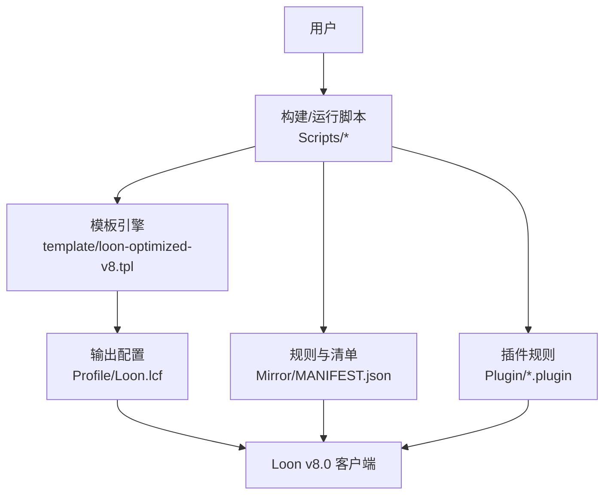
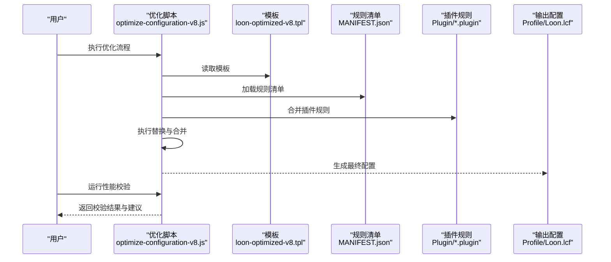
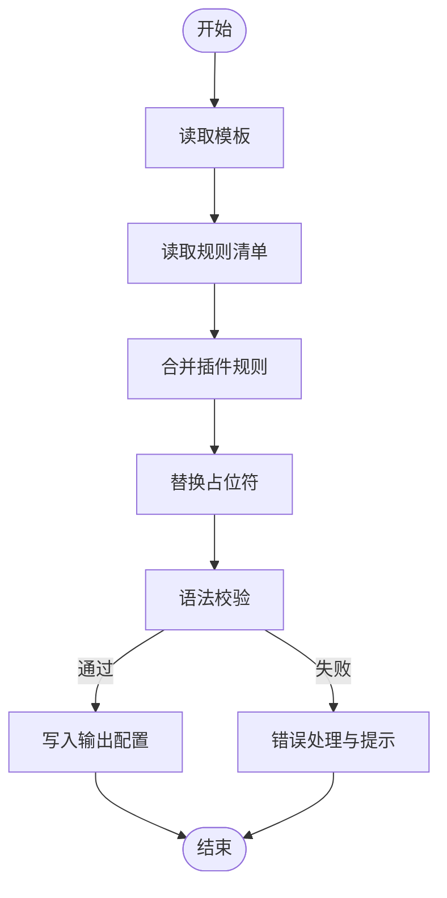
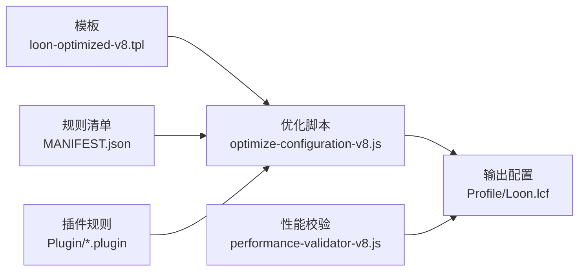

# Loon v8.0优化系统

<cite>
**本文档引用的文件**   
- [README.md](file://README.md)
- [package.json](file://package.json)
- [surgio.conf.js](file://surgio.conf.js)
- [Scripts/optimize-configuration-v8.js](file://Scripts/optimize-configuration-v8.js)
- [Scripts/performance-validator-v8.js](file://Scripts/performance-validator-v8.js)
- [template/loon-optimized-v8.tpl](file://template/loon-optimized-v8.tpl)
- [Profile/Loon.lcf](file://Profile/Loon.lcf)
- [Mirror/MANIFEST.json](file://Mirror/MANIFEST.json)
- [doc/Loon_Best_Practices_Complete_Guide.md](file://doc/Loon_Best_Practices_Complete_Guide.md)
</cite>

## 目录
1. [简介](#简介)
2. [项目结构](#项目结构)
3. [核心组件](#核心组件)
4. [架构总览](#架构总览)
5. [详细组件分析](#详细组件分析)
6. [依赖关系分析](#依赖关系分析)
7. [性能考量](#性能考量)
8. [故障排查指南](#故障排查指南)
9. [结论](#结论)
10. [附录](#附录)

## 简介
本仓库围绕 Loon v8.0 的优化系统，提供配置模板、脚本工具与规则集，用于生成高性能、低延迟、可维护的网络访问策略。系统通过模板化配置、脚本校验与性能验证，确保在 Loon v8.0 环境下稳定运行并达到最佳体验。

## 项目结构
- Profile：存放各代理工具的配置文件（如 Loon.lcf）
- template：模板文件，包含 loon-optimized-v8.tpl 等
- Scripts：脚本集合，包括 v8 优化脚本、性能校验脚本、流量与健康通知脚本等
- Mirror：规则与资源清单，含 MANIFEST.json 与各应用规则
- Plugin：按应用划分的插件规则
- QX/apple：Quantumult X 相关规则
- doc：文档与审计记录
- test：测试用例与测试运行器
- surgio.conf.js：Surgio 构建配置
- package.json：工程元数据与脚本命令
- README.md：项目说明

图表来源
- [Scripts/optimize-configuration-v8.js](file://Scripts/optimize-configuration-v8.js)
- [template/loon-optimized-v8.tpl](file://template/loon-optimized-v8.tpl)
- [Profile/Loon.lcf](file://Profile/Loon.lcf)
- [Mirror/MANIFEST.json](file://Mirror/MANIFEST.json)

章节来源
- [README.md](file://README.md)
- [package.json](file://package.json)
- [surgio.conf.js](file://surgio.conf.js)

## 核心组件
- 配置模板：loon-optimized-v8.tpl 提供针对 Loon v8.0 的高性能模板，包含分流、直连、代理与脚本注入等关键段落
- 优化脚本：optimize-configuration-v8.js 负责解析模板、合并规则、生成最终配置
- 性能校验：performance-validator-v8.js 对生成的配置进行语法与性能检查，确保符合 v8.0 规范
- 规则清单：Mirror/MANIFEST.json 定义规则版本与资源索引，便于更新与回滚
- 配置文件：Profile/Loon.lcf 为最终部署到 Loon 的配置

章节来源
- [template/loon-optimized-v8.tpl](file://template/loon-optimized-v8.tpl)
- [Scripts/optimize-configuration-v8.js](file://Scripts/optimize-configuration-v8.js)
- [Scripts/performance-validator-v8.js](file://Scripts/performance-validator-v8.js)
- [Mirror/MANIFEST.json](file://Mirror/MANIFEST.json)
- [Profile/Loon.lcf](file://Profile/Loon.lcf)

## 架构总览
系统采用“模板 + 脚本 + 规则”的分层架构：
- 模板层：集中管理通用结构与占位符
- 脚本层：读取模板与规则，执行替换、合并与校验
- 规则层：按应用或场景组织，支持增量更新
- 输出层：生成 Loon 可直接加载的配置文件

图表来源
- [Scripts/optimize-configuration-v8.js](file://Scripts/optimize-configuration-v8.js)
- [template/loon-optimized-v8.tpl](file://template/loon-optimized-v8.tpl)
- [Mirror/MANIFEST.json](file://Mirror/MANIFEST.json)
- [Profile/Loon.lcf](file://Profile/Loon.lcf)

## 详细组件分析

### 配置模板（loon-optimized-v8.tpl）
- 职责：定义 Loon v8.0 的核心段落结构，包括全局设置、分流规则、直连与代理策略、脚本注入点
- 设计要点：使用占位符与条件段，便于脚本动态替换；保持可读性与可维护性
- 扩展方式：新增应用或场景时，在模板中增加对应段落并在脚本中实现合并逻辑

章节来源
- [template/loon-optimized-v8.tpl](file://template/loon-optimized-v8.tpl)

### 优化脚本（optimize-configuration-v8.js）
- 职责：读取模板与规则清单，合并插件规则，生成最终配置
- 处理流程：
  - 解析模板与占位符
  - 加载 MANIFEST.json 获取规则版本与资源
  - 合并 Plugin 下的规则片段
  - 执行替换与去重
  - 输出到 Profile/Loon.lcf
- 错误处理：对缺失文件或格式错误进行提示与中止

图表来源
- [Scripts/optimize-configuration-v8.js](file://Scripts/optimize-configuration-v8.js)

章节来源
- [Scripts/optimize-configuration-v8.js](file://Scripts/optimize-configuration-v8.js)

### 性能校验（performance-validator-v8.js）
- 职责：对生成的配置进行语法与性能检查，确保符合 Loon v8.0 规范
- 检查项：
  - 段落完整性与顺序
  - 规则重复与冲突检测
  - 脚本注入点的合法性
  - 资源引用有效性
- 输出：报告问题与建议优化方案

章节来源
- [Scripts/performance-validator-v8.js](file://Scripts/performance-validator-v8.js)

### 规则清单（MANIFEST.json）
- 职责：定义规则版本、资源路径与更新策略
- 内容：包含各应用规则的索引、版本号与校验信息
- 作用：支持增量更新与回滚，保证一致性

章节来源
- [Mirror/MANIFEST.json](file://Mirror/MANIFEST.json)

### 配置文件（Profile/Loon.lcf）
- 职责：最终部署到 Loon 的配置，由脚本生成
- 特点：遵循 v8.0 规范，包含所有必要的分流、直连与代理策略

章节来源
- [Profile/Loon.lcf](file://Profile/Loon.lcf)

## 依赖关系分析
- 脚本依赖模板与规则清单，生成配置文件
- 插件规则作为输入源之一，影响最终配置内容
- 性能校验脚本依赖生成的配置文件进行检查

图表来源
- [template/loon-optimized-v8.tpl](file://template/loon-optimized-v8.tpl)
- [Scripts/optimize-configuration-v8.js](file://Scripts/optimize-configuration-v8.js)
- [Mirror/MANIFEST.json](file://Mirror/MANIFEST.json)
- [Profile/Loon.lcf](file://Profile/Loon.lcf)
- [Scripts/performance-validator-v8.js](file://Scripts/performance-validator-v8.js)

章节来源
- [package.json](file://package.json)
- [surgio.conf.js](file://surgio.conf.js)

## 性能考量
- 模板设计应减少不必要的嵌套与重复，提升解析效率
- 规则清单需保持最小化与去重，避免冗余
- 脚本执行应避免频繁 I/O，尽量批量处理
- 性能校验应在开发阶段尽早发现潜在问题

## 故障排查指南
- 常见问题：
  - 模板占位符未替换：检查脚本替换逻辑与变量映射
  - 规则冲突：使用性能校验工具定位并修复
  - 插件规则缺失：确认 MANIFEST.json 中的索引与路径
- 调试建议：
  - 启用脚本日志输出
  - 分步执行模板解析与规则合并
  - 对比历史版本配置差异

章节来源
- [Scripts/performance-validator-v8.js](file://Scripts/performance-validator-v8.js)
- [doc/Loon_Best_Practices_Complete_Guide.md](file://doc/Loon_Best_Practices_Complete_Guide.md)

## 结论
Loon v8.0 优化系统通过模板化配置、脚本自动化与规则化管理，实现了高效、稳定且可扩展的网络策略生成。结合性能校验与最佳实践，可在复杂网络环境中提供一致的用户体验。

## 附录
- 最佳实践参考：[Loon 最佳实践完整指南](file://doc/Loon_Best_Practices_Complete_Guide.md)
- 构建与发布：参见 [surgio.conf.js](file://surgio.conf.js) 与 [package.json](file://package.json)