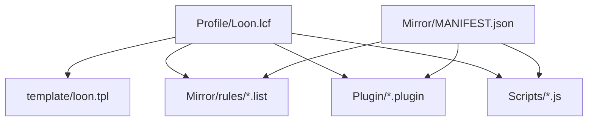
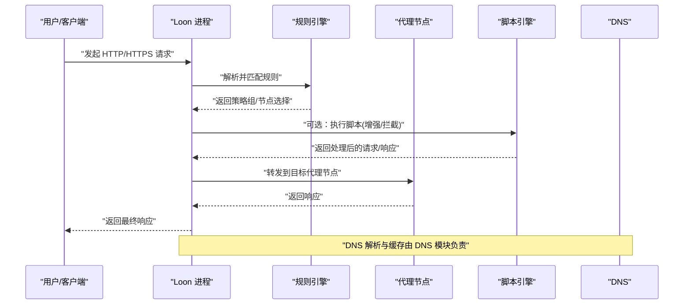
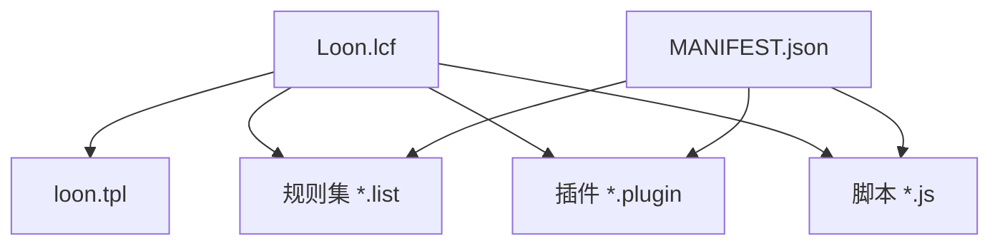

# Loon配置指南

<cite>
**本文档引用的文件**
- [Loon.lcf](file://Profile/Loon.lcf)
- [loon.tpl](file://template/loon.tpl)
- [MANIFEST.json](file://Mirror/MANIFEST.json)
- [loon-Advertising.list](file://Mirror/rules/loon-Advertising.list)
- [loon-China.list](file://Mirror/rules/loon-China.list)
- [loon-Global.list](file://Mirror/rules/loon-Global.list)
- [loon-Hijacking.list](file://Mirror/rules/loon-Hijacking.list)
- [loon-Privacy.list](file://Mirror/rules/loon-Privacy.list)
- [ai.plugin](file://Plugin/ai.plugin)
- [bilibili.plugin](file://Plugin/bilibili.plugin)
- [wechat.plugin](file://Plugin/wechat.plugin)
- [Amap.js](file://Scripts/Amap.js)
- [JD.js](file://Scripts/JD.js)
- [health-notify.js](file://Scripts/health-notify.js)
- [traffic-notify.js](file://Scripts/traffic-notify.js)
</cite>

## 目录
1. [简介](#简介)
2. [项目结构](#项目结构)
3. [核心组件](#核心组件)
4. [架构总览](#架构总览)
5. [详细组件分析](#详细组件分析)
6. [依赖关系分析](#依赖关系分析)
7. [性能考虑](#性能考虑)
8. [故障排查指南](#故障排查指南)
9. [结论](#结论)
10. [附录：常用场景模板与最佳实践](#附录常用场景模板与最佳实践)

## 简介
本指南面向使用 Loon 代理工具的用户，系统讲解 .lcf 配置文件语法、基础与高级选项、规则引擎、脚本集成、插件管理与网络设置。文档结合仓库中的实际配置与资源，提供可操作的示例路径与最佳实践，帮助快速搭建稳定高效的代理环境。

## 项目结构
仓库围绕“配置模板 + 规则列表 + 插件 + 脚本”组织，便于组合生成最终的 Loon 配置文件。关键目录与文件说明：
- Profile/Loon.lcf：Loon 主配置文件（入口）
- template/loon.tpl：Loon 配置模板（用于生成或拼装最终配置）
- Mirror/rules/*.list：分流与广告拦截等规则集
- Plugin/*.plugin：按应用/功能划分的插件
- Scripts/*.js：增强脚本（通知、健康检查、流量统计等）
- Mirror/MANIFEST.json：镜像资源清单（供构建/校验使用）

图表来源
- [Loon.lcf](file://Profile/Loon.lcf)
- [loon.tpl](file://template/loon.tpl)
- [MANIFEST.json](file://Mirror/MANIFEST.json)
- [loon-Advertising.list](file://Mirror/rules/loon-Advertising.list)
- [ai.plugin](file://Plugin/ai.plugin)
- [Amap.js](file://Scripts/Amap.js)

章节来源
- [Loon.lcf](file://Profile/Loon.lcf)
- [loon.tpl](file://template/loon.tpl)
- [MANIFEST.json](file://Mirror/MANIFEST.json)

## 核心组件
- 配置文件（.lcf）：定义全局参数、代理节点、策略组、规则、DNS、脚本与插件加载等。
- 规则引擎：基于域名/IP/ASN/地理位置等条件进行分流，支持外部规则集。
- 脚本系统：通过 JavaScript 扩展行为（如去广告、数据增强、通知）。
- 插件管理：按应用维度启用/禁用功能模块。
- 网络设置：HTTP/HTTPS 代理、DNS 解析、TLS 优化、超时与重试等。

章节来源
- [Loon.lcf](file://Profile/Loon.lcf)
- [loon.tpl](file://template/loon.tpl)

## 架构总览
Loon 运行时由“配置解析 → 规则匹配 → 路由决策 → 代理转发/脚本执行 → 结果返回”构成。规则与脚本可动态更新，插件按需加载。

图表来源
- [Loon.lcf](file://Profile/Loon.lcf)
- [loon-Advertising.list](file://Mirror/rules/loon-Advertising.list)
- [Amap.js](file://Scripts/Amap.js)

## 详细组件分析

### 配置文件（.lcf）语法与结构
- 基本结构
  - 全局段：定义默认代理、日志级别、超时、并发等。
  - 代理段：声明上游代理（HTTP/SOCKS/SS/VMess 等），含认证、TLS、SNI、端口等。
  - 策略组：将多个代理节点聚合，配合规则进行自动切换。
  - 规则段：按域名/IP/ASN/地理位置等条件映射到策略组或直接拒绝/放行。
  - DNS 段：自定义上游 DNS、DoH/DoT、本地缓存、白名单等。
  - 脚本段：引入 JS 脚本，绑定触发点（请求前/后、响应前/后）。
  - 插件段：按应用或功能启用插件。
- 常见键名与含义
  - 代理相关：类型、地址、端口、用户名/密码、加密方式、TLS 开关、SNI、证书校验等。
  - 策略组：名称、模式（如手动/自动/延迟）、成员列表、健康检查间隔。
  - 规则：匹配类型（域名/IP/ASN/地理）、匹配值、动作（直连/代理/拒绝）。
  - DNS：上游服务器、DoH/DoT 地址、缓存大小、过滤规则。
  - 脚本：路径、作用域、触发事件、参数。
  - 插件：插件标识、启用标志、参数。
- 注意事项
  - 规则顺序影响匹配优先级，建议将更具体的规则置于前面。
  - 策略组成员应包含至少一个可用节点，避免死链。
  - DNS 与 TLS 设置需与上游代理能力一致。

章节来源
- [Loon.lcf](file://Profile/Loon.lcf)
- [loon.tpl](file://template/loon.tpl)

### 规则引擎配置
- 规则来源
  - 内置规则：按域名/IP/ASN/地理位置等条件直接编写。
  - 外部规则：引用 *.list 文件，集中维护广告、分流、隐私等规则。
- 规则类型
  - 域名规则：精确/通配/正则匹配。
  - IP/CIDR 规则：针对特定网段。
  - ASN/地理规则：按自治系统或国家/地区分流。
  - 动作：直连、代理、拒绝、重定向等。
- 最佳实践
  - 将高频访问的国内站点设为直连，海外站点走代理。
  - 广告与追踪域名统一加入拒绝或重定向策略。
  - 定期更新外部规则集，保持时效性。

章节来源
- [loon-Advertising.list](file://Mirror/rules/loon-Advertising.list)
- [loon-China.list](file://Mirror/rules/loon-China.list)
- [loon-Global.list](file://Mirror/rules/loon-Global.list)
- [loon-Hijacking.list](file://Mirror/rules/loon-Hijacking.list)
- [loon-Privacy.list](file://Mirror/rules/loon-Privacy.list)

### 脚本集成
- 脚本用途
  - 请求/响应修改、去广告、数据增强、通知与健康检查、流量统计等。
- 触发点
  - 请求前、请求后、响应前、响应后。
- 典型脚本
  - 地图类增强：Amap.js
  - 电商类增强：JD.js
  - 通知与健康检查：health-notify.js、traffic-notify.js
- 集成方式
  - 在配置中声明脚本路径与作用域，绑定触发事件。
  - 脚本间可通过共享上下文传递数据（遵循脚本引擎约定）。

章节来源
- [Amap.js](file://Scripts/Amap.js)
- [JD.js](file://Scripts/JD.js)
- [health-notify.js](file://Scripts/health-notify.js)
- [traffic-notify.js](file://Scripts/traffic-notify.js)

### 插件管理
- 插件分类
  - 应用级插件：如 bilibili.plugin、wechat.plugin、ai.plugin 等。
  - 功能级插件：通知、搜索、支付等。
- 启用方式
  - 在配置中按插件标识启用，并可传入参数。
- 生命周期
  - 按需加载，减少内存占用；支持热更新（取决于实现）。

章节来源
- [ai.plugin](file://Plugin/ai.plugin)
- [bilibili.plugin](file://Plugin/bilibili.plugin)
- [wechat.plugin](file://Plugin/wechat.plugin)

### 网络设置
- 代理协议
  - HTTP、SOCKS、SS、VMess 等，支持多节点与负载均衡。
- TLS 与安全
  - 证书校验、SNI、最小版本、套件选择。
- DNS 解析
  - 自定义上游、DoH/DoT、缓存、过滤与回退策略。
- 连接优化
  - 超时、重试、并发、Keep-Alive、带宽限制等。

章节来源
- [Loon.lcf](file://Profile/Loon.lcf)
- [loon.tpl](file://template/loon.tpl)

## 依赖关系分析
Loon 的配置依赖规则集、脚本与插件，三者通过清单统一管理，确保一致性。

图表来源
- [Loon.lcf](file://Profile/Loon.lcf)
- [loon.tpl](file://template/loon.tpl)
- [MANIFEST.json](file://Mirror/MANIFEST.json)
- [loon-Advertising.list](file://Mirror/rules/loon-Advertising.list)
- [ai.plugin](file://Plugin/ai.plugin)
- [Amap.js](file://Scripts/Amap.js)

章节来源
- [MANIFEST.json](file://Mirror/MANIFEST.json)
- [Loon.lcf](file://Profile/Loon.lcf)

## 性能考虑
- 规则匹配
  - 将高命中率的规则前置，减少不必要的匹配开销。
  - 合理使用外部规则集，避免重复与冲突。
- 脚本执行
  - 控制脚本数量与复杂度，避免阻塞请求链路。
  - 对耗时操作采用异步或批处理方式。
- DNS 与 TLS
  - 启用 DNS 缓存，合理设置 TTL。
  - 复用 TLS 会话，减少握手开销。
- 代理节点
  - 为策略组配置健康检查与自动切换，提升可用性。
  - 根据延迟与丢包率选择最优节点。

[本节为通用指导，不直接分析具体文件]

## 故障排查指南
- 常见问题
  - 无法解析域名：检查 DNS 上游与 DoH/DoT 配置，确认缓存与过滤规则。
  - HTTPS 失败：核对证书校验、SNI、TLS 版本与套件。
  - 规则不生效：检查规则顺序与匹配条件，确认外部规则已正确加载。
  - 脚本报错：查看脚本日志，定位错误行与上下文。
  - 插件未生效：确认插件标识与启用标志，检查参数是否正确。
- 排查步骤
  - 开启调试日志，观察请求链路。
  - 逐步关闭脚本与插件，定位问题源。
  - 替换上游 DNS 与代理节点，验证连通性。
  - 使用最小化配置复现问题，再逐步恢复。

章节来源
- [Loon.lcf](file://Profile/Loon.lcf)
- [health-notify.js](file://Scripts/health-notify.js)
- [traffic-notify.js](file://Scripts/traffic-notify.js)

## 结论
通过合理的 .lcf 配置、规则集、脚本与插件协同，Loon 可实现灵活、高效且稳定的代理与增强能力。建议从最小可用配置起步，逐步叠加功能，并结合监控与日志持续优化。

[本节为总结，不直接分析具体文件]

## 附录：常用场景模板与最佳实践

### 场景一：HTTP/HTTPS 代理与策略组
- 目标：为不同业务设定不同代理策略，自动切换最优节点。
- 要点：
  - 定义多个代理节点与策略组。
  - 将常用海外服务映射到海外策略组，国内服务映射到直连。
  - 启用健康检查与延迟探测。
- 参考路径
  - [Loon.lcf](file://Profile/Loon.lcf)
  - [loon.tpl](file://template/loon.tpl)

### 场景二：DNS 解析与防泄漏
- 目标：使用可靠 DNS，防止 DNS 泄漏，提高解析速度。
- 要点：
  - 配置国内/国外双 DNS，按域名分流。
  - 启用 DoH/DoT 与缓存。
  - 设置白名单与黑名单。
- 参考路径
  - [Loon.lcf](file://Profile/Loon.lcf)
  - [loon-China.list](file://Mirror/rules/loon-China.list)

### 场景三：广告拦截与隐私保护
- 目标：屏蔽广告与追踪，保护隐私。
- 要点：
  - 引入广告与隐私规则集。
  - 对恶意域名直接拒绝或重定向。
  - 定期更新规则集。
- 参考路径
  - [loon-Advertising.list](file://Mirror/rules/loon-Advertising.list)
  - [loon-Privacy.list](file://Mirror/rules/loon-Privacy.list)

### 场景四：应用增强脚本
- 目标：为地图、电商等应用提供数据增强与体验优化。
- 要点：
  - 引入对应脚本，绑定触发点。
  - 控制脚本执行范围与频率。
  - 监控脚本性能与错误。
- 参考路径
  - [Amap.js](file://Scripts/Amap.js)
  - [JD.js](file://Scripts/JD.js)

### 场景五：插件化管理
- 目标：按应用启用插件，减少冗余。
- 要点：
  - 为每个应用创建独立插件。
  - 在配置中按需启用与传参。
  - 关注插件生命周期与兼容性。
- 参考路径
  - [ai.plugin](file://Plugin/ai.plugin)
  - [bilibili.plugin](file://Plugin/bilibili.plugin)
  - [wechat.plugin](file://Plugin/wechat.plugin)

### 最佳实践清单
- 规则分层：通用规则在前，特殊规则在后。
- 节点冗余：策略组内至少两个可用节点。
- DNS 安全：优先使用可信上游，启用缓存与过滤。
- 脚本精简：仅启用必要脚本，避免阻塞。
- 插件按需：只启用当前需要的插件。
- 日志与监控：开启必要日志，定期巡检。
- 版本管理：规则与脚本集中维护，定期更新。

[本节为通用指导，不直接分析具体文件]