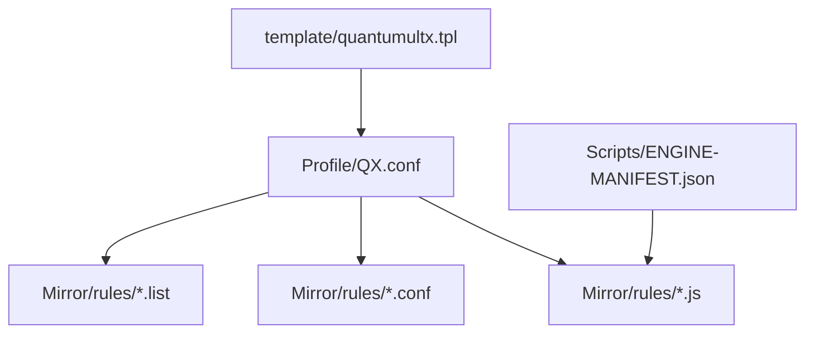
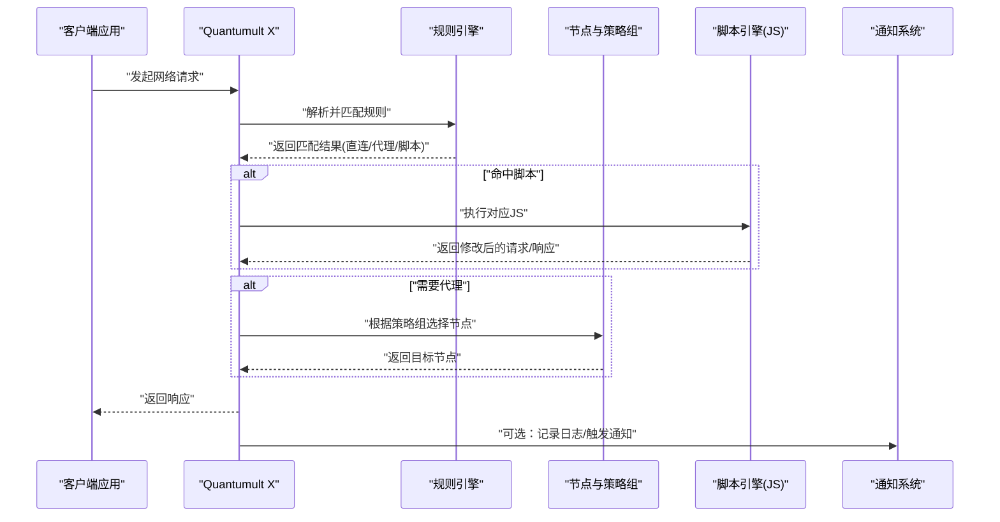
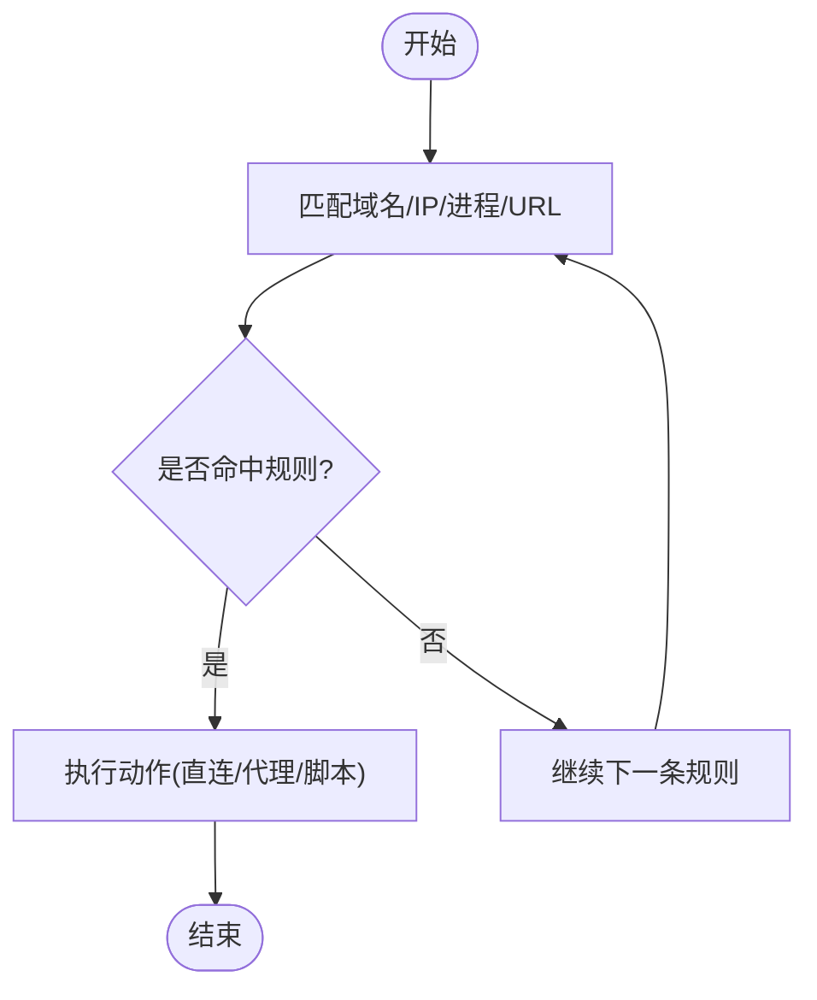
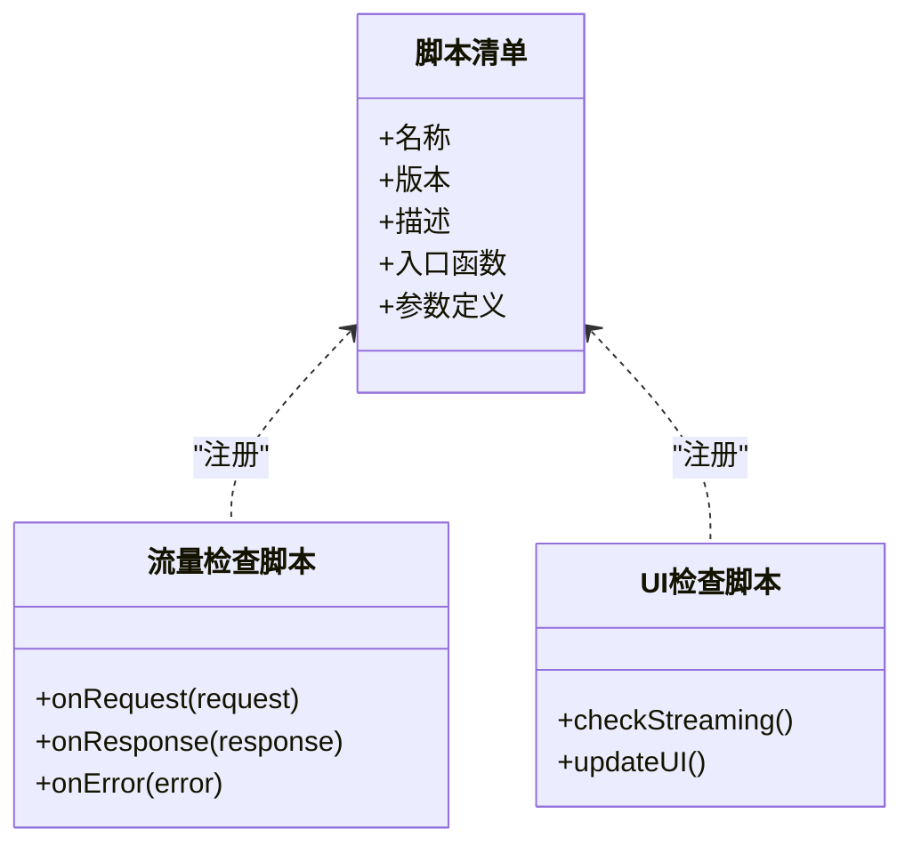
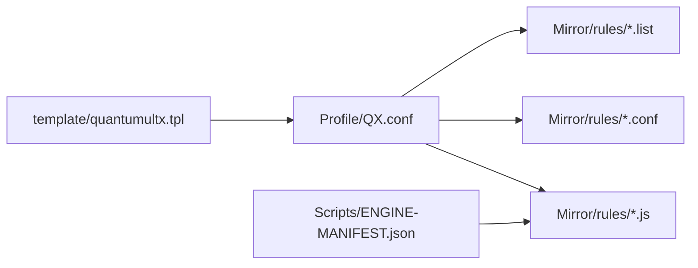

# Quantumult X配置指南

<cite>
**本文档引用的文件**   
- [README.md](file://README.md)
- [Profile/QX.conf](file://Profile/QX.conf)
- [Mirror/rules/qx-China.list](file://Mirror/rules/qx-China.list)
- [Mirror/rules/qx-Epic.list](file://Mirror/rules/qx-Epic.list)
- [Mirror/rules/qx-Hijacking.list](file://Mirror/rules/qx-Hijacking.list)
- [Mirror/rules/qx-bilibili.conf](file://Mirror/rules/qx-bilibili.conf)
- [Mirror/rules/qx-streaming-ui-check.js](file://Mirror/rules/qx-streaming-ui-check.js)
- [Mirror/rules/qx-traffic-check.js](file://Mirror/rules/qx-traffic-check.js)
- [Scripts/ENGINE-MANIFEST.json](file://Scripts/ENGINE-MANIFEST.json)
- [template/quantumultx.tpl](file://template/quantumultx.tpl)
</cite>

## 目录
1. [简介](#简介)
2. [项目结构](#项目结构)
3. [核心组件](#核心组件)
4. [架构总览](#架构总览)
5. [详细组件分析](#详细组件分析)
6. [依赖关系分析](#依赖关系分析)
7. [性能优化建议](#性能优化建议)
8. [故障排除指南](#故障排除指南)
9. [结论](#结论)
10. [附录](#附录)

## 简介
本指南面向Quantumult X（QX）用户与开发者，系统化讲解QX配置文件(.conf)的语法格式、模块结构与常用选项；覆盖节点管理、规则配置、脚本集成、通知系统与UI定制；并提供可落地的配置示例路径、性能优化建议与常见问题排查方法。文档内容基于仓库中的实际配置文件与模板进行归纳总结，便于快速上手与深度定制。

## 项目结构
仓库围绕“规则、插件、脚本、模板、测试与CI”组织，其中与QX配置直接相关的核心目录包括：
- Profile：集中存放QX主配置文件与跨工具模板
- Mirror/rules：聚合各类分流规则与脚本片段
- Scripts：引擎脚本与清单，用于扩展功能与通知
- template：提供QX模板，便于批量生成或迁移配置

图表来源
- [Profile/QX.conf](file://Profile/QX.conf)
- [Mirror/rules/qx-China.list](file://Mirror/rules/qx-China.list)
- [Mirror/rules/qx-Epic.list](file://Mirror/rules/qx-Epic.list)
- [Mirror/rules/qx-Hijacking.list](file://Mirror/rules/qx-Hijacking.list)
- [Mirror/rules/qx-bilibili.conf](file://Mirror/rules/qx-bilibili.conf)
- [Mirror/rules/qx-streaming-ui-check.js](file://Mirror/rules/qx-streaming-ui-check.js)
- [Mirror/rules/qx-traffic-check.js](file://Mirror/rules/qx-traffic-check.js)
- [Scripts/ENGINE-MANIFEST.json](file://Scripts/ENGINE-MANIFEST.json)
- [template/quantumultx.tpl](file://template/quantumultx.tpl)

章节来源
- [README.md](file://README.md)
- [Profile/QX.conf](file://Profile/QX.conf)
- [template/quantumultx.tpl](file://template/quantumultx.tpl)

## 核心组件
- 配置文件入口与模块划分
  - QX主配置文件位于Profile/QX.conf，通常包含以下模块：[服务器]、[策略组]、[规则]、[重写]、[MITM]、[任务]、[通知]、[界面]等。
  - 规则与脚本通过相对或绝对路径引入，支持外部列表与JS脚本。
- 节点与策略组
  - 节点定义在[服务器]段，策略组在[策略组]段，二者通过名称引用形成代理链路。
- 规则系统
  - 规则段支持域名、IP、进程名、URL匹配与脚本匹配，按优先级顺序生效。
- 脚本与任务
  - JS脚本通过[任务]或[重写]调用，常用于广告拦截、数据增强、流量统计与通知。
- 通知与界面
  - 通知由脚本触发，界面可通过[界面]段自定义分组与排序。

章节来源
- [Profile/QX.conf](file://Profile/QX.conf)
- [Scripts/ENGINE-MANIFEST.json](file://Scripts/ENGINE-MANIFEST.json)

## 架构总览
下图展示QX配置加载与请求处理的关键流程：从配置文件解析到规则匹配、节点选择、脚本执行与通知输出。

图表来源
- [Profile/QX.conf](file://Profile/QX.conf)
- [Mirror/rules/qx-streaming-ui-check.js](file://Mirror/rules/qx-streaming-ui-check.js)
- [Mirror/rules/qx-traffic-check.js](file://Mirror/rules/qx-traffic-check.js)
- [Scripts/ENGINE-MANIFEST.json](file://Scripts/ENGINE-MANIFEST.json)

## 详细组件分析

### 节点管理与策略组
- 节点定义
  - 在[服务器]段声明节点信息，包含类型、地址、端口、加密方式、SNI等参数。
  - 常见协议：HTTP(S)、SOCKS5、VMess、Trojan、Shadowsocks等。
- 策略组
  - 在[策略组]段定义选择策略：如手动、故障转移、负载均衡、延迟测速等。
  - 策略组引用节点名称，实现灵活切换与自动选路。
- 最佳实践
  - 将不同地区/运营商的节点分属不同策略组，便于精细化控制。
  - 使用延迟测速与故障转移提升稳定性与体验。

章节来源
- [Profile/QX.conf](file://Profile/QX.conf)

### 规则配置与分流
- 规则段
  - 支持域名、IP、进程名、URL关键字、正则表达式与脚本匹配。
  - 规则按行从上到下匹配，命中即停止后续匹配。
- 常用规则类型
  - 国内直连：将国内站点设为直连，降低延迟。
  - 海外代理：将海外站点走代理，保障访问。
  - 广告与劫持：拦截广告与恶意重定向。
  - 媒体加速：针对流媒体与特定服务优化路由。
- 外部规则
  - 通过include引入外部.list或.conf文件，便于维护与更新。

图表来源
- [Mirror/rules/qx-China.list](file://Mirror/rules/qx-China.list)
- [Mirror/rules/qx-Epic.list](file://Mirror/rules/qx-Epic.list)
- [Mirror/rules/qx-Hijacking.list](file://Mirror/rules/qx-Hijacking.list)
- [Mirror/rules/qx-bilibili.conf](file://Mirror/rules/qx-bilibili.conf)

章节来源
- [Mirror/rules/qx-China.list](file://Mirror/rules/qx-China.list)
- [Mirror/rules/qx-Epic.list](file://Mirror/rules/qx-Epic.list)
- [Mirror/rules/qx-Hijacking.list](file://Mirror/rules/qx-Hijacking.list)
- [Mirror/rules/qx-bilibili.conf](file://Mirror/rules/qx-bilibili.conf)

### 脚本编写与集成
- 脚本位置与清单
  - 脚本文件位于Mirror/rules与Scripts目录，清单文件ENGINE-MANIFEST.json描述可用脚本与元信息。
- 脚本用途
  - 广告拦截、数据增强、流量统计、UI检查、健康检测与通知。
- 调用方式
  - 在[任务]或[重写]中引用脚本，传入上下文参数，获取返回值以修改请求/响应。
- 开发规范
  - 保持函数幂等与错误处理健壮；避免阻塞主线程；合理缓存与限频。

图表来源
- [Scripts/ENGINE-MANIFEST.json](file://Scripts/ENGINE-MANIFEST.json)
- [Mirror/rules/qx-traffic-check.js](file://Mirror/rules/qx-traffic-check.js)
- [Mirror/rules/qx-streaming-ui-check.js](file://Mirror/rules/qx-streaming-ui-check.js)

章节来源
- [Scripts/ENGINE-MANIFEST.json](file://Scripts/ENGINE-MANIFEST.json)
- [Mirror/rules/qx-traffic-check.js](file://Mirror/rules/qx-traffic-check.js)
- [Mirror/rules/qx-streaming-ui-check.js](file://Mirror/rules/qx-streaming-ui-check.js)

### 通知系统与任务调度
- 通知机制
  - 通过脚本触发通知，支持标题、正文、图标与链接跳转。
- 任务调度
  - 在[任务]段定义定时任务，周期性执行脚本，如健康检查、流量统计与清理。
- 最佳实践
  - 限制通知频率，避免打扰；对失败重试设置退避策略。

章节来源
- [Profile/QX.conf](file://Profile/QX.conf)
- [Scripts/ENGINE-MANIFEST.json](file://Scripts/ENGINE-MANIFEST.json)

### UI定制与界面分组
- 界面段
  - 通过[界面]段自定义分组、排序与显示名称，提升可读性。
- 分组策略
  - 按用途（如工作、娱乐）、地区（如国内、海外）或服务（如流媒体）分组。
- 动态更新
  - 结合脚本与任务定期刷新分组状态，确保界面与实际一致。

章节来源
- [Profile/QX.conf](file://Profile/QX.conf)

## 依赖关系分析
- 配置文件依赖
  - QX主配置依赖规则列表与脚本清单，规则与脚本通过路径引用。
- 脚本与引擎
  - ENGINE-MANIFEST.json为脚本引擎提供元数据，决定脚本可用性。
- 模板与迁移
  - quantumultx.tpl提供模板化配置，便于批量生成与迁移。

图表来源
- [Profile/QX.conf](file://Profile/QX.conf)
- [Mirror/rules/qx-China.list](file://Mirror/rules/qx-China.list)
- [Mirror/rules/qx-Epic.list](file://Mirror/rules/qx-Epic.list)
- [Mirror/rules/qx-Hijacking.list](file://Mirror/rules/qx-Hijacking.list)
- [Mirror/rules/qx-bilibili.conf](file://Mirror/rules/qx-bilibili.conf)
- [Scripts/ENGINE-MANIFEST.json](file://Scripts/ENGINE-MANIFEST.json)
- [template/quantumultx.tpl](file://template/quantumultx.tpl)

章节来源
- [Profile/QX.conf](file://Profile/QX.conf)
- [Scripts/ENGINE-MANIFEST.json](file://Scripts/ENGINE-MANIFEST.json)
- [template/quantumultx.tpl](file://template/quantumultx.tpl)

## 性能优化建议
- 规则优化
  - 将高频匹配的国内规则置顶，减少不必要的匹配开销。
  - 合并重复规则，使用更精确的匹配条件。
- 节点与策略组
  - 启用延迟测速与故障转移，避免低质量节点影响整体体验。
  - 合理拆分策略组，避免单组过大导致选择耗时。
- 脚本优化
  - 避免频繁I/O与网络请求；合理使用缓存与节流。
  - 将耗时逻辑异步化，减少阻塞。
- 资源管理
  - 定期清理无用规则与脚本，保持配置精简。
  - 使用外部规则与脚本托管，减少本地维护成本。

## 故障排除指南
- 常见问题
  - 规则不生效：检查规则顺序与匹配条件；确认外部规则路径正确。
  - 脚本执行失败：查看脚本日志与错误堆栈；验证参数传递与返回值格式。
  - 节点连接失败：检查证书与SNI；确认节点信息与权限设置。
  - 通知未触发：检查任务调度与通知权限；确认脚本触发条件。
- 调试技巧
  - 开启详细日志，定位问题阶段。
  - 逐步缩小范围，隔离规则与脚本影响。
  - 使用最小化配置复现问题，逐步添加功能。

## 结论
本指南系统梳理了Quantumult X的配置语法、模块结构与关键能力，涵盖节点管理、规则分流、脚本集成、通知与UI定制，并提供性能优化与故障排除建议。借助仓库中的实际配置文件与模板，用户可以快速搭建稳定高效的代理环境，并根据需求进行深度定制。

## 附录
- 参考文件
  - 主配置：Profile/QX.conf
  - 规则列表：Mirror/rules/qx-China.list、qx-Epic.list、qx-Hijacking.list
  - 服务专用：Mirror/rules/qx-bilibili.conf
  - 脚本示例：Mirror/rules/qx-streaming-ui-check.js、qx-traffic-check.js
  - 脚本清单：Scripts/ENGINE-MANIFEST.json
  - 模板文件：template/quantumultx.tpl