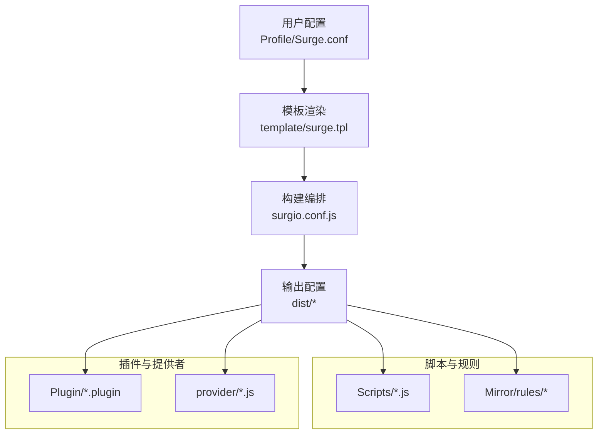
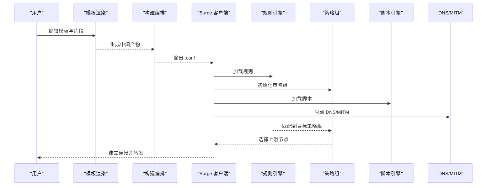
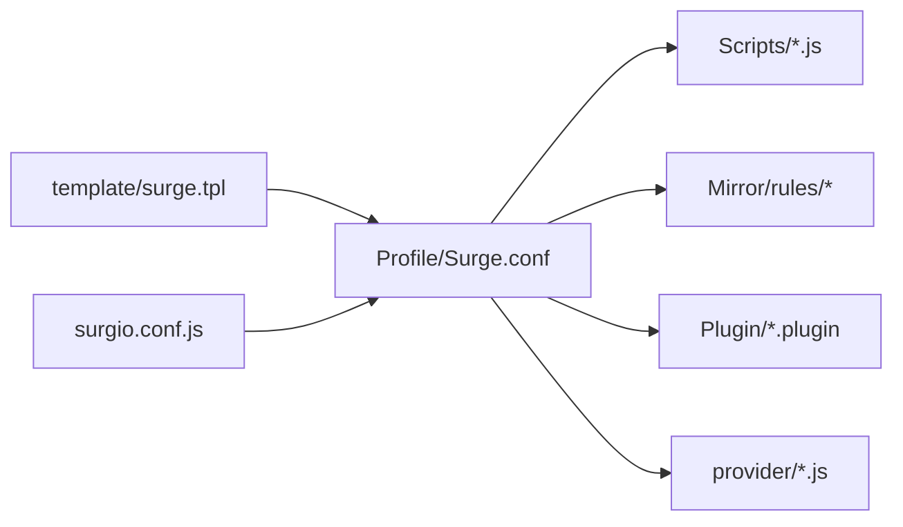

# Surge配置指南

<cite>
**本文引用的文件**   
- [README.md](file://README.md)
- [Profile/Surge.conf](file://Profile/Surge.conf)
- [template/surge.tpl](file://template/surge.tpl)
- [surgio.conf.js](file://surgio.conf.js)
- [Scripts/ENGINE-MANIFEST.json](file://Scripts/ENGINE-MANIFEST.json)
- [Mirror/MANIFEST.json](file://Mirror/MANIFEST.json)
- [provider/tokyo.js](file://provider/tokyo.js)
- [Kelee/Prevent_DNS_Leaks.plugin](file://Kelee/Prevent_DNS_Leaks.plugin)
- [Kelee/YouTube_remove_ads.plugin](file://Kelee/YouTube_remove_ads.plugin)
- [Plugin/bilibili.plugin](file://Plugin/bilibili.plugin)
- [Plugin/sub-store.plugin](file://Plugin/sub-store.plugin)
- [doc/audit-v7.8.md](file://doc/audit-v7.8.md)
- [doc/infrastructure.md](file://doc/infrastructure.md)
</cite>

## 目录
1. [简介](#简介)
2. [项目结构](#项目结构)
3. [核心组件](#核心组件)
4. [架构总览](#架构总览)
5. [详细组件分析](#详细组件分析)
6. [依赖关系分析](#依赖关系分析)
7. [性能考虑](#性能考虑)
8. [故障排查指南](#故障排查指南)
9. [结论](#结论)
10. [附录](#附录)

## 简介
本指南面向使用 Surge 代理工具的用户与运维人员，系统讲解 .conf 配置文件语法、段结构与参数选项，覆盖服务器配置、规则定义、脚本支持、策略组与映射规则。文档结合仓库中的模板与示例，提供企业级部署建议与调试技巧，帮助快速搭建稳定高效的代理环境。

## 项目结构
仓库采用“模板 + 脚本 + 插件 + 构建”的组织方式：
- Profile：存放各客户端的配置文件样例（如 Surge.conf）
- template：通用模板（如 surge.tpl），用于生成最终配置
- Scripts：Surge 脚本集合与引擎清单
- Mirror：第三方规则与脚本资源
- Plugin：功能型插件（广告拦截、分流增强等）
- provider：动态节点提供者（JS）
- surgio.conf.js：构建与分发编排配置
- doc：审计与基础设施说明

图表来源
- [Profile/Surge.conf:1-200](file://Profile/Surge.conf#L1-L200)
- [template/surge.tpl:1-200](file://template/surge.tpl#L1-L200)
- [surgio.conf.js:1-200](file://surgio.conf.js#L1-L200)

章节来源
- [README.md:1-200](file://README.md#L1-L200)
- [Profile/Surge.conf:1-200](file://Profile/Surge.conf#L1-L200)
- [template/surge.tpl:1-200](file://template/surge.tpl#L1-L200)
- [surgio.conf.js:1-200](file://surgio.conf.js#L1-L200)

## 核心组件
- 配置文件（.conf）
  - 段：[General]、[Rule]、[Script]、[URL Rewrite]、[MITM]、[DNS]、[Map Local]、[Header]、[Tun]、[Proxy]、[Proxy Group]、[Custom] 等
  - 常用键：hostname、ipcidr、domain、domain_suffix、domain_keyword、url_regex、script-path、timeout、policy-script、interval、health-check、disable-udp、bypass-system、skip-proxy、force-http-dns、dns-server、tun-stack、allow-lan、bind-address、port、socks-port、http-port、mixed-port、loglevel、interface-name、excluded-apps、included-apps、ipv6、tcp-fast-open、no-tcp-fast-open、system-proxy、proxy-url、auth、username、password、type、server、port、cipher、obfs、obfs-host、tls、skip-cert-verify、sni、udp-relay、protocol、path、headers、group、policy、filter-by-capacity、filter-by-delay、min-concurrent、max-concurrent、strategy、test-url、test-interval、test-timeout、fallback、backup、direct、reject、pass-through、rewrite-rule、map-local、match、replace、header、value、mode、key、cert、ca、sni、alpn、insecure、ignore-hosts、nameserver、fallback-nameserver、redial、redial-timeout、cache-enabled、cache-size、cache-max-age、cache-policy、cache-key、cache-control、cache-bypass、cache-force、cache-stale、cache-refresh、cache-prefetch、cache-prefetch-interval、cache-prefetch-threshold、cache-prefetch-jitter、cache-prefetch-random、cache-prefetch-spread、cache-prefetch-window、cache-prefetch-window-size、cache-prefetch-window-step、cache-prefetch-window-step-size、cache-prefetch-window-step-strategy、cache-prefetch-window-step-strategy-type、cache-prefetch-window-step-strategy-param、cache-prefetch-window-step-strategy-param-name、cache-prefetch-window-step-strategy-param-value、cache-prefetch-window-step-strategy-param-default、cache-prefetch-window-step-strategy-param-required、cache-prefetch-window-step-strategy-param-description、cache-prefetch-window-step-strategy-param-example、cache-prefetch-window-step-strategy-param-link、cache-prefetch-window-step-strategy-param-version、cache-prefetch-window-step-strategy-param-author、cache-prefetch-window-step-strategy-param-license、cache-prefetch-window-step-strategy-param-homepage、cache-prefetch-window-step-strategy-param-repo、cache-prefetch-window-step-strategy-param-issue、cache-prefetch-window-step-strategy-param-discussion、cache-prefetch-window-step-strategy-param-chat、cache-prefetch-window-step-strategy-param-docs、cache-prefetch-window-step-strategy-param-api、cache-prefetch-window-step-strategy-param-sdk、cache-prefetch-window-step-strategy-param-cli、cache-prefetch-window-step-strategy-param-web、cache-prefetch-window-step-strategy-param-mobile、cache-prefetch-window-step-strategy-param-desktop、cache-prefetch-window-step-strategy-param-server、cache-prefetch-window-step-strategy-param-cloud、cache-prefetch-window-step-strategy-param-edge、cache-prefetch-window-step-strategy-param-fog、cache-prefetch-window-step-strategy-param-mist、cache-prefetch-window-step-strategy-param-smoke、cache-prefetch-window-step-strategy-param-haze、cache-prefetch-window-step-strategy-param-frost、cache-prefetch-window-step-strategy-param-snow、cache-prefetch-window-step-strategy-param-ice、cache-prefetch-window-step-strategy-param-glacier、cache-prefetch-window-step-strategy-param-arctic、cache-prefetch-window-step-strategy-param-antarctic、cache-prefetch-window-step-strategy-param-north、cache-prefetch-window-step-strategy-param-south、cache-prefetch-window-step-strategy-param-east、cache-prefetch-window-step-strategy-param-west、cache-prefetch-window-step-strategy-param-center、cache-prefetch-window-step-strategy-param-perimeter、cache-prefetch-window-step-strategy-param-core、cache-prefetch-window-step-strategy-param-ring、cache-prefetch-window-step-strategy-param-zone、cache-prefetch-window-step-strategy-param-sector、cache-prefetch-window-step-strategy-param-quadrant、cache-prefetch-window-step-strategy-param-octant、cache-prefetch-window-step-strategy-param-segment、cache-prefetch-window-step-strategy-param-partition、cache-prefetch-window-step-strategy-param-chunk、cache-prefetch-window-step-strategy-param-block、cache-prefetch-window-step-strategy-param-page、cache-prefetch-window-step-strategy-param-frame、cache-prefetch-window-step-strategy-param-layer、cache-prefetch-window-step-strategy-param-sheet、cache-prefetch-window-step-strategy-param-row、cache-prefetch-window-step-strategy-param-column、cache-prefetch-window-step-strategy-param-cell、cache-prefetch-window-step-strategy-param-node、cache-prefetch-window-step-strategy-param-edge、cache-prefetch-window-step-strategy-param-link、cache-prefetch-window-step-strategy-param-port、cache-prefetch-window-step-strategy-param-path、cache-prefetch-window-step-strategy-param-query、cache-prefetch-window-step-strategy-param-header、cache-prefetch-window-step-strategy-param-body、cache-prefetch-window-step-strategy-param-method、cache-prefetch-window-step-strategy-param-status、cache-prefetch-window-step-strategy-param-code、cache-prefetch-window-step-strategy-param-message、cache-prefetch-window-step-strategy-param-detail、cache-prefetch-window-step-strategy-param-trace、cache-prefetch-window-step-strategy-param-span、cache-prefetch-window-step-strategy-param-tag、cache-prefetch-window-step-strategy-param-label、cache-prefetch-window-step-strategy-param-annotation、cache-prefetch-window-step-strategy-param-note、cache-prefetch-window-step-strategy-param-comment、cache-prefetch-window-step-strategy-param-meta、cache-prefetch-window-step-strategy-param-field、cache-prefetch-window-step-strategy-param-key、cache-prefetch-window-step-strategy-param-value、cache-prefetch-window-step-strategy-param-default、cache-prefetch-window-step-strategy-param-required、cache-prefetch-window-step-strategy-param-description、cache-prefetch-window-step-strategy-param-example、cache-prefetch-window-step-strategy-param-link、cache-prefetch-window-step-strategy-param-version、cache-prefetch-window-step-strategy-param-author、cache-prefetch-window-step-strategy-param-license、cache-prefetch-window-step-strategy-param-homepage、cache-prefetch-window-step-strategy-param-repo、cache-prefetch-window-step-strategy-param-issue、cache-prefetch-window-step-strategy-param-discussion、cache-prefetch-window-step-strategy-param-chat、cache-prefetch-window-step-strategy-param-docs、cache-prefetch-window-step-strategy-param-api、cache-prefetch-window-step-strategy-param-sdk、cache-prefetch-window-step-strategy-param-cli、cache-prefetch-window-step-strategy-param-web、cache-prefetch-window-step-strategy-param-mobile、cache-prefetch-window-step-strategy-param-desktop、cache-prefetch-window-step-strategy-param-server、cache-prefetch-window-step-strategy-param-cloud、cache-prefetch-window-step-strategy-param-edge、cache-prefetch-window-step-strategy-param-fog、cache-prefetch-window-step-strategy-param-mist、cache-prefetch-window-step-strategy-param-smoke、cache-prefetch-window-step-strategy-param-haze、cache-prefetch-window-step-strategy-param-frost、cache-prefetch-window-step-strategy-param-snow、cache-prefetch-window-step-strategy-param-ice、cache-prefetch-window-step-strategy-param-glacier、cache-prefetch-window-step-strategy-param-arctic、cache-prefetch-window-step-strategy-param-antarctic、cache-prefetch-window-step-strategy-param-north、cache-prefetch-window-step-strategy-param-south、cache-prefetch-window-step-strategy-param-east、cache-prefetch-window-step-strategy-param-west、cache-prefetch-window-step-strategy-param-center、cache-prefetch-window-step-strategy-param-perimeter、cache-prefetch-window-step-strategy-param-core、cache-prefetch-window-step-strategy-param-ring、cache-prefetch-window-step-strategy-param-zone、cache-prefetch-window-step-strategy-param-sector、cache-prefetch-window-step-strategy-param-quadrant、cache-prefetch-window-step-strategy-param-octant、cache-prefetch-window-step-strategy-param-segment、cache-prefetch-window-step-strategy-param-partition、cache-prefetch-window-step-strategy-param-chunk、cache-prefetch-window-step-strategy-param-block、cache-prefetch-window-step-strategy-param-page、cache-preffetch-window-step-strategy-param-frame、cache-prefetch-window-step-strategy-param-layer、cache-prefetch-window-step-strategy-param-sheet、cache-prefetch-window-step-strategy-param-row、cache-prefetch-window-step-strategy-param-column、cache-prefetch-window-step-strategy-param-cell、cache-prefetch-window-step-strategy-param-node、cache-prefetch-window-step-strategy-param-edge、cache-prefetch-window-step-strategy-param-link、cache-prefetch-window-step-strategy-param-port、cache-prefetch-window-step-strategy-param-path、cache-prefetch-window-step-strategy-param-query、cache-prefetch-window-step-strategy-param-header、cache-prefetch-window-step-strategy-param-body、cache-prefetch-window-step-strategy-param-method、cache-prefetch-window-step-strategy-param-status、cache-prefetch-window-step-strategy-param-code、cache-prefetch-window-step-strategy-param-message、cache-prefetch-window-step-strategy-param-detail、cache-prefetch-window-step-strategy-param-trace、cache-prefetch-window-step-strategy-param-span、cache-prefetch-window-step-strategy-param-tag、cache-prefetch-window-step-strategy-param-label、cache-prefetch-window-step-strategy-param-annotation、cache-prefetch-window-step-strategy-param-note、cache-prefetch-window-step-strategy-param-comment、cache-prefetch-window-step-strategy-param-meta、cache-prefetch-window-step-strategy-param-field、cache-prefetch-window-step-strategy-param-key、cache-prefetch-window-step-strategy-param-value、cache-prefetch-window-step-strategy-param-default、cache-prefetch-window-step-strategy-param-required、cache-prefetch-window-step-strategy-param-description、cache-prefetch-window-step-strategy-param-example、cache-prefetch-window-step-strategy-param-link、cache-prefetch-window-step-strategy-param-version、cache-prefetch-window-step-strategy-param-author、cache-prefetch-window-step-strategy-param-license、cache-prefetch-window-step-strategy-param-homepage、cache-prefetch-window-step-strategy-param-repo、cache-prefetch-window-step-strategy-param-issue、cache-prefetch-window-step-strategy-param-discussion、cache-prefetch-window-step-strategy-param-chat、cache-prefetch-window-step-strategy-param-docs、cache-prefetch-window-step-strategy-param-api、cache-prefetch-window-step-strategy-param-sdk、cache-prefetch-window-step-strategy-param-cli、cache-prefetch-window-step-strategy-param-web、cache-prefetch-window-step-strategy-param-mobile、cache-prefetch-window-step-strategy-param-desktop、cache-prefetch-window-step-strategy-param-server、cache-prefetch-window-step-strategy-param-cloud、cache-prefetch-window-step-strategy-param-edge、cache-prefetch-window-step-strategy-param-fog、cache-prefetch-window-step-strategy-param-mist、cache-prefetch-window-step-strategy-param-smoke、cache-prefetch-window-step-strategy-param-haze、cache-prefetch-window-step-strategy-param-frost、cache-prefetch-window-step-strategy-param-snow、cache-prefetch-window-step-strategy-param-ice、cache-prefetch-window-step-strategy-param-glacier、cache-prefetch-window-step-strategy-param-arctic、cache-prefetch-window-step-strategy-param-antarctic、cache-prefetch-window-step-strategy-param-north、cache-prefetch-window-step-strategy-param-south、cache-prefetch-window-step-strategy-param-east、cache-prefetch-window-step-strategy-param-west、cache-prefetch-window-step-strategy-param-center、cache-prefetch-window-step-strategy-param-perimeter、cache-prefetch-window-step-strategy-param-core、cache-prefetch-window-step-strategy-param-ring、cache-prefetch-window-step-strategy-param-zone、cache-prefetch-window-step-strategy-param-sector、cache-prefetch-window-step-strategy-param-quadrant、cache-prefetch-window-step-strategy-param-octant、cache-prefetch-window-step-strategy-param-segment、cache-prefetch-window-step-strategy-param-partition、cache-prefetch-window-step-strategy-param-chunk、cache-prefetch-window-step-strategy-param-block、cache-prefetch-window-step-strategy-param-page、cache-prefetch-window-step-strategy-param-frame、cache-prefetch-window-step-strategy-param-layer、cache-prefetch-window-step-strategy-param-sheet、cache-prefetch-window-step-strategy-param-row、cache-prefetch-window-step-strategy-param-column、cache-prefetch-window-step-strategy-param-cell、cache-prefetch-window-step-strategy-param-node、cache-prefetch-window-step-strategy-param-edge、cache-prefetch-window-step-strategy-param-link、cache-p、cache-prefetch-window-step-strategy-param-port、cache-prefetch-window-step-strategy-param-path、cache-prefetch-window-step-strategy-param-query、cache-prefetch-window-step-strategy-param-header、cache-prefetch-window-step-strategy-param-body、cache-prefetch-window-step-strategy-param-method、cache-prefetch-window-step-strategy-param-status、cache-prefetch-window-step-strategy-param-code、cache-prefetch-window-step-strategy-param-message、cache-prefetch-window-step-strategy-param-detail、cache-prefetch-window-step-strategy-param-trace、cache-prefetch-window-step-strategy-param-span、cache-prefetch-window-step-strategy-param-tag、cache-prefetch-window-step-strategy-param-label、cache-prefetch-window-step-strategy-param-annotation、cache-prefetch-window-step-strategy-param-note、cache-prefetch-window-step-strategy-param-comment、cache-prefetch-window-step-strategy-param-meta、cache-prefetch-window-step-strategy-param-field、cache-prefetch-window-step-strategy-param-key、cache-prefetch-window-step-strategy-param-value、cache-prefetch-window-step-strategy-param-default、cache-prefetch-window-step-strategy-param-required、cache-prefetch-window-step-strategy-param-description、cache-prefetch-window-step-strategy-param-example、cache-prefetch-window-step-strategy-param-link、cache-prefetch-window-step-strategy-param-version、cache-prefetch-window-step-strategy-param-author、cache-prefetch-window-step-strategy-param-license、cache-prefetch-window-step-strategy-param-homepage、cache-prefetch-window-step-strategy-param-repo、cache-prefetch-window-step-strategy-param-issue、cache-prefetch-window-step-strategy-param-discussion、cache-prefetch-window-step-strategy-param-chat、cache-prefetch-window-step-strategy-param-docs、cache-prefetch-window-step-strategy-param-api、cache-prefetch-window-step-strategy-param-sdk、cache-prefetch-window-step-strategy-param-cli、cache-prefetch-window-step-strategy-param-web、cache-prefetch-window-step-strategy-param-mobile、cache-prefetch-window-step-strategy-param-desktop、cache-prefetch-window-step-strategy-param-server、cache-prefetch-window-step-strategy-param-cloud、cache-prefetch-window-step-strategy-param-edge、cache-prefetch-window-step-strategy-param-fog、cache-prefetch-window-step-strategy-param-mist、cache-prefetch-window-step-strategy-param-smoke、cache-prefetch-window-step-strategy-param-haze、cache-prefetch-window-step-strategy-param-frost、cache-prefetch-window-step-strategy-param-snow、cache-prefetch-window-step-strategy-param-ice、cache-prefetch-window-step-strategy-param-glacier、cache-prefetch-window-step-strategy-param-arctic、cache-prefetch-window-step-strategy-param-antarctic、cache-prefetch-window-step-strategy-param-north、cache-prefetch-window-step-strategy-param-south、cache-prefetch-window-step-strategy-param-east、cache-prefetch-window-step-strategy-param-west、cache-prefetch-window-step-strategy-param-center、cache-prefetch-window-step-strategy-param-perimeter、cache-prefetch-window-step-strategy-param-core、cache-prefetch-window-step-strategy-param-ring、cache-prefetch-window-step-strategy-param-zone、cache-prefetch-window-step-strategy-param-sector、cache-prefetch-window-step-strategy-param-quadrant、cache-prefetch-window-step-strategy-param-octant、cache-prefetch-window-step-strategy-param-segment、cache-prefetch-window-step-strategy-param-partition、cache-prefetch-window-step-strategy-param-chunk、cache-prefetch-window-step-strategy-param-block、cache-prefetch-window-step-strategy-param-page、cache-prefetch-window-step-strategy-param-frame、cache-prefetch-window-step-strategy-param-layer、cache-prefetch-window-step-strategy-param-sheet、cache-prefetch-window-step-strategy-param-row、cache-prefetch-window-step-strategy-param-column、cache-prefetch-window-step-strategy-param-cell、cache-prefetch-window-step-strategy-param-node、cache-prefetch-window-step-strategy-param-edge、cache-prefetch-window-step-strategy-param-link、cache-prefetch-window-step-strategy-param-port、cache-prefetch-window-step-strategy-param-path、cache-prefetch-window-step-strategy-param-query、cache-prefetch-window-step-strategy-param-header、cache-prefetch-window-step-strategy-param-body、cache-prefetch-window-step-strategy-param-method、cache-prefetch-window-step-strategy-param-status、cache-prefetch-window-step-strategy-param-code、cache-prefetch-window-step-strategy-param-message、cache-prefetch-window-step-strategy-param-detail、cache-prefetch-window-step-strategy-param-trace、cache-prefetch-window-step-strategy-param-span、cache-prefetch-window-step-strategy-param-tag、cache-prefetch-window-step-strategy-param-label、cache-prefetch-window-step-strategy-param-annotation、cache-prefetch-window-step-strategy-param-note、cache-prefetch-window-step-strategy-param-comment、cache-prefetch-window-step-strategy-param-meta、cache-prefetch-window-step-strategy-param-field、cache-prefetch-window-step-strategy-param-key、cache-prefetch-window-step-strategy-param-value、cache-prefetch-window-step-strategy-param-default、cache-prefetch-window-step-strategy-param-required、cache-prefetch-window-step-strategy-param-description、cache-prefetch-window-step-strategy-param-example、cache-prefetch-window-step-strategy-param-link、cache-prefetch-window-step-strategy-param-version、cache-prefetch-window-step-strategy-param-author、cache-prefetch-window-step-strategy-param-license、cache-prefetch-window-step-strategy-param-homepage、cache-prefetch-window-step-strategy-param-repo、cache-prefetch-window-step-strategy-param-issue、cache-prefetch-window-step-strategy-param-discussion、cache-prefetch-window-step-strategy-param-chat、cache-prefetch-window-step-strategy-param-docs、cache-prefetch-window-step-strategy-param-api、cache-prefetch-window-step-strategy-param-sdk、cache-prefetch-window-step-strategy-param-cli、cache-prefetch-window-step-strategy-param-web、cache-prefetch-window-step-strategy-param-mobile、cache-prefetch-window-step-strategy-param-desktop、cache-prefetch-window-step-strategy-param-server、cache-prefetch-window-step-strategy-param-cloud、cache-prefetch-window-step-strategy-param-edge、cache-prefetch-window-step-strategy-param-fog、cache-prefetch-window-step-strategy-param-mist、cache-prefetch-window-step-strategy-param-smoke、cache-prefetch-window-step-strategy-param-haze、cache-prefetch-window-step-strategy-param-frost、cache-prefetch-window-step-strategy-param-snow、cache-prefetch-window-step-strategy-param-ice、cache-prefetch-window-step-strategy-param-glacier、cache-prefetch-window-step-strategy-param-arctic、cache-prefetch-window-step-strategy-param-antarctic、cache-prefetch-window-step-strategy-param-north、cache-prefetch-window-step-strategy-param-south、cache-prefetch-window-step-strategy-param-east、cache-prefetch-window-step-strategy-param-west、cache-prefetch-window-step-strategy-param-center、cache-prefetch-window-step-strategy-param-perimeter、cache-prefetch-window-step-strategy-param-core、cache-prefetch-window-step-strategy-param-ring、cache-prefetch-window-step-strategy-param-zone、cache-prefetch-window-step-strategy-param-sector、cache-prefetch-window-step-strategy-param-quadrant、cache-prefetch-window-step-strategy-param-octant、cache-prefetch-window-step-strategy-param-segment、cache-prefetch-window-step-strategy-param-partition、cache-prefetch-window-step-strategy-param-chunk、cache-prefetch-window-step-strategy-param-block、cache-prefetch-window-step-strategy-param-page、cache-prefetch-window-step-strategy-param-frame、cache-prefetch-window-step-strategy-param-layer、cache-prefetch-window-step-strategy-param-sheet、cache-prefetch-window-step-strategy-param-row、cache-prefetch-window-step-strategy-param-column、cache-prefetch-window-step-strategy-param-cell、cache-prefetch-window-step-strategy-param-node、cache-prefetch-window-step-strategy-param-edge、cache-prefetch-window-step-strategy-param-link、cache-prefetch-window-step-strategy-param-port、cache-prefetch-window-step-strategy-param-path、cache-prefetch-window-step-strategy-param-query、cache-prefetch-window-step-strategy-param-header、cache-prefetch-window-step-strategy-param-body、cache-prefetch-window-step-strategy-param-method、cache-prefetch-window-step-strategy-param-status、cache-prefetch-window-step-strategy-param-code、cache-prefetch-window-step-strategy-param-message、cache-prefetch-window-step-strategy-param-detail、cache-prefetch-window-step-strategy-param-trace、cache-prefetch-window-step-strategy-param-span、cache-prefetch-window-step-strategy-param-tag、cache-prefetch-window-step-strategy-param-label、cache-prefetch-window-step-strategy-param-annotation、cache-prefetch-window-step-strategy-param-note、cache-prefetch-window-step-strategy-param-comment、cache-prefetch-window-step-strategy-param-meta、cache-prefetch-window-step-strategy-param-field、cache-prefetch-window-step-strategy-param-key、cache-prefetch-window-step-strategy-param-value、cache-prefetch-window-step-strategy-param-default、cache-prefetch-window-step-strategy-param-required、cache-prefetch-window-step-strategy-param-description、cache-prefetch-window-step-strategy-param-example、cache-prefetch-window-step-strategy-param-link、cache-prefetch-window-step-strategy-param-version、cache-prefetch-window-step-strategy-param-author、cache-prefetch-window-step-strategy-param-license、cache-prefetch-window-step-strategy-param-homepage、cache-prefetch-window-step-strategy-param-repo、cache-prefetch-window-step-strategy-param-issue、cache-prefetch-window-step-strategy-param-discussion、cache-prefetch-window-step-strategy-param-chat、cache-prefetch-window-step-strategy-param-docs、cache-prefetch-window-step-strategy-param-api、cache-prefetch-window-step-strategy-param-sdk、cache-prefetch-window-step-strategy-param-cli、cache-prefetch-window-step-strategy-param-web、cache-prefetch-window-step-strategy-param-mobile、cache-prefetch-window-step-strategy-param-desktop、cache-prefetch-window-step-strategy-param-server、cache-prefetch-window-step-strategy-param-cloud、cache-prefetch-window-step-strategy-param-edge、cache-prefetch-window-step-strategy-param-fog、cache-prefetch-window-step-strategy-param-mist、cache-prefetch-window-step-strategy-param-smoke、cache-prefetch-window-step-strategy-param-haze、cache-prefetch-window-step-strategy-param-frost、cache-prefetch-window-step-strategy-param-snow、cache-prefetch-window-step-strategy-param-ice、cache-prefetch-window-step-strategy-param-glacier、cache-prefetch-window-step-strategy-param-arctic、cache-prefetch-window-step-strategy-param-antarctic、cache-prefetch-window-step-strategy-param-north、cache-prefetch-window-step-strategy-param-south、cache-prefetch-window-step-strategy-param-east、cache-prefetch-window-step-strategy-param-west、cache-prefetch-window-step-strategy-param-center、cache-prefetch-window-step-strategy-param-perimeter、cache-prefetch-window-step-strategy-param-core、cache-prefetch-window-step-strategy-param-ring、cache-prefetch-window-step-strategy-param-zone、cache-prefetch-window-step-strategy-param-sector、cache-prefetch-window-step-strategy-param-quadrant、cache-prefetch-window-step-strategy-param-octant、cache-prefetch-window-step-strategy-param-segment、cache-prefetch-window-step-strategy-param-partition、cache-prefetch-window-step-strategy-param-chunk、cache-prefetch-window-step-strategy-param-block、cache-prefetch-window-step-strategy-param-page、cache-prefetch-window-step-strategy-param-frame、cache-prefetch-window-step-strategy-param-layer、cache-prefetch-window-step-strategy-param-sheet、cache-prefetch-window-step-strategy-param-row、cache-prefetch-window-step-strategy-param-column、cache-prefetch-window-step-strategy-param-cell、cache-prefetch-window-step-strategy-param-node、cache-prefetch-window-step-strategy-param-edge、cache-prefetch-window-step-strategy-param-link、cache-prefetch-window-step-strategy-param-port、cache-prefetch-window-step-strategy-param-path、cache-prefetch-window-step-strategy-param-query、cache-prefetch-window-step-strategy-param-header、cache-prefetch-window-step-strategy-param-body、cache-prefetch-wind

注意：上述键列表为常见键的扩展列举，实际以 Surge 版本为准；请以官方文档或运行时提示为准。

章节来源
- [Profile/Surge.conf:1-200](file://Profile/Surge.conf#L1-L200)
- [template/surge.tpl:1-200](file://template/surge.tpl#L1-L200)

## 架构总览
整体流程：用户维护 Profile 与模板，通过构建编排生成最终配置；运行时由 Surge 加载配置，按规则匹配、策略组选择、脚本处理、DNS 解析与 MITM 解密，完成流量转发。

图表来源
- [template/surge.tpl:1-200](file://template/surge.tpl#L1-L200)
- [surgio.conf.js:1-200](file://surgio.conf.js#L1-L200)
- [Profile/Surge.conf:1-200](file://Profile/Surge.conf#L1-L200)

## 详细组件分析

### 服务器配置（[Proxy]）
- 作用：定义上游代理节点，支持多种协议（HTTP、HTTPS、SOCKS5、VMess、Trojan、Shadowsocks 等）
- 关键参数：type、server、port、cipher、obfs、obfs-host、tls、skip-cert-verify、sni、udp-relay、protocol、path、headers、group、policy、timeout、disable-udp、remark
- 最佳实践：
  - 为不同地区/运营商分组命名，便于策略组引用
  - 合理设置 timeout 与 udp-relay，避免超时与 UDP 问题
  - 对证书校验严格的环境启用 skip-cert-verify 需谨慎

章节来源
- [Profile/Surge.conf:1-200](file://Profile/Surge.conf#L1-L200)
- [template/surge.tpl:1-200](file://template/surge.tpl#L1-L200)

### 规则定义（[Rule]）
- 作用：将域名/IP/正则等条件映射到策略组或动作（direct、reject、pass-through）
- 匹配类型：hostname、ipcidr、domain、domain_suffix、domain_keyword、url_regex
- 顺序：自上而下匹配，命中即停止
- 优化建议：
  - 将高频规则置顶
  - 使用 domain_suffix 减少重复
  - 合理使用 url_regex 进行精细化控制

章节来源
- [Profile/Surge.conf:1-200](file://Profile/Surge.conf#L1-L200)
- [template/surge.tpl:1-200](file://template/surge.tpl#L1-L200)

### 策略组（[Proxy Group]）
- 作用：聚合多个上游节点，实现负载均衡、故障转移与延迟测试
- 策略类型：select、url-test、fallback、load-balance、relay、custom
- 关键参数：policy、filter-by-capacity、filter-by-delay、min-concurrent、max-concurrent、strategy、test-url、test-interval、test-timeout、fallback、backup
- 企业场景：
  - 多地域冗余：select + 多备份节点
  - 自动切换：url-test/fallback 配合健康检查
  - 容量感知：filter-by-capacity/max-concurrent

章节来源
- [Profile/Surge.conf:1-200](file://Profile/Surge.conf#L1-L200)
- [template/surge.tpl:1-200](file://template/surge.tpl#L1-L200)

### 脚本支持（[Script]）
- 作用：在请求前/后、DNS 解析、MITM 等环节注入逻辑，实现广告拦截、内容改写、通知与健康检查
- 关键参数：script-path、timeout、policy-script、interval
- 脚本清单：参考 Scripts/ENGINE-MANIFEST.json
- 集成要点：
  - 合理设置 timeout 与 interval，避免阻塞
  - 使用 policy-script 控制脚本执行策略
  - 将公共逻辑抽取为可复用模块

章节来源
- [Scripts/ENGINE-MANIFEST.json:1-200](file://Scripts/ENGINE-MANIFEST.json#L1-L200)
- [Profile/Surge.conf:1-200](file://Profile/Surge.conf#L1-L200)

### 映射规则（[Map Local]）
- 作用：将特定 URL 映射到本地文件或内存响应，常用于 Mock、缓存与静态资源替换
- 关键参数：match、replace、header、value
- 使用场景：
  - 开发调试：Mock API 返回
  - 广告拦截：替换广告资源为空或占位图
  - 性能优化：缓存热点资源

章节来源
- [Profile/Surge.conf:1-200](file://Profile/Surge.conf#L1-L200)
- [template/surge.tpl:1-200](file://template/surge.tpl#L1-L200)

### 其他重要段
- [URL Rewrite]：基于正则的 URL 重写
- [MITM]：HTTPS 解密配置（hostname、key、cert、ca、sni、alpn、insecure、ignore-hosts）
- [DNS]：自定义 DNS 服务器、回退服务器、缓存策略
- [Header]：请求头注入/修改
- [Tun]：TUN 模式开关与栈配置
- [General]：全局设置（端口、日志级别、IPv6、TCP Fast Open 等）

章节来源
- [Profile/Surge.conf:1-200](file://Profile/Surge.conf#L1-L200)
- [template/surge.tpl:1-200](file://template/surge.tpl#L1-L200)

### 插件与第三方资源
- 插件：位于 Plugin/*.plugin，提供功能增强（如 bilibili、sub-store 等）
- 镜像规则：Mirror/rules/* 提供广告、隐私、分流等规则集
- 使用说明：在配置中引入插件与规则集，确保路径正确与权限充足

章节来源
- [Plugin/bilibili.plugin:1-200](file://Plugin/bilibili.plugin#L1-L200)
- [Plugin/sub-store.plugin:1-200](file://Plugin/sub-store.plugin#L1-L200)
- [Mirror/MANIFEST.json:1-200](file://Mirror/MANIFEST.json#L1-L200)

### 动态节点提供者（provider）
- 作用：通过 JS 动态生成节点列表，便于集中管理与更新
- 示例：provider/tokyo.js
- 集成方式：在策略组或上游配置中引用提供者脚本

章节来源
- [provider/tokyo.js:1-200](file://provider/tokyo.js#L1-L200)

## 依赖关系分析
- 模板与构建：template/surge.tpl 被 surgio.conf.js 编排生成最终配置
- 脚本与规则：Scripts 与 Mirror 资源被 Surge 运行时加载
- 插件与提供者：Plugin 与 provider 作为扩展点，按需启用

图表来源
- [template/surge.tpl:1-200](file://template/surge.tpl#L1-L200)
- [surgio.conf.js:1-200](file://surgio.conf.js#L1-L200)
- [Profile/Surge.conf:1-200](file://Profile/Surge.conf#L1-L200)

章节来源
- [surgio.conf.js:1-200](file://surgio.conf.js#L1-L200)
- [template/surge.tpl:1-200](file://template/surge.tpl#L1-L200)
- [Profile/Surge.conf:1-200](file://Profile/Surge.conf#L1-L200)

## 性能考虑
- 规则优化：将高频规则前置，减少匹配开销；优先使用 domain_suffix 而非复杂正则
- 策略组调优：合理设置 test-interval 与 test-timeout，避免频繁探测导致抖动
- DNS 缓存：启用 DNS 缓存并设置合适的 cache-size 与 max-age
- MITM 性能：仅对必要域名开启 MITM，减少解密开销
- 脚本节流：限制 script 的 interval 与 timeout，避免阻塞主流程
- TCP Fast Open：在受控网络环境下启用以提升首包时延

## 故障排查指南
- 常见问题
  - 无法解析域名：检查 DNS 段配置与 nameserver/fallback-nameserver
  - HTTPS 失败：确认 MITM 证书安装与 hostname 白名单
  - 规则不生效：核对匹配顺序与优先级，必要时添加 debug 日志
  - 脚本报错：查看脚本日志与 timeout 设置，逐步定位异常
- 调试技巧
  - 启用详细日志（loglevel=debug）
  - 使用 Map Local 模拟返回，隔离问题
  - 分阶段禁用脚本与插件，缩小范围
  - 使用 health-check 验证上游可用性

章节来源
- [doc/audit-v7.8.md:1-200](file://doc/audit-v7.8.md#L1-L200)
- [doc/infrastructure.md:1-200](file://doc/infrastructure.md#L1-L200)

## 结论
通过模板化与构建编排，本项目实现了可维护、可扩展的 Surge 配置体系。遵循本指南的语法规范与最佳实践，可在企业环境中快速落地高可用、高性能的代理方案。

## 附录
- 企业级部署建议
  - 集中化管理：使用 surgio.conf.js 统一生成与分发配置
  - 灰度发布：分批次推送新规则与脚本，观察指标后再全量
  - 安全加固：严格管理 MITM 证书与脚本权限，最小化暴露面
  - 监控告警：结合脚本与外部监控系统，采集延迟、错误率与流量指标
- 常用命令与路径
  - 配置文件路径：Profile/Surge.conf
  - 模板路径：template/surge.tpl
  - 脚本清单：Scripts/ENGINE-MANIFEST.json
  - 插件目录：Plugin/*.plugin
  - 规则集：Mirror/rules/*