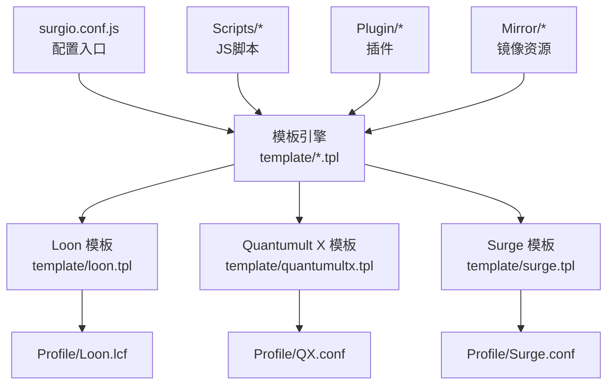
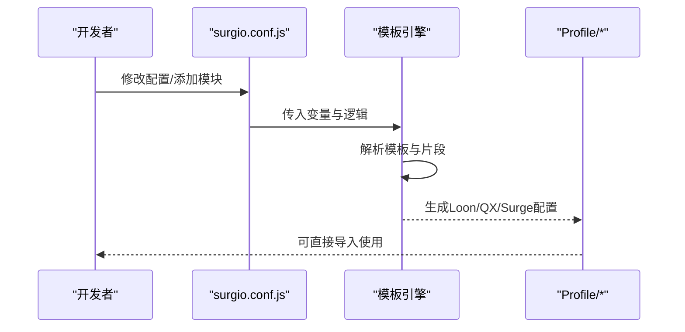
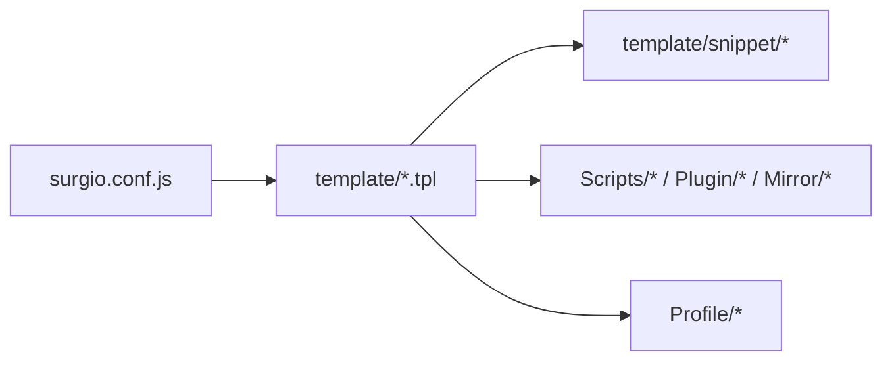

# Surgio配置系统

<cite>
**本文档引用的文件**   
- [surgio.conf.js](file://surgio.conf.js)
- [package.json](file://package.json)
- [template/loon.tpl](file://template/loon.tpl)
- [template/quantumultx.tpl](file://template/quantumultx.tpl)
- [template/surge.tpl](file://template/surge.tpl)
- [Profile/Loon.lcf](file://Profile/Loon.lcf)
- [Profile/QX.conf](file://Profile/QX.conf)
- [Profile/Surge.conf](file://Profile/Surge.conf)
- [README.md](file://README.md)
</cite>

## 目录
1. [简介](#简介)
2. [项目结构](#项目结构)
3. [核心组件](#核心组件)
4. [架构总览](#架构总览)
5. [详细组件分析](#详细组件分析)
6. [依赖关系分析](#依赖关系分析)
7. [性能考虑](#性能考虑)
8. [故障排查指南](#故障排查指南)
9. [结论](#结论)
10. [附录](#附录)

## 简介
本技术文档面向Surgio配置生成系统，系统性阐述其核心架构、配置语法与模板系统。重点说明如何使用JavaScript编写配置文件，定义共享变量、函数与条件逻辑；深入解析模板引擎工作原理，包括Loon、Quantumult X与Surge模板的语法差异与转换规则；并提供动态配置、条件渲染与模块化组织的实践示例。同时给出开发最佳实践与性能优化建议，帮助读者高效构建可维护、可扩展的网络配置生成方案。

## 项目结构
仓库采用“源码即配置”的组织方式：以JavaScript作为配置入口，通过模板文件将不同平台的配置格式进行统一抽象与转换，最终输出到Profile目录下的目标平台配置文件。关键目录与职责如下：
- surgio.conf.js：全局配置入口，声明模块、变量、函数与生成策略
- template/*：平台模板（Loon、Quantumult X、Surge）及片段模板
- Profile/*：生成的目标平台配置文件
- Scripts/*、Plugin/*、Mirror/*：脚本、插件与镜像资源，供模板引用或注入
- test/*：测试用例与测试运行器
- doc/*：审计与迁移文档

图表来源
- [surgio.conf.js](file://surgio.conf.js)
- [template/loon.tpl](file://template/loon.tpl)
- [template/quantumultx.tpl](file://template/quantumultx.tpl)
- [template/surge.tpl](file://template/surge.tpl)
- [Profile/Loon.lcf](file://Profile/Loon.lcf)
- [Profile/QX.conf](file://Profile/QX.conf)
- [Profile/Surge.conf](file://Profile/Surge.conf)

章节来源
- [README.md](file://README.md)
- [package.json](file://package.json)

## 核心组件
- 配置入口（surgio.conf.js）
  - 负责声明全局变量、共享函数、模块组织与生成策略
  - 提供条件逻辑与动态拼装能力，驱动模板渲染
- 模板系统（template/*.tpl）
  - 为不同平台提供统一的模板抽象
  - 支持片段化模板（snippet），便于复用与组合
- 输出层（Profile/*）
  - 根据模板与配置生成各平台原生配置文件
- 资源层（Scripts/*、Plugin/*、Mirror/*）
  - 提供脚本、插件与镜像资源，被模板按需引用

章节来源
- [surgio.conf.js](file://surgio.conf.js)
- [template/loon.tpl](file://template/loon.tpl)
- [template/quantumultx.tpl](file://template/quantumultx.tpl)
- [template/surge.tpl](file://template/surge.tpl)
- [Profile/Loon.lcf](file://Profile/Loon.lcf)
- [Profile/QX.conf](file://Profile/QX.conf)
- [Profile/Surge.conf](file://Profile/Surge.conf)

## 架构总览
Surgio采用“配置即代码 + 模板渲染”的架构：
- 输入：JavaScript配置文件（变量、函数、条件、模块）
- 处理：模板引擎解析并渲染不同平台的模板
- 输出：各平台原生配置文件（Loon、QX、Surge）

图表来源
- [surgio.conf.js](file://surgio.conf.js)
- [template/loon.tpl](file://template/loon.tpl)
- [template/quantumultx.tpl](file://template/quantumultx.tpl)
- [template/surge.tpl](file://template/surge.tpl)
- [Profile/Loon.lcf](file://Profile/Loon.lcf)
- [Profile/QX.conf](file://Profile/QX.conf)
- [Profile/Surge.conf](file://Profile/Surge.conf)

## 详细组件分析

### 配置入口（surgio.conf.js）
- 作用
  - 集中管理全局变量、共享函数与模块组织
  - 定义条件逻辑与动态拼装策略，控制模板渲染行为
- 设计要点
  - 变量命名规范与类型约束，确保模板渲染稳定
  - 函数封装常用逻辑（如域名集合、规则拼接、条件判断）
  - 模块化拆分，按功能域组织配置片段，提升可维护性
- 使用建议
  - 将重复逻辑抽离为函数，减少模板复杂度
  - 使用条件表达式控制不同平台特性开关
  - 保持配置文件的幂等性，避免重复生成

章节来源
- [surgio.conf.js](file://surgio.conf.js)

### 模板系统（template/*.tpl）
- 模板类型
  - Loon模板（template/loon.tpl）
  - Quantumult X模板（template/quantumultx.tpl）
  - Surge模板（template/surge.tpl）
- 片段模板（template/snippet/*）
  - 按功能域划分（如AI服务、银行广告拦截、开发者工具、社交、流媒体等）
  - 支持跨平台复用与组合
- 模板语法差异与转换规则
  - 不同平台在规则语法、脚本注入、UI提示等方面存在差异
  - 模板层通过条件分支与映射表实现语法转换
  - 片段模板屏蔽平台差异，统一对外暴露接口

章节来源
- [template/loon.tpl](file://template/loon.tpl)
- [template/quantumultx.tpl](file://template/quantumultx.tpl)
- [template/surge.tpl](file://template/surge.tpl)
- [template/snippet/ai-services.qx](file://template/snippet/ai-services.qx)
- [template/snippet/ai-services.tpl](file://template/snippet/ai-services.tpl)
- [template/snippet/bank-ad-reject.qx](file://template/snippet/bank-ad-reject.qx)
- [template/snippet/bank-ad-reject.tpl](file://template/snippet/bank-ad-reject.tpl)
- [template/snippet/developer.qx](file://template/snippet/developer.qx)
- [template/snippet/developer.tpl](file://template/snippet/developer.tpl)
- [template/snippet/social.qx](file://template/snippet/social.qx)
- [template/snippet/social.tpl](file://template/snippet/social.tpl)
- [template/snippet/streaming.qx](file://template/snippet/streaming.qx)
- [template/snippet/streaming.tpl](file://template/snippet/streaming.tpl)

### 输出层（Profile/*）
- 目标文件
  - Profile/Loon.lcf：Loon配置文件
  - Profile/QX.conf：Quantumult X配置文件
  - Profile/Surge.conf：Surge配置文件
- 生成流程
  - 模板引擎读取surgio.conf.js中的变量与逻辑
  - 渲染对应模板，生成平台原生配置
  - 输出至Profile目录，供客户端直接导入

章节来源
- [Profile/Loon.lcf](file://Profile/Loon.lcf)
- [Profile/QX.conf](file://Profile/QX.conf)
- [Profile/Surge.conf](file://Profile/Surge.conf)

### 资源层（Scripts/*、Plugin/*、Mirror/*）
- Scripts/*：JavaScript脚本，用于增强应用行为（如健康通知、流量统计）
- Plugin/*：插件配置，按应用域划分（如B站、京东、知乎等）
- Mirror/*：镜像资源与清单，用于加速下载与本地缓存

章节来源
- [Scripts/ENGINE-MANIFEST.json](file://Scripts/ENGINE-MANIFEST.json)
- [Scripts/health-notify.js](file://Scripts/health-notify.js)
- [Scripts/traffic-notify.js](file://Scripts/traffic-notify.js)
- [Plugin/bilibili.plugin](file://Plugin/bilibili.plugin)
- [Plugin/jd.plugin](file://Plugin/jd.plugin)
- [Plugin/zhihu.plugin](file://Plugin/zhihu.plugin)
- [Mirror/MANIFEST.json](file://Mirror/MANIFEST.json)

## 依赖关系分析
Surgio的核心依赖关系如下：
- surgio.conf.js依赖模板文件（template/*.tpl）与片段模板（template/snippet/*）
- 模板文件依赖资源层（Scripts/*、Plugin/*、Mirror/*）
- 输出层（Profile/*）由模板引擎渲染生成

图表来源
- [surgio.conf.js](file://surgio.conf.js)
- [template/loon.tpl](file://template/loon.tpl)
- [template/quantumultx.tpl](file://template/quantumultx.tpl)
- [template/surge.tpl](file://template/surge.tpl)
- [Scripts/ENGINE-MANIFEST.json](file://Scripts/ENGINE-MANIFEST.json)
- [Mirror/MANIFEST.json](file://Mirror/MANIFEST.json)

章节来源
- [package.json](file://package.json)

## 性能考虑
- 模板渲染优化
  - 预编译模板，减少运行时解析开销
  - 缓存片段模板，避免重复渲染
- 配置加载优化
  - 延迟加载大型资源（如镜像清单）
  - 增量更新，仅重新渲染变更部分
- 内存管理
  - 避免在循环中创建大对象
  - 及时释放临时变量引用

[本节为通用指导，不直接分析具体文件]

## 故障排查指南
- 常见问题
  - 模板语法错误：检查模板文件语法与变量引用
  - 变量未定义：确认surgio.conf.js中已正确声明
  - 平台差异：核对模板中的条件分支与映射表
- 调试技巧
  - 启用详细日志，定位渲染失败位置
  - 分模块验证，逐步缩小问题范围
  - 使用测试用例覆盖边界情况

[本节为通用指导，不直接分析具体文件]

## 结论
Surgio通过“配置即代码 + 模板渲染”的架构，实现了多平台网络配置的统一管理。开发者可使用JavaScript编写灵活、可维护的配置，借助模板引擎生成Loon、Quantumult X与Surge的原生配置文件。遵循本文档的最佳实践与性能优化建议，可显著提升配置系统的稳定性与扩展性。

[本节为总结性内容，不直接分析具体文件]

## 附录
- 术语表
  - 模板引擎：负责解析模板并生成目标平台配置的工具
  - 片段模板：按功能域划分的可复用模板单元
  - 资源层：包含脚本、插件与镜像等静态资源
- 参考链接
  - README.md：项目概述与使用说明
  - package.json：依赖与脚本定义

[本节为补充信息，不直接分析具体文件]