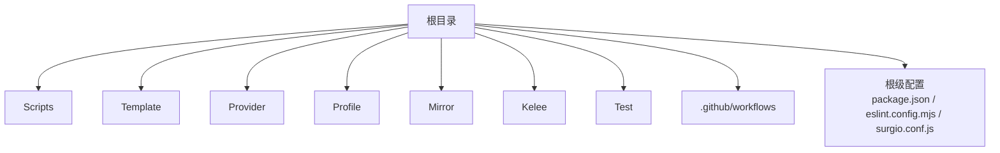
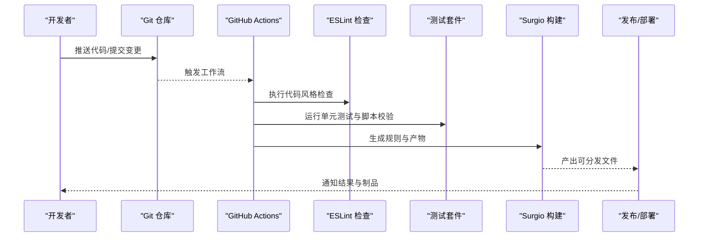
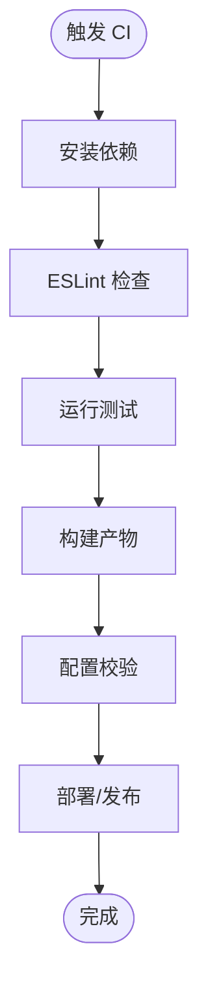
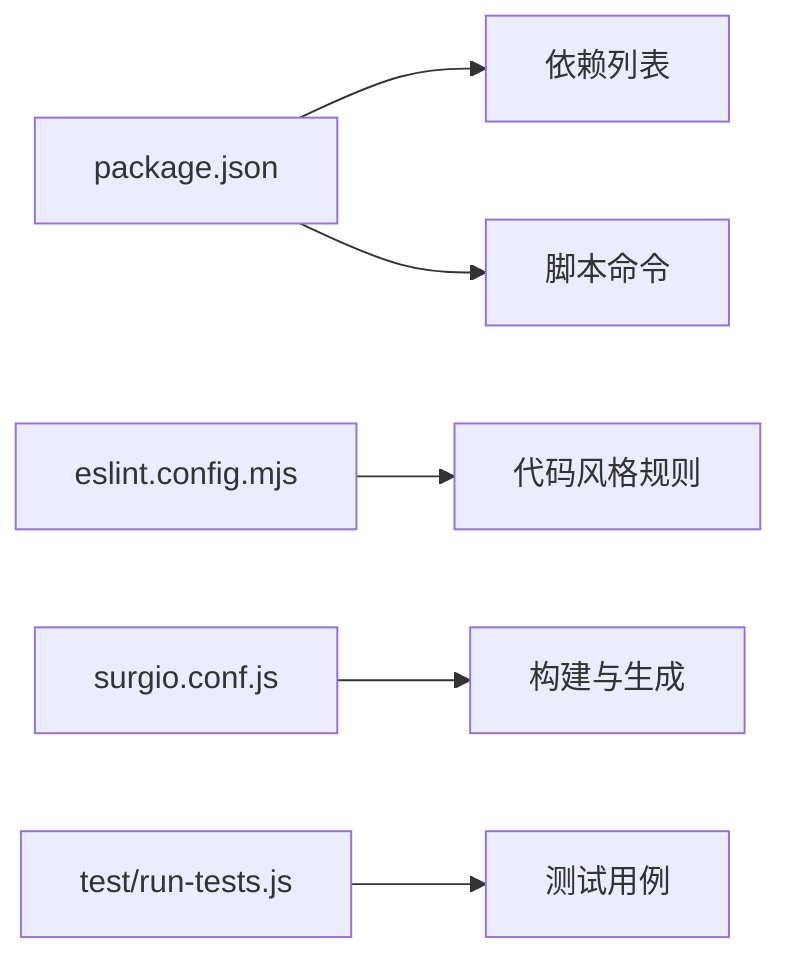

# 开发工作流

<cite>
**本文引用的文件**   
- [README.md](file://README.md)
- [package.json](file://package.json)
- [eslint.config.mjs](file://eslint.config.mjs)
- [surgio.conf.js](file://surgio.conf.js)
- [test/harness.js](file://test/harness.js)
- [test/run-tests.js](file://test/run-tests.js)
- [test/cases/purify-scripts.test.js](file://test/cases/purify-scripts.test.js)
- [test/cases/qidian-wrapper.test.js](file://test/cases/qidian-wrapper.test.js)
- [test/cases/zhihu-cainiao.test.js](file://test/cases/zhihu-cainiao.test.js)
- [test/cases/zhihuifangdong.test.js](file://test/cases/zhihuifangdong.test.js)
- [.github/workflows/script-tests.yml](file://.github/workflows/script-tests.yml)
- [.github/workflows/config-validate.yml](file://.github/workflows/config-validate.yml)
- [.github/workflows/surgio-build.yml](file://.github/workflows/surgio-build.yml)
- [.github/workflows/pages-deploy.yml](file://.github/workflows/pages-deploy.yml)
- [.github/workflows/mirror-scripts.yml](file://.github/workflows/mirror-scripts.yml)
- [.github/workflows/cdn-verify.yml](file://.github/workflows/cdn-verify.yml)
- [.github/workflows/upstream-health.yml](file://.github/workflows/upstream-health.yml)
- [Scripts/ENGINE-MANIFEST.json](file://Scripts/ENGINE-MANIFEST.json)
</cite>

## 目录
1. [简介](#简介)
2. [项目结构](#项目结构)
3. [核心组件](#核心组件)
4. [架构总览](#架构总览)
5. [详细组件分析](#详细组件分析)
6. [依赖分析](#依赖分析)
7. [性能考虑](#性能考虑)
8. [故障排查指南](#故障排查指南)
9. [结论](#结论)
10. [附录](#附录)

## 简介
本文件为 Surgio 项目的开发工作流提供完整指导，涵盖环境搭建、依赖安装与项目初始化；代码规范与 ESLint 配置；测试框架与单元测试编写；持续集成流程与自动化部署；调试技巧与常见问题解决方案；以及贡献指南与代码审查标准。读者可据此快速上手并高效参与项目开发。

## 项目结构
仓库采用“规则脚本 + 模板 + 配置文件 + 测试 + CI”的模块化组织方式：
- Scripts：各平台脚本与引擎清单
- Template：不同代理工具的配置模板
- Provider：上游资源提供者脚本
- Profile：各客户端配置文件
- Mirror：镜像与辅助脚本
- Kelee：插件集合
- Test：测试用例与运行器
- .github/workflows：CI/CD 流水线
- 根级配置：包管理、ESLint、Surgio 配置等

**章节来源**
- [README.md](file://README.md)
- [package.json](file://package.json)
- [surgio.conf.js](file://surgio.conf.js)

## 核心组件
- 包管理与脚本入口：通过 package.json 定义依赖与脚本命令，统一开发与构建入口
- 代码质量：ESLint 配置集中管理，保证风格一致性与静态检查
- 运行时配置：surgio.conf.js 作为 Surgio 的核心配置，驱动规则生成与构建
- 测试框架：基于 Node.js 的测试运行器与用例集，覆盖脚本与规则校验
- 持续集成：GitHub Actions 多任务流水线，包含测试、构建、验证与部署

**章节来源**
- [package.json](file://package.json)
- [eslint.config.mjs](file://eslint.config.mjs)
- [surgio.conf.js](file://surgio.conf.js)
- [test/harness.js](file://test/harness.js)
- [test/run-tests.js](file://test/run-tests.js)

## 架构总览
下图展示了从开发者提交到自动测试、构建与发布的整体流程，以及关键工件（脚本、规则、模板）之间的关系。

**图表来源**
- [.github/workflows/script-tests.yml](file://.github/workflows/script-tests.yml)
- [.github/workflows/config-validate.yml](file://.github/workflows/config-validate.yml)
- [.github/workflows/surgio-build.yml](file://.github/workflows/surgio-build.yml)
- [.github/workflows/pages-deploy.yml](file://.github/workflows/pages-deploy.yml)

**章节来源**
- [.github/workflows/script-tests.yml](file://.github/workflows/script-tests.yml)
- [.github/workflows/config-validate.yml](file://.github/workflows/config-validate.yml)
- [.github/workflows/surgio-build.yml](file://.github/workflows/surgio-build.yml)
- [.github/workflows/pages-deploy.yml](file://.github/workflows/pages-deploy.yml)

## 详细组件分析

### 开发环境与依赖安装
- 使用 Node.js 与 npm/yarn 管理依赖
- 安装依赖后，通过包脚本进行本地检查与测试
- 建议锁定版本与使用一致的 Node 版本，避免环境差异

建议步骤
- 克隆仓库
- 安装依赖
- 运行本地代码检查
- 运行本地测试

**章节来源**
- [package.json](file://package.json)

### 代码规范与 ESLint
- 使用 ESLint 进行静态检查与风格统一
- 在根目录 eslint.config.mjs 中集中配置规则
- 建议在 IDE 中启用 ESLint 插件，实时提示问题

常用操作
- 本地运行 ESLint 检查
- 修复部分可自动修复的问题
- 将检查纳入提交前钩子或 CI 流程

**章节来源**
- [eslint.config.mjs](file://eslint.config.mjs)

### 测试框架与单元测试
- 测试运行器位于 test/run-tests.js，测试夹具在 test/harness.js
- 用例集中在 test/cases 下，按功能模块划分
- 支持对脚本与规则的自动化校验

编写要点
- 每个用例聚焦单一场景，断言清晰
- 模拟外部依赖，确保测试稳定
- 保持用例命名与路径一致性，便于定位与维护

常用操作
- 本地运行全部测试
- 指定单个或多个用例运行
- 查看测试输出与失败详情

**章节来源**
- [test/run-tests.js](file://test/run-tests.js)
- [test/harness.js](file://test/harness.js)
- [test/cases/purify-scripts.test.js](file://test/cases/purify-scripts.test.js)
- [test/cases/qidian-wrapper.test.js](file://test/cases/qidian-wrapper.test.js)
- [test/cases/zhihu-cainiao.test.js](file://test/cases/zhihu-cainiao.test.js)
- [test/cases/zhihuifangdong.test.js](file://test/cases/zhihuifangdong.test.js)

### 持续集成与自动化部署
- GitHub Actions 定义多个工作流：脚本测试、配置校验、构建、页面部署、镜像同步、CDN 校验、上游健康检查
- 典型流程：拉取代码 → 安装依赖 → 代码检查 → 运行测试 → 构建产物 → 部署/发布

关键工作流
- 脚本测试：执行测试套件，保障脚本正确性
- 配置校验：校验 Surgio 配置与模板有效性
- 构建：生成规则与分发文件
- 部署：将产物发布至目标站点或 CDN
- 镜像与健康：同步镜像与上游健康检查

**图表来源**
- [.github/workflows/script-tests.yml](file://.github/workflows/script-tests.yml)
- [.github/workflows/config-validate.yml](file://.github/workflows/config-validate.yml)
- [.github/workflows/surgio-build.yml](file://.github/workflows/surgio-build.yml)
- [.github/workflows/pages-deploy.yml](file://.github/workflows/pages-deploy.yml)
- [.github/workflows/mirror-scripts.yml](file://.github/workflows/mirror-scripts.yml)
- [.github/workflows/cdn-verify.yml](file://.github/workflows/cdn-verify.yml)
- [.github/workflows/upstream-health.yml](file://.github/workflows/upstream-health.yml)

**章节来源**
- [.github/workflows/script-tests.yml](file://.github/workflows/script-tests.yml)
- [.github/workflows/config-validate.yml](file://.github/workflows/config-validate.yml)
- [.github/workflows/surgio-build.yml](file://.github/workflows/surgio-build.yml)
- [.github/workflows/pages-deploy.yml](file://.github/workflows/pages-deploy.yml)
- [.github/workflows/mirror-scripts.yml](file://.github/workflows/mirror-scripts.yml)
- [.github/workflows/cdn-verify.yml](file://.github/workflows/cdn-verify.yml)
- [.github/workflows/upstream-health.yml](file://.github/workflows/upstream-health.yml)

### 调试技巧与常见问题
- 本地复现：优先在本地运行测试与检查，缩小问题范围
- 日志输出：在关键路径增加必要日志，便于定位
- 隔离依赖：使用最小化依赖与环境复现问题
- 逐步验证：分步验证配置与脚本，确认每一步输出符合预期

常见现象与建议
- 测试失败：检查用例输入与断言，确认外部依赖是否可用
- 构建错误：核对配置项与模板语法，确保路径与变量正确
- 部署失败：检查权限与网络策略，确认目标服务状态

**章节来源**
- [test/run-tests.js](file://test/run-tests.js)
- [test/harness.js](file://test/harness.js)

### 贡献指南与代码审查标准
- 提交前自检：运行 ESLint 与测试，确保无报错
- 提交信息：简洁明确，描述变更目的与影响范围
- 代码审查：关注可读性、健壮性与安全性，避免引入回归
- 文档更新：变更涉及行为或配置时，同步更新相关文档

建议实践
- 小步提交，便于审查与回滚
- 用例先行，提升覆盖率与稳定性
- 保持向后兼容，谨慎破坏性变更

[本节为通用指导，不直接分析具体文件]

## 依赖分析
- 包依赖由 package.json 统一管理，包含开发依赖与运行时依赖
- ESLint 配置集中，便于统一风格与规则
- Surgio 配置驱动构建与规则生成
- 测试套件依赖 Node.js 运行时与测试库

**图表来源**
- [package.json](file://package.json)
- [eslint.config.mjs](file://eslint.config.mjs)
- [surgio.conf.js](file://surgio.conf.js)
- [test/run-tests.js](file://test/run-tests.js)

**章节来源**
- [package.json](file://package.json)
- [eslint.config.mjs](file://eslint.config.mjs)
- [surgio.conf.js](file://surgio.conf.js)
- [test/run-tests.js](file://test/run-tests.js)

## 性能考虑
- 控制依赖体积，仅引入必要库
- 优化测试数据与模拟，减少 IO 与网络开销
- 构建阶段缓存依赖与中间产物，缩短 CI 时间
- 合理拆分任务，并行执行独立步骤

[本节为通用指导，不直接分析具体文件]

## 故障排查指南
- 环境问题：确认 Node 版本与包管理器一致，清理缓存后重试
- 权限问题：检查仓库读写与部署凭据
- 网络问题：代理与镜像源配置是否正确
- 配置错误：逐项核对 surgio.conf.js 与模板语法

建议步骤
- 复现最小用例，定位问题边界
- 查看 CI 日志与本地输出，对比差异
- 逐步回退变更，确认引入点

**章节来源**
- [test/run-tests.js](file://test/run-tests.js)
- [test/harness.js](file://test/harness.js)

## 结论
通过统一的包管理、ESLint 规范、完善的测试与 CI/CD 流水线，Surgio 项目实现了高效的开发与交付。遵循本文档的流程与实践，可显著提升代码质量与协作效率。

[本节为总结性内容，不直接分析具体文件]

## 附录
- 引擎清单：Scripts/ENGINE-MANIFEST.json 用于声明脚本引擎与版本要求
- 模板与规则：Template 与 Profile 目录下的模板与配置文件需与构建流程保持一致
- 上游与镜像：Mirror 与 Provider 目录中的脚本需定期维护与校验

**章节来源**
- [Scripts/ENGINE-MANIFEST.json](file://Scripts/ENGINE-MANIFEST.json)