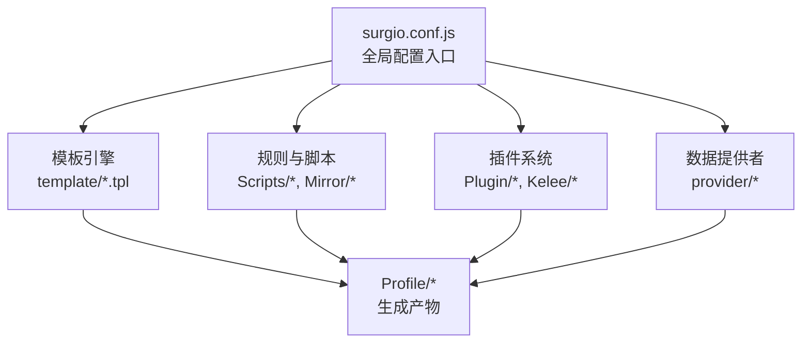
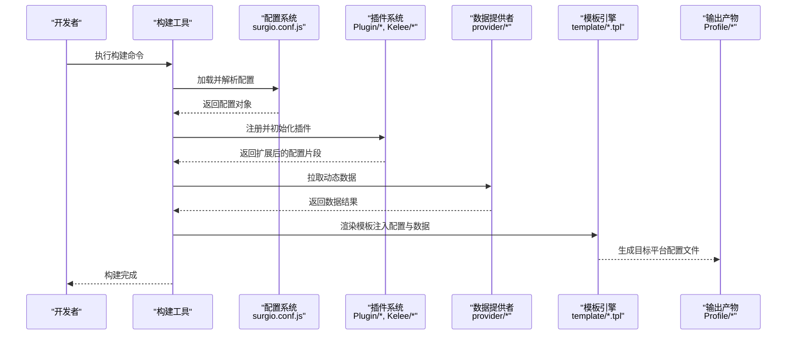
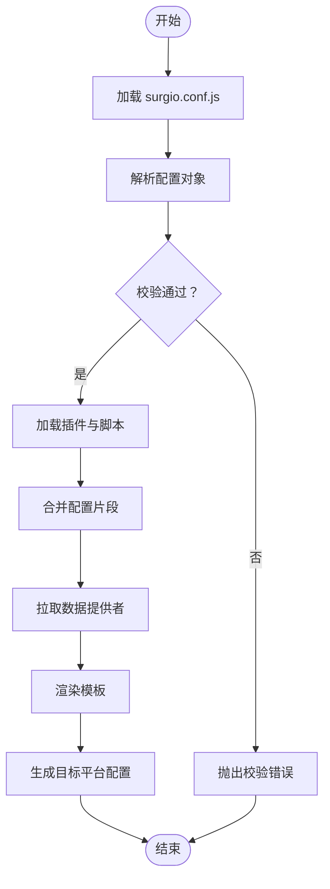
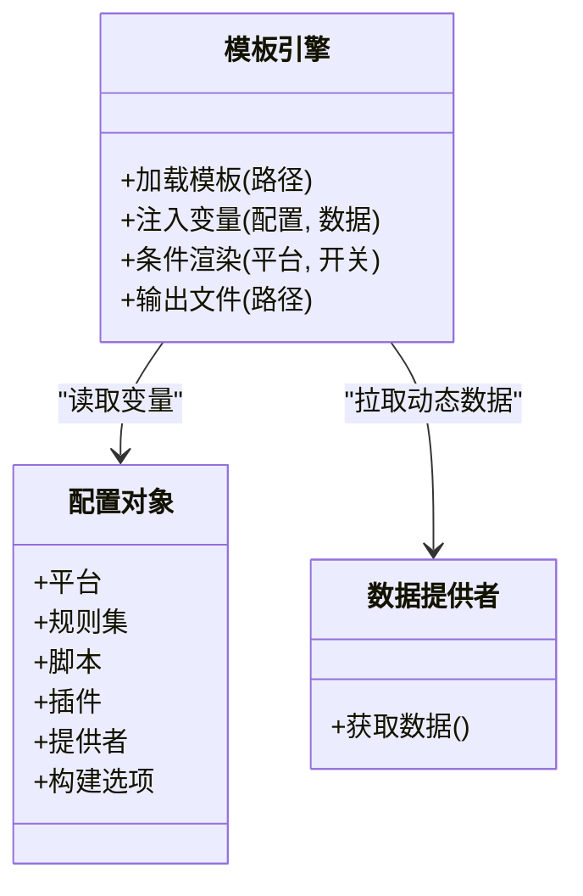
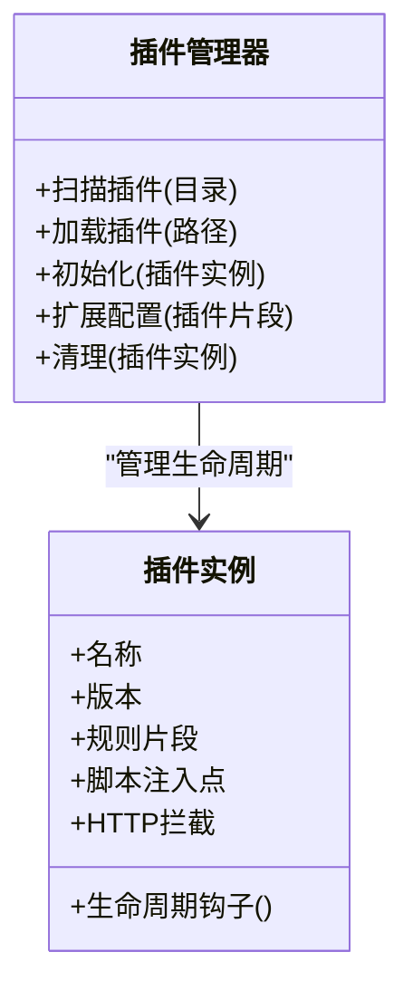
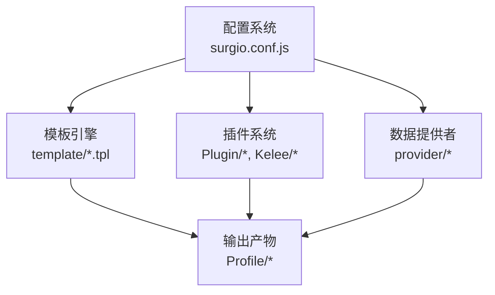

# 核心架构设计

<cite>
**本文引用的文件**   
- [surgio.conf.js](file://surgio.conf.js)
- [package.json](file://package.json)
- [README.md](file://README.md)
- [template/loon.tpl](file://template/loon.tpl)
- [template/quantumultx.tpl](file://template/quantumultx.tpl)
- [template/surge.tpl](file://template/surge.tpl)
- [Profile/Loon.lcf](file://Profile/Loon.lcf)
- [Profile/QX.conf](file://Profile/QX.conf)
- [Profile/Surge.conf](file://Profile/Surge.conf)
- [Scripts/ENGINE-MANIFEST.json](file://Scripts/ENGINE-MANIFEST.json)
- [Mirror/MANIFEST.json](file://Mirror/MANIFEST.json)
- [provider/tokyo.js](file://provider/tokyo.js)
- [Kelee/Prevent_DNS_Leaks.plugin](file://Kelee/Prevent_DNS_Leaks.plugin)
- [Kelee/YouTube_remove_ads.plugin](file://Kelee/YouTube_remove_ads.plugin)
- [Plugin/bilibili.plugin](file://Plugin/bilibili.plugin)
- [Plugin/wechat.plugin](file://Plugin/wechat.plugin)
- [test/run-tests.js](file://test/run-tests.js)
- [test/harness.js](file://test/harness.js)
</cite>

## 目录
1. [简介](#简介)
2. [项目结构](#项目结构)
3. [核心组件](#核心组件)
4. [架构总览](#架构总览)
5. [详细组件分析](#详细组件分析)
6. [依赖关系分析](#依赖关系分析)
7. [性能考量](#性能考量)
8. [故障排查指南](#故障排查指南)
9. [结论](#结论)
10. [附录](#附录)

## 简介
本技术文档面向 Surgio 的核心架构，系统性阐述配置系统的设计模式、模块划分与数据流；深入解析 JavaScript 配置文件的工作原理（配置对象结构、生命周期管理与错误处理）；介绍插件系统的架构与扩展方式；并提供架构图与数据流程图，帮助读者理解各组件之间的交互关系。同时给出核心 API 的使用示例与最佳实践，便于快速上手与二次开发。

## 项目结构
Surgio 采用“模板 + 规则 + 脚本 + 插件”的组合式工程化组织：
- 顶层配置文件 surgio.conf.js 作为全局入口，定义目标平台、规则集、脚本与插件等。
- template/ 存放不同平台的输出模板（Loon、Quantumult X、Surge）。
- Profile/ 提供各平台可直接使用的生成产物样例。
- Scripts/ 存放可注入的脚本与引擎清单。
- Mirror/ 存放镜像资源与规则集合。
- Plugin/ 与 Kelee/ 存放插件定义与第三方插件。
- provider/ 提供外部数据源或动态提供者。
- test/ 包含测试用例与运行器。

图表来源
- [surgio.conf.js](file://surgio.conf.js)
- [template/loon.tpl](file://template/loon.tpl)
- [template/quantumultx.tpl](file://template/quantumultx.tpl)
- [template/surge.tpl](file://template/surge.tpl)
- [Profile/Loon.lcf](file://Profile/Loon.lcf)
- [Profile/QX.conf](file://Profile/QX.conf)
- [Profile/Surge.conf](file://Profile/Surge.conf)

章节来源
- [README.md](file://README.md)
- [package.json](file://package.json)

## 核心组件
- 配置系统
  - 以 surgio.conf.js 为唯一入口，集中管理目标平台、规则集、脚本、插件、提供者与构建选项。
  - 支持条件分支、合并策略与校验钩子，确保配置在不同平台间的一致性。
- 模板引擎
  - 基于 template/*.tpl 将配置渲染为目标平台格式（Loon、QX、Surge）。
  - 模板变量由配置系统与运行时上下文注入。
- 插件系统
  - 通过 Plugin/* 与 Kelee/* 中的 .plugin 文件声明式扩展能力。
  - 插件可注入规则、脚本、域名白名单、HTTP 拦截逻辑等。
- 脚本引擎
  - Scripts/* 提供可注入脚本，ENGINE-MANIFEST.json 描述脚本元数据与加载顺序。
- 数据提供者
  - provider/* 暴露动态数据源（如地区、IP、列表），供配置与模板在构建期消费。

章节来源
- [surgio.conf.js](file://surgio.conf.js)
- [Scripts/ENGINE-MANIFEST.json](file://Scripts/ENGINE-MANIFEST.json)
- [Mirror/MANIFEST.json](file://Mirror/MANIFEST.json)
- [provider/tokyo.js](file://provider/tokyo.js)

## 架构总览
Surgio 的整体架构围绕“配置驱动 + 模板渲染 + 插件扩展”展开。构建流程从 surgio.conf.js 开始，读取并解析配置，随后加载插件与脚本，调用数据提供者获取动态内容，最终通过模板引擎生成目标平台的配置文件。

图表来源
- [surgio.conf.js](file://surgio.conf.js)
- [template/loon.tpl](file://template/loon.tpl)
- [template/quantumultx.tpl](file://template/quantumultx.tpl)
- [template/surge.tpl](file://template/surge.tpl)
- [Profile/Loon.lcf](file://Profile/Loon.lcf)
- [Profile/QX.conf](file://Profile/QX.conf)
- [Profile/Surge.conf](file://Profile/Surge.conf)
- [Scripts/ENGINE-MANIFEST.json](file://Scripts/ENGINE-MANIFEST.json)
- [provider/tokyo.js](file://provider/tokyo.js)

## 详细组件分析

### 配置系统（JavaScript 配置文件）
- 配置对象结构
  - 目标平台选择：指定 Loon、Quantumult X、Surge 等。
  - 规则集：引用 Mirror/rules 下的规则文件，支持按平台过滤。
  - 脚本与插件：声明需要注入的脚本与插件路径。
  - 数据提供者：引入 provider/* 提供的动态数据。
  - 构建选项：开关、合并策略、校验规则等。
- 生命周期管理
  - 加载阶段：读取 surgio.conf.js，解析为配置对象。
  - 扩展阶段：加载插件与脚本，合并到主配置。
  - 验证阶段：执行校验钩子，确保配置合法性。
  - 渲染阶段：将配置与数据注入模板，生成输出。
- 错误处理机制
  - 语法错误：捕获 JS 解析异常并定位行号。
  - 校验失败：对必填字段、类型与范围进行断言，抛出结构化错误。
  - 运行时异常：在插件与提供者中统一 try/catch，记录上下文信息。

图表来源
- [surgio.conf.js](file://surgio.conf.js)
- [Scripts/ENGINE-MANIFEST.json](file://Scripts/ENGINE-MANIFEST.json)
- [provider/tokyo.js](file://provider/tokyo.js)

章节来源
- [surgio.conf.js](file://surgio.conf.js)

### 模板引擎（多平台输出）
- 模板文件
  - template/loon.tpl、template/quantumultx.tpl、template/surge.tpl 分别对应 Loon、QX、Surge 的输出格式。
- 变量注入
  - 模板变量来自配置系统与运行时上下文（规则、脚本、插件、提供者数据）。
- 条件渲染
  - 根据目标平台与开关项选择性渲染特定段落。
- 产物位置
  - 生成的配置文件位于 Profile/ 目录下，便于直接部署。

图表来源
- [template/loon.tpl](file://template/loon.tpl)
- [template/quantumultx.tpl](file://template/quantumultx.tpl)
- [template/surge.tpl](file://template/surge.tpl)
- [Profile/Loon.lcf](file://Profile/Loon.lcf)
- [Profile/QX.conf](file://Profile/QX.conf)
- [Profile/Surge.conf](file://Profile/Surge.conf)

章节来源
- [template/loon.tpl](file://template/loon.tpl)
- [template/quantumultx.tpl](file://template/quantumultx.tpl)
- [template/surge.tpl](file://template/surge.tpl)
- [Profile/Loon.lcf](file://Profile/Loon.lcf)
- [Profile/QX.conf](file://Profile/QX.conf)
- [Profile/Surge.conf](file://Profile/Surge.conf)

### 插件系统（扩展与自定义）
- 插件声明
  - 通过 Plugin/* 与 Kelee/* 中的 .plugin 文件声明式扩展能力。
  - 每个插件可包含规则片段、脚本注入点、域名白名单、HTTP 拦截逻辑等。
- 插件加载
  - 构建时扫描插件目录，按依赖顺序加载并合并到主配置。
- 插件接口
  - 提供统一的注册与生命周期钩子（初始化、扩展、清理）。
- 使用示例
  - 在 surgio.conf.js 中声明插件路径与启用开关。
  - 在插件文件中实现具体功能逻辑。

图表来源
- [Plugin/bilibili.plugin](file://Plugin/bilibili.plugin)
- [Plugin/wechat.plugin](file://Plugin/wechat.plugin)
- [Kelee/Prevent_DNS_Leaks.plugin](file://Kelee/Prevent_DNS_Leaks.plugin)
- [Kelee/YouTube_remove_ads.plugin](file://Kelee/YouTube_remove_ads.plugin)

章节来源
- [Plugin/bilibili.plugin](file://Plugin/bilibili.plugin)
- [Plugin/wechat.plugin](file://Plugin/wechat.plugin)
- [Kelee/Prevent_DNS_Leaks.plugin](file://Kelee/Prevent_DNS_Leaks.plugin)
- [Kelee/YouTube_remove_ads.plugin](file://Kelee/YouTube_remove_ads.plugin)

### 脚本引擎（可注入脚本）
- 脚本清单
  - Scripts/ENGINE-MANIFEST.json 描述脚本元数据与加载顺序。
- 注入点
  - 在模板渲染阶段将脚本注入到目标平台配置中。
- 健康与流量通知
  - health-notify.js、traffic-notify.js 提供监控与告警能力。

章节来源
- [Scripts/ENGINE-MANIFEST.json](file://Scripts/ENGINE-MANIFEST.json)
- [Scripts/health-notify.js](file://Scripts/health-notify.js)
- [Scripts/traffic-notify.js](file://Scripts/traffic-notify.js)

### 数据提供者（动态数据源）
- 提供者接口
  - provider/* 暴露统一的数据获取方法，供配置与模板在构建期消费。
- 示例
  - provider/tokyo.js 提供地区相关数据，用于规则与模板的条件渲染。

章节来源
- [provider/tokyo.js](file://provider/tokyo.js)

## 依赖关系分析
Surgio 的依赖关系清晰分层：配置系统为核心，模板引擎与插件系统为扩展层，数据提供者与脚本引擎为支撑层。

图表来源
- [surgio.conf.js](file://surgio.conf.js)
- [template/loon.tpl](file://template/loon.tpl)
- [template/quantumultx.tpl](file://template/quantumultx.tpl)
- [template/surge.tpl](file://template/surge.tpl)
- [Profile/Loon.lcf](file://Profile/Loon.lcf)
- [Profile/QX.conf](file://Profile/QX.conf)
- [Profile/Surge.conf](file://Profile/Surge.conf)
- [Scripts/ENGINE-MANIFEST.json](file://Scripts/ENGINE-MANIFEST.json)
- [provider/tokyo.js](file://provider/tokyo.js)

章节来源
- [package.json](file://package.json)

## 性能考量
- 配置解析缓存：避免重复解析大型配置对象。
- 插件按需加载：仅启用必要插件，减少构建开销。
- 数据提供者批处理：合并多次请求，降低网络延迟。
- 模板渲染优化：预编译模板，减少运行时计算。
- 增量构建：仅重新渲染变更部分，提升迭代速度。

[本节为通用指导，不直接分析具体文件]

## 故障排查指南
- 常见错误
  - 配置语法错误：检查 surgio.conf.js 的 JS 语法与必填字段。
  - 插件加载失败：确认插件路径与依赖是否完整。
  - 数据提供者超时：检查网络与提供者可用性。
  - 模板渲染异常：核对模板变量与条件渲染逻辑。
- 调试建议
  - 启用详细日志，定位错误堆栈。
  - 使用 test/run-tests.js 与 test/harness.js 运行单元测试。
  - 逐步禁用插件与脚本，隔离问题来源。

章节来源
- [test/run-tests.js](file://test/run-tests.js)
- [test/harness.js](file://test/harness.js)

## 结论
Surgio 通过“配置驱动 + 模板渲染 + 插件扩展”的架构，实现了跨平台配置的统一管理与高效生成。其清晰的模块划分与数据流设计，使得扩展与定制变得简单直观。遵循本文的最佳实践与故障排查指南，可显著提升开发与运维效率。

[本节为总结性内容，不直接分析具体文件]

## 附录
- 核心 API 使用示例与最佳实践
  - 在 surgio.conf.js 中声明目标平台、规则集、脚本与插件。
  - 在插件文件中实现规则片段与脚本注入点。
  - 在 provider/* 中提供动态数据，并在模板中使用。
  - 使用 test/* 进行单元测试与集成测试，确保稳定性。

[本节为补充说明，不直接分析具体文件]