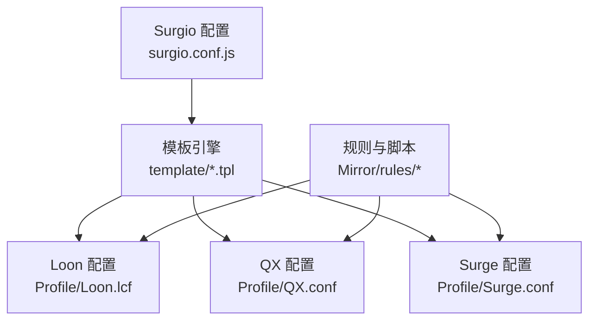
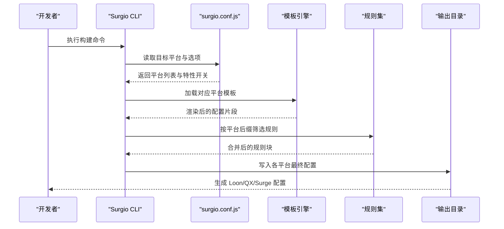
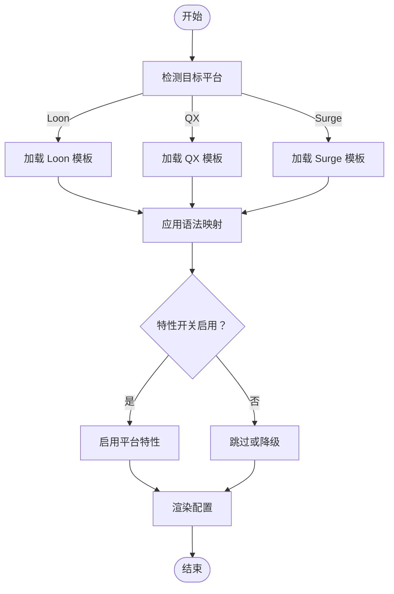
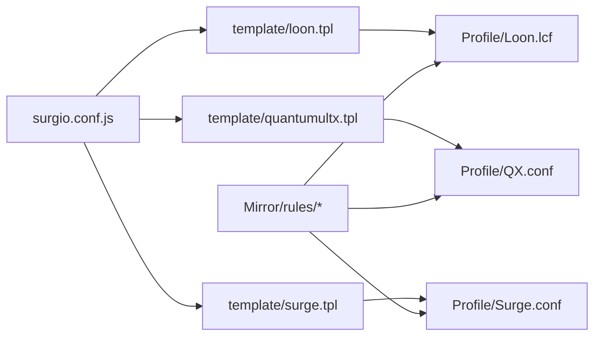

# 平台兼容性处理

<cite>
**本文引用的文件**   
- [surgio.conf.js](file://surgio.conf.js)
- [package.json](file://package.json)
- [README.md](file://README.md)
- [template/loon.tpl](file://template/loon.tpl)
- [template/quantumultx.tpl](file://template/quantumultx.tpl)
- [template/surge.tpl](file://template/surge.tpl)
- [Profile/Loon.lcf](file://Profile/Loon.lcf)
- [Profile/QX.conf](file://Profile/QX.conf)
- [Profile/Surge.conf](file://Profile/Surge.conf)
- [Mirror/rules/qx-China.list](file://Mirror/rules/qx-China.list)
- [Mirror/rules/loon-China.list](file://Mirror/rules/loon-China.list)
- [doc/surgio-migration.md](file://doc/surgio-migration.md)
</cite>

## 目录
1. [简介](#简介)
2. [项目结构](#项目结构)
3. [核心组件](#核心组件)
4. [架构总览](#架构总览)
5. [详细组件分析](#详细组件分析)
6. [依赖关系分析](#依赖关系分析)
7. [性能考量](#性能考量)
8. [故障排查指南](#故障排查指南)
9. [结论](#结论)
10. [附录](#附录)

## 简介
本技术文档围绕 Surgio 的多平台兼容性处理机制展开，聚焦 Loon、Quantumult X（QX）与 Surge 三大目标平台的配置格式差异与转换规则。文档将系统阐述平台检测机制、条件编译与特性适配策略，并提供跨平台开发的指导原则（语法映射、功能降级、错误处理），以及完整的平台特性对照表与迁移指南，帮助开发者编写可移植的模板代码。

## 项目结构
仓库采用“模板 + 配置文件 + 规则脚本”的组织方式：
- 模板层：为不同平台提供独立模板（Loon、QX、Surge），用于生成最终配置。
- 配置层：各平台 Profile 示例，体现目标平台的具体语法与结构。
- 规则与脚本：按平台分目录存放规则与脚本，便于在构建时进行选择性输出。
- 构建与校验：通过 Surgio 配置文件与 CI 工作流驱动多平台构建与验证。

图表来源
- [surgio.conf.js](file://surgio.conf.js)
- [template/loon.tpl](file://template/loon.tpl)
- [template/quantumultx.tpl](file://template/quantumultx.tpl)
- [template/surge.tpl](file://template/surge.tpl)
- [Profile/Loon.lcf](file://Profile/Loon.lcf)
- [Profile/QX.conf](file://Profile/QX.conf)
- [Profile/Surge.conf](file://Profile/Surge.conf)

章节来源
- [README.md](file://README.md)
- [package.json](file://package.json)

## 核心组件
- 构建配置（surgio.conf.js）：定义目标平台、模板路径、输出目录、平台特性开关与转换规则。
- 模板文件（*.tpl）：分别面向 Loon、QX、Surge，包含平台特定的语法片段与条件编译标记。
- 平台 Profile（*.lcf/*.conf）：作为参考实现，展示各平台最终配置的典型结构与字段命名差异。
- 规则与脚本（Mirror/rules/*）：按平台后缀区分（如 qx-*.list、loon-*.list），在构建阶段被选择性地合并到对应平台输出中。

章节来源
- [surgio.conf.js](file://surgio.conf.js)
- [template/loon.tpl](file://template/loon.tpl)
- [template/quantumultx.tpl](file://template/quantumultx.tpl)
- [template/surge.tpl](file://template/surge.tpl)
- [Profile/Loon.lcf](file://Profile/Loon.lcf)
- [Profile/QX.conf](file://Profile/QX.conf)
- [Profile/Surge.conf](file://Profile/Surge.conf)
- [Mirror/rules/qx-China.list](file://Mirror/rules/qx-China.list)
- [Mirror/rules/loon-China.list](file://Mirror/rules/loon-China.list)

## 架构总览
Surgio 的构建流程以“平台检测 → 模板渲染 → 规则拼装 → 输出校验”为主线：
- 平台检测：读取 surgio.conf.js 中的 target 列表，识别 Loon、QX、Surge。
- 模板渲染：根据目标平台选择对应 *.tpl，并注入平台变量与特性开关。
- 规则拼装：依据平台后缀筛选 Mirror/rules 下的规则文件，合并到最终配置。
- 输出校验：通过 CI 工作流对生成的配置进行语法检查与一致性验证。

图表来源
- [surgio.conf.js](file://surgio.conf.js)
- [template/loon.tpl](file://template/loon.tpl)
- [template/quantumultx.tpl](file://template/quantumultx.tpl)
- [template/surge.tpl](file://template/surge.tpl)
- [Mirror/rules/qx-China.list](file://Mirror/rules/qx-China.list)
- [Mirror/rules/loon-China.list](file://Mirror/rules/loon-China.list)

## 详细组件分析

### 平台检测与条件编译
- 平台检测：由构建配置集中声明目标平台，避免硬编码；支持扩展新平台。
- 条件编译：模板中使用平台标识进行分支渲染，确保仅输出当前平台支持的语法。
- 特性开关：针对各平台能力差异（如脚本引擎、正则表达式、HTTP API）设置开关，控制是否启用特定功能。

章节来源
- [surgio.conf.js](file://surgio.conf.js)
- [template/loon.tpl](file://template/loon.tpl)
- [template/quantumultx.tpl](file://template/quantumultx.tpl)
- [template/surge.tpl](file://template/surge.tpl)

### 模板系统与语法映射
- Loon 模板：遵循 .lcf 风格，强调插件化与脚本集成。
- QX 模板：遵循 .conf 风格，侧重规则与脚本分离，支持丰富的内置函数。
- Surge 模板：遵循 .conf 风格，强调策略组与规则域，API 调用方式与其他平台存在差异。

图表来源
- [template/loon.tpl](file://template/loon.tpl)
- [template/quantumultx.tpl](file://template/quantumultx.tpl)
- [template/surge.tpl](file://template/surge.tpl)

章节来源
- [template/loon.tpl](file://template/loon.tpl)
- [template/quantumultx.tpl](file://template/quantumultx.tpl)
- [template/surge.tpl](file://template/surge.tpl)

### 规则与脚本的平台适配
- 规则文件：按平台后缀组织（qx-*.list、loon-*.list），构建时按目标平台选择性合并。
- 脚本文件：不同平台对脚本语言与运行环境的支持不同，需通过模板条件编译控制引入。
- 资源解析：QX 与 Surge 在资源解析与 HTTP 请求方面存在差异，需在模板中做差异化处理。

章节来源
- [Mirror/rules/qx-China.list](file://Mirror/rules/qx-China.list)
- [Mirror/rules/loon-China.list](file://Mirror/rules/loon-China.list)

### 平台特性对照与迁移指南
- 语法差异：字段命名、注释风格、作用域划分在不同平台间不一致，需在模板中统一映射。
- 功能差异：脚本引擎、正则表达式、HTTP API、策略组等能力在各平台实现不同，需通过特性开关控制。
- 降级策略：当目标平台不支持某特性时，应回退到兼容模式或禁用该功能，保证基础可用性。
- 错误处理：构建期进行语法校验与缺失字段检查，运行期捕获异常并记录日志，便于定位问题。

章节来源
- [doc/surgio-migration.md](file://doc/surgio-migration.md)

## 依赖关系分析
- 构建配置依赖模板与规则集，模板依赖平台特性开关，规则集依赖平台后缀约定。
- 模板之间相互独立，避免交叉引用，降低耦合度。
- 规则与脚本按平台隔离，减少运行时冲突。

图表来源
- [surgio.conf.js](file://surgio.conf.js)
- [template/loon.tpl](file://template/loon.tpl)
- [template/quantumultx.tpl](file://template/quantumultx.tpl)
- [template/surge.tpl](file://template/surge.tpl)
- [Profile/Loon.lcf](file://Profile/Loon.lcf)
- [Profile/QX.conf](file://Profile/QX.conf)
- [Profile/Surge.conf](file://Profile/Surge.conf)
- [Mirror/rules/qx-China.list](file://Mirror/rules/qx-China.list)
- [Mirror/rules/loon-China.list](file://Mirror/rules/loon-China.list)

章节来源
- [surgio.conf.js](file://surgio.conf.js)
- [package.json](file://package.json)

## 性能考量
- 模板渲染：避免在模板中进行复杂计算，尽量将逻辑前置到构建配置或预处理阶段。
- 规则合并：按平台增量合并规则，减少不必要的重复与冗余。
- 缓存策略：对静态模板与规则进行缓存，提升重复构建效率。
- 并行构建：对不同平台并行渲染与输出，缩短整体构建时间。

## 故障排查指南
- 构建失败：检查 surgio.conf.js 中的目标平台与模板路径是否正确，确认模板语法无错误。
- 运行时异常：查看各平台日志，确认脚本与规则是否被正确引入，特性开关是否符合预期。
- 规则不生效：核对规则文件后缀与平台匹配，确认作用域与优先级设置。
- 兼容性问题：对比平台特性对照表，确认是否存在未覆盖的差异点，必要时添加降级逻辑。

章节来源
- [doc/surgio-migration.md](file://doc/surgio-migration.md)

## 结论
Surgio 通过模板系统与构建配置实现了 Loon、QX、Surge 三平台的兼容与转换。借助平台检测、条件编译与特性开关，开发者可以编写一次模板，输出多平台配置。建议在实际项目中严格遵循语法映射、功能降级与错误处理原则，持续完善平台特性对照表与迁移指南，以提升可移植性与可维护性。

## 附录
- 平台特性对照表：建议在模板与构建配置中维护一份详细的特性矩阵，明确各平台支持与限制。
- 迁移清单：列出从单平台向多平台迁移的步骤，包括模板拆分、规则重命名、脚本适配与测试用例补充。
- 最佳实践：保持模板简洁、规则模块化、配置可读性强，便于团队协作与长期演进。