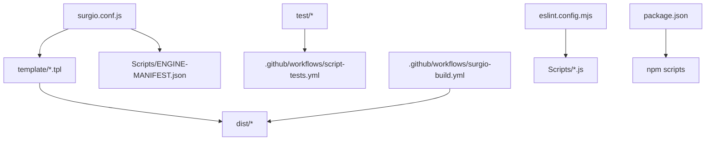
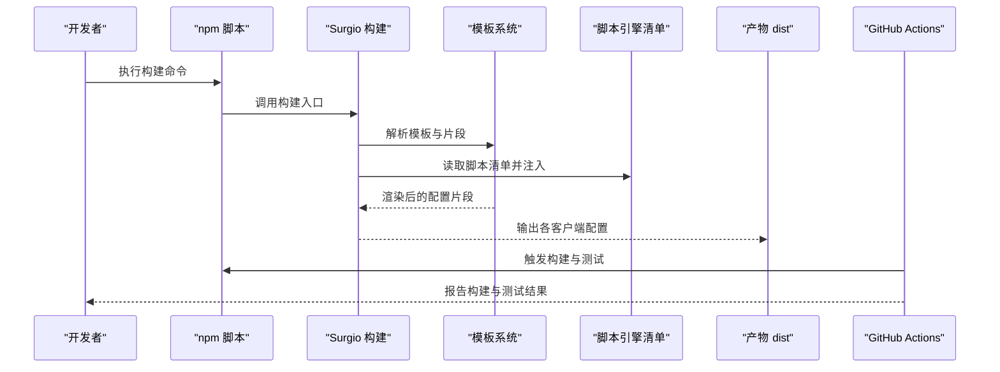
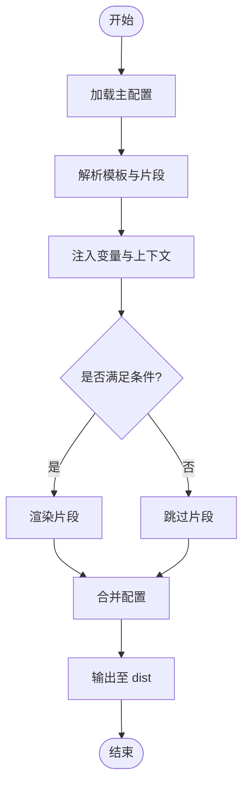
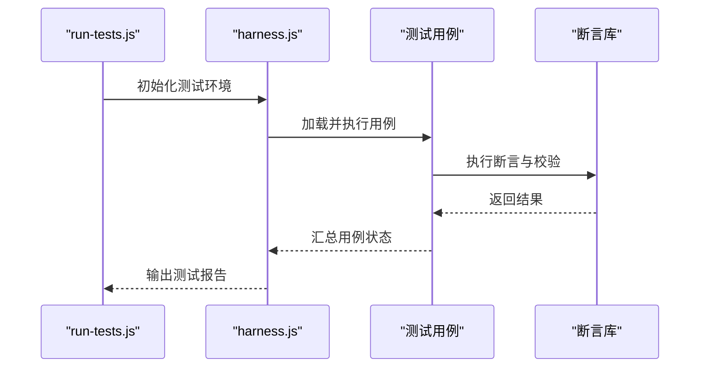
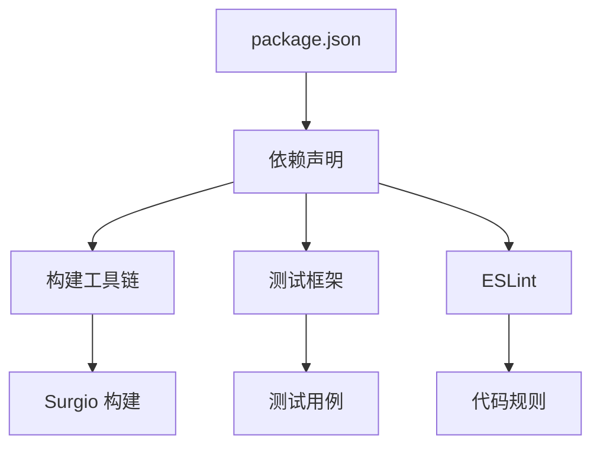

# 模板开发指南

<cite>
**本文档引用的文件**   
- [README.md](file://README.md)
- [package.json](file://package.json)
- [surgio.conf.js](file://surgio.conf.js)
- [template/loon.tpl](file://template/loon.tpl)
- [template/quantumultx.tpl](file://template/quantumultx.tpl)
- [template/surge.tpl](file://template/surge.tpl)
- [template/snippet/ai-services.tpl](file://template/snippet/ai-services.tpl)
- [template/snippet/bank-ad-reject.tpl](file://template/snippet/bank-ad-reject.tpl)
- [template/snippet/developer.qx](file://template/snippet/developer.qx)
- [template/snippet/social.qx](file://template/snippet/social.qx)
- [template/snippet/streaming.qx](file://template/snippet/streaming.qx)
- [Scripts/ENGINE-MANIFEST.json](file://Scripts/ENGINE-MANIFEST.json)
- [test/harness.js](file://test/harness.js)
- [test/run-tests.js](file://test/run-tests.js)
- [eslint.config.mjs](file://eslint.config.mjs)
- [.github/workflows/surgio-build.yml](file://.github/workflows/surgio-build.yml)
- [.github/workflows/script-tests.yml](file://.github/workflows/script-tests.yml)
</cite>

## 目录
1. [简介](#简介)
2. [项目结构](#项目结构)
3. [核心组件](#核心组件)
4. [架构总览](#架构总览)
5. [详细组件分析](#详细组件分析)
6. [依赖分析](#依赖分析)
7. [性能考虑](#性能考虑)
8. [故障排查指南](#故障排查指南)
9. [结论](#结论)
10. [附录](#附录)

## 简介
本指南面向 Surgio 模板开发者，提供从环境搭建、调试与测试到性能优化、协作规范与问题排查的完整工作流。Surgio 通过统一的配置与模板系统，将脚本与规则在不同代理客户端（如 Surge、Loon、Quantumult X）间进行转换与分发。本文档帮助你在保证质量与性能的前提下，高效迭代模板与脚本。

## 项目结构
仓库采用按功能域组织的方式：
- template：各客户端模板与片段（snippet），用于生成最终配置文件
- Scripts：引擎脚本与清单，定义可被模板引用的脚本集合
- test：单元测试与测试运行器
- .github/workflows：CI/CD 流水线，包含构建、校验与部署
- eslint.config.mjs：代码风格与静态检查配置
- surgio.conf.js：Surgio 主配置，定义输入源、输出目标与转换规则
- package.json：依赖与脚本命令

图表来源
- [surgio.conf.js:1-200](file://surgio.conf.js#L1-L200)
- [template/loon.tpl:1-200](file://template/loon.tpl#L1-L200)
- [template/quantumultx.tpl:1-200](file://template/quantumultx.tpl#L1-L200)
- [template/surge.tpl:1-200](file://template/surge.tpl#L1-L200)
- [Scripts/ENGINE-MANIFEST.json:1-200](file://Scripts/ENGINE-MANIFEST.json#L1-L200)
- [test/harness.js:1-200](file://test/harness.js#L1-L200)
- [test/run-tests.js:1-200](file://test/run-tests.js#L1-L200)
- [eslint.config.mjs:1-200](file://eslint.config.mjs#L1-L200)
- [package.json:1-200](file://package.json#L1-L200)

章节来源
- [README.md:1-200](file://README.md#L1-L200)
- [package.json:1-200](file://package.json#L1-L200)
- [surgio.conf.js:1-200](file://surgio.conf.js#L1-L200)

## 核心组件
- 模板系统（template）：以 .tpl 和 .qx/.list 等片段形式组织，支持变量注入与条件渲染，产出不同客户端的最终配置
- 脚本引擎（Scripts）：通过 ENGINE-MANIFEST.json 声明脚本元数据，供模板引用与按需加载
- 构建与发布（surgio.conf.js + CI）：统一入口配置，驱动模板编译与产物输出；GitHub Actions 负责自动化构建与校验
- 测试框架（test）：基于 Node.js 的测试运行器与用例集，覆盖脚本逻辑与模板生成结果
- 代码质量（eslint）：统一编码规范与静态检查，保障脚本与配置的可维护性

章节来源
- [template/loon.tpl:1-200](file://template/loon.tpl#L1-L200)
- [template/quantumultx.tpl:1-200](file://template/quantumultx.tpl#L1-L200)
- [template/surge.tpl:1-200](file://template/surge.tpl#L1-L200)
- [Scripts/ENGINE-MANIFEST.json:1-200](file://Scripts/ENGINE-MANIFEST.json#L1-L200)
- [surgio.conf.js:1-200](file://surgio.conf.js#L1-L200)
- [test/harness.js:1-200](file://test/harness.js#L1-L200)
- [test/run-tests.js:1-200](file://test/run-tests.js#L1-L200)
- [eslint.config.mjs:1-200](file://eslint.config.mjs#L1-L200)

## 架构总览
Surgio 模板构建流程由主配置驱动，读取模板与脚本清单，执行转换与合并，输出各客户端可用配置。CI 流水线在每次提交时执行构建与测试，确保变更质量。

图表来源
- [surgio.conf.js:1-200](file://surgio.conf.js#L1-L200)
- [template/loon.tpl:1-200](file://template/loon.tpl#L1-L200)
- [template/quantumultx.tpl:1-200](file://template/quantumultx.tpl#L1-L200)
- [template/surge.tpl:1-200](file://template/surge.tpl#L1-L200)
- [Scripts/ENGINE-MANIFEST.json:1-200](file://Scripts/ENGINE-MANIFEST.json#L1-L200)
- [.github/workflows/surgio-build.yml:1-200](file://.github/workflows/surgio-build.yml#L1-L200)
- [.github/workflows/script-tests.yml:1-200](file://.github/workflows/script-tests.yml#L1-L200)

## 详细组件分析

### 模板系统与片段管理
- 模板文件（.tpl）：定义全局结构与变量注入点，按客户端差异拆分或条件渲染
- 片段（snippet）：按功能域组织（如 AI、银行广告拦截、开发者工具、社交、流媒体），便于复用与组合
- 变量与条件：通过主配置与运行时上下文注入变量，控制片段启用与参数化

图表来源
- [surgio.conf.js:1-200](file://surgio.conf.js#L1-L200)
- [template/snippet/ai-services.tpl:1-200](file://template/snippet/ai-services.tpl#L1-L200)
- [template/snippet/bank-ad-reject.tpl:1-200](file://template/snippet/bank-ad-reject.tpl#L1-L200)
- [template/snippet/developer.qx:1-200](file://template/snippet/developer.qx#L1-L200)
- [template/snippet/social.qx:1-200](file://template/snippet/social.qx#L1-L200)
- [template/snippet/streaming.qx:1-200](file://template/snippet/streaming.qx#L1-L200)

章节来源
- [template/loon.tpl:1-200](file://template/loon.tpl#L1-L200)
- [template/quantumultx.tpl:1-200](file://template/quantumultx.tpl#L1-L200)
- [template/surge.tpl:1-200](file://template/surge.tpl#L1-L200)
- [template/snippet/ai-services.tpl:1-200](file://template/snippet/ai-services.tpl#L1-L200)
- [template/snippet/bank-ad-reject.tpl:1-200](file://template/snippet/bank-ad-reject.tpl#L1-L200)
- [template/snippet/developer.qx:1-200](file://template/snippet/developer.qx#L1-L200)
- [template/snippet/social.qx:1-200](file://template/snippet/social.qx#L1-L200)
- [template/snippet/streaming.qx:1-200](file://template/snippet/streaming.qx#L1-L200)

### 脚本引擎与清单
- ENGINE-MANIFEST.json：集中声明脚本名称、版本、依赖与入口路径，供模板按需引用
- 脚本组织：按业务域划分（如地图、电商、社区等），保持单一职责与高内聚
- 模板引用：通过变量或宏在模板中引入脚本片段，避免重复与冗余

章节来源
- [Scripts/ENGINE-MANIFEST.json:1-200](file://Scripts/ENGINE-MANIFEST.json#L1-L200)
- [Scripts/Amap.js:1-200](file://Scripts/Amap.js#L1-L200)
- [Scripts/JD.js:1-200](file://Scripts/JD.js#L1-L200)
- [Scripts/Qidian.js:1-200](file://Scripts/Qidian.js#L1-L200)
- [Scripts/Reddit.js:1-200](file://Scripts/Reddit.js#L1-L200)
- [Scripts/Tieba.js:1-200](file://Scripts/Tieba.js#L1-L200)
- [Scripts/Zhihu.js:1-200](file://Scripts/Zhihu.js#L1-L200)
- [Scripts/Zhihuifangdong.js:1-200](file://Scripts/Zhihuifangdong.js#L1-L200)
- [Scripts/health-notify.js:1-200](file://Scripts/health-notify.js#L1-L200)
- [Scripts/traffic-notify.js:1-200](file://Scripts/traffic-notify.js#L1-L200)

### 构建与发布（CI/CD）
- surgio.conf.js：定义输入源、模板映射、输出目标与转换策略
- GitHub Actions：
  - surgio-build.yml：执行模板构建与产物校验
  - script-tests.yml：运行脚本测试与覆盖率统计
  - pages-deploy.yml：将产物部署至页面服务
- 本地构建：通过 npm 脚本调用 Surgio CLI，快速验证变更

章节来源
- [surgio.conf.js:1-200](file://surgio.conf.js#L1-L200)
- [.github/workflows/surgio-build.yml:1-200](file://.github/workflows/surgio-build.yml#L1-L200)
- [.github/workflows/script-tests.yml:1-200](file://.github/workflows/script-tests.yml#L1-L200)
- [.github/workflows/pages-deploy.yml:1-200](file://.github/workflows/pages-deploy.yml#L1-L200)
- [package.json:1-200](file://package.json#L1-L200)

### 测试框架与用例
- harness.js：测试运行器封装，提供断言与辅助方法
- run-tests.js：测试入口，聚合用例并输出结果
- 用例组织：按功能模块划分，覆盖脚本逻辑与模板渲染结果

图表来源
- [test/harness.js:1-200](file://test/harness.js#L1-L200)
- [test/run-tests.js:1-200](file://test/run-tests.js#L1-L200)

章节来源
- [test/harness.js:1-200](file://test/harness.js#L1-L200)
- [test/run-tests.js:1-200](file://test/run-tests.js#L1-L200)
- [test/cases/purify-scripts.test.js:1-200](file://test/cases/purify-scripts.test.js#L1-L200)
- [test/cases/qidian-wrapper.test.js:1-200](file://test/cases/qidian-wrapper.test.js#L1-L200)
- [test/cases/zhihu-cainiao.test.js:1-200](file://test/cases/zhihu-cainiao.test.js#L1-L200)
- [test/cases/zhihuifangdong.test.js:1-200](file://test/cases/zhihuifangdong.test.js#L1-L200)

### 代码质量与规范
- eslint.config.mjs：统一 JavaScript 与模板相关规则的静态检查
- 建议：在提交前运行 lint 与格式化，减少代码风格差异带来的协作成本

章节来源
- [eslint.config.mjs:1-200](file://eslint.config.mjs#L1-L200)

## 依赖分析
- 构建依赖：Surgio CLI、Node.js 运行时、模板引擎与脚本处理库
- 测试依赖：测试框架与断言库
- 代码质量：ESLint 及插件
- 外部集成：GitHub Actions 提供的 CI/CD 能力

图表来源
- [package.json:1-200](file://package.json#L1-L200)
- [eslint.config.mjs:1-200](file://eslint.config.mjs#L1-L200)
- [surgio.conf.js:1-200](file://surgio.conf.js#L1-L200)

章节来源
- [package.json:1-200](file://package.json#L1-L200)
- [eslint.config.mjs:1-200](file://eslint.config.mjs#L1-L200)
- [surgio.conf.js:1-200](file://surgio.conf.js#L1-L200)

## 性能考虑
- 模板渲染优化
  - 减少不必要的条件分支与循环，优先使用常量与预计算值
  - 合理拆分片段，避免大段重复渲染
  - 利用缓存机制存储中间结果，降低重复计算
- 内存管理
  - 避免在高频路径创建大对象，尽量复用数据结构
  - 及时释放不再使用的临时变量与引用
- 执行效率提升
  - 将耗时操作异步化或延迟执行
  - 对正则匹配与字符串处理进行优化，减少回溯与重复扫描
- 监控与诊断
  - 在关键路径添加性能埋点，记录渲染时长与内存峰值
  - 结合 CI 的性能回归检测，防止退化

[本节为通用指导，不直接分析具体文件]

## 故障排查指南
- 构建失败
  - 检查 surgio.conf.js 的路径与变量是否正确
  - 确认模板语法与片段引用无误
  - 查看 CI 日志定位错误堆栈
- 脚本异常
  - 使用测试用例复现问题，逐步缩小范围
  - 在关键函数添加日志输出，观察输入输出
  - 检查依赖版本与兼容性
- 模板渲染异常
  - 验证变量注入与条件判断逻辑
  - 对比不同客户端的输出差异，定位兼容性问题
- 性能问题
  - 使用性能分析工具定位热点函数
  - 优化正则与字符串处理，减少 CPU 占用
  - 监控内存泄漏，确保资源及时释放

章节来源
- [surgio.conf.js:1-200](file://surgio.conf.js#L1-L200)
- [test/harness.js:1-200](file://test/harness.js#L1-L200)
- [test/run-tests.js:1-200](file://test/run-tests.js#L1-L200)
- [eslint.config.mjs:1-200](file://eslint.config.mjs#L1-L200)

## 结论
通过统一的模板系统与脚本清单，Surgio 实现了跨客户端的配置生成与分发。遵循本文档的开发工作流、性能优化策略与故障排查方法，可以显著提升模板质量与开发效率。建议在团队协作中严格执行代码规范与 CI 流程，确保变更的稳定性和可追溯性。

[本节为总结性内容，不直接分析具体文件]

## 附录
- 开发环境搭建
  - 安装 Node.js 与包管理器
  - 克隆仓库并安装依赖
  - 配置环境变量与密钥（如需）
- 调试技巧
  - 使用本地构建快速验证
  - 在测试用例中添加断言与日志
  - 借助 ESLint 与 IDE 插件进行实时检查
- 测试方法
  - 编写覆盖核心逻辑的用例
  - 使用测试运行器批量执行
  - 在 CI 中集成自动化测试
- 版本控制与协作
  - 使用分支策略与提交规范
  - 通过 Pull Request 进行代码审查
  - 在 CI 中执行构建与测试门禁
- 最佳实践
  - 模块化与高内聚低耦合
  - 清晰的命名与注释
  - 持续集成与自动化发布

[本节为补充信息，不直接分析具体文件]