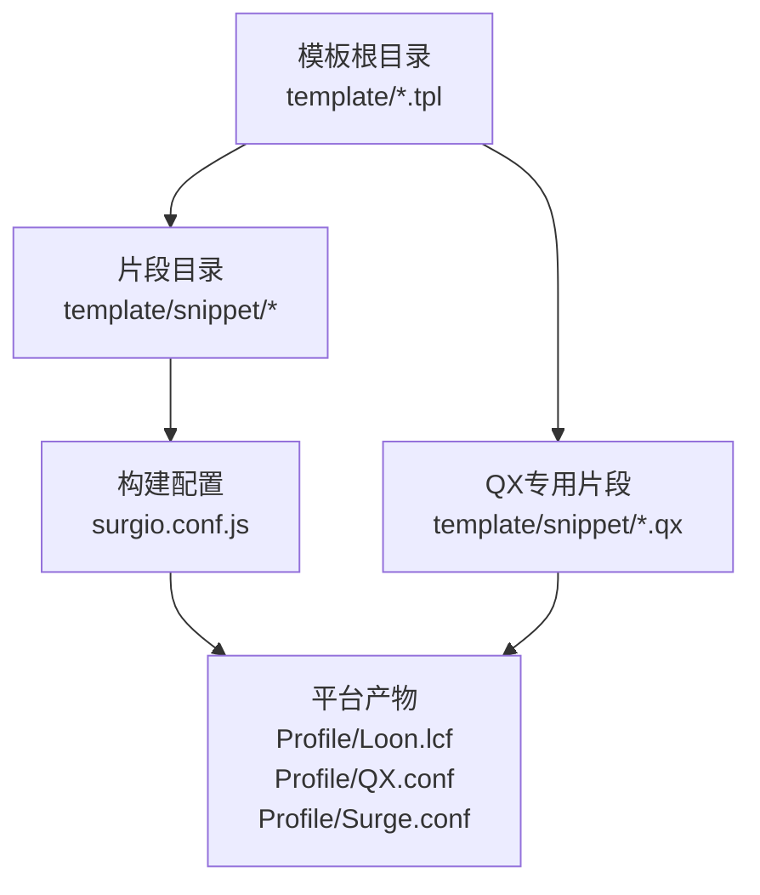
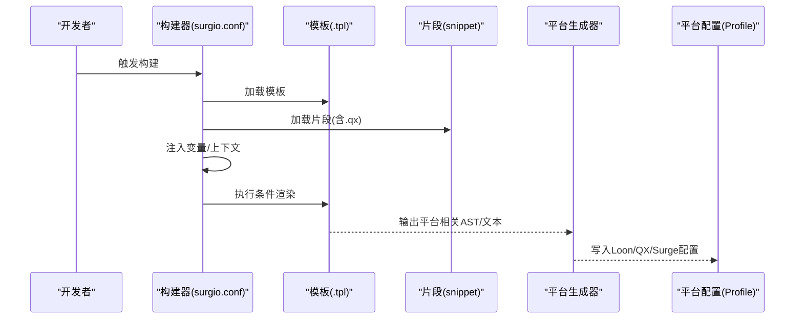
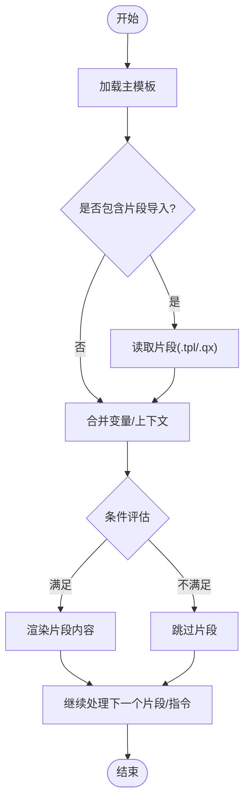
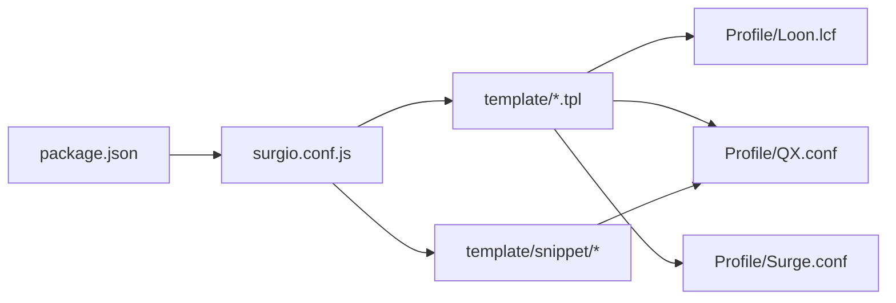

# 模板引擎系统

<cite>
**本文引用的文件**   
- [surgio.conf.js](file://surgio.conf.js)
- [package.json](file://package.json)
- [template/loon.tpl](file://template/loon.tpl)
- [template/quantumultx.tpl](file://template/quantumultx.tpl)
- [template/surge.tpl](file://template/surge.tpl)
- [template/snippet/ai-services.tpl](file://template/snippet/ai-services.tpl)
- [template/snippet/bank-ad-reject.tpl](file://template/snippet/bank-ad-reject.tpl)
- [template/snippet/developer.tpl](file://template/snippet/developer.tpl)
- [template/snippet/social.tpl](file://template/snippet/social.tpl)
- [template/snippet/streaming.tpl](file://template/snippet/streaming.tpl)
- [template/snippet/ai-services.qx](file://template/snippet/ai-services.qx)
- [template/snippet/bank-ad-reject.qx](file://template/snippet/bank-ad-reject.qx)
- [template/snippet/developer.qx](file://template/snippet/developer.qx)
- [template/snippet/social.qx](file://template/snippet/social.qx)
- [template/snippet/streaming.qx](file://template/snippet/streaming.qx)
- [Profile/Loon.lcf](file://Profile/Loon.lcf)
- [Profile/QX.conf](file://Profile/QX.conf)
- [Profile/Surge.conf](file://Profile/Surge.conf)
- [README.md](file://README.md)
</cite>

## 目录
1. [简介](#简介)
2. [项目结构](#项目结构)
3. [核心组件](#核心组件)
4. [架构总览](#架构总览)
5. [详细组件分析](#详细组件分析)
6. [依赖关系分析](#依赖关系分析)
7. [性能考量](#性能考量)
8. [故障排查指南](#故障排查指南)
9. [结论](#结论)
10. [附录：语法参考与示例](#附录语法参考与示例)

## 简介
本技术文档面向使用 Surgio 模板引擎的开发者与维护者，系统性阐述模板语法、变量插值与条件渲染机制，并深入对比 Loon、Quantumult X（QX）与 Surge 三大目标平台的差异及转换规则。同时，文档详解片段（snippet）系统的定义、导入与使用方式，提供模板开发最佳实践、调试技巧与性能优化建议，并给出完整的语法参考与实际使用示例路径，帮助读者快速上手与高效排障。

## 项目结构
Surgio 模板工程采用“模板 + 片段 + 构建配置”的组织方式：
- 模板层：以 .tpl 为后缀的通用模板，描述跨平台一致的规则与逻辑；针对 QX 的 .qx 片段用于特定平台能力。
- 片段层：按功能域拆分可复用片段，如 AI 服务、银行广告拦截、开发者工具、社交、流媒体等。
- 构建配置：通过 surgio.conf.js 统一声明目标平台、输入输出、片段合并与变量注入策略。
- 产物与配置文件：Profile 目录下生成各平台可直接使用的配置文件（.lcf/.conf）。

图表来源
- [surgio.conf.js](file://surgio.conf.js)
- [template/loon.tpl](file://template/loon.tpl)
- [template/quantumultx.tpl](file://template/quantumultx.tpl)
- [template/surge.tpl](file://template/surge.tpl)
- [template/snippet/ai-services.tpl](file://template/snippet/ai-services.tpl)
- [template/snippet/ai-services.qx](file://template/snippet/ai-services.qx)
- [Profile/Loon.lcf](file://Profile/Loon.lcf)
- [Profile/QX.conf](file://Profile/QX.conf)
- [Profile/Surge.conf](file://Profile/Surge.conf)

章节来源
- [README.md](file://README.md)
- [package.json](file://package.json)
- [surgio.conf.js](file://surgio.conf.js)

## 核心组件
- 模板引擎与构建器：由 surgio.conf.js 驱动，负责解析模板、合并片段、注入变量、执行条件渲染，并按目标平台生成最终配置。
- 片段系统：将复杂规则拆分为独立片段，支持按需引入、条件启用与平台差异化处理。
- 平台适配层：在模板中抽象通用语义，构建期根据目标平台（Loon/QX/Surge）转换为对应语法与字段。
- 变量与上下文：通过构建配置与环境变量注入运行时上下文，实现动态开关、白名单/黑名单管理、域名集合扩展等。

章节来源
- [surgio.conf.js](file://surgio.conf.js)
- [template/loon.tpl](file://template/loon.tpl)
- [template/quantumultx.tpl](file://template/quantumultx.tpl)
- [template/surge.tpl](file://template/surge.tpl)

## 架构总览
下图展示从模板到平台产物的整体流程：模板与片段被读取后，经变量注入与条件判断，生成各平台专属配置。

图表来源
- [surgio.conf.js](file://surgio.conf.js)
- [template/loon.tpl](file://template/loon.tpl)
- [template/quantumultx.tpl](file://template/quantumultx.tpl)
- [template/surge.tpl](file://template/surge.tpl)
- [template/snippet/ai-services.tpl](file://template/snippet/ai-services.tpl)
- [template/snippet/ai-services.qx](file://template/snippet/ai-services.qx)
- [Profile/Loon.lcf](file://Profile/Loon.lcf)
- [Profile/QX.conf](file://Profile/QX.conf)
- [Profile/Surge.conf](file://Profile/Surge.conf)

## 详细组件分析

### 模板语法与变量插值
- 变量插值：模板中使用占位符引用构建时注入的变量，常用于开关控制、域名列表、策略名称等。
- 条件渲染：基于布尔变量或表达式决定是否输出某段规则或片段，避免多分支重复代码。
- 循环与集合：对域名集合进行遍历生成多条规则，减少冗余。
- 注释与分隔：便于维护与阅读，不影响生成结果。

章节来源
- [template/loon.tpl](file://template/loon.tpl)
- [template/quantumultx.tpl](file://template/quantumultx.tpl)
- [template/surge.tpl](file://template/surge.tpl)

### 条件渲染机制
- 布尔开关：通过变量 true/false 控制片段或规则块是否生效。
- 环境区分：依据目标平台或环境变量选择不同分支。
- 组合条件：多个变量组合决定输出，确保最小化且精确的规则集。

章节来源
- [template/loon.tpl](file://template/loon.tpl)
- [template/quantumultx.tpl](file://template/quantumultx.tpl)
- [template/surge.tpl](file://template/surge.tpl)

### 片段（Snippet）系统
- 片段定义：每个 .tpl 片段封装一组相关规则，命名体现领域语义（如 ai-services、bank-ad-reject）。
- 片段导入：模板通过导入语句引入所需片段，支持条件启用。
- 平台差异：同一片段可附带 .qx 版本，用于 QX 特有语法或脚本。
- 变量透传：片段内部可消费外部注入的变量，实现参数化。

图表来源
- [template/snippet/ai-services.tpl](file://template/snippet/ai-services.tpl)
- [template/snippet/bank-ad-reject.tpl](file://template/snippet/bank-ad-reject.tpl)
- [template/snippet/developer.tpl](file://template/snippet/developer.tpl)
- [template/snippet/social.tpl](file://template/snippet/social.tpl)
- [template/snippet/streaming.tpl](file://template/snippet/streaming.tpl)
- [template/snippet/ai-services.qx](file://template/snippet/ai-services.qx)
- [template/snippet/bank-ad-reject.qx](file://template/snippet/bank-ad-reject.qx)
- [template/snippet/developer.qx](file://template/snippet/developer.qx)
- [template/snippet/social.qx](file://template/snippet/social.qx)
- [template/snippet/streaming.qx](file://template/snippet/streaming.qx)

章节来源
- [template/snippet/ai-services.tpl](file://template/snippet/ai-services.tpl)
- [template/snippet/bank-ad-reject.tpl](file://template/snippet/bank-ad-reject.tpl)
- [template/snippet/developer.tpl](file://template/snippet/developer.tpl)
- [template/snippet/social.tpl](file://template/snippet/social.tpl)
- [template/snippet/streaming.tpl](file://template/snippet/streaming.tpl)
- [template/snippet/ai-services.qx](file://template/snippet/ai-services.qx)
- [template/snippet/bank-ad-reject.qx](file://template/snippet/bank-ad-reject.qx)
- [template/snippet/developer.qx](file://template/snippet/developer.qx)
- [template/snippet/social.qx](file://template/snippet/social.qx)
- [template/snippet/streaming.qx](file://template/snippet/streaming.qx)

### 平台差异与转换规则（Loon / Quantumult X / Surge）
- 字段映射：同一语义在不同平台使用不同关键字与属性名，构建期完成映射。
- 脚本支持：QX 通常支持更丰富的脚本能力，可通过 .qx 片段注入脚本或额外配置。
- 规则粒度：Surge 与 Loon 在域名匹配、策略组、分流等方面存在细节差异，需分别适配。
- 输出格式：各平台配置文件后缀与结构不同（.lcf/.conf），构建器负责生成正确格式。

章节来源
- [template/loon.tpl](file://template/loon.tpl)
- [template/quantumultx.tpl](file://template/quantumultx.tpl)
- [template/surge.tpl](file://template/surge.tpl)
- [Profile/Loon.lcf](file://Profile/Loon.lcf)
- [Profile/QX.conf](file://Profile/QX.conf)
- [Profile/Surge.conf](file://Profile/Surge.conf)

### 构建配置与变量注入
- 入口配置：surgio.conf.js 集中声明模板路径、片段目录、目标平台、变量注入与输出位置。
- 变量来源：可从环境变量、本地配置文件或命令行参数注入，便于 CI/CD 与多环境切换。
- 构建任务：支持批量生成多平台产物，保证一致性。

章节来源
- [surgio.conf.js](file://surgio.conf.js)
- [package.json](file://package.json)

## 依赖关系分析
- 构建期依赖：Node.js 环境与 Surgio CLI（由 package.json 管理），通过 surgio.conf.js 驱动。
- 模板与片段：模板依赖片段，片段之间尽量保持低耦合，通过变量解耦。
- 平台产物：Profile 下的 .lcf/.conf 为最终产物，供各客户端直接加载。

图表来源
- [package.json](file://package.json)
- [surgio.conf.js](file://surgio.conf.js)
- [template/loon.tpl](file://template/loon.tpl)
- [template/quantumultx.tpl](file://template/quantumultx.tpl)
- [template/surge.tpl](file://template/surge.tpl)
- [template/snippet/ai-services.tpl](file://template/snippet/ai-services.tpl)
- [Profile/Loon.lcf](file://Profile/Loon.lcf)
- [Profile/QX.conf](file://Profile/QX.conf)
- [Profile/Surge.conf](file://Profile/Surge.conf)

章节来源
- [package.json](file://package.json)
- [surgio.conf.js](file://surgio.conf.js)

## 性能考量
- 片段拆分：将大模板拆分为小片段，按需加载，减少构建与运行时的解析开销。
- 条件渲染：尽早过滤无用分支，避免生成大量无效规则。
- 变量预计算：在构建期计算常量集合，避免模板内重复运算。
- 增量构建：仅变更片段重新生成受影响产物，缩短迭代时间。
- 产物体积：去重与压缩无关内容，提升客户端加载速度。

[本节为通用指导，不直接分析具体文件]

## 故障排查指南
- 构建失败：检查 surgio.conf.js 路径与变量是否正确；确认 Node 版本与依赖安装。
- 平台不生效：核对目标平台字段映射与语法差异；查看 Profile 下对应配置文件是否生成成功。
- 片段未加载：确认导入语句与条件变量；检查片段是否存在同名冲突。
- 变量未注入：检查环境变量或构建参数传递；在模板中打印上下文定位问题。
- 规则冲突：审查片段间覆盖关系与优先级；必要时调整导入顺序或作用域。

章节来源
- [surgio.conf.js](file://surgio.conf.js)
- [template/loon.tpl](file://template/loon.tpl)
- [template/quantumultx.tpl](file://template/quantumultx.tpl)
- [template/surge.tpl](file://template/surge.tpl)
- [Profile/Loon.lcf](file://Profile/Loon.lcf)
- [Profile/QX.conf](file://Profile/QX.conf)
- [Profile/Surge.conf](file://Profile/Surge.conf)

## 结论
Surgio 模板引擎通过统一的模板与片段体系，结合构建期变量注入与条件渲染，实现了跨 Loon、QX、Surge 三平台的一致化规则管理与灵活定制。合理组织片段、善用变量与条件、遵循平台差异映射，可显著提升可维护性与构建效率。建议在团队内建立片段规范与命名约定，配合 CI 自动化构建与校验，保障多平台产物的稳定性与一致性。

[本节为总结性内容，不直接分析具体文件]

## 附录：语法参考与示例

### 模板语法参考
- 变量插值：使用占位符引用构建期变量，常见于开关、域名集合、策略名等。
- 条件渲染：基于布尔变量或表达式包裹规则块，满足条件才输出。
- 循环与集合：对数组/集合进行遍历，生成多条相似规则。
- 注释：使用注释说明意图与依赖，不影响生成结果。
- 片段导入：在主模板中导入片段，支持条件启用与变量透传。

章节来源
- [template/loon.tpl](file://template/loon.tpl)
- [template/quantumultx.tpl](file://template/quantumultx.tpl)
- [template/surge.tpl](file://template/surge.tpl)

### 片段使用示例
- AI 服务片段：适用于 AI 类应用的分流与策略设置，可按开关启用。
- 银行广告拦截片段：针对银行类应用的广告规则，支持条件启用。
- 开发者工具片段：为开发者场景提供调试与辅助规则。
- 社交与流媒体片段：覆盖社交与视频流媒体平台的分流与优化。

章节来源
- [template/snippet/ai-services.tpl](file://template/snippet/ai-services.tpl)
- [template/snippet/bank-ad-reject.tpl](file://template/snippet/bank-ad-reject.tpl)
- [template/snippet/developer.tpl](file://template/snippet/developer.tpl)
- [template/snippet/social.tpl](file://template/snippet/social.tpl)
- [template/snippet/streaming.tpl](file://template/snippet/streaming.tpl)

### QX 专用片段示例
- .qx 片段：用于注入 QX 特有的脚本或配置项，与 .tpl 片段协同工作。
- 与 .tpl 的关系：.tpl 负责通用逻辑，.qx 补充平台能力。

章节来源
- [template/snippet/ai-services.qx](file://template/snippet/ai-services.qx)
- [template/snippet/bank-ad-reject.qx](file://template/snippet/bank-ad-reject.qx)
- [template/snippet/developer.qx](file://template/snippet/developer.qx)
- [template/snippet/social.qx](file://template/snippet/social.qx)
- [template/snippet/streaming.qx](file://template/snippet/streaming.qx)

### 平台产物示例
- Loon：生成 .lcf 配置文件，包含分流、策略与脚本调用等。
- QX：生成 .conf 配置文件，支持脚本与高级特性。
- Surge：生成 .conf 配置文件，遵循 Surge 规则语法。

章节来源
- [Profile/Loon.lcf](file://Profile/Loon.lcf)
- [Profile/QX.conf](file://Profile/QX.conf)
- [Profile/Surge.conf](file://Profile/Surge.conf)

### 调试技巧
- 开启构建日志：观察变量注入与片段加载过程。
- 最小化复现：剥离无关片段，聚焦问题片段。
- 平台验证：在各平台客户端中逐项验证规则生效情况。
- 版本回退：当变更后异常，逐步回滚定位问题点。

章节来源
- [surgio.conf.js](file://surgio.conf.js)
- [template/loon.tpl](file://template/loon.tpl)
- [template/quantumultx.tpl](file://template/quantumultx.tpl)
- [template/surge.tpl](file://template/surge.tpl)