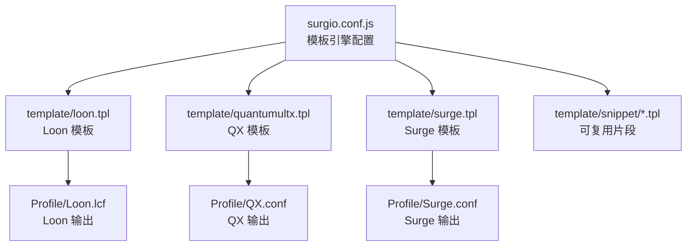
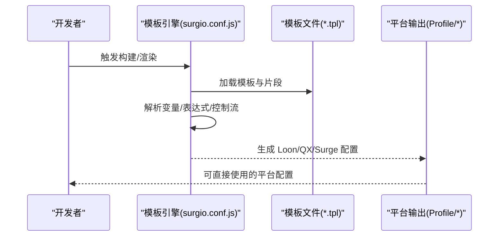
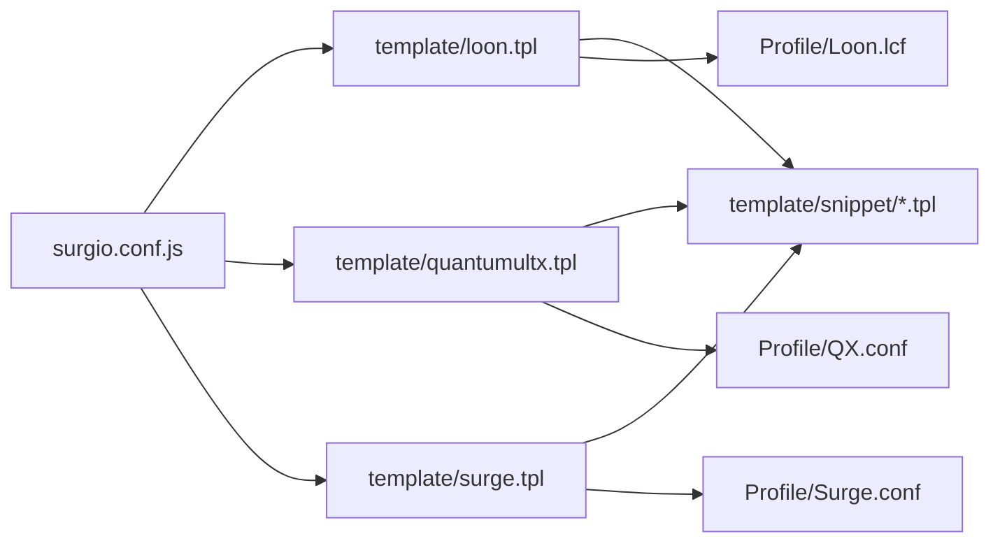

# 模板语法基础

<cite>
**本文引用的文件**   
- [surgio.conf.js](file://surgio.conf.js)
- [template/loon.tpl](file://template/loon.tpl)
- [template/quantumultx.tpl](file://template/quantumultx.tpl)
- [template/surge.tpl](file://template/surge.tpl)
- [template/snippet/ai-services.tpl](file://template/snippet/ai-services.tpl)
- [template/snippet/bank-ad-reject.tpl](file://template/snippet/bank-ad-reject.tpl)
- [template/snippet/developer.tpl](file://template/snippet/developer.tpl)
- [template/snippet/social.tpl](file://template/snippet/social.tpl)
- [template/snippet/streaming.tpl](file://template/snippet/streaming.tpl)
- [Profile/Loon.lcf](file://Profile/Loon.lcf)
- [Profile/QX.conf](file://Profile/QX.conf)
- [Profile/Surge.conf](file://Profile/Surge.conf)
- [README.md](file://README.md)
</cite>

## 目录
1. [简介](#简介)
2. [项目结构](#项目结构)
3. [核心组件](#核心组件)
4. [架构总览](#架构总览)
5. [详细组件分析](#详细组件分析)
6. [依赖关系分析](#依赖关系分析)
7. [性能考虑](#性能考虑)
8. [故障排查指南](#故障排查指南)
9. [结论](#结论)
10. [附录：语法参考与示例](#附录语法参考与示例)

## 简介
本文件面向使用 Surgio 模板引擎的开发者，系统讲解模板变量插值、条件渲染与循环结构的语法与用法，并对比 Loon、Quantumult X、Surge 三大平台的差异与兼容策略。文档同时提供数据类型、运算符与内置函数的完整参考，以及常见用法的代码片段路径，帮助快速掌握模板编写技巧。

## 项目结构
Surgio 模板相关资源主要分布在以下位置：
- 模板定义：template/*.tpl 与 template/snippet/*.tpl
- 平台配置文件：Profile/*.conf / *.lcf（用于生成目标平台配置）
- 构建与配置：surgio.conf.js（模板引擎入口与全局配置）
- 说明文档：README.md（项目背景与使用说明）

图表来源
- [surgio.conf.js](file://surgio.conf.js)
- [template/loon.tpl](file://template/loon.tpl)
- [template/quantumultx.tpl](file://template/quantumultx.tpl)
- [template/surge.tpl](file://template/surge.tpl)
- [Profile/Loon.lcf](file://Profile/Loon.lcf)
- [Profile/QX.conf](file://Profile/QX.conf)
- [Profile/Surge.conf](file://Profile/Surge.conf)

章节来源
- [README.md](file://README.md)
- [surgio.conf.js](file://surgio.conf.js)

## 核心组件
- 模板引擎配置：通过 surgio.conf.js 统一声明模板源、目标平台与变量注入策略，驱动模板编译与输出。
- 模板文件：按平台划分（loon.tpl、quantumultx.tpl、surge.tpl），并在 snippet 中组织可复用片段，便于跨平台复用逻辑。
- 平台输出：Profile 下的 .conf/.lcf 为最终产物，由模板引擎根据模板与变量生成。

章节来源
- [surgio.conf.js](file://surgio.conf.js)
- [template/loon.tpl](file://template/loon.tpl)
- [template/quantumultx.tpl](file://template/quantumultx.tpl)
- [template/surge.tpl](file://template/surge.tpl)
- [Profile/Loon.lcf](file://Profile/Loon.lcf)
- [Profile/QX.conf](file://Profile/QX.conf)
- [Profile/Surge.conf](file://Profile/Surge.conf)

## 架构总览
Surgio 模板引擎的工作流如下：
- 读取模板与片段
- 解析变量与表达式
- 执行条件与循环
- 生成各平台专属配置

图表来源
- [surgio.conf.js](file://surgio.conf.js)
- [template/loon.tpl](file://template/loon.tpl)
- [template/quantumultx.tpl](file://template/quantumultx.tpl)
- [template/surge.tpl](file://template/surge.tpl)
- [Profile/Loon.lcf](file://Profile/Loon.lcf)
- [Profile/QX.conf](file://Profile/QX.conf)
- [Profile/Surge.conf](file://Profile/Surge.conf)

## 详细组件分析

### 模板变量插值
- 作用：在模板中以占位符形式注入运行时变量，实现动态内容生成。
- 典型场景：域名列表、规则集合、脚本路径、开关标志等。
- 建议实践：
  - 将易变数据抽离为变量，避免硬编码。
  - 对空值与默认值进行兜底处理，提升鲁棒性。
  - 在片段中复用变量，减少重复。

章节来源
- [template/loon.tpl](file://template/loon.tpl)
- [template/quantumultx.tpl](file://template/quantumultx.tpl)
- [template/surge.tpl](file://template/surge.tpl)
- [template/snippet/ai-services.tpl](file://template/snippet/ai-services.tpl)
- [template/snippet/bank-ad-reject.tpl](file://template/snippet/bank-ad-reject.tpl)
- [template/snippet/developer.tpl](file://template/snippet/developer.tpl)
- [template/snippet/social.tpl](file://template/snippet/social.tpl)
- [template/snippet/streaming.tpl](file://template/snippet/streaming.tpl)

### 条件渲染逻辑
- 作用：根据变量或表达式决定某段模板是否输出，常用于功能开关、平台差异化。
- 典型场景：
  - 仅当某服务启用时输出对应规则或脚本。
  - 针对 Loon/QX/Surge 的不同语法分支。
- 建议实践：
  - 将平台差异集中在条件块内，保持主模板整洁。
  - 为每个分支提供最小可用集，确保回退路径。

章节来源
- [template/loon.tpl](file://template/loon.tpl)
- [template/quantumultx.tpl](file://template/quantumultx.tpl)
- [template/surge.tpl](file://template/surge.tpl)

### 循环结构
- 作用：遍历集合（如域名数组、规则项）批量生成配置行。
- 典型场景：
  - 批量生成域名匹配规则。
  - 为多个服务注入相同结构的脚本或策略。
- 建议实践：
  - 将集合数据集中管理，便于维护。
  - 在循环内做轻量校验，避免无效输出。

章节来源
- [template/loon.tpl](file://template/loon.tpl)
- [template/quantumultx.tpl](file://template/quantumultx.tpl)
- [template/surge.tpl](file://template/surge.tpl)
- [template/snippet/streaming.tpl](file://template/snippet/streaming.tpl)

### 平台差异与兼容性
- 差异点：
  - 语法关键字与写法不同（例如规则类型、脚本调用方式）。
  - 支持的内置函数与数据结构存在差异。
- 兼容策略：
  - 以模板文件区分平台，或在同一模板中使用条件分支。
  - 通过 snippet 抽象公共逻辑，按需引入。
  - 在 surgio.conf.js 中统一注入变量，保证一致性。

章节来源
- [surgio.conf.js](file://surgio.conf.js)
- [template/loon.tpl](file://template/loon.tpl)
- [template/quantumultx.tpl](file://template/quantumultx.tpl)
- [template/surge.tpl](file://template/surge.tpl)
- [Profile/Loon.lcf](file://Profile/Loon.lcf)
- [Profile/QX.conf](file://Profile/QX.conf)
- [Profile/Surge.conf](file://Profile/Surge.conf)

## 依赖关系分析
- surgio.conf.js 作为中心配置，依赖模板与片段，产出 Profile 下的平台配置。
- 模板之间通过 snippet 共享逻辑，降低耦合度。
- 平台输出文件仅依赖模板渲染结果，不直接依赖源码。

图表来源
- [surgio.conf.js](file://surgio.conf.js)
- [template/loon.tpl](file://template/loon.tpl)
- [template/quantumultx.tpl](file://template/quantumultx.tpl)
- [template/surge.tpl](file://template/surge.tpl)
- [template/snippet/ai-services.tpl](file://template/snippet/ai-services.tpl)
- [template/snippet/bank-ad-reject.tpl](file://template/snippet/bank-ad-reject.tpl)
- [template/snippet/developer.tpl](file://template/snippet/developer.tpl)
- [template/snippet/social.tpl](file://template/snippet/social.tpl)
- [template/snippet/streaming.tpl](file://template/snippet/streaming.tpl)
- [Profile/Loon.lcf](file://Profile/Loon.lcf)
- [Profile/QX.conf](file://Profile/QX.conf)
- [Profile/Surge.conf](file://Profile/Surge.conf)

章节来源
- [surgio.conf.js](file://surgio.conf.js)
- [template/loon.tpl](file://template/loon.tpl)
- [template/quantumultx.tpl](file://template/quantumultx.tpl)
- [template/surge.tpl](file://template/surge.tpl)

## 性能考虑
- 模板渲染阶段：
  - 避免在循环中进行复杂计算，尽量提前准备数据。
  - 合理使用条件分支，减少不必要的输出。
- 输出产物：
  - 合并相近规则，降低配置体积。
  - 按需引入片段，避免冗余。
- 构建流程：
  - 缓存中间结果，缩短二次构建时间。
  - 增量更新，仅重渲染变更部分。

## 故障排查指南
- 常见问题定位：
  - 变量未定义：检查 surgio.conf.js 的变量注入与模板中的引用是否一致。
  - 条件分支未生效：确认布尔值与比较表达式是否符合预期。
  - 循环未输出：检查集合是否为空或迭代键名是否正确。
- 调试建议：
  - 先输出最小可复现模板，逐步增加复杂度。
  - 分别验证各平台输出，定位平台差异问题。
  - 利用片段隔离问题范围，提高定位效率。

章节来源
- [surgio.conf.js](file://surgio.conf.js)
- [template/loon.tpl](file://template/loon.tpl)
- [template/quantumultx.tpl](file://template/quantumultx.tpl)
- [template/surge.tpl](file://template/surge.tpl)

## 结论
Surgio 模板引擎通过统一的配置与模块化模板设计，实现了跨平台（Loon、QX、Surge）的规则与脚本生成。掌握变量插值、条件渲染与循环结构后，可高效构建可维护、可扩展的模板体系。建议在项目中持续沉淀片段与最佳实践，提升团队整体效率。

## 附录：语法参考与示例

### 数据类型
- 字符串：用于域名、路径、标识等文本信息。
- 布尔值：用于开关控制与条件判断。
- 数字：用于端口、优先级、阈值等数值型参数。
- 数组/集合：用于批量条目（如域名列表、规则项）。
- 对象/映射：用于结构化配置（如服务属性、选项键值对）。

章节来源
- [template/loon.tpl](file://template/loon.tpl)
- [template/quantumultx.tpl](file://template/quantumultx.tpl)
- [template/surge.tpl](file://template/surge.tpl)

### 运算符
- 算术运算：加减乘除、取模等。
- 比较运算：等于、不等于、大于、小于等。
- 逻辑运算：与、或、非。
- 字符串操作：拼接、截取、替换等。
- 空值处理：判空、默认值、可选链等。

章节来源
- [template/loon.tpl](file://template/loon.tpl)
- [template/quantumultx.tpl](file://template/quantumultx.tpl)
- [template/surge.tpl](file://template/surge.tpl)

### 内置函数
- 字符串函数：大小写转换、去空格、格式化等。
- 集合函数：过滤、映射、聚合、去重等。
- 工具函数：日期时间、随机数、哈希等。
- 平台适配函数：针对不同平台的关键字转换与兼容性封装。

章节来源
- [template/loon.tpl](file://template/loon.tpl)
- [template/quantumultx.tpl](file://template/quantumultx.tpl)
- [template/surge.tpl](file://template/surge.tpl)

### 常见用法模式与示例路径
- 变量插值
  - 示例片段：[template/snippet/ai-services.tpl](file://template/snippet/ai-services.tpl)
  - 示例片段：[template/snippet/bank-ad-reject.tpl](file://template/snippet/bank-ad-reject.tpl)
- 条件渲染
  - 示例片段：[template/snippet/developer.tpl](file://template/snippet/developer.tpl)
  - 示例片段：[template/snippet/social.tpl](file://template/snippet/social.tpl)
- 循环结构
  - 示例片段：[template/snippet/streaming.tpl](file://template/snippet/streaming.tpl)
- 平台差异处理
  - Loon 模板：[template/loon.tpl](file://template/loon.tpl)
  - QX 模板：[template/quantumultx.tpl](file://template/quantumultx.tpl)
  - Surge 模板：[template/surge.tpl](file://template/surge.tpl)

章节来源
- [template/snippet/ai-services.tpl](file://template/snippet/ai-services.tpl)
- [template/snippet/bank-ad-reject.tpl](file://template/snippet/bank-ad-reject.tpl)
- [template/snippet/developer.tpl](file://template/snippet/developer.tpl)
- [template/snippet/social.tpl](file://template/snippet/social.tpl)
- [template/snippet/streaming.tpl](file://template/snippet/streaming.tpl)
- [template/loon.tpl](file://template/loon.tpl)
- [template/quantumultx.tpl](file://template/quantumultx.tpl)
- [template/surge.tpl](file://template/surge.tpl)