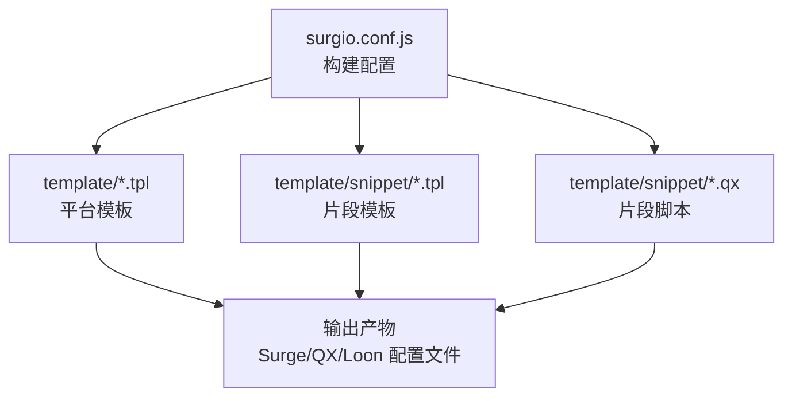
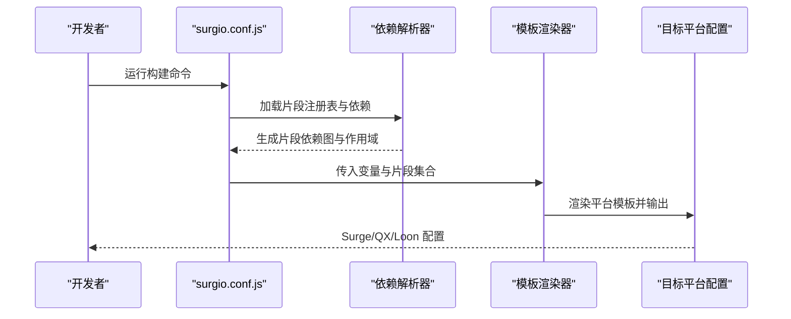
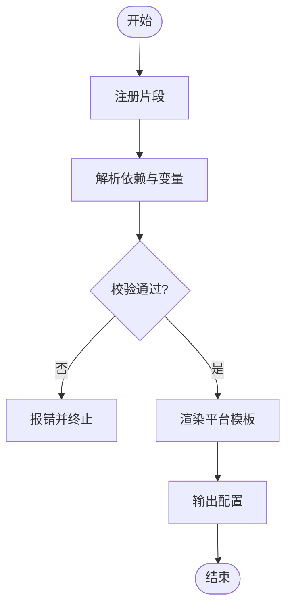
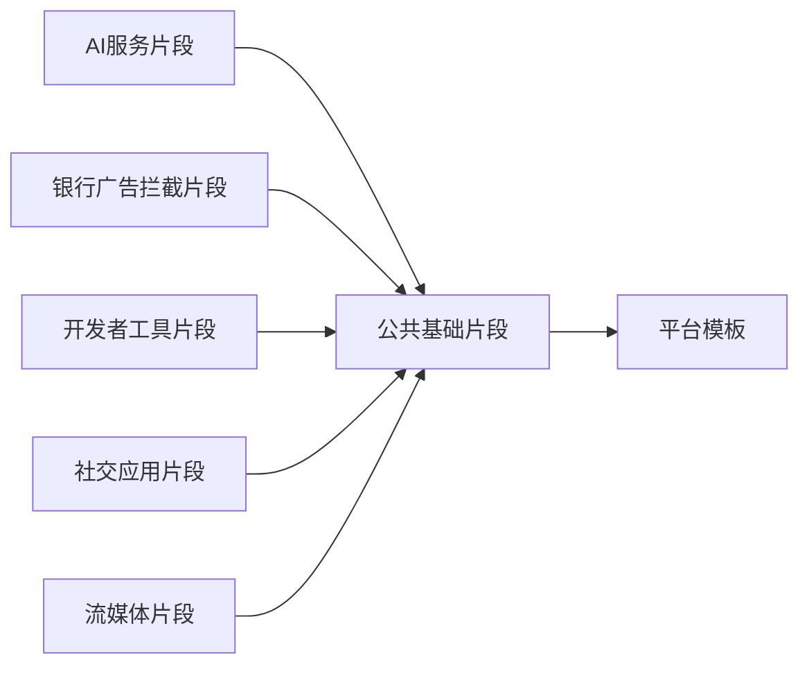

# 片段系统

<cite>
**本文引用的文件**   
- [surgio.conf.js](file://surgio.conf.js)
- [template/snippet/ai-services.tpl](file://template/snippet/ai-services.tpl)
- [template/snippet/bank-ad-reject.tpl](file://template/snippet/bank-ad-reject.tpl)
- [template/snippet/developer.tpl](file://template/snippet/developer.tpl)
- [template/snippet/social.tpl](file://template/snippet/social.tpl)
- [template/snippet/streaming.tpl](file://template/snippet/streaming.tpl)
- [template/snippet/ai-services.qx](file://template/snippet/ai-services.qx)
- [template/snippet/bank-ad-reject.qx](file://template/snippet/bank-ad-reject.qx)
- [template/snippet/developer.qx](file://template/snippet/developer.qx)
- [template/snippet/social.qx](file://template/snippet/social.qx)
- [template/snippet/streaming.qx](file://template/snippet/streaming.qx)
- [template/surge.tpl](file://template/surge.tpl)
- [template/quantumultx.tpl](file://template/quantumultx.tpl)
- [template/loon.tpl](file://template/loon.tpl)
- [README.md](file://README.md)
</cite>

## 目录
1. [简介](#简介)
2. [项目结构](#项目结构)
3. [核心组件](#核心组件)
4. [架构总览](#架构总览)
5. [详细组件分析](#详细组件分析)
6. [依赖分析](#依赖分析)
7. [性能考虑](#性能考虑)
8. [故障排查指南](#故障排查指南)
9. [结论](#结论)
10. [附录：API参考与示例](#附录api参考与示例)

## 简介
本技术文档面向Surgio模板“片段系统”，聚焦于片段的定义、导入与使用方式，深入解释片段的生命周期管理、作用域规则与依赖解析机制。同时覆盖不同类型片段（AI服务、银行广告拦截、开发者工具、社交应用、流媒体）的特性与使用场景，并提供开发最佳实践、完整的API参考与实际开发示例，帮助读者快速上手并高效维护片段生态。

## 项目结构
仓库采用按功能与目标平台分层组织的方式：
- template/snippet：片段模板与对应引擎脚本（.tpl为模板，.qx为Quantumult X脚本片段）
- template：各目标平台（Surge、Quantumult X、Loon）的顶层模板
- surgio.conf.js：Surgio构建配置入口，负责片段注册、依赖解析与输出编排
- README.md：项目说明与使用说明

图表来源
- [surgio.conf.js](file://surgio.conf.js)
- [template/surge.tpl](file://template/surge.tpl)
- [template/quantumultx.tpl](file://template/quantumultx.tpl)
- [template/loon.tpl](file://template/loon.tpl)
- [template/snippet/ai-services.tpl](file://template/snippet/ai-services.tpl)
- [template/snippet/bank-ad-reject.tpl](file://template/snippet/bank-ad-reject.tpl)
- [template/snippet/developer.tpl](file://template/snippet/developer.tpl)
- [template/snippet/social.tpl](file://template/snippet/social.tpl)
- [template/snippet/streaming.tpl](file://template/snippet/streaming.tpl)

章节来源
- [README.md](file://README.md)
- [surgio.conf.js](file://surgio.conf.js)

## 核心组件
- 片段模板（.tpl）：声明式描述片段元数据、变量、条件与包含关系，是片段的核心定义载体
- 片段脚本（.qx）：针对Quantumult X的运行时逻辑，供片段在QX引擎中执行
- 平台模板（*.tpl）：Surge、Quantumult X、Loon的目标模板，负责将片段组装为最终配置
- 构建配置（surgio.conf.js）：集中管理片段注册、依赖图、变量注入与输出策略

章节来源
- [template/snippet/ai-services.tpl](file://template/snippet/ai-services.tpl)
- [template/snippet/bank-ad-reject.tpl](file://template/snippet/bank-ad-reject.tpl)
- [template/snippet/developer.tpl](file://template/snippet/developer.tpl)
- [template/snippet/social.tpl](file://template/snippet/social.tpl)
- [template/snippet/streaming.tpl](file://template/snippet/streaming.tpl)
- [template/snippet/ai-services.qx](file://template/snippet/ai-services.qx)
- [template/snippet/bank-ad-reject.qx](file://template/snippet/bank-ad-reject.qx)
- [template/snippet/developer.qx](file://template/snippet/developer.qx)
- [template/snippet/social.qx](file://template/snippet/social.qx)
- [template/snippet/streaming.qx](file://template/snippet/streaming.qx)
- [template/surge.tpl](file://template/surge.tpl)
- [template/quantumultx.tpl](file://template/quantumultx.tpl)
- [template/loon.tpl](file://template/loon.tpl)
- [surgio.conf.js](file://surgio.conf.js)

## 架构总览
片段系统以“声明式模板 + 构建期依赖解析 + 多平台模板渲染”为核心流程。构建时读取surgio.conf.js中的片段注册表，解析依赖图，合并变量与作用域，再根据目标平台模板生成最终配置。

图表来源
- [surgio.conf.js](file://surgio.conf.js)
- [template/surge.tpl](file://template/surge.tpl)
- [template/quantumultx.tpl](file://template/quantumultx.tpl)
- [template/loon.tpl](file://template/loon.tpl)

## 详细组件分析

### 片段模板（.tpl）
- 职责：声明片段名称、版本、作者、描述、变量、条件开关、与其他片段的依赖关系，以及可被平台模板引用的内容块
- 典型字段：
  - 元信息：名称、版本、作者、描述
  - 变量：布尔开关、字符串值、数组等
  - 依赖：其他片段ID或模块名
  - 条件：基于变量或环境决定是否启用
  - 内容块：供平台模板include的命名区域
- 生命周期阶段：
  - 注册阶段：构建启动时被surgio.conf.js扫描并注册
  - 解析阶段：根据依赖图进行拓扑排序与冲突检测
  - 渲染阶段：平台模板按需引入片段内容块
  - 输出阶段：生成目标平台配置

图表来源
- [template/snippet/ai-services.tpl](file://template/snippet/ai-services.tpl)
- [template/snippet/bank-ad-reject.tpl](file://template/snippet/bank-ad-reject.tpl)
- [template/snippet/developer.tpl](file://template/snippet/developer.tpl)
- [template/snippet/social.tpl](file://template/snippet/social.tpl)
- [template/snippet/streaming.tpl](file://template/snippet/streaming.tpl)
- [surgio.conf.js](file://surgio.conf.js)

章节来源
- [template/snippet/ai-services.tpl](file://template/snippet/ai-services.tpl)
- [template/snippet/bank-ad-reject.tpl](file://template/snippet/bank-ad-reject.tpl)
- [template/snippet/developer.tpl](file://template/snippet/developer.tpl)
- [template/snippet/social.tpl](file://template/snippet/social.tpl)
- [template/snippet/streaming.tpl](file://template/snippet/streaming.tpl)

### 片段脚本（.qx）
- 职责：提供Quantumult X运行时所需的JS逻辑，如请求拦截、响应改写、本地缓存、调试日志等
- 特点：
  - 与片段模板解耦，通过变量控制行为
  - 支持模块化组织，避免重复代码
  - 可通过环境变量或注入参数实现差异化行为
- 使用方式：
  - 在QX配置中引用脚本路径
  - 由片段模板在渲染时注入脚本路径与参数

章节来源
- [template/snippet/ai-services.qx](file://template/snippet/ai-services.qx)
- [template/snippet/bank-ad-reject.qx](file://template/snippet/bank-ad-reject.qx)
- [template/snippet/developer.qx](file://template/snippet/developer.qx)
- [template/snippet/social.qx](file://template/snippet/social.qx)
- [template/snippet/streaming.qx](file://template/snippet/streaming.qx)

### 平台模板（Surge / Quantumult X / Loon）
- 职责：将片段内容块与平台特定语法结合，生成可直接运行的配置文件
- 关键点：
  - 不同平台的语法差异通过模板抽象处理
  - 片段变量在渲染时替换为具体值
  - 支持条件编译，仅包含启用的片段

章节来源
- [template/surge.tpl](file://template/surge.tpl)
- [template/quantumultx.tpl](file://template/quantumultx.tpl)
- [template/loon.tpl](file://template/loon.tpl)

### 构建配置（surgio.conf.js）
- 职责：集中管理片段注册、依赖解析、变量注入、输出策略
- 关键能力：
  - 片段注册表：定义所有可用片段及其属性
  - 依赖解析：构建片段依赖图，解决循环依赖与冲突
  - 变量注入：将用户配置与环境变量注入到片段作用域
  - 输出编排：根据目标平台选择对应模板并渲染

章节来源
- [surgio.conf.js](file://surgio.conf.js)

## 依赖分析
片段之间的依赖关系由构建配置统一管理，确保：
- 无环依赖：构建期检测并报错
- 最小化包含：仅包含必要片段
- 变量隔离：每个片段拥有独立作用域，避免污染

图表来源
- [surgio.conf.js](file://surgio.conf.js)
- [template/snippet/ai-services.tpl](file://template/snippet/ai-services.tpl)
- [template/snippet/bank-ad-reject.tpl](file://template/snippet/bank-ad-reject.tpl)
- [template/snippet/developer.tpl](file://template/snippet/developer.tpl)
- [template/snippet/social.tpl](file://template/snippet/social.tpl)
- [template/snippet/streaming.tpl](file://template/snippet/streaming.tpl)

章节来源
- [surgio.conf.js](file://surgio.conf.js)

## 性能考虑
- 片段粒度：保持片段小而专一，减少不必要的依赖
- 变量预计算：在构建期完成常量计算，避免运行时开销
- 条件编译：仅包含启用的片段，减小最终配置体积
- 脚本优化：对.qx脚本进行去重、懒加载与缓存策略

## 故障排查指南
- 依赖冲突：检查片段依赖是否形成环路或版本不兼容
- 变量未定义：确认变量是否在构建配置中正确注入
- 平台语法错误：核对目标平台模板语法与片段内容块匹配
- 脚本执行失败：检查.qx脚本路径与权限，查看运行时日志

## 结论
Surgio片段系统通过声明式模板与构建期依赖解析，实现了高内聚、低耦合的模块化配置管理。开发者可专注于业务逻辑，无需关心平台差异与依赖冲突。遵循本文的最佳实践，可显著提升开发效率与配置稳定性。

## 附录：API参考与示例

### 片段模板API
- 元信息字段：名称、版本、作者、描述
- 变量定义：类型包括布尔、字符串、数组，支持默认值与验证规则
- 依赖声明：通过ID引用其他片段，支持条件依赖
- 内容块：命名区域，供平台模板include
- 条件开关：基于变量或环境动态启用/禁用

章节来源
- [template/snippet/ai-services.tpl](file://template/snippet/ai-services.tpl)
- [template/snippet/bank-ad-reject.tpl](file://template/snippet/bank-ad-reject.tpl)
- [template/snippet/developer.tpl](file://template/snippet/developer.tpl)
- [template/snippet/social.tpl](file://template/snippet/social.tpl)
- [template/snippet/streaming.tpl](file://template/snippet/streaming.tpl)

### 构建配置API
- 片段注册：定义片段ID、路径、元数据
- 依赖解析：配置依赖图与解析策略
- 变量注入：定义全局变量与片段级变量
- 输出策略：指定目标平台与模板路径

章节来源
- [surgio.conf.js](file://surgio.conf.js)

### 平台模板API
- include指令：引入片段内容块
- 变量替换：在模板中使用变量占位符
- 条件编译：根据变量决定是否包含片段

章节来源
- [template/surge.tpl](file://template/surge.tpl)
- [template/quantumultx.tpl](file://template/quantumultx.tpl)
- [template/loon.tpl](file://template/loon.tpl)

### 实际开发示例
- AI服务片段：用于接入大模型API，支持鉴权、重试与缓存
- 银行广告拦截片段：屏蔽金融类应用的广告与遥测
- 开发者工具片段：提供调试、日志与网络抓包功能
- 社交应用片段：优化社交媒体体验，去除推荐与追踪
- 流媒体片段：提升视频播放体验，去广告与加速

章节来源
- [template/snippet/ai-services.tpl](file://template/snippet/ai-services.tpl)
- [template/snippet/bank-ad-reject.tpl](file://template/snippet/bank-ad-reject.tpl)
- [template/snippet/developer.tpl](file://template/snippet/developer.tpl)
- [template/snippet/social.tpl](file://template/snippet/social.tpl)
- [template/snippet/streaming.tpl](file://template/snippet/streaming.tpl)