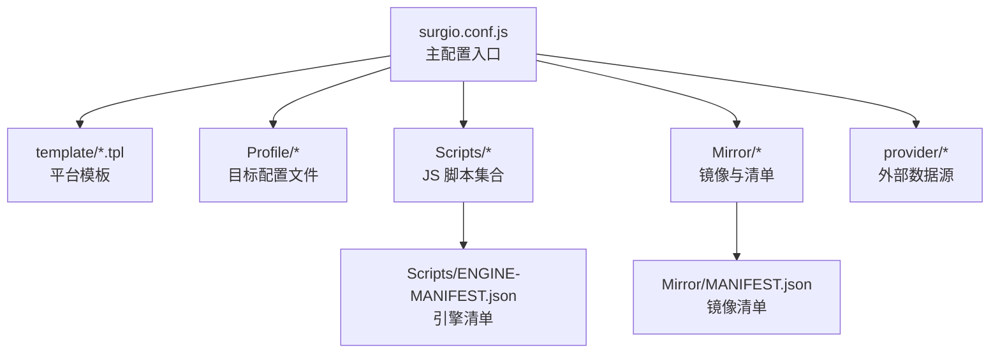
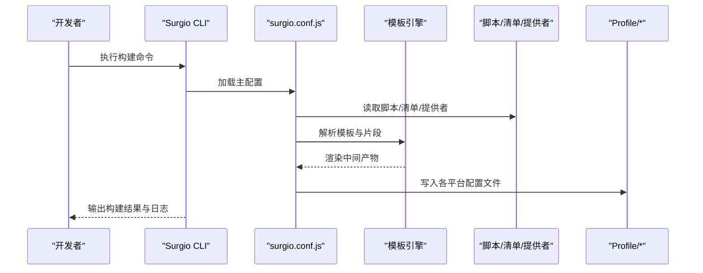
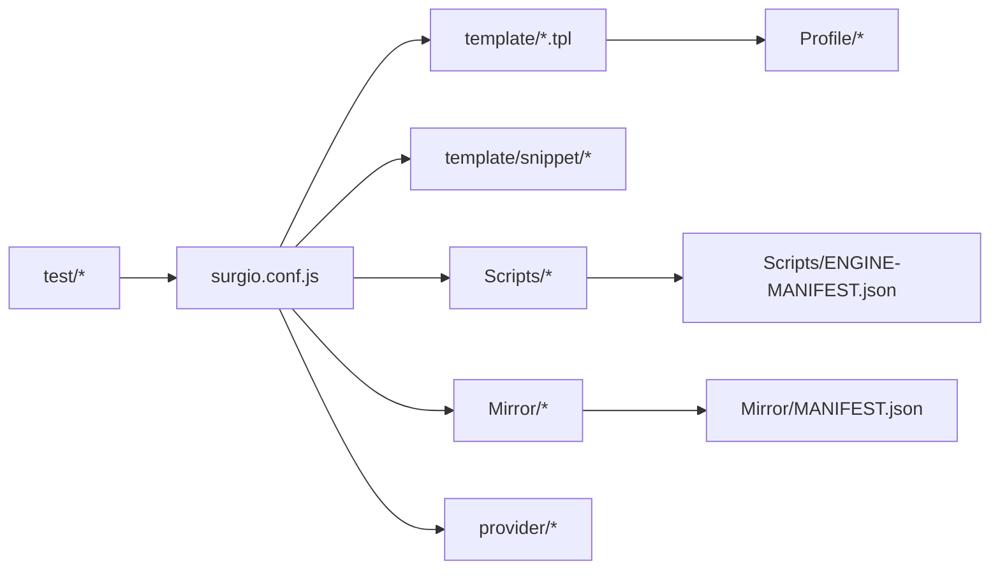

# 配置生成流程

<cite>
**本文引用的文件**   
- [surgio.conf.js](file://surgio.conf.js)
- [package.json](file://package.json)
- [README.md](file://README.md)
- [template/quantumultx.tpl](file://template/quantumultx.tpl)
- [template/surge.tpl](file://template/surge.tpl)
- [template/loon.tpl](file://template/loon.tpl)
- [Profile/QX.conf](file://Profile/QX.conf)
- [Profile/Surge.conf](file://Profile/Surge.conf)
- [Profile/Loon.lcf](file://Profile/Loon.lcf)
- [Mirror/MANIFEST.json](file://Mirror/MANIFEST.json)
- [Scripts/ENGINE-MANIFEST.json](file://Scripts/ENGINE-MANIFEST.json)
- [provider/tokyo.js](file://provider/tokyo.js)
- [test/run-tests.js](file://test/run-tests.js)
- [test/harness.js](file://test/harness.js)
</cite>

## 目录
1. [简介](#简介)
2. [项目结构](#项目结构)
3. [核心组件](#核心组件)
4. [架构总览](#架构总览)
5. [详细组件分析](#详细组件分析)
6. [依赖关系分析](#依赖关系分析)
7. [性能考虑](#性能考虑)
8. [故障排除指南](#故障排除指南)
9. [结论](#结论)
10. [附录](#附录)

## 简介
本技术文档围绕 Surgio 的配置生成流程，系统阐述从 JavaScript 配置到最终多平台配置文件（Quantumult X、Surge、Loon）的完整流水线。内容涵盖：
- 配置验证与转换优化
- 多平台输出机制与格式适配
- 缓存策略与增量更新
- 高级用法：动态内容生成与条件编译
- 故障排除与性能调优建议

目标是帮助开发者快速理解并高效使用 Surgio，构建稳定高效的规则与脚本分发体系。

## 项目结构
仓库采用“配置即代码”的组织方式，核心由以下部分组成：
- 顶层配置入口：surgio.conf.js
- 模板与片段：template/* 与 template/snippet/*
- 目标产物：Profile/*（QX.conf、Surge.conf、Loon.lcf）
- 脚本与引擎清单：Scripts/* 与 Scripts/ENGINE-MANIFEST.json
- 镜像与资源清单：Mirror/* 与 Mirror/MANIFEST.json
- 提供者：provider/*（如 tokyo.js）
- 测试与运行：test/*

图表来源
- [surgio.conf.js](file://surgio.conf.js)
- [template/quantumultx.tpl](file://template/quantumultx.tpl)
- [template/surge.tpl](file://template/surge.tpl)
- [template/loon.tpl](file://template/loon.tpl)
- [Profile/QX.conf](file://Profile/QX.conf)
- [Profile/Surge.conf](file://Profile/Surge.conf)
- [Profile/Loon.lcf](file://Profile/Loon.lcf)
- [Scripts/ENGINE-MANIFEST.json](file://Scripts/ENGINE-MANIFEST.json)
- [Mirror/MANIFEST.json](file://Mirror/MANIFEST.json)
- [provider/tokyo.js](file://provider/tokyo.js)

章节来源
- [README.md](file://README.md)
- [package.json](file://package.json)

## 核心组件
- 配置入口与任务编排：surgio.conf.js 定义输入、模板、输出、插件与钩子，驱动整个生成流程。
- 模板系统：template/*.tpl 为各平台提供差异化渲染模板；snippet/* 提供可复用片段。
- 目标产物：Profile/* 为最终生成的配置文件，分别对应 QX、Surge、Loon。
- 脚本与引擎清单：Scripts/* 包含业务脚本，ENGINE-MANIFEST.json 描述引擎可用能力与版本。
- 镜像与资源清单：Mirror/* 提供镜像资源与 MANIFEST.json 用于校验与分发。
- 提供者：provider/* 负责拉取或计算外部数据（如地理位置、上游列表）。
- 测试与运行：test/* 提供用例与运行器，保障生成质量与回归稳定性。

章节来源
- [surgio.conf.js](file://surgio.conf.js)
- [template/quantumultx.tpl](file://template/quantumultx.tpl)
- [template/surge.tpl](file://template/surge.tpl)
- [template/loon.tpl](file://template/loon.tpl)
- [Profile/QX.conf](file://Profile/QX.conf)
- [Profile/Surge.conf](file://Profile/Surge.conf)
- [Profile/Loon.lcf](file://Profile/Loon.lcf)
- [Scripts/ENGINE-MANIFEST.json](file://Scripts/ENGINE-MANIFEST.json)
- [Mirror/MANIFEST.json](file://Mirror/MANIFEST.json)
- [provider/tokyo.js](file://provider/tokyo.js)
- [test/run-tests.js](file://test/run-tests.js)
- [test/harness.js](file://test/harness.js)

## 架构总览
Surgio 的生成管线遵循“配置驱动 + 模板渲染 + 多目标输出”的模式。整体流程如下：

图表来源
- [surgio.conf.js](file://surgio.conf.js)
- [template/quantumultx.tpl](file://template/quantumultx.tpl)
- [template/surge.tpl](file://template/surge.tpl)
- [template/loon.tpl](file://template/loon.tpl)
- [Profile/QX.conf](file://Profile/QX.conf)
- [Profile/Surge.conf](file://Profile/Surge.conf)
- [Profile/Loon.lcf](file://Profile/Loon.lcf)
- [Scripts/ENGINE-MANIFEST.json](file://Scripts/ENGINE-MANIFEST.json)
- [Mirror/MANIFEST.json](file://Mirror/MANIFEST.json)
- [provider/tokyo.js](file://provider/tokyo.js)

## 详细组件分析

### 配置入口与任务编排（surgio.conf.js）
- 职责：定义输入源（脚本、规则、清单）、模板映射、输出路径、平台差异、插件与钩子函数。
- 关键点：
  - 输入聚合：合并 Scripts、Mirror、Provider 等模块，形成统一上下文。
  - 模板绑定：将不同平台模板与上下文数据关联，支持条件渲染。
  - 输出控制：按平台生成 Profile/*，并处理格式差异与兼容性。
  - 扩展点：通过钩子实现自定义验证、转换、优化逻辑。

章节来源
- [surgio.conf.js](file://surgio.conf.js)

### 模板系统与片段（template/*.tpl 与 snippet/*）
- 职责：为 QX、Surge、Loon 提供差异化渲染模板，snippet/* 提供可复用片段。
- 关键点：
  - 平台差异：不同平台的语法与字段映射在模板中处理。
  - 片段复用：通过片段减少重复，提高一致性。
  - 条件编译：基于上下文开关控制规则与脚本的包含与否。

章节来源
- [template/quantumultx.tpl](file://template/quantumultx.tpl)
- [template/surge.tpl](file://template/surge.tpl)
- [template/loon.tpl](file://template/loon.tpl)
- [template/snippet](file://template/snippet)

### 目标产物（Profile/*）
- 职责：生成最终可被客户端直接使用的配置文件。
- 关键点：
  - QX.conf：适配 Quantumult X 的规则与脚本引用。
  - Surge.conf：适配 Surge 的分组与策略组。
  - Loon.lcf：适配 Loon 的配置结构与插件声明。

章节来源
- [Profile/QX.conf](file://Profile/QX.conf)
- [Profile/Surge.conf](file://Profile/Surge.conf)
- [Profile/Loon.lcf](file://Profile/Loon.lcf)

### 脚本与引擎清单（Scripts/* 与 ENGINE-MANIFEST.json）
- 职责：管理业务脚本与引擎能力声明。
- 关键点：
  - 脚本组织：按功能域拆分，便于维护与按需引入。
  - 引擎清单：声明引擎版本与特性，确保兼容性与降级策略。

章节来源
- [Scripts/ENGINE-MANIFEST.json](file://Scripts/ENGINE-MANIFEST.json)

### 镜像与资源清单（Mirror/* 与 MANIFEST.json）
- 职责：提供镜像资源与完整性校验清单。
- 关键点：
  - 镜像分发：集中管理第三方资源，提升下载稳定性。
  - 清单校验：通过 MANIFEST.json 进行完整性与版本校验。

章节来源
- [Mirror/MANIFEST.json](file://Mirror/MANIFEST.json)

### 提供者（provider/*）
- 职责：拉取或计算外部数据，注入到生成上下文。
- 关键点：
  - 数据源抽象：统一接口获取地理位置、上游列表等。
  - 缓存与重试：对外部请求进行缓存与失败重试。

章节来源
- [provider/tokyo.js](file://provider/tokyo.js)

### 测试与运行（test/*）
- 职责：保障生成流程的正确性与稳定性。
- 关键点：
  - 用例覆盖：针对关键路径编写单元测试与集成测试。
  - 运行器：统一执行测试与报告结果。

章节来源
- [test/run-tests.js](file://test/run-tests.js)
- [test/harness.js](file://test/harness.js)

## 依赖关系分析
Surgio 的依赖关系清晰分层：配置入口依赖模板、脚本、清单与提供者；模板依赖片段；输出依赖平台适配；测试依赖运行器与夹具。

图表来源
- [surgio.conf.js](file://surgio.conf.js)
- [template/quantumultx.tpl](file://template/quantumultx.tpl)
- [template/surge.tpl](file://template/surge.tpl)
- [template/loon.tpl](file://template/loon.tpl)
- [Profile/QX.conf](file://Profile/QX.conf)
- [Profile/Surge.conf](file://Profile/Surge.conf)
- [Profile/Loon.lcf](file://Profile/Loon.lcf)
- [Scripts/ENGINE-MANIFEST.json](file://Scripts/ENGINE-MANIFEST.json)
- [Mirror/MANIFEST.json](file://Mirror/MANIFEST.json)
- [provider/tokyo.js](file://provider/tokyo.js)
- [test/run-tests.js](file://test/run-tests.js)
- [test/harness.js](file://test/harness.js)

章节来源
- [package.json](file://package.json)

## 性能考虑
- 增量构建：仅对变更的脚本、模板与清单进行重新渲染，避免全量重建。
- 并行处理：对独立的数据源拉取与模板渲染进行并行化。
- 缓存策略：对外部请求与中间产物进行缓存，减少重复工作。
- 模板优化：减少条件分支与复杂表达式，提升渲染速度。
- 产物压缩：对输出文件进行必要的压缩与去重。

[本节为通用指导，不直接分析具体文件]

## 故障排除指南
- 构建失败：检查 surgio.conf.js 的路径与依赖是否正确；确认模板语法与片段引用无误。
- 平台兼容问题：核对 Profile/* 的平台特定字段与版本要求；必要时调整模板映射。
- 外部数据异常：检查 provider/* 的网络访问与重试逻辑；确认 MANIFEST.json 的完整性。
- 测试失败：定位 test/* 的用例与断言；使用运行器查看详细日志。

章节来源
- [surgio.conf.js](file://surgio.conf.js)
- [template/quantumultx.tpl](file://template/quantumultx.tpl)
- [template/surge.tpl](file://template/surge.tpl)
- [template/loon.tpl](file://template/loon.tpl)
- [Profile/QX.conf](file://Profile/QX.conf)
- [Profile/Surge.conf](file://Profile/Surge.conf)
- [Profile/Loon.lcf](file://Profile/Loon.lcf)
- [Mirror/MANIFEST.json](file://Mirror/MANIFEST.json)
- [provider/tokyo.js](file://provider/tokyo.js)
- [test/run-tests.js](file://test/run-tests.js)
- [test/harness.js](file://test/harness.js)

## 结论
Surgio 通过“配置驱动 + 模板渲染 + 多目标输出”的架构，实现了从 JavaScript 配置到多平台配置文件的自动化生成。其清晰的模块化设计、可扩展的模板系统与完善的测试保障，使得配置生成流程既灵活又可靠。结合缓存与增量构建，可在保证正确性的同时显著提升构建效率。

[本节为总结性内容，不直接分析具体文件]

## 附录
- 安装与运行：参考 package.json 中的脚本命令与 README.md 的使用说明。
- 高级用法：通过 surgio.conf.js 的钩子与插件机制实现动态内容生成与条件编译。
- 最佳实践：保持模板简洁、合理拆分片段、完善测试覆盖。

章节来源
- [package.json](file://package.json)
- [README.md](file://README.md)
- [surgio.conf.js](file://surgio.conf.js)