# 优化与安全文档

<cite>
**本文引用的文件**   
- [README.md](file://README.md)
- [package.json](file://package.json)
- [surgio.conf.js](file://surgio.conf.js)
- [deploy-all-v8.sh](file://deploy-all-v8.sh)
- [eslint.config.mjs](file://eslint.config.mjs)
- [Scripts/ENGINE-MANIFEST.json](file://Scripts/ENGINE-MANIFEST.json)
- [Scripts/script-engine-v4.js](file://Scripts/script-engine-v4.js)
- [Scripts/mitm-cert-manager-v3.js](file://Scripts/mitm-cert-manager-v3.js)
- [Scripts/mitm-secure-traffic-v3.js](file://Scripts/mitm-secure-traffic-v3.js)
- [Scripts/optimize-configuration-v8.js](file://Scripts/optimize-configuration-v8.js)
- [Scripts/performance-validator-v8.js](file://Scripts/performance-validator-v8.js)
- [Scripts/dns-perf-test-v2.js](file://Scripts/dns-perf-test-v2.js)
- [Scripts/perf-monitor-suite-v3.js](file://Scripts/perf-monitor-suite-v3.js)
- [Scripts/cleanup.sh](file://Scripts/cleanup.sh)
- [Scripts/complete-cleanup.sh](file://Scripts/complete-cleanup.sh)
- [Mirror/MANIFEST.json](file://Mirror/MANIFEST.json)
- [Profile/Loon.lcf](file://Profile/Loon.lcf)
- [Profile/QX.conf](file://Profile/QX.conf)
- [template/loon-optimized-v8.tpl](file://template/loon-optimized-v8.tpl)
- [template/quantumultx.tpl](file://template/quantumultx.tpl)
- [template/surge.tpl](file://template/surge.tpl)
- [ad-filter-v8.7/experiments/model-quantization-int8.js](file://ad-filter-v8.7/experiments/model-quantization-int8.js)
- [ml-monitoring-v8.7/dashboard.js](file://ml-monitoring-v8.7/dashboard.js)
- [provider/tokyo-enhanced.js](file://provider/tokyo-enhanced.js)
- [provider/tokyo.js](file://provider/tokyo.js)
- [test/harness.js](file://test/harness.js)
- [test/run-tests.js](file://test/run-tests.js)
- [test/cases/purify-scripts.test.js](file://test/cases/purify-scripts.test.js)
- [doc/COMPLETE-OPTIMIZATION-SUMMARY-v8.x.md](file://doc/COMPLETE-OPTIMIZATION-SUMMARY-v8.x.md)
- [doc/GOAL_ACHIEVEREMENT_REPORT.md](file://doc/GOAL_ACHIEVEREMENT_REPORT.md)
- [doc/Implementation_Verification_Checklist.md](file://doc/Implementation_Verification_Checklist.md)
- [doc/Loon_Best_Practices_Complete_Guide.md](file://doc/Loon_Best_Practices_Complete_Guide.md)
- [doc/ecosystem-evaluation.md](file://doc/ecosystem-evaluation.md)
- [doc/infrastructure.md](file://doc/infrastructure.md)
- [doc/surgio-migration.md](file://doc/surgio-migration.md)
</cite>

## 目录
1. [简介](#简介)
2. [项目结构](#项目结构)
3. [核心组件](#核心组件)
4. [架构总览](#架构总览)
5. [详细组件分析](#详细组件分析)
6. [依赖关系分析](#依赖关系分析)
7. [性能考量](#性能考量)
8. [故障排查指南](#故障排查指南)
9. [结论](#结论)
10. [附录](#附录)

## 简介
本仓库围绕“配置优化与安全”主题，提供面向 Loon、Quantumult X、Surge 等代理与规则引擎的脚本、模板、镜像清单与部署工具。其目标包括：
- 通过脚本与模板实现配置自动化生成与校验
- 构建 MITM 证书管理与安全流量处理流程
- 提供 DNS 与广告过滤的性能测试与监控套件
- 以工程化手段（ESLint、测试、CI）保障质量与可维护性

## 项目结构
仓库采用按功能域划分的目录组织方式：
- Scripts：脚本引擎、MITM 安全、性能测试与清理工具
- Profile：各客户端配置文件入口
- template：多客户端模板与片段
- Mirror：镜像清单与资源解析脚本
- provider：上游 Provider 脚本
- ad-filter-v8.7 / ml-monitoring-v8.7：广告过滤实验与 ML 监控
- test：测试框架与用例
- doc：优化总结、迁移指南与最佳实践
- .github/workflows：CI/CD 流水线

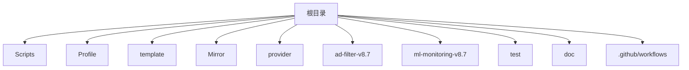

**图表来源** 
- [README.md](file://README.md)
- [package.json](file://package.json)

**章节来源**
- [README.md](file://README.md)
- [package.json](file://package.json)

## 核心组件
- 脚本引擎与运行时
  - 脚本引擎 v4：统一加载与执行脚本，提供能力抽象与生命周期管理
  - 引擎清单：声明可用脚本与版本信息，便于分发与校验
- MITM 安全
  - 证书管理器：安装、更新与校验本地信任证书
  - 安全流量：对 HTTPS 流量进行拦截与策略控制
- 配置优化
  - 配置优化器：合并、去重、排序与校验模板输出
  - 性能验证器：基于指标阈值与回归检测保证稳定性
- 性能与监控
  - DNS 性能测试套件：并发解析、延迟与丢包统计
  - 性能监控套件：采集关键指标并上报
- 清理与维护
  - 清理脚本：临时文件、缓存与日志清理
- 模板与镜像
  - 多客户端模板：Loon、Quantumult X、Surge 模板与片段
  - 镜像清单：资源映射与校验

**章节来源**
- [Scripts/script-engine-v4.js](file://Scripts/script-engine-v4.js)
- [Scripts/ENGINE-MANIFEST.json](file://Scripts/ENGINE-MANIFEST.json)
- [Scripts/mitm-cert-manager-v3.js](file://Scripts/mitm-cert-manager-v3.js)
- [Scripts/mitm-secure-traffic-v3.js](file://Scripts/mitm-secure-traffic-v3.js)
- [Scripts/optimize-configuration-v8.js](file://Scripts/optimize-configuration-v8.js)
- [Scripts/performance-validator-v8.js](file://Scripts/performance-validator-v8.js)
- [Scripts/dns-perf-test-v2.js](file://Scripts/dns-perf-test-v2.js)
- [Scripts/perf-monitor-suite-v3.js](file://Scripts/perf-monitor-suite-v3.js)
- [Scripts/cleanup.sh](file://Scripts/cleanup.sh)
- [Scripts/complete-cleanup.sh](file://Scripts/complete-cleanup.sh)
- [Mirror/MANIFEST.json](file://Mirror/MANIFEST.json)
- [template/loon-optimized-v8.tpl](file://template/loon-optimized-v8.tpl)
- [template/quantumultx.tpl](file://template/quantumultx.tpl)
- [template/surge.tpl](file://template/surge.tpl)

## 架构总览
系统由“脚本引擎 + 安全模块 + 配置生成 + 性能监控 + 模板与镜像”构成，运行于代理客户端环境并通过 CI 进行持续集成与发布。

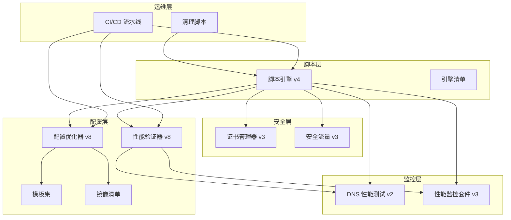

**图表来源** 
- [Scripts/script-engine-v4.js](file://Scripts/script-engine-v4.js)
- [Scripts/mitm-cert-manager-v3.js](file://Scripts/mitm-cert-manager-v3.js)
- [Scripts/mitm-secure-traffic-v3.js](file://Scripts/mitm-secure-traffic-v3.js)
- [Scripts/optimize-configuration-v8.js](file://Scripts/optimize-configuration-v8.js)
- [Scripts/performance-validator-v8.js](file://Scripts/performance-validator-v8.js)
- [Scripts/dns-perf-test-v2.js](file://Scripts/dns-perf-test-v2.js)
- [Scripts/perf-monitor-suite-v3.js](file://Scripts/perf-monitor-suite-v3.js)
- [Scripts/cleanup.sh](file://Scripts/cleanup.sh)
- [Mirror/MANIFEST.json](file://Mirror/MANIFEST.json)
- [template/loon-optimized-v8.tpl](file://template/loon-optimized-v8.tpl)
- [template/quantumultx.tpl](file://template/quantumultx.tpl)
- [template/surge.tpl](file://template/surge.tpl)

## 详细组件分析

### 脚本引擎 v4
职责：
- 加载与注册脚本模块
- 提供事件钩子与上下文对象
- 错误捕获与日志记录
- 与证书管理、安全流量、配置优化、性能验证等模块交互

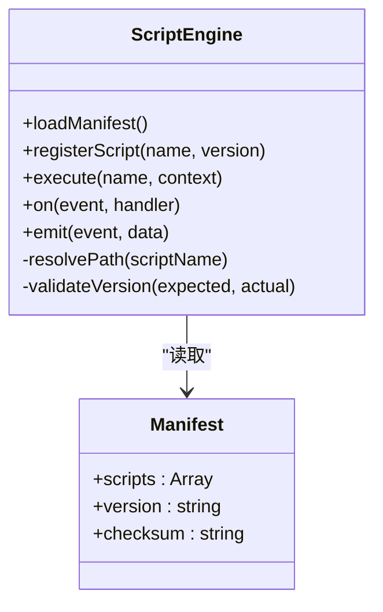

**图表来源** 
- [Scripts/script-engine-v4.js](file://Scripts/script-engine-v4.js)
- [Scripts/ENGINE-MANIFEST.json](file://Scripts/ENGINE-MANIFEST.json)

**章节来源**
- [Scripts/script-engine-v4.js](file://Scripts/script-engine-v4.js)
- [Scripts/ENGINE-MANIFEST.json](file://Scripts/ENGINE-MANIFEST.json)

### MITM 证书管理器 v3
职责：
- 检查系统信任状态
- 下载或更新证书
- 校验证书指纹与有效期
- 失败回滚与告警

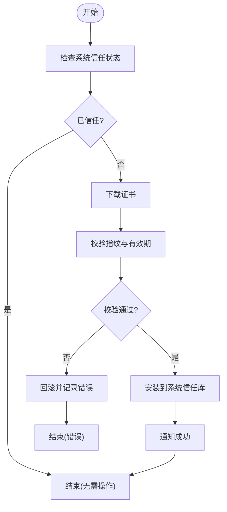

**图表来源** 
- [Scripts/mitm-cert-manager-v3.js](file://Scripts/mitm-cert-manager-v3.js)

**章节来源**
- [Scripts/mitm-cert-manager-v3.js](file://Scripts/mitm-cert-manager-v3.js)

### MITM 安全流量 v3
职责：
- 识别需要拦截的域名与路径
- 注入策略与重写规则
- 限制明文传输与降级保护
- 异常重试与熔断

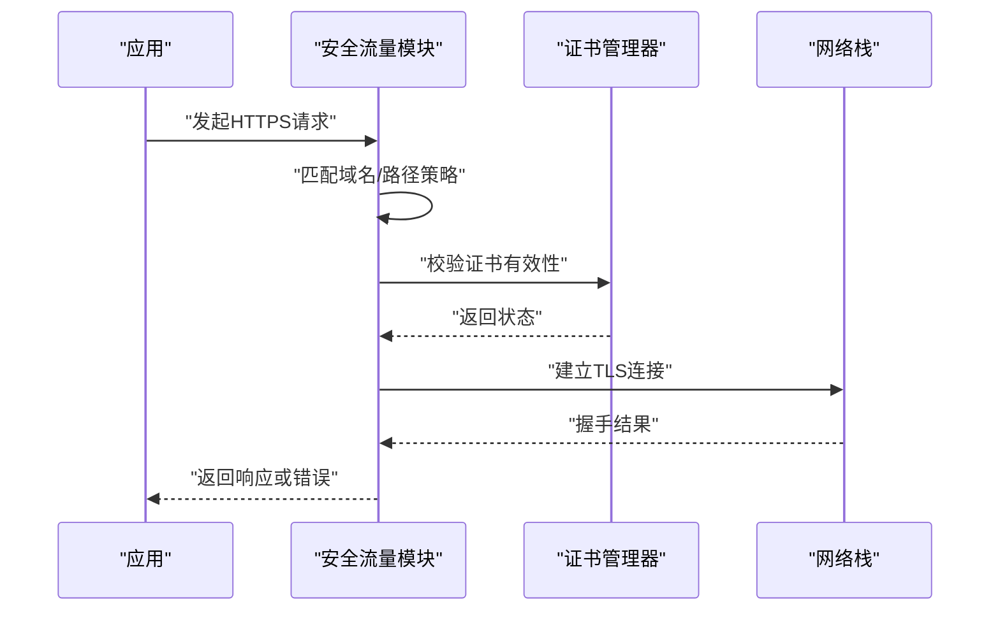

**图表来源** 
- [Scripts/mitm-secure-traffic-v3.js](file://Scripts/mitm-secure-traffic-v3.js)
- [Scripts/mitm-cert-manager-v3.js](file://Scripts/mitm-cert-manager-v3.js)

**章节来源**
- [Scripts/mitm-secure-traffic-v3.js](file://Scripts/mitm-secure-traffic-v3.js)
- [Scripts/mitm-cert-manager-v3.js](file://Scripts/mitm-cert-manager-v3.js)

### 配置优化器 v8
职责：
- 读取模板与片段
- 合并规则与去重
- 排序与格式化输出
- 校验语法与兼容性

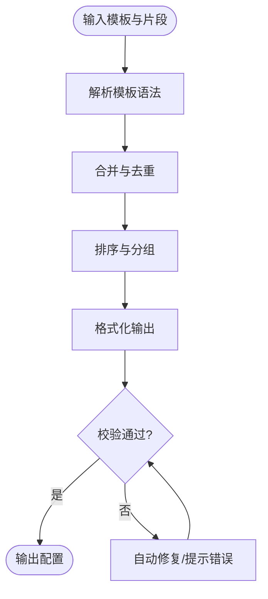

**图表来源** 
- [Scripts/optimize-configuration-v8.js](file://Scripts/optimize-configuration-v8.js)
- [template/loon-optimized-v8.tpl](file://template/loon-optimized-v8.tpl)
- [template/quantumultx.tpl](file://template/quantumultx.tpl)
- [template/surge.tpl](file://template/surge.tpl)

**章节来源**
- [Scripts/optimize-configuration-v8.js](file://Scripts/optimize-configuration-v8.js)
- [template/loon-optimized-v8.tpl](file://template/loon-optimized-v8.tpl)
- [template/quantumultx.tpl](file://template/quantumultx.tpl)
- [template/surge.tpl](file://template/surge.tpl)

### 性能验证器 v8
职责：
- 定义指标阈值与回归基线
- 执行基准测试并采集数据
- 对比历史结果并生成报告
- 失败阻断与告警

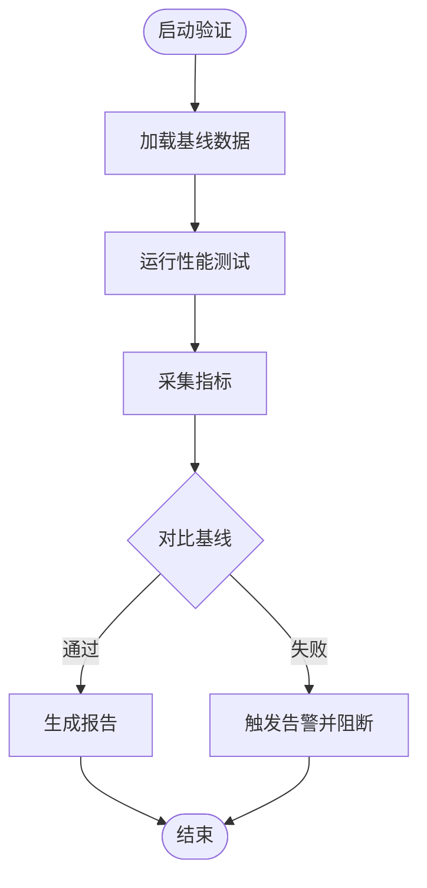

**图表来源** 
- [Scripts/performance-validator-v8.js](file://Scripts/performance-validator-v8.js)
- [Scripts/dns-perf-test-v2.js](file://Scripts/dns-perf-test-v2.js)
- [Scripts/perf-monitor-suite-v3.js](file://Scripts/perf-monitor-suite-v3.js)

**章节来源**
- [Scripts/performance-validator-v8.js](file://Scripts/performance-validator-v8.js)
- [Scripts/dns-perf-test-v2.js](file://Scripts/dns-perf-test-v2.js)
- [Scripts/perf-monitor-suite-v3.js](file://Scripts/perf-monitor-suite-v3.js)

### DNS 性能测试 v2
职责：
- 并发解析不同上游
- 统计延迟、成功率与抖动
- 生成可视化报告

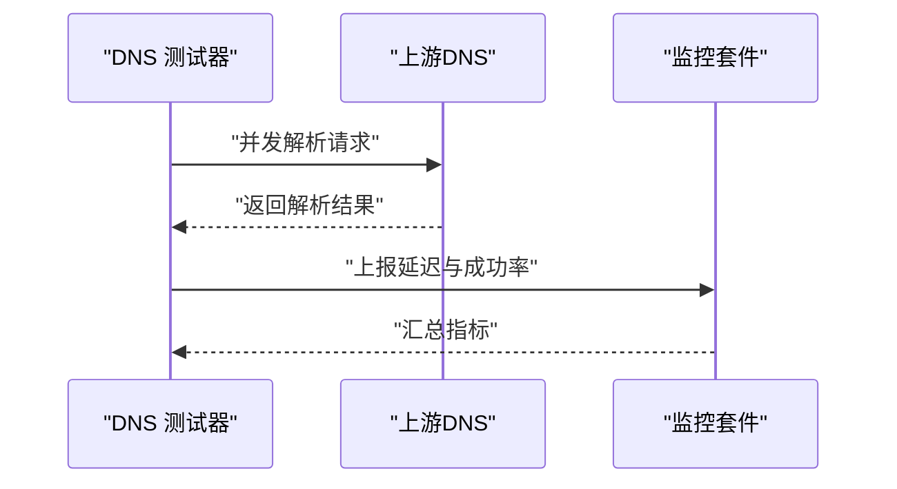

**图表来源** 
- [Scripts/dns-perf-test-v2.js](file://Scripts/dns-perf-test-v2.js)
- [Scripts/perf-monitor-suite-v3.js](file://Scripts/perf-monitor-suite-v3.js)

**章节来源**
- [Scripts/dns-perf-test-v2.js](file://Scripts/dns-perf-test-v2.js)
- [Scripts/perf-monitor-suite-v3.js](file://Scripts/perf-monitor-suite-v3.js)

### 清理脚本
职责：
- 清理临时文件、缓存与日志
- 释放磁盘空间
- 可选完全清理模式

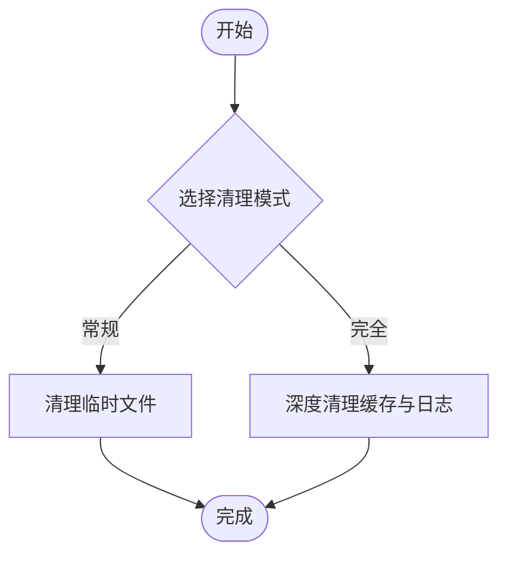

**图表来源** 
- [Scripts/cleanup.sh](file://Scripts/cleanup.sh)
- [Scripts/complete-cleanup.sh](file://Scripts/complete-cleanup.sh)

**章节来源**
- [Scripts/cleanup.sh](file://Scripts/cleanup.sh)
- [Scripts/complete-cleanup.sh](file://Scripts/complete-cleanup.sh)

### 模板与镜像
职责：
- 模板：为不同客户端生成标准化配置
- 镜像：资源映射、校验与分发

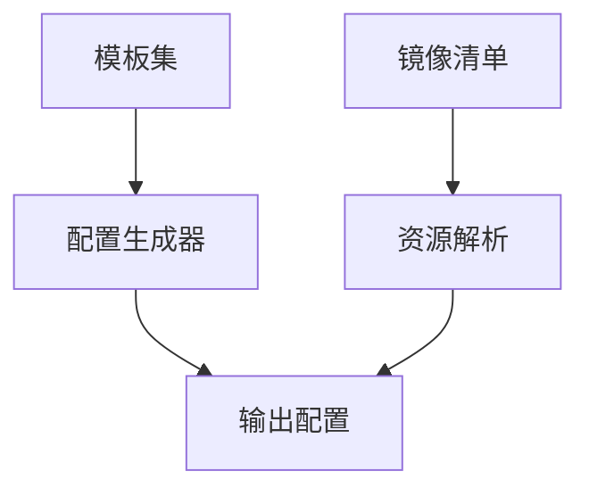

**图表来源** 
- [template/loon-optimized-v8.tpl](file://template/loon-optimized-v8.tpl)
- [template/quantumultx.tpl](file://template/quantumultx.tpl)
- [template/surge.tpl](file://template/surge.tpl)
- [Mirror/MANIFEST.json](file://Mirror/MANIFEST.json)

**章节来源**
- [template/loon-optimized-v8.tpl](file://template/loon-optimized-v8.tpl)
- [template/quantumultx.tpl](file://template/quantumultx.tpl)
- [template/surge.tpl](file://template/surge.tpl)
- [Mirror/MANIFEST.json](file://Mirror/MANIFEST.json)

### 广告过滤实验与 ML 监控
职责：
- 实验：模型量化与推理优化
- 监控：仪表盘展示关键指标

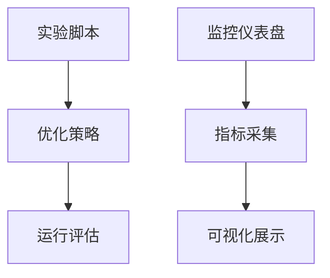

**图表来源** 
- [ad-filter-v8.7/experiments/model-quantization-int8.js](file://ad-filter-v8.7/experiments/model-quantization-int8.js)
- [ml-monitoring-v8.7/dashboard.js](file://ml-monitoring-v8.7/dashboard.js)

**章节来源**
- [ad-filter-v8.7/experiments/model-quantization-int8.js](file://ad-filter-v8.7/experiments/model-quantization-int8.js)
- [ml-monitoring-v8.7/dashboard.js](file://ml-monitoring-v8.7/dashboard.js)

### Provider 脚本
职责：
- 动态生成上游 Provider 列表
- 健康检查与权重调整

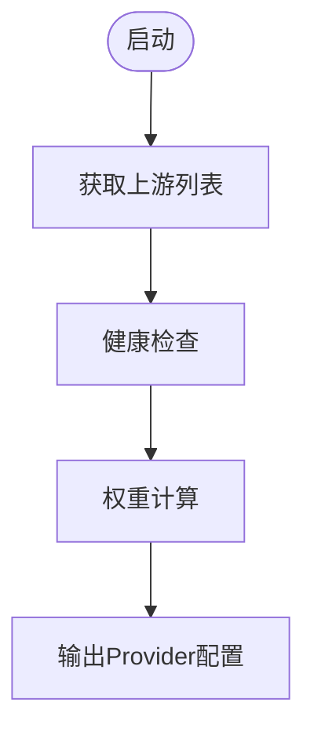

**图表来源** 
- [provider/tokyo.js](file://provider/tokyo.js)
- [provider/tokyo-enhanced.js](file://provider/tokyo-enhanced.js)

**章节来源**
- [provider/tokyo.js](file://provider/tokyo.js)
- [provider/tokyo-enhanced.js](file://provider/tokyo-enhanced.js)

## 依赖关系分析
- 脚本引擎依赖清单与模板
- 安全模块依赖证书管理器
- 配置优化器依赖模板与镜像清单
- 性能验证器依赖 DNS 测试与监控套件
- 清理脚本独立运行，服务于整体维护

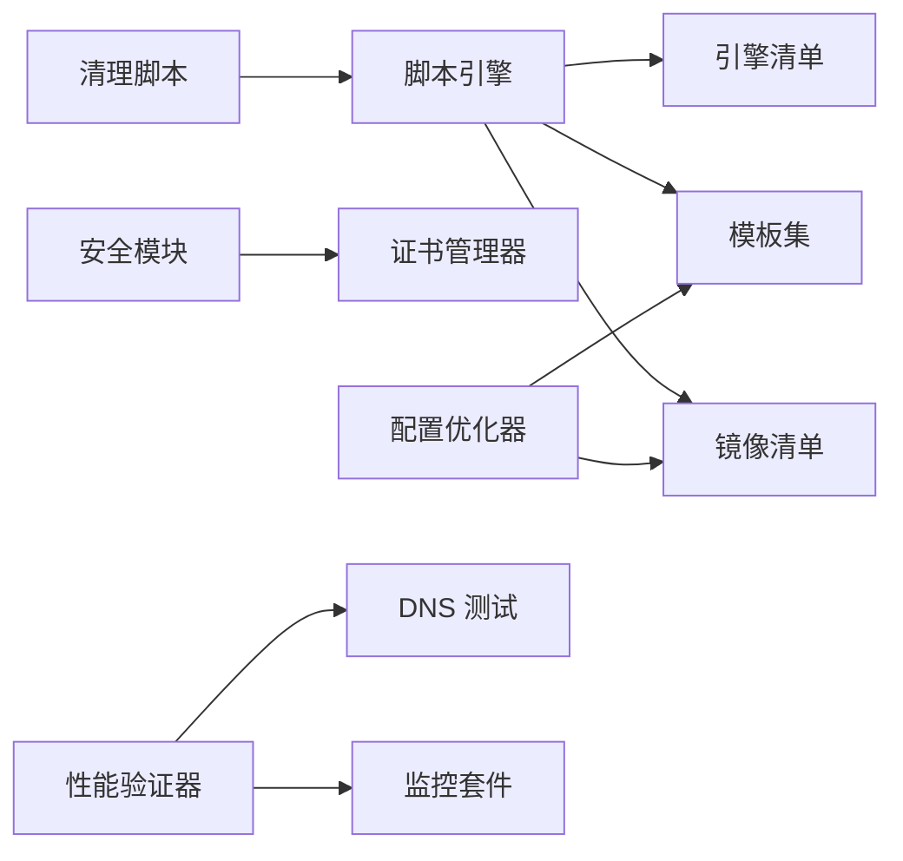

**图表来源** 
- [Scripts/script-engine-v4.js](file://Scripts/script-engine-v4.js)
- [Scripts/ENGINE-MANIFEST.json](file://Scripts/ENGINE-MANIFEST.json)
- [Scripts/mitm-cert-manager-v3.js](file://Scripts/mitm-cert-manager-v3.js)
- [Scripts/optimize-configuration-v8.js](file://Scripts/optimize-configuration-v8.js)
- [Scripts/performance-validator-v8.js](file://Scripts/performance-validator-v8.js)
- [Scripts/dns-perf-test-v2.js](file://Scripts/dns-perf-test-v2.js)
- [Scripts/perf-monitor-suite-v3.js](file://Scripts/perf-monitor-suite-v3.js)
- [Scripts/cleanup.sh](file://Scripts/cleanup.sh)
- [Mirror/MANIFEST.json](file://Mirror/MANIFEST.json)

**章节来源**
- [Scripts/script-engine-v4.js](file://Scripts/script-engine-v4.js)
- [Scripts/ENGINE-MANIFEST.json](file://Scripts/ENGINE-MANIFEST.json)
- [Scripts/mitm-cert-manager-v3.js](file://Scripts/mitm-cert-manager-v3.js)
- [Scripts/optimize-configuration-v8.js](file://Scripts/optimize-configuration-v8.js)
- [Scripts/performance-validator-v8.js](file://Scripts/performance-validator-v8.js)
- [Scripts/dns-perf-test-v2.js](file://Scripts/dns-perf-test-v2.js)
- [Scripts/perf-monitor-suite-v3.js](file://Scripts/perf-monitor-suite-v3.js)
- [Scripts/cleanup.sh](file://Scripts/cleanup.sh)
- [Mirror/MANIFEST.json](file://Mirror/MANIFEST.json)

## 性能考量
- 并发与限流：DNS 测试与监控套件需合理设置并发上限，避免拥塞
- 缓存与复用：模板解析与镜像清单应缓存中间结果，减少重复计算
- 指标阈值：性能验证器需设定合理的阈值与回归窗口，降低误报
- 资源占用：清理脚本应定期执行，防止磁盘与内存压力
- 安全开销：MITM 拦截会增加握手与解密成本，需权衡策略粒度

[本节为通用指导，不直接分析具体文件]

## 故障排查指南
常见问题与定位步骤：
- 证书问题
  - 检查系统信任状态与证书指纹
  - 查看证书管理器日志与回滚记录
- 配置生成失败
  - 校验模板语法与片段引用
  - 使用配置优化器的错误提示与自动修复
- 性能回归
  - 查看性能验证器报告与基线差异
  - 检查 DNS 测试与监控套件指标
- 清理无效
  - 确认清理模式与权限
  - 检查临时文件与缓存路径

**章节来源**
- [Scripts/mitm-cert-manager-v3.js](file://Scripts/mitm-cert-cert-manager-v3.js)
- [Scripts/optimize-configuration-v8.js](file://Scripts/optimize-configuration-v8.js)
- [Scripts/performance-validator-v8.js](file://Scripts/performance-validator-v8.js)
- [Scripts/dns-perf-test-v2.js](file://Scripts/dns-perf-test-v2.js)
- [Scripts/perf-monitor-suite-v3.js](file://Scripts/perf-monitor-suite-v3.js)
- [Scripts/cleanup.sh](file://Scripts/cleanup.sh)
- [Scripts/complete-cleanup.sh](file://Scripts/complete-cleanup.sh)

## 结论
本项目以脚本引擎为核心，串联安全、配置优化、性能监控与模板镜像，形成闭环的工程化体系。通过严格的校验、测试与 CI，确保配置生成的正确性与性能稳定性。建议在生产环境中结合监控与告警机制，持续迭代优化策略与模板。

[本节为总结性内容，不直接分析具体文件]

## 附录
- 部署与发布
  - 使用部署脚本一键发布
  - 结合 CI/CD 进行自动化构建与验证
- 测试框架
  - 测试夹具与用例编写规范
  - 运行测试与生成报告
- 文档与最佳实践
  - 优化总结与目标达成报告
  - 实施验证清单与生态评估
  - Loon 最佳实践与基础设施说明
  - Surge 迁移指南

**章节来源**
- [deploy-all-v8.sh](file://deploy-all-v8.sh)
- [test/harness.js](file://test/harness.js)
- [test/run-tests.js](file://test/run-tests.js)
- [test/cases/purify-scripts.test.js](file://test/cases/purify-scripts.test.js)
- [doc/COMPLETE-OPTIMIZATION-SUMMARY-v8.x.md](file://doc/COMPLETE-OPTIMIZATION-SUMMARY-v8.x.md)
- [doc/GOAL_ACHIEVEREMENT_REPORT.md](file://doc/GOAL_ACHIEVEREMENT_REPORT.md)
- [doc/Implementation_Verification_Checklist.md](file://doc/Implementation_Verification_Checklist.md)
- [doc/Loon_Best_Practices_Complete_Guide.md](file://doc/Loon_Best_Practices_Complete_Guide.md)
- [doc/ecosystem-evaluation.md](file://doc/ecosystem-evaluation.md)
- [doc/infrastructure.md](file://doc/infrastructure.md)
- [doc/surgio-migration.md](file://doc/surgio-migration.md)