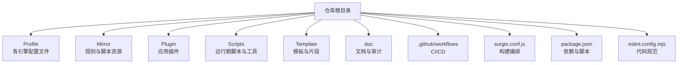
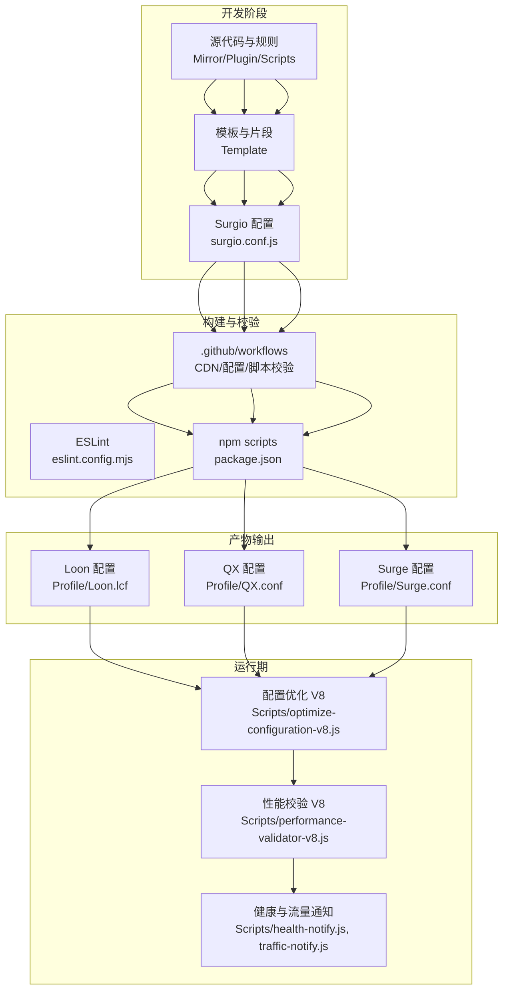
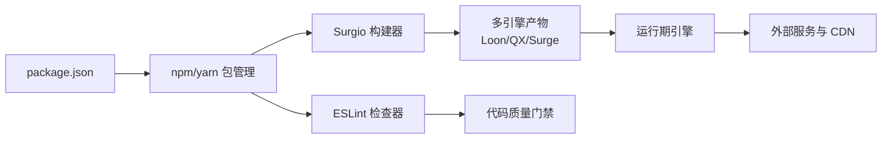

# 最佳实践指南

<cite>
**本文档引用的文件**   
- [README.md](file://README.md)
- [package.json](file://package.json)
- [surgio.conf.js](file://surgio.conf.js)
- [eslint.config.mjs](file://eslint.config.mjs)
- [Loon_Best_Practices_Complete_Guide.md](file://doc/Loon_Best_Practices_Complete_Guide.md)
- [infrastructure.md](file://doc/infrastructure.md)
- [surgio-migration.md](file://doc/surgio-migration.md)
- [Loon.lcf](file://Profile/Loon.lcf)
- [QX.conf](file://Profile/QX.conf)
- [Surge.conf](file://Profile/Surge.conf)
- [loon-AllInOne.plugin](file://Mirror/rules/loon-AllInOne.plugin)
- [qx-AllInOne.conf](file://Mirror/rules/qx-AllInOne.conf)
- [optimize-configuration-v8.js](file://Scripts/optimize-configuration-v8.js)
- [performance-validator-v8.js](file://Scripts/performance-validator-v8.js)
- [ENGINE-MANIFEST.json](file://Scripts/ENGINE-MANIFEST.json)
- [cdn-verify.yml](file://.github/workflows/cdn-verify.yml)
- [config-validate.yml](file://.github/workflows/config-validate.yml)
- [script-tests.yml](file://.github/workflows/script-tests.yml)
</cite>

## 目录
1. [简介](#简介)
2. [项目结构](#项目结构)
3. [核心组件](#核心组件)
4. [架构总览](#架构总览)
5. [详细组件分析](#详细组件分析)
6. [依赖关系分析](#依赖关系分析)
7. [性能考量](#性能考量)
8. [故障排查指南](#故障排查指南)
9. [结论](#结论)
10. [附录](#附录)

## 简介
本仓库是一个面向 Loon、Quantumult X（QX）、Surge 等网络工具的配置与脚本工程，提供规则集、插件、模板与自动化校验能力。其目标是通过统一的工程化手段，提升配置的可维护性、可验证性与跨平台一致性，同时为不同引擎提供优化后的产物。

## 项目结构
仓库采用“按功能域组织”的结构：
- Profile：各引擎的配置文件入口
- Mirror：规则与脚本资源，含多引擎适配
- Plugin：应用级插件定义
- Scripts：运行时脚本与性能/健康检查工具
- Template：模板与片段，用于生成最终配置
- doc：文档与审计记录
- .github/workflows：CI/CD 流水线
- surgio.conf.js：Surgio 构建配置，驱动多引擎产物生成
- package.json：依赖与脚本命令
- eslint.config.mjs：代码规范与静态检查

**图表来源** 
- [surgio.conf.js](file://surgio.conf.js)
- [package.json](file://package.json)
- [eslint.config.mjs](file://eslint.config.mjs)

**章节来源**
- [README.md](file://README.md)
- [package.json](file://package.json)

## 核心组件
- 多引擎配置中心：通过 Surgio 将统一源转换为 Loon、QX、Surge 等不同格式，确保一致性与可维护性。
- 规则与脚本库：覆盖广告拦截、隐私保护、地理定位、流量检测等场景，支持多引擎语法。
- 模板与片段：以模板驱动的方式生成差异化配置，便于快速定制与扩展。
- 质量保障：ESLint 静态检查、GitHub Actions 自动化校验与测试，保证提交质量。
- 性能与健康：V8 优化与校验脚本，配合健康通知与流量统计脚本，提升稳定性与可观测性。

**章节来源**
- [Loon_Best_Practices_Complete_Guide.md](file://doc/Loon_Best_Practices_Complete_Guide.md)
- [infrastructure.md](file://doc/infrastructure.md)
- [surgio-migration.md](file://doc/surgio-migration.md)

## 架构总览
下图展示了从源码到多引擎产物的整体流程，以及脚本在运行期的作用点。

**图表来源** 
- [surgio.conf.js](file://surgio.conf.js)
- [package.json](file://package.json)
- [eslint.config.mjs](file://eslint.config.mjs)
- [cdn-verify.yml](file://.github/workflows/cdn-verify.yml)
- [config-validate.yml](file://.github/workflows/config-validate.yml)
- [script-tests.yml](file://.github/workflows/script-tests.yml)
- [optimize-configuration-v8.js](file://Scripts/optimize-configuration-v8.js)
- [performance-validator-v8.js](file://Scripts/performance-validator-v8.js)
- [Loon.lcf](file://Profile/Loon.lcf)
- [QX.conf](file://Profile/QX.conf)
- [Surge.conf](file://Profile/Surge.conf)

## 详细组件分析

### 多引擎配置与模板系统
- 使用模板与片段组合生成不同引擎的差异化配置，减少重复与维护成本。
- 通过 Surgio 统一编排，确保规则与脚本在多引擎间保持一致语义。
- 建议：
  - 将通用逻辑下沉至公共片段，避免硬编码差异。
  - 对每个引擎的专有特性进行最小化封装，提高可读性。
  - 在模板中明确变量命名与作用域，降低耦合。

**章节来源**
- [template/loon.tpl](file://template/loon.tpl)
- [template/quantumultx.tpl](file://template/quantumultx.tpl)
- [template/surge.tpl](file://template/surge.tpl)
- [surgio.conf.js](file://surgio.conf.js)

### 规则与脚本库
- 规则覆盖广告拦截、隐私、地理定位、流媒体与特定站点优化。
- 脚本提供运行时增强，如资源解析、流量检测、UI 检查等。
- 建议：
  - 规则按场景拆分，保持单一职责与高内聚。
  - 脚本遵循模块化设计，避免全局污染。
  - 对第三方资源增加版本与校验机制，确保稳定性。

**章节来源**
- [loon-AllInOne.plugin](file://Mirror/rules/loon-AllInOne.plugin)
- [qx-AllInOne.conf](file://Mirror/rules/qx-AllInOne.conf)
- [qx-resource-parser.js](file://Mirror/rules/qx-resource-parser.js)
- [qx-traffic-check.js](file://Mirror/rules/qx-traffic-check.js)

### 构建与质量保障
- ESLint 统一代码风格与静态检查，防止低级错误进入主干。
- GitHub Actions 流水线执行 CDN 校验、配置合法性检查与脚本测试。
- 建议：
  - 在本地预提交前运行 lint 与测试，减少回滚概率。
  - 将关键校验步骤加入 PR 检查，强制质量门禁。
  - 对脚本进行单元测试，覆盖边界条件与异常路径。

**章节来源**
- [eslint.config.mjs](file://eslint.config.mjs)
- [cdn-verify.yml](file://.github/workflows/cdn-verify.yml)
- [config-validate.yml](file://.github/workflows/config-validate.yml)
- [script-tests.yml](file://.github/workflows/script-tests.yml)
- [package.json](file://package.json)

### 性能与健康监控
- V8 优化脚本对配置进行预处理与压缩，减少加载时延。
- 性能校验脚本评估配置复杂度与潜在瓶颈，辅助调优。
- 健康与流量通知脚本提供运行态反馈，便于问题定位。
- 建议：
  - 定期运行性能校验，跟踪回归趋势。
  - 结合日志与告警，建立闭环监控。
  - 对热点脚本进行缓存与懒加载，降低冷启动开销。

**章节来源**
- [optimize-configuration-v8.js](file://Scripts/optimize-configuration-v8.js)
- [performance-validator-v8.js](file://Scripts/performance-validator-v8.js)
- [health-notify.js](file://Scripts/health-notify.js)
- [traffic-notify.js](file://Scripts/traffic-notify.js)
- [ENGINE-MANIFEST.json](file://Scripts/ENGINE-MANIFEST.json)

### 模板与片段最佳实践
- 模板应清晰表达意图，避免过度嵌套与复杂条件。
- 片段按主题划分，复用性强且易于替换。
- 建议：
  - 使用命名约定区分不同引擎的片段后缀。
  - 在片段头部添加用途说明与依赖声明。
  - 对可变部分使用占位符，并在构建时注入。

**章节来源**
- [template/snippet/ai-services.qx](file://template/snippet/ai-services.qx)
- [template/snippet/bank-ad-reject.tpl](file://template/snippet/bank-ad-reject.tpl)
- [template/snippet/developer.qx](file://template/snippet/developer.qx)
- [template/snippet/social.qx](file://template/snippet/social.qx)
- [template/snippet/streaming.qx](file://template/snippet/streaming.qx)

## 依赖关系分析
- 构建依赖：Surgio、ESLint、Node.js 生态工具链。
- 运行依赖：各引擎运行时环境（Loon、QX、Surge）。
- 外部依赖：CDN 资源、第三方脚本与服务端 API。
- 建议：
  - 锁定依赖版本，确保构建可重现。
  - 对外部资源增加完整性校验与降级策略。
  - 对引擎差异进行抽象，降低耦合度。

**图表来源** 
- [package.json](file://package.json)
- [surgio.conf.js](file://surgio.conf.js)
- [eslint.config.mjs](file://eslint.config.mjs)

**章节来源**
- [package.json](file://package.json)
- [surgio.conf.js](file://surgio.conf.js)

## 性能考量
- 配置体积与解析复杂度直接影响启动时间与内存占用。
- 脚本执行路径应避免阻塞主线程，合理使用异步与缓存。
- 建议：
  - 按需加载规则与脚本，减少冷启动开销。
  - 对频繁访问的资源进行本地缓存与增量更新。
  - 定期清理无效规则与废弃脚本，保持精简。

[本节为通用指导，不直接分析具体文件]

## 故障排查指南
- 常见症状：
  - 配置无法加载或语法错误
  - 脚本执行失败或返回异常
  - 规则命中异常导致功能失效
- 排查步骤：
  - 运行 ESLint 检查语法与风格问题
  - 执行配置校验与脚本测试，定位失败用例
  - 查看健康与流量通知日志，确认运行态状态
  - 逐步禁用规则与脚本，缩小问题范围
- 建议：
  - 在 CI 中集成端到端校验，提前发现问题
  - 对关键路径增加断言与回滚机制
  - 建立问题知识库，沉淀解决方案

**章节来源**
- [eslint.config.mjs](file://eslint.config.mjs)
- [config-validate.yml](file://.github/workflows/config-validate.yml)
- [script-tests.yml](file://.github/workflows/script-tests.yml)
- [health-notify.js](file://Scripts/health-notify.js)
- [traffic-notify.js](file://Scripts/traffic-notify.js)

## 结论
本仓库通过工程化手段实现了多引擎配置的统一管理、高质量保障与运行期优化。遵循本文的最佳实践，可显著提升配置的可维护性、稳定性与性能表现。建议在团队内推广模板化与模块化设计，持续完善质量门禁与监控体系。

[本节为总结性内容，不直接分析具体文件]

## 附录
- 参考文档：
  - [Loon 最佳实践完整指南](file://doc/Loon_Best_Practices_Complete_Guide.md)
  - [基础设施说明](file://doc/infrastructure.md)
  - [Surgio 迁移指南](file://doc/surgio-migration.md)
- 配置文件示例：
  - [Loon 配置](file://Profile/Loon.lcf)
  - [QX 配置](file://Profile/QX.conf)
  - [Surge 配置](file://Profile/Surge.conf)

[本节为补充信息，不直接分析具体文件]