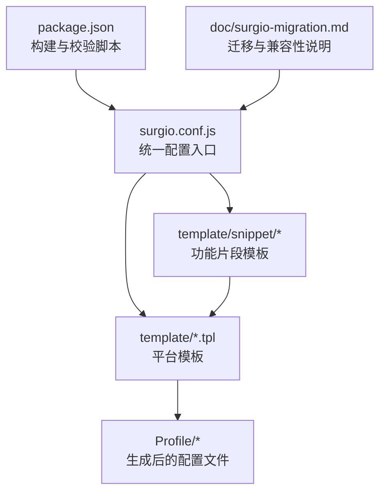
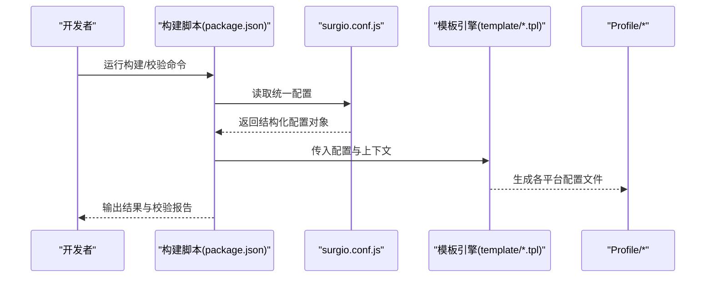
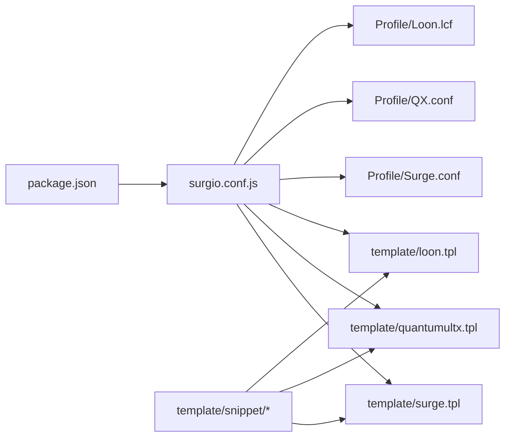

# 配置指南

<cite>
**本文档引用的文件**
- [surgio.conf.js](file://surgio.conf.js)
- [README.md](file://README.md)
- [package.json](file://package.json)
- [template/loon.tpl](file://template/loon.tpl)
- [template/quantumultx.tpl](file://template/quantumultx.tpl)
- [template/surge.tpl](file://template/surge.tpl)
- [Profile/Loon.lcf](file://Profile/Loon.lcf)
- [Profile/QX.conf](file://Profile/QX.conf)
- [Profile/Surge.conf](file://Profile/Surge.conf)
- [template/snippet/ai-services.tpl](file://template/snippet/ai-services.tpl)
- [template/snippet/bank-ad-reject.tpl](file://template/snippet/bank-ad-reject.tpl)
- [template/snippet/developer.tpl](file://template/snippet/developer.tpl)
- [template/snippet/social.tpl](file://template/snippet/social.tpl)
- [template/snippet/streaming.tpl](file://template/snippet/streaming.tpl)
- [doc/surgio-migration.md](file://doc/surgio-migration.md)
</cite>

## 目录
1. [简介](#简介)
2. [项目结构](#项目结构)
3. [核心组件](#核心组件)
4. [架构总览](#架构总览)
5. [详细组件分析](#详细组件分析)
6. [依赖关系分析](#依赖关系分析)
7. [性能考虑](#性能考虑)
8. [故障排查指南](#故障排查指南)
9. [结论](#结论)
10. [附录](#附录)

## 简介
本指南面向使用 Surgio 配置系统的用户与开发者，系统性地说明多平台（Surge、Quantumult X、Loon）的配置格式、语法与选项；解释 Surgio 的模板化生成机制、配置验证与错误处理流程；并提供模板使用方法、自定义扩展、最佳实践以及迁移与版本兼容性建议。读者无需深入代码即可快速上手，同时为高级用户提供足够的技术细节以进行二次开发。

## 项目结构
Surgio 采用“集中式配置 + 模板化输出”的组织方式：
- surgio.conf.js：全局配置入口，定义规则、脚本、插件、分组、策略组等元数据，并控制生成目标平台与行为。
- template/*：各平台的模板文件，负责将统一配置渲染为目标平台的配置文件格式。
- Profile/*：由模板生成的示例或最终配置文件，便于直接导入客户端。
- template/snippet/*：可复用的片段模板，按功能域（如 AI 服务、银行广告拒绝、开发者工具、社交、流媒体等）组织，供主模板按需引入。
- doc/surgio-migration.md：迁移与版本兼容说明。
- package.json：构建与校验脚本入口，提供验证、测试、发布等能力。

图表来源
- [surgio.conf.js](file://surgio.conf.js)
- [template/loon.tpl](file://template/loon.tpl)
- [template/quantumultx.tpl](file://template/quantumultx.tpl)
- [template/surge.tpl](file://template/surge.tpl)
- [Profile/Loon.lcf](file://Profile/Loon.lcf)
- [Profile/QX.conf](file://Profile/QX.conf)
- [Profile/Surge.conf](file://Profile/Surge.conf)
- [template/snippet/ai-services.tpl](file://template/snippet/ai-services.tpl)
- [template/snippet/bank-ad-reject.tpl](file://template/snippet/bank-ad-reject.tpl)
- [template/snippet/developer.tpl](file://template/snippet/developer.tpl)
- [template/snippet/social.tpl](file://template/snippet/social.tpl)
- [template/snippet/streaming.tpl](file://template/snippet/streaming.tpl)
- [package.json](file://package.json)
- [doc/surgio-migration.md](file://doc/surgio-migration.md)

章节来源
- [surgio.conf.js](file://surgio.conf.js)
- [package.json](file://package.json)
- [README.md](file://README.md)

## 核心组件
- 统一配置（surgio.conf.js）
  - 作用：声明所有规则、脚本、插件、分组、策略组、节点、分流、HTTP API、日志、调试开关等，作为单一事实源。
  - 关键概念：规则集、脚本集、插件集、策略组、节点池、分发器、HTTP 接口、环境变量与条件分支。
- 平台模板（template/*.tpl）
  - 作用：将统一配置渲染为 Surge、Quantumult X、Loon 的配置文件格式。
  - 关键点：模板变量、条件渲染、循环展开、片段引入、平台差异处理。
- 片段模板（template/snippet/*）
  - 作用：按功能域组织常用规则与脚本片段，支持复用与组合。
  - 关键点：命名约定、参数化、依赖声明、冲突检测。
- 生成产物（Profile/*）
  - 作用：可直接导入客户端的最终配置文件，保证与源码一致。
- 构建与校验（package.json）
  - 作用：提供配置校验、模板渲染、测试与发布流水线。

章节来源
- [surgio.conf.js](file://surgio.conf.js)
- [template/loon.tpl](file://template/loon.tpl)
- [template/quantumultx.tpl](file://template/quantumultx.tpl)
- [template/surge.tpl](file://template/surge.tpl)
- [template/snippet/ai-services.tpl](file://template/snippet/ai-services.tpl)
- [template/snippet/bank-ad-reject.tpl](file://template/snippet/bank-ad-reject.tpl)
- [template/snippet/developer.tpl](file://template/snippet/developer.tpl)
- [template/snippet/social.tpl](file://template/snippet/social.tpl)
- [template/snippet/streaming.tpl](file://template/snippet/streaming.tpl)
- [package.json](file://package.json)

## 架构总览
Surgio 的工作流遵循“输入统一配置 → 模板渲染 → 输出平台特定配置”的管道模型。构建阶段执行配置校验与模板渲染，确保一致性；运行时通过 Profile 文件被客户端加载。

图表来源
- [package.json](file://package.json)
- [surgio.conf.js](file://surgio.conf.js)
- [template/loon.tpl](file://template/loon.tpl)
- [template/quantumultx.tpl](file://template/quantumultx.tpl)
- [template/surge.tpl](file://template/surge.tpl)
- [Profile/Loon.lcf](file://Profile/Loon.lcf)
- [Profile/QX.conf](file://Profile/QX.conf)
- [Profile/Surge.conf](file://Profile/Surge.conf)

## 详细组件分析

### 统一配置（surgio.conf.js）
- 职责
  - 定义规则、脚本、插件、策略组、节点、分流、HTTP API、日志、调试开关等。
  - 提供条件分支与环境变量，实现多环境切换。
  - 暴露构建期钩子，用于预处理与后处理。
- 结构与约定
  - 顶层键：rules、scripts、plugins、groups、nodes、distributors、http、logging、debug、env、hooks 等。
  - 命名规范：全小写、短横线分隔；避免与平台保留字冲突。
  - 类型约束：数组、对象、布尔、字符串、枚举等，配合校验规则。
- 最佳实践
  - 将公共片段抽取到 snippet 目录，通过引用复用。
  - 使用 env 区分 dev/test/prod，避免硬编码。
  - 对敏感信息使用环境变量注入，不提交明文。
  - 保持规则顺序稳定，便于变更追踪。

章节来源
- [surgio.conf.js](file://surgio.conf.js)

### 平台模板（template/*.tpl）
- 角色
  - 将统一配置渲染为 Surge、Quantumult X、Loon 的配置文件格式。
- 关键能力
  - 变量插值、条件渲染、循环展开、片段引入、平台差异处理。
  - 输出注释与格式化，提升可读性与可维护性。
- 模板约定
  - 文件名对应平台：surge.tpl、quantumultx.tpl、loon.tpl。
  - 使用统一的上下文对象访问配置项。
  - 对缺失或不合法字段给出明确错误提示。

章节来源
- [template/surge.tpl](file://template/surge.tpl)
- [template/quantumultx.tpl](file://template/quantumultx.tpl)
- [template/loon.tpl](file://template/loon.tpl)

### 片段模板（template/snippet/*）
- 角色
  - 按功能域组织常用规则与脚本片段，支持复用与组合。
- 常见片段
  - ai-services.tpl：AI 服务相关规则与脚本。
  - bank-ad-reject.tpl：银行类应用广告拦截。
  - developer.tpl：开发者工具与调试增强。
  - social.tpl：社交平台优化。
  - streaming.tpl：流媒体加速与去广告。
- 使用方式
  - 在主模板中按条件引入片段。
  - 通过参数化配置控制行为。
  - 避免片段间冲突，必要时在统一配置中显式覆盖。

章节来源
- [template/snippet/ai-services.tpl](file://template/snippet/ai-services.tpl)
- [template/snippet/bank-ad-reject.tpl](file://template/snippet/bank-ad-reject.tpl)
- [template/snippet/developer.tpl](file://template/snippet/developer.tpl)
- [template/snippet/social.tpl](file://template/snippet/social.tpl)
- [template/snippet/streaming.tpl](file://template/snippet/streaming.tpl)

### 生成产物（Profile/*）
- 角色
  - 由模板渲染得到的最终配置文件，可直接导入客户端。
- 文件
  - Loon.lcf：Loon 配置文件。
  - QX.conf：Quantumult X 配置文件。
  - Surge.conf：Surge 配置文件。
- 注意事项
  - 不要手动修改，以免与源码不一致。
  - 如需调整，请修改统一配置与模板后重新生成。

章节来源
- [Profile/Loon.lcf](file://Profile/Loon.lcf)
- [Profile/QX.conf](file://Profile/QX.conf)
- [Profile/Surge.conf](file://Profile/Surge.conf)

### 构建与校验（package.json）
- 角色
  - 提供配置校验、模板渲染、测试与发布脚本。
- 关键脚本
  - 校验：检查统一配置的合法性与完整性。
  - 渲染：根据统一配置生成各平台配置文件。
  - 测试：运行单元测试与集成测试。
  - 发布：打包与部署产物。
- 建议
  - 在 CI 中强制运行校验与测试，确保质量。
  - 将生成产物纳入版本管理，便于回溯。

章节来源
- [package.json](file://package.json)

## 依赖关系分析
- 模块耦合
  - surgio.conf.js 是中心依赖，被模板与构建脚本共同消费。
  - 模板之间相对独立，通过片段模板共享逻辑。
- 外部依赖
  - 构建脚本依赖 Node.js 环境与包管理器。
  - 客户端依赖各自平台的配置文件格式。
- 潜在风险
  - 片段间的命名冲突与规则覆盖需显式管理。
  - 环境变量未设置可能导致渲染失败。

图表来源
- [surgio.conf.js](file://surgio.conf.js)
- [template/surge.tpl](file://template/surge.tpl)
- [template/quantumultx.tpl](file://template/quantumultx.tpl)
- [template/loon.tpl](file://template/loon.tpl)
- [template/snippet/ai-services.tpl](file://template/snippet/ai-services.tpl)
- [template/snippet/bank-ad-reject.tpl](file://template/snippet/bank-ad-reject.tpl)
- [template/snippet/developer.tpl](file://template/snippet/developer.tpl)
- [template/snippet/social.tpl](file://template/snippet/social.tpl)
- [template/snippet/streaming.tpl](file://template/snippet/streaming.tpl)
- [package.json](file://package.json)
- [Profile/Surge.conf](file://Profile/Surge.conf)
- [Profile/QX.conf](file://Profile/QX.conf)
- [Profile/Loon.lcf](file://Profile/Loon.lcf)

章节来源
- [package.json](file://package.json)
- [surgio.conf.js](file://surgio.conf.js)

## 性能考虑
- 配置规模
  - 规则与片段数量增长时，渲染时间线性增加。建议拆分片段、按需引入。
- 缓存与增量
  - 利用构建缓存减少重复渲染；仅变更部分重新生成。
- 资源占用
  - 避免在统一配置中进行复杂计算，尽量在构建期完成。
- 客户端加载
  - 生成的配置文件应保持精简，去除冗余注释与空段。

[本节为通用指导，不直接分析具体文件]

## 故障排查指南
- 常见错误
  - 配置语法错误：检查键名、类型与必填项。
  - 模板渲染失败：确认片段路径与变量存在性。
  - 环境变量缺失：在构建环境中设置必要变量。
  - 片段冲突：显式覆盖或重命名以避免冲突。
- 定位方法
  - 使用构建脚本的校验模式获取详细错误堆栈。
  - 逐步缩小范围，先禁用片段再逐一启用。
  - 对比 Profile 中的生成结果与预期差异。
- 恢复步骤
  - 回滚到上一个已知可用的提交。
  - 修正配置后重新生成并校验。

章节来源
- [package.json](file://package.json)
- [surgio.conf.js](file://surgio.conf.js)

## 结论
Surgio 通过统一配置与模板化渲染，实现了跨平台配置的一致性与可维护性。遵循本文的结构与最佳实践，可以高效地管理多平台规则、脚本与插件，并在构建期保障质量。结合迁移与兼容性说明，可在版本演进中平滑升级。

[本节为总结性内容，不直接分析具体文件]

## 附录

### 多平台配置格式与语法要点
- Surge
  - 配置文件：Profile/Surge.conf
  - 重点：策略组、节点、规则、脚本、HTTP API、日志与调试。
  - 模板：template/surge.tpl
- Quantumult X
  - 配置文件：Profile/QX.conf
  - 重点：规则、脚本、重写、任务调度、HTTP API。
  - 模板：template/quantumultx.tpl
- Loon
  - 配置文件：Profile/Loon.lcf
  - 重点：规则、脚本、插件、HTTP API、日志。
  - 模板：template/loon.tpl

章节来源
- [Profile/Surge.conf](file://Profile/Surge.conf)
- [Profile/QX.conf](file://Profile/QX.conf)
- [Profile/Loon.lcf](file://Profile/Loon.lcf)
- [template/surge.tpl](file://template/surge.tpl)
- [template/quantumultx.tpl](file://template/quantumultx.tpl)
- [template/loon.tpl](file://template/loon.tpl)

### 配置模板使用方法与自定义选项
- 引入片段
  - 在主模板中按功能域引入片段，并通过参数控制行为。
- 条件渲染
  - 基于环境变量或配置标志决定是否包含某片段或选项。
- 自定义扩展
  - 新增片段模板，遵循命名与参数约定。
  - 在统一配置中声明依赖与覆盖规则。
- 最佳实践
  - 保持片段原子化，避免过大片段。
  - 使用清晰的注释与文档，便于团队协作。

章节来源
- [template/snippet/ai-services.tpl](file://template/snippet/ai-services.tpl)
- [template/snippet/bank-ad-reject.tpl](file://template/snippet/bank-ad-reject.tpl)
- [template/snippet/developer.tpl](file://template/snippet/developer.tpl)
- [template/snippet/social.tpl](file://template/snippet/social.tpl)
- [template/snippet/streaming.tpl](file://template/snippet/streaming.tpl)

### 实际配置示例与最佳实践
- 示例来源
  - Profile/* 中的配置文件可作为参考，展示不同平台的典型用法。
- 最佳实践
  - 将敏感信息放入环境变量。
  - 使用分段与注释提升可读性。
  - 在 CI 中运行校验与测试，确保一致性。

章节来源
- [Profile/Surge.conf](file://Profile/Surge.conf)
- [Profile/QX.conf](file://Profile/QX.conf)
- [Profile/Loon.lcf](file://Profile/Loon.lcf)

### 配置验证机制与错误处理
- 验证阶段
  - 构建脚本读取统一配置并进行类型与完整性校验。
  - 模板渲染前进行上下文检查，确保变量可用。
- 错误处理
  - 输出明确的错误信息与行号，便于定位。
  - 提供回退与恢复策略，避免破坏现有配置。
- 建议
  - 在本地与 CI 均运行校验，尽早发现问题。
  - 对关键路径添加断言与日志。

章节来源
- [package.json](file://package.json)
- [surgio.conf.js](file://surgio.conf.js)

### 配置迁移与版本兼容性
- 迁移指南
  - 参考迁移文档，了解新旧版本的差异与升级步骤。
- 兼容性
  - 保持向后兼容，提供过渡期与弃用警告。
- 建议
  - 分阶段迁移，先在测试环境验证。
  - 更新文档与示例，确保团队同步。

章节来源
- [doc/surgio-migration.md](file://doc/surgio-migration.md)