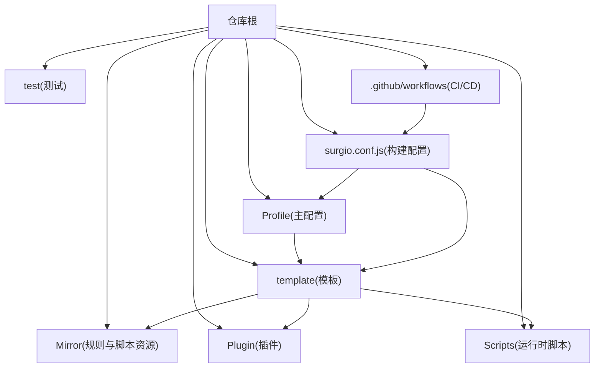
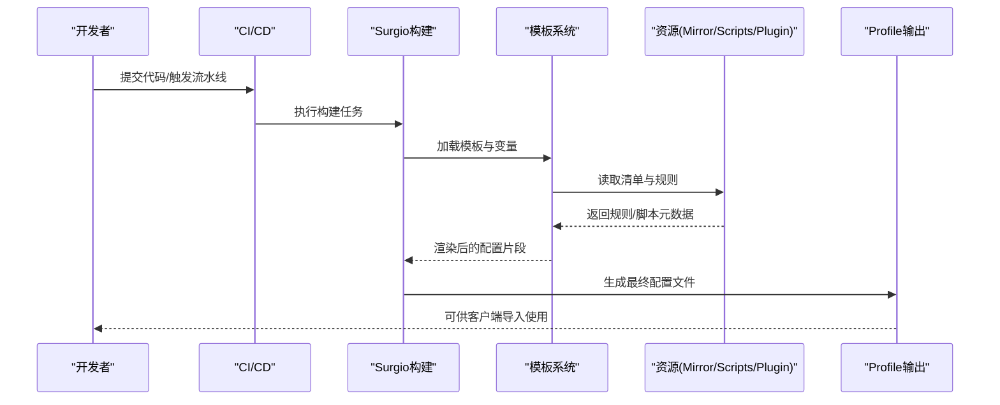
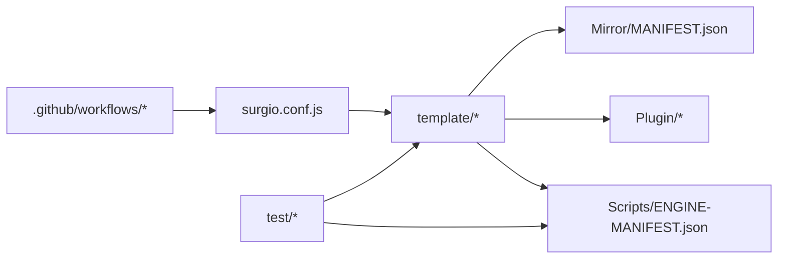

# 项目概览

<cite>
**本文引用的文件**   
- [README.md](file://README.md)
- [package.json](file://package.json)
- [surgio.conf.js](file://surgio.conf.js)
- [Mirrors/MANIFEST.json](file://Mirror/MANIFEST.json)
- [Profile/Loon.lcf](file://Profile/Loon.lcf)
- [Profile/QX.conf](file://Profile/QX.conf)
- [Profile/Surge.conf](file://Profile/Surge.conf)
- [template/quantumultx.tpl](file://template/quantumultx.tpl)
- [template/surge.tpl](file://template/surge.tpl)
- [template/loon.tpl](file://template/loon.tpl)
- [Scripts/ENGINE-MANIFEST.json](file://Scripts/ENGINE-MANIFEST.json)
- [test/run-tests.js](file://test/run-tests.js)
- [test/harness.js](file://test/harness.js)
</cite>

## 目录
1. [简介](#简介)
2. [项目结构](#项目结构)
3. [核心组件](#核心组件)
4. [架构总览](#架构总览)
5. [详细组件分析](#详细组件分析)
6. [依赖关系分析](#依赖关系分析)
7. [性能考量](#性能考量)
8. [故障排查指南](#故障排查指南)
9. [结论](#结论)
10. [附录](#附录)

## 简介
本项目是一个面向网络配置管理的仓库，围绕多代理客户端（如 Surge、Quantumult X、Loon）的规则与脚本进行集中化管理与分发。其目标包括：
- 统一维护规则、插件与脚本，支持多平台模板生成与发布
- 提供可复用的片段化模板与清单，便于按需组合
- 通过工作流实现校验、构建与部署的自动化
- 为初学者提供清晰的使用路径，为高级用户提供可扩展的配置与集成能力

本概览文档将从概念到实现逐层展开，帮助读者快速理解并高效使用该项目。

## 项目结构
仓库采用按功能域划分的目录组织方式，核心目录说明如下：
- Profile：各客户端的主配置文件入口（Loon、QX、Surge）
- template：模板文件，用于生成不同客户端的最终配置
- Mirror：规则与脚本资源集合，包含清单与具体规则/脚本
- Plugin：按应用或场景分类的插件定义
- Scripts：运行时脚本与引擎清单
- test：测试用例与运行器
- surgio.conf.js：Surgio 构建配置，驱动模板渲染与输出
- .github/workflows：CI/CD 流水线（校验、构建、部署等）

图表来源
- [surgio.conf.js:1-200](file://surgio.conf.js#L1-L200)
- [Profile/Loon.lcf:1-200](file://Profile/Loon.lcf#L1-L200)
- [Profile/QX.conf:1-200](file://Profile/QX.conf#L1-L200)
- [Profile/Surge.conf:1-200](file://Profile/Surge.conf#L1-L200)

章节来源
- [README.md:1-200](file://README.md#L1-L200)
- [package.json:1-200](file://package.json#L1-L200)
- [surgio.conf.js:1-200](file://surgio.conf.js#L1-L200)

## 核心组件
- 构建与模板系统
  - 以 Surgio 为核心，通过 surgio.conf.js 声明输入、模板与输出，将模板渲染为各客户端可用配置
  - 模板位于 template 目录，分别对应 Quantumult X、Surge、Loon 的输出格式
- 规则与脚本资源
  - Mirror 目录集中管理规则与脚本，MANIFEST.json 作为资源清单，便于版本管理与按需引用
  - Scripts 目录存放运行时脚本，ENGINE-MANIFEST.json 描述脚本引擎与依赖
- 插件体系
  - Plugin 目录按业务域组织插件，供模板与 Profile 引用，形成“插件即规则”的组合模式
- 测试与质量保障
  - test 目录包含测试用例与运行器，确保脚本与规则在变更时保持稳定

章节来源
- [surgio.conf.js:1-200](file://surgio.conf.js#L1-L200)
- [template/quantumultx.tpl:1-200](file://template/quantumultx.tpl#L1-L200)
- [template/surge.tpl:1-200](file://template/surge.tpl#L1-L200)
- [template/loon.tpl:1-200](file://template/loon.tpl#L1-L200)
- [Mirror/MANIFEST.json:1-200](file://Mirror/MANIFEST.json#L1-L200)
- [Scripts/ENGINE-MANIFEST.json:1-200](file://Scripts/ENGINE-MANIFEST.json#L1-L200)

## 架构总览
整体架构围绕“模板渲染 + 资源编排 + 多端输出”展开：
- 输入：模板与资源清单（template、Mirror、Scripts、Plugin）
- 处理：Surgio 构建流程读取配置，解析模板，合并资源，生成目标客户端配置
- 输出：Profile 下的 Loon、QX、Surge 配置文件
- 支撑：CI/CD 工作流负责校验、构建与发布；测试套件保证稳定性

图表来源
- [surgio.conf.js:1-200](file://surgio.conf.js#L1-L200)
- [Profile/Loon.lcf:1-200](file://Profile/Loon.lcf#L1-L200)
- [Profile/QX.conf:1-200](file://Profile/QX.conf#L1-L200)
- [Profile/Surge.conf:1-200](file://Profile/Surge.conf#L1-L200)

## 详细组件分析

### 构建配置（Surgio）
- 作用：定义模板渲染管线、输入源、输出目标与环境变量
- 关键点：
  - 模板映射：将不同客户端的模板与输出路径关联
  - 资源注入：从 Mirror、Scripts、Plugin 中抽取规则与脚本
  - 环境变量：控制开关、版本与调试信息
- 建议：
  - 保持模板与资源解耦，通过清单统一管理版本
  - 在 CI 中增加模板语法与规则语法校验步骤

章节来源
- [surgio.conf.js:1-200](file://surgio.conf.js#L1-L200)

### 模板系统（Quantumult X / Surge / Loon）
- 作用：抽象出通用配置结构，针对不同客户端生成差异化的最终配置
- 关键点：
  - 模板变量：用于注入规则、脚本、插件与策略组
  - 条件渲染：根据环境或用户选择启用/禁用模块
  - 输出校验：确保生成的配置符合客户端语法要求
- 建议：
  - 模板内避免硬编码，尽量通过变量与清单驱动
  - 为每个客户端维护最小必要字段，降低维护成本

章节来源
- [template/quantumultx.tpl:1-200](file://template/quantumultx.tpl#L1-L200)
- [template/surge.tpl:1-200](file://template/surge.tpl#L1-L200)
- [template/loon.tpl:1-200](file://template/loon.tpl#L1-L200)

### 资源清单（Mirror MANIFEST）
- 作用：集中管理规则与脚本的版本、来源与依赖
- 关键点：
  - 条目结构：名称、版本、URL、校验值、适用客户端
  - 增量更新：基于清单对比实现增量拉取与缓存
  - 健康检查：上游可用性检测与回退策略
- 建议：
  - 严格版本号管理，避免破坏性变更
  - 提供镜像与备用源，提高可用性

章节来源
- [Mirror/MANIFEST.json:1-200](file://Mirror/MANIFEST.json#L1-L200)

### 脚本引擎（Scripts ENGINE-MANIFEST）
- 作用：描述脚本引擎、依赖与生命周期钩子
- 关键点：
  - 引擎声明：指定脚本运行环境与权限
  - 依赖管理：声明外部库与本地模块
  - 生命周期：启动、请求拦截、响应处理、错误上报
- 建议：
  - 脚本模块化，避免全局污染
  - 提供单元测试与模拟数据，提升稳定性

章节来源
- [Scripts/ENGINE-MANIFEST.json:1-200](file://Scripts/ENGINE-MANIFEST.json#L1-L200)

### 插件体系（Plugin）
- 作用：按业务域组织规则与行为，便于按需启用
- 关键点：
  - 插件命名：清晰表达用途与范围
  - 依赖声明：插件间依赖与冲突处理
  - 版本兼容：与模板与清单的版本对齐
- 建议：
  - 插件粒度适中，避免过大单体
  - 提供使用说明与示例配置

章节来源
- [Plugin/bilibili.plugin:1-200](file://Plugin/bilibili.plugin#L1-L200)
- [Plugin/wechat.plugin:1-200](file://Plugin/wechat.plugin#L1-L200)
- [Plugin/netease.plugin:1-200](file://Plugin/netease.plugin#L1-L200)

### 测试套件（test）
- 作用：验证脚本与规则的正确性与兼容性
- 关键点：
  - 用例组织：按功能域划分测试文件
  - 运行器：统一入口与报告输出
  - 断言：覆盖边界条件与异常路径
- 建议：
  - 持续集成中自动运行测试
  - 覆盖率阈值与失败阻断

章节来源
- [test/run-tests.js:1-200](file://test/run-tests.js#L1-L200)
- [test/harness.js:1-200](file://test/harness.js#L1-L200)

## 依赖关系分析
- 内部依赖
  - 构建配置依赖模板与资源清单
  - 模板依赖插件与脚本引擎
  - 测试依赖构建产物与脚本引擎
- 外部依赖
  - CI/CD 平台（GitHub Actions）
  - 上游规则与脚本源（Mirror 清单）
  - 客户端工具链（Surgio、各客户端命令行）

图表来源
- [surgio.conf.js:1-200](file://surgio.conf.js#L1-L200)
- [Mirror/MANIFEST.json:1-200](file://Mirror/MANIFEST.json#L1-L200)
- [Scripts/ENGINE-MANIFEST.json:1-200](file://Scripts/ENGINE-MANIFEST.json#L1-L200)
- [test/run-tests.js:1-200](file://test/run-tests.js#L1-L200)

章节来源
- [package.json:1-200](file://package.json#L1-L200)
- [.github/workflows/config-validate.yml:1-200](file://.github/workflows/config-validate.yml#L1-L200)
- [.github/workflows/pages-deploy.yml:1-200](file://.github/workflows/pages-deploy.yml#L1-L200)

## 性能考量
- 模板渲染
  - 减少不必要的条件分支与重复计算
  - 使用缓存机制避免重复下载与解析
- 资源拉取
  - 优先使用镜像与本地缓存
  - 并行拉取与失败重试策略
- 脚本执行
  - 避免阻塞式操作，采用异步与事件驱动
  - 限制内存占用与 CPU 使用峰值
- 构建与发布
  - 增量构建与差量发布
  - 产物压缩与去重

[本节为通用指导，不直接分析具体文件]

## 故障排查指南
- 常见问题
  - 模板渲染失败：检查模板语法与变量注入是否正确
  - 资源拉取失败：核对清单 URL 与校验值，检查网络与镜像可用性
  - 脚本执行异常：查看引擎日志与断点输出，确认依赖与权限
  - 客户端导入失败：比对客户端版本与配置语法差异
- 定位方法
  - 启用详细日志与调试模式
  - 使用测试套件复现问题
  - 分阶段隔离（模板、资源、脚本）逐步缩小范围
- 恢复策略
  - 回滚到上一个稳定版本
  - 切换备用源与降级策略
  - 临时禁用有问题的插件或脚本

章节来源
- [test/run-tests.js:1-200](file://test/run-tests.js#L1-L200)
- [test/harness.js:1-200](file://test/harness.js#L1-L200)

## 结论
本项目通过模板化与清单化管理，实现了跨客户端的网络配置统一与自动化。借助 CI/CD 与测试套件，保障了配置的稳定性与可维护性。对于初学者，可从 Profile 与模板入手快速上手；对于高级用户，可通过扩展模板、插件与脚本实现深度定制。建议在迭代过程中持续关注性能与可用性优化，完善监控与告警机制。

[本节为总结性内容，不直接分析具体文件]

## 附录
- 术语表
  - 模板：用于生成客户端配置的抽象文件
  - 清单：描述资源元数据与版本的 JSON 文件
  - 插件：按业务域组织的规则与行为集合
  - 脚本：运行时执行的逻辑单元
- 常用命令
  - 本地构建：运行构建配置生成 Profile
  - 运行测试：执行测试套件验证变更
  - 发布制品：通过工作流推送与归档

[本节为补充信息，不直接分析具体文件]