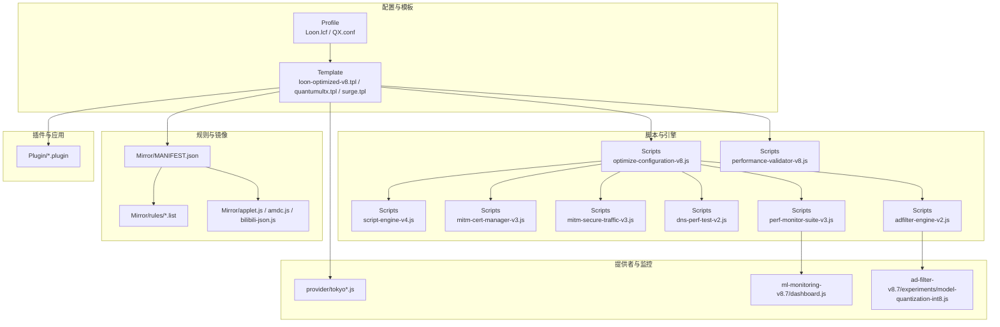
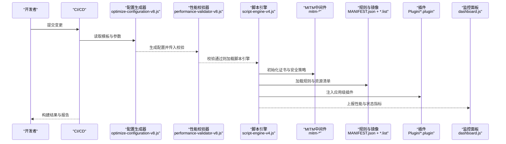
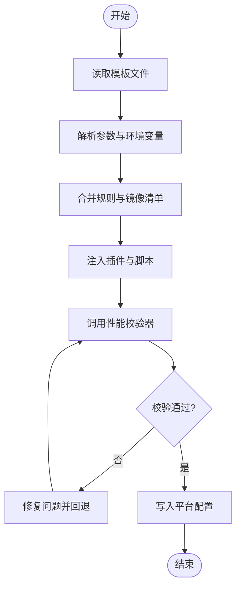
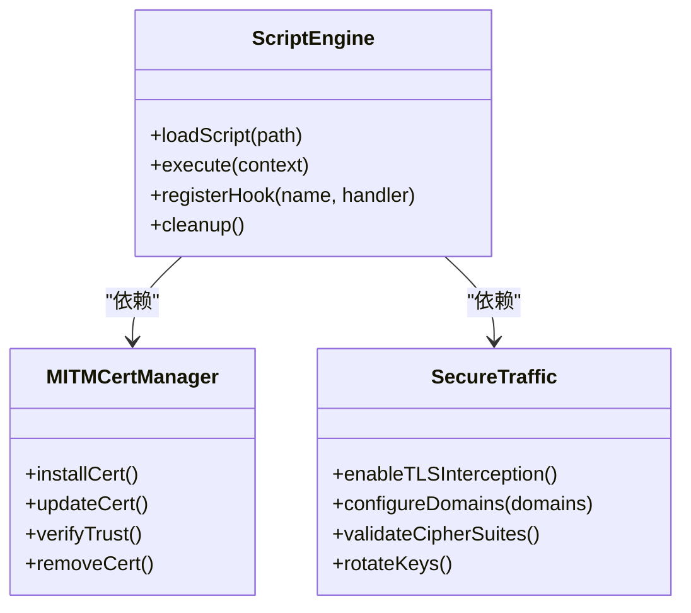
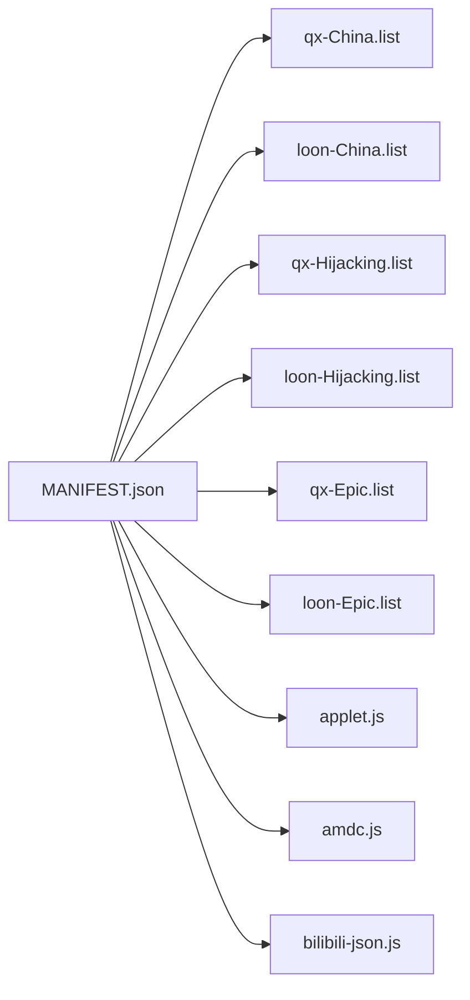
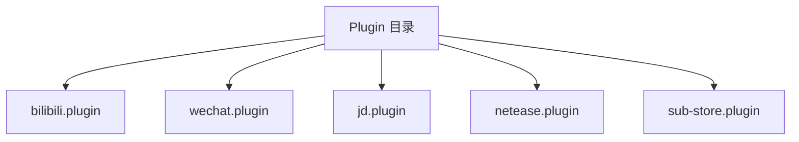
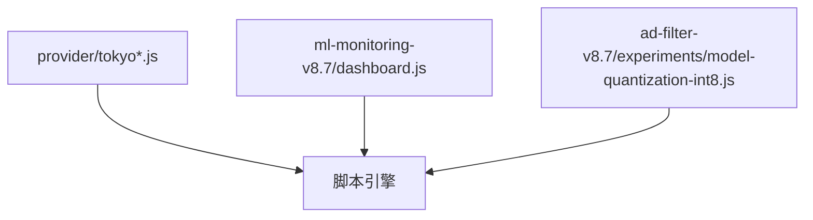
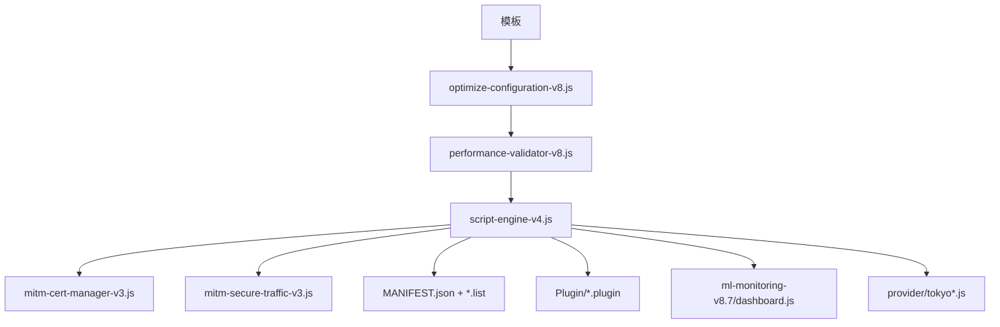

# v8.x版本文档

<cite>
**本文引用的文件**   
- [README.md](file://README.md)
- [package.json](file://package.json)
- [deploy-all-v8.sh](file://deploy-all-v8.sh)
- [surgio.conf.js](file://surgio.conf.js)
- [Scripts/ENGINE-MANIFEST.json](file://Scripts/ENGINE-MANIFEST.json)
- [Mirror/MANIFEST.json](file://Mirror/MANIFEST.json)
- [template/loon-optimized-v8.tpl](file://template/loon-optimized-v8.tpl)
- [template/quantumultx.tpl](file://template/quantumultx.tpl)
- [template/surge.tpl](file://template/surge.tpl)
- [Scripts/optimize-configuration-v8.js](file://Scripts/optimize-configuration-v8.js)
- [Scripts/performance-validator-v8.js](file://Scripts/performance-validator-v8.js)
- [Scripts/script-engine-v4.js](file://Scripts/script-engine-v4.js)
- [Scripts/mitm-cert-manager-v3.js](file://Scripts/mitm-cert-manager-v3.js)
- [Scripts/mitm-secure-traffic-v3.js](file://Scripts/mitm-secure-traffic-v3.js)
- [Scripts/dns-perf-test-v2.js](file://Scripts/dns-perf-test-v2.js)
- [Scripts/perf-monitor-suite-v3.js](file://Scripts/perf-monitor-suite-v3.js)
- [Scripts/adfilter-engine-v2.js](file://Scripts/adfilter-engine-v2.js)
- [ad-filter-v8.7/experiments/model-quantization-int8.js](file://ad-filter-v8.7/experiments/model-quantization-int8.js)
- [ml-monitoring-v8.7/dashboard.js](file://ml-monitoring-v8.7/dashboard.js)
- [provider/tokyo-enhanced.js](file://provider/tokyo-enhanced.js)
- [provider/tokyo.js](file://provider/tokyo.js)
- [doc/COMPLETE-OPTIMIZATION-SUMMARY-v8.x.md](file://doc/COMPLETE-OPTIMIZATION-SUMMARY-v8.x.md)
- [doc/GOAL_ACHIEVEREMENT_REPORT.md](file://doc/GOAL_ACHIEVEREMENT_REPORT.md)
- [doc/Implementation_Verification_Checklist.md](file://doc/Implementation_Verification_Checklist.md)
- [doc/Loon_Best_Practices_Complete_Guide.md](file://doc/Loon_Best_Practices_Complete_Guide.md)
- [doc/ecosystem-evaluation.md](file://doc/ecosystem-evaluation.md)
- [doc/infrastructure.md](file://doc/infrastructure.md)
- [doc/surgio-migration.md](file://doc/surgio-migration.md)
- [Profile/Loon.lcf](file://Profile/Loon.lcf)
- [Profile/QX.conf](file://Profile/QX.conf)
- [Plugin/bilibili.plugin](file://Plugin/bilibili.plugin)
- [Plugin/wechat.plugin](file://Plugin/wechat.plugin)
- [Plugin/jd.plugin](file://Plugin/jd.plugin)
- [Plugin/netease.plugin](file://Plugin/netease.plugin)
- [Plugin/sub-store.plugin](file://Plugin/sub-store.plugin)
- [Mirror/rules/qx-China.list](file://Mirror/rules/qx-China.list)
- [Mirror/rules/loon-China.list](file://Mirror/rules/loon-China.list)
- [Mirror/rules/qx-Hijacking.list](file://Mirror/rules/qx-Hijacking.list)
- [Mirror/rules/loon-Hijacking.list](file://Mirror/rules/loon-Hijacking.list)
- [Mirror/rules/qx-Epic.list](file://Mirror/rules/qx-Epic.list)
- [Mirror/rules/loon-Epic.list](file://Mirror/rules/loon-Epic.list)
- [Mirror/applet.js](file://Mirror/applet.js)
- [Mirror/amdc.js](file://Mirror/amdc.js)
- [Mirror/bilibili-json.js](file://Mirror/bilibili-json.js)
</cite>

## 目录
1. [简介](#简介)
2. [项目结构](#项目结构)
3. [核心组件](#核心组件)
4. [架构总览](#架构总览)
5. [详细组件分析](#详细组件分析)
6. [依赖关系分析](#依赖关系分析)
7. [性能考量](#性能考量)
8. [故障排查指南](#故障排查指南)
9. [结论](#结论)
10. [附录](#附录)

## 简介
本仓库是面向 v8.x 版本的网络配置与脚本工程，围绕 Loon、Quantumult X、Surge 等代理工具提供规则集、插件、模板与脚本引擎。其目标是在不同平台间实现一致的优化体验：包括 DNS 优化、MITM 安全流量、广告过滤、性能监控与验证、以及基于规则的流量治理。文档将系统性梳理代码结构、数据流、处理逻辑与集成点，帮助开发者与使用者快速理解并高效使用。

## 项目结构
仓库采用“按功能域组织”的结构：
- Profile：各客户端的配置文件入口（Loon、QX）
- Template：v8 系列模板（Loon、QX、Surge），用于生成最终配置
- Scripts：脚本引擎与工具链（DNS、MITM、性能测试、广告过滤、配置优化等）
- Mirror：规则与资源镜像清单、JS 辅助模块
- Plugin：应用级插件（B站、微信、京东、网易等）
- Provider：外部提供者（如 Tokyo 节点增强）
- ad-filter-v8.7 / ml-monitoring-v8.7：实验性 ML 与监控
- doc：v8.x 优化总结、目标达成报告、最佳实践与迁移指南
- test：单元测试与测试运行器
- .github/workflows：CI/CD 流水线（校验、构建、部署、健康检查）

图表来源
- [template/loon-optimized-v8.tpl](file://template/loon-optimized-v8.tpl)
- [template/quantumultx.tpl](file://template/quantumultx.tpl)
- [template/surge.tpl](file://template/surge.tpl)
- [Scripts/optimize-configuration-v8.js](file://Scripts/optimize-configuration-v8.js)
- [Scripts/performance-validator-v8.js](file://Scripts/performance-validator-v8.js)
- [Scripts/script-engine-v4.js](file://Scripts/script-engine-v4.js)
- [Scripts/mitm-cert-manager-v3.js](file://Scripts/mitm-cert-manager-v3.js)
- [Scripts/mitm-secure-traffic-v3.js](file://Scripts/mitm-secure-traffic-v3.js)
- [Scripts/dns-perf-test-v2.js](file://Scripts/dns-perf-test-v2.js)
- [Scripts/perf-monitor-suite-v3.js](file://Scripts/perf-monitor-suite-v3.js)
- [Scripts/adfilter-engine-v2.js](file://Scripts/adfilter-engine-v2.js)
- [Mirror/MANIFEST.json](file://Mirror/MANIFEST.json)
- [Mirror/applet.js](file://Mirror/applet.js)
- [Mirror/amdc.js](file://Mirror/amdc.js)
- [Mirror/bilibili-json.js](file://Mirror/bilibili-json.js)
- [provider/tokyo-enhanced.js](file://provider/tokyo-enhanced.js)
- [provider/tokyo.js](file://provider/tokyo.js)
- [ml-monitoring-v8.7/dashboard.js](file://ml-monitoring-v8.7/dashboard.js)
- [ad-filter-v8.7/experiments/model-quantization-int8.js](file://ad-filter-v8.7/experiments/model-quantization-int8.js)

章节来源
- [README.md](file://README.md)
- [package.json](file://package.json)
- [deploy-all-v8.sh](file://deploy-all-v8.sh)
- [surgio.conf.js](file://surgio.conf.js)

## 核心组件
- 配置生成与优化
  - 模板层：v8 系列模板负责输出 Loon、QX、Surge 的最终配置
  - 优化脚本：optimize-configuration-v8.js 对模板进行参数化与优化
  - 性能校验：performance-validator-v8.js 对生成的配置进行约束与校验
- 脚本引擎与中间件
  - script-engine-v4.js 提供统一的脚本执行环境
  - mitm-cert-manager-v3.js 与 mitm-secure-traffic-v3.js 管理证书与安全流量
- 规则与镜像
  - Mirror/MANIFEST.json 定义规则与资源清单
  - rules/*.list 提供多平台规则集（China/Hijacking/Epic 等）
  - applet.js / amdc.js / bilibili-json.js 为特定场景的 JS 辅助
- 插件生态
  - Plugin/*.plugin 针对具体应用的功能增强与去广告
- 提供者与监控
  - provider/tokyo*.js 提供节点或上游增强能力
  - ml-monitoring-v8.7/dashboard.js 提供可视化监控面板
  - ad-filter-v8.7/experiments/model-quantization-int8.js 实验性模型量化

章节来源
- [template/loon-optimized-v8.tpl](file://template/loon-optimized-v8.tpl)
- [template/quantumultx.tpl](file://template/quantumultx.tpl)
- [template/surge.tpl](file://template/surge.tpl)
- [Scripts/optimize-configuration-v8.js](file://Scripts/optimize-configuration-v8.js)
- [Scripts/performance-validator-v8.js](file://Scripts/performance-validator-v8.js)
- [Scripts/script-engine-v4.js](file://Scripts/script-engine-v4.js)
- [Scripts/mitm-cert-manager-v3.js](file://Scripts/mitm-cert-manager-v3.js)
- [Scripts/mitm-secure-traffic-v3.js](file://Scripts/mitm-secure-traffic-v3.js)
- [Mirror/MANIFEST.json](file://Mirror/MANIFEST.json)
- [Mirror/rules/qx-China.list](file://Mirror/rules/qx-China.list)
- [Mirror/rules/loon-China.list](file://Mirror/rules/loon-China.list)
- [Mirror/rules/qx-Hijacking.list](file://Mirror/rules/qx-Hijacking.list)
- [Mirror/rules/loon-Hijacking.list](file://Mirror/rules/loon-Hijacking.list)
- [Mirror/rules/qx-Epic.list](file://Mirror/rules/qx-Epic.list)
- [Mirror/rules/loon-Epic.list](file://Mirror/rules/loon-Epic.list)
- [Mirror/applet.js](file://Mirror/applet.js)
- [Mirror/amdc.js](file://Mirror/amdc.js)
- [Mirror/bilibili-json.js](file://Mirror/bilibili-json.js)
- [Plugin/bilibili.plugin](file://Plugin/bilibili.plugin)
- [Plugin/wechat.plugin](file://Plugin/wechat.plugin)
- [Plugin/jd.plugin](file://Plugin/jd.plugin)
- [Plugin/netease.plugin](file://Plugin/netease.plugin)
- [provider/tokyo-enhanced.js](file://provider/tokyo-enhanced.js)
- [provider/tokyo.js](file://provider/tokyo.js)
- [ml-monitoring-v8.7/dashboard.js](file://ml-monitoring-v8.7/dashboard.js)
- [ad-filter-v8.7/experiments/model-quantization-int8.js](file://ad-filter-v8.7/experiments/model-quantization-int8.js)

## 架构总览
整体架构以“模板 + 脚本引擎 + 规则/插件 + 监控”为核心，通过 CI/CD 驱动自动化构建与部署。

图表来源
- [Scripts/optimize-configuration-v8.js](file://Scripts/optimize-configuration-v8.js)
- [Scripts/performance-validator-v8.js](file://Scripts/performance-validator-v8.js)
- [Scripts/script-engine-v4.js](file://Scripts/script-engine-v4.js)
- [Scripts/mitm-cert-manager-v3.js](file://Scripts/mitm-cert-manager-v3.js)
- [Scripts/mitm-secure-traffic-v3.js](file://Scripts/mitm-secure-traffic-v3.js)
- [Mirror/MANIFEST.json](file://Mirror/MANIFEST.json)
- [Mirror/rules/qx-China.list](file://Mirror/rules/qx-China.list)
- [Plugin/bilibili.plugin](file://Plugin/bilibili.plugin)
- [ml-monitoring-v8.7/dashboard.js](file://ml-monitoring-v8.7/dashboard.js)

## 详细组件分析

### 配置生成与优化流程
- 输入：v8 模板（Loon/QX/Surge）、环境变量与参数
- 处理：optimize-configuration-v8.js 解析模板、合并规则、注入脚本与插件
- 输出：平台专属配置文件，供 Profile 直接引用

图表来源
- [template/loon-optimized-v8.tpl](file://template/loon-optimized-v8.tpl)
- [template/quantumultx.tpl](file://template/quantumultx.tpl)
- [template/surge.tpl](file://template/surge.tpl)
- [Scripts/optimize-configuration-v8.js](file://Scripts/optimize-configuration-v8.js)
- [Scripts/performance-validator-v8.js](file://Scripts/performance-validator-v8.js)
- [Mirror/MANIFEST.json](file://Mirror/MANIFEST.json)

章节来源
- [template/loon-optimized-v8.tpl](file://template/loon-optimized-v8.tpl)
- [template/quantumultx.tpl](file://template/quantumultx.tpl)
- [template/surge.tpl](file://template/surge.tpl)
- [Scripts/optimize-configuration-v8.js](file://Scripts/optimize-configuration-v8.js)
- [Scripts/performance-validator-v8.js](file://Scripts/performance-validator-v8.js)
- [Mirror/MANIFEST.json](file://Mirror/MANIFEST.json)

### 脚本引擎与 MITM 中间件
- script-engine-v4.js 提供统一运行时，负责加载与调度脚本
- mitm-cert-manager-v3.js 管理证书安装、更新与信任
- mitm-secure-traffic-v3.js 确保 HTTPS 流量的解密与重定向安全

图表来源
- [Scripts/script-engine-v4.js](file://Scripts/script-engine-v4.js)
- [Scripts/mitm-cert-manager-v3.js](file://Scripts/mitm-cert-manager-v3.js)
- [Scripts/mitm-secure-traffic-v3.js](file://Scripts/mitm-secure-traffic-v3.js)

章节来源
- [Scripts/script-engine-v4.js](file://Scripts/script-engine-v4.js)
- [Scripts/mitm-cert-manager-v3.js](file://Scripts/mitm-cert-manager-v3.js)
- [Scripts/mitm-secure-traffic-v3.js](file://Scripts/mitm-secure-traffic-v3.js)

### 规则与镜像系统
- MANIFEST.json 作为规则与资源的权威清单，包含版本、路径与校验信息
- rules/*.list 提供多平台规则集，涵盖 China、Hijacking、Epic 等分类
- applet.js / amdc.js / bilibili-json.js 提供特定业务场景的 JS 支持

图表来源
- [Mirror/MANIFEST.json](file://Mirror/MANIFEST.json)
- [Mirror/rules/qx-China.list](file://Mirror/rules/qx-China.list)
- [Mirror/rules/loon-China.list](file://Mirror/rules/loon-China.list)
- [Mirror/rules/qx-Hijacking.list](file://Mirror/rules/qx-Hijacking.list)
- [Mirror/rules/loon-Hijacking.list](file://Mirror/rules/loon-Hijacking.list)
- [Mirror/rules/qx-Epic.list](file://Mirror/rules/qx-Epic.list)
- [Mirror/rules/loon-Epic.list](file://Mirror/rules/loon-Epic.list)
- [Mirror/applet.js](file://Mirror/applet.js)
- [Mirror/amdc.js](file://Mirror/amdc.js)
- [Mirror/bilibili-json.js](file://Mirror/bilibili-json.js)

章节来源
- [Mirror/MANIFEST.json](file://Mirror/MANIFEST.json)
- [Mirror/rules/qx-China.list](file://Mirror/rules/qx-China.list)
- [Mirror/rules/loon-China.list](file://Mirror/rules/loon-China.list)
- [Mirror/rules/qx-Hijacking.list](file://Mirror/rules/qx-Hijacking.list)
- [Mirror/rules/loon-Hijacking.list](file://Mirror/rules/loon-Hijacking.list)
- [Mirror/rules/qx-Epic.list](file://Mirror/rules/qx-Epic.list)
- [Mirror/rules/loon-Epic.list](file://Mirror/rules/loon-Epic.list)
- [Mirror/applet.js](file://Mirror/applet.js)
- [Mirror/amdc.js](file://Mirror/amdc.js)
- [Mirror/bilibili-json.js](file://Mirror/bilibili-json.js)

### 插件生态
- Plugin/*.plugin 针对具体应用提供去广告、功能增强与行为定制
- 典型插件包括 B站、微信、京东、网易等

图表来源
- [Plugin/bilibili.plugin](file://Plugin/bilibili.plugin)
- [Plugin/wechat.plugin](file://Plugin/wechat.plugin)
- [Plugin/jd.plugin](file://Plugin/jd.plugin)
- [Plugin/netease.plugin](file://Plugin/netease.plugin)
- [Plugin/sub-store.plugin](file://Plugin/sub-store.plugin)

章节来源
- [Plugin/bilibili.plugin](file://Plugin/bilibili.plugin)
- [Plugin/wechat.plugin](file://Plugin/wechat.plugin)
- [Plugin/jd.plugin](file://Plugin/jd.plugin)
- [Plugin/netease.plugin](file://Plugin/netease.plugin)
- [Plugin/sub-store.plugin](file://Plugin/sub-store.plugin)

### 提供者与监控
- provider/tokyo*.js 提供上游节点增强与路由优化
- ml-monitoring-v8.7/dashboard.js 提供可视化监控面板，展示性能与状态
- ad-filter-v8.7/experiments/model-quantization-int8.js 为实验性模型量化

图表来源
- [provider/tokyo-enhanced.js](file://provider/tokyo-enhanced.js)
- [provider/tokyo.js](file://provider/tokyo.js)
- [ml-monitoring-v8.7/dashboard.js](file://ml-monitoring-v8.7/dashboard.js)
- [ad-filter-v8.7/experiments/model-quantization-int8.js](file://ad-filter-v8.7/experiments/model-quantization-int8.js)

章节来源
- [provider/tokyo-enhanced.js](file://provider/tokyo-enhanced.js)
- [provider/tokyo.js](file://provider/tokyo.js)
- [ml-monitoring-v8.7/dashboard.js](file://ml-monitoring-v8.7/dashboard.js)
- [ad-filter-v8.7/experiments/model-quantization-int8.js](file://ad-filter-v8.7/experiments/model-quantization-int8.js)

## 依赖关系分析
- 模板与脚本：模板依赖 optimize-configuration-v8.js 进行参数化与优化
- 脚本与引擎：脚本依赖 script-engine-v4.js 提供的运行时与钩子机制
- 规则与镜像：规则清单由 MANIFEST.json 统一管理，被脚本引擎加载
- 插件与引擎：插件通过脚本引擎注入到对应应用上下文
- 监控与引擎：监控面板订阅引擎的性能与状态事件

图表来源
- [template/loon-optimized-v8.tpl](file://template/loon-optimized-v8.tpl)
- [template/quantumultx.tpl](file://template/quantumultx.tpl)
- [template/surge.tpl](file://template/surge.tpl)
- [Scripts/optimize-configuration-v8.js](file://Scripts/optimize-configuration-v8.js)
- [Scripts/performance-validator-v8.js](file://Scripts/performance-validator-v8.js)
- [Scripts/script-engine-v4.js](file://Scripts/script-engine-v4.js)
- [Scripts/mitm-cert-manager-v3.js](file://Scripts/mitm-cert-manager-v3.js)
- [Scripts/mitm-secure-traffic-v3.js](file://Scripts/mitm-secure-traffic-v3.js)
- [Mirror/MANIFEST.json](file://Mirror/MANIFEST.json)
- [Mirror/rules/qx-China.list](file://Mirror/rules/qx-China.list)
- [Plugin/bilibili.plugin](file://Plugin/bilibili.plugin)
- [ml-monitoring-v8.7/dashboard.js](file://ml-monitoring-v8.7/dashboard.js)
- [provider/tokyo-enhanced.js](file://provider/tokyo-enhanced.js)

章节来源
- [Scripts/optimize-configuration-v8.js](file://Scripts/optimize-configuration-v8.js)
- [Scripts/performance-validator-v8.js](file://Scripts/performance-validator-v8.js)
- [Scripts/script-engine-v4.js](file://Scripts/script-engine-v4.js)
- [Scripts/mitm-cert-manager-v3.js](file://Scripts/mitm-cert-manager-v3.js)
- [Scripts/mitm-secure-traffic-v3.js](file://Scripts/mitm-secure-traffic-v3.js)
- [Mirror/MANIFEST.json](file://Mirror/MANIFEST.json)
- [Mirror/rules/qx-China.list](file://Mirror/rules/qx-China.list)
- [Plugin/bilibili.plugin](file://Plugin/bilibili.plugin)
- [ml-monitoring-v8.7/dashboard.js](file://ml-monitoring-v8.7/dashboard.js)
- [provider/tokyo-enhanced.js](file://provider/tokyo-enhanced.js)

## 性能考量
- DNS 性能测试：dns-perf-test-v2.js 提供 DNS 延迟与解析质量评估
- 性能监控套件：perf-monitor-suite-v3.js 收集关键指标（CPU、内存、请求时延）
- 广告过滤引擎：adfilter-engine-v2.js 优化匹配与缓存策略
- 配置优化：optimize-configuration-v8.js 减少冗余规则与重复项
- 校验与回归：performance-validator-v8.js 在构建阶段拦截性能退化

章节来源
- [Scripts/dns-perf-test-v2.js](file://Scripts/dns-perf-test-v2.js)
- [Scripts/perf-monitor-suite-v3.js](file://Scripts/perf-monitor-suite-v3.js)
- [Scripts/adfilter-engine-v2.js](file://Scripts/adfilter-engine-v2.js)
- [Scripts/optimize-configuration-v8.js](file://Scripts/optimize-configuration-v8.js)
- [Scripts/performance-validator-v8.js](file://Scripts/performance-validator-v8.js)

## 故障排查指南
- 证书与 MITM
  - 检查证书是否安装与信任：mitm-cert-manager-v3.js
  - 确认 HTTPS 解密策略与域名白名单：mitm-secure-traffic-v3.js
- 规则与镜像
  - 核对 MANIFEST.json 的版本与路径一致性
  - 检查 *.list 规则语法与冲突
- 脚本与引擎
  - 查看脚本加载顺序与钩子注册
  - 定位异常堆栈与日志输出
- 性能与校验
  - 运行 performance-validator-v8.js 获取构建期错误
  - 使用 perf-monitor-suite-v3.js 采集运行时指标
- 插件与提供者
  - 验证插件依赖与上下文注入
  - 检查 provider 返回的数据结构与格式

章节来源
- [Scripts/mitm-cert-manager-v3.js](file://Scripts/mitm-cert-cert-manager-v3.js)
- [Scripts/mitm-secure-traffic-v3.js](file://Scripts/mitm-secure-traffic-v3.js)
- [Mirror/MANIFEST.json](file://Mirror/MANIFEST.json)
- [Mirror/rules/qx-China.list](file://Mirror/rules/qx-China.list)
- [Scripts/script-engine-v4.js](file://Scripts/script-engine-v4.js)
- [Scripts/performance-validator-v8.js](file://Scripts/performance-validator-v8.js)
- [Scripts/perf-monitor-suite-v3.js](file://Scripts/perf-monitor-suite-v3.js)
- [Plugin/bilibili.plugin](file://Plugin/bilibili.plugin)
- [provider/tokyo-enhanced.js](file://provider/tokyo-enhanced.js)

## 结论
v8.x 版本通过模板化配置、脚本引擎与规则/插件体系，实现了跨平台的稳定与高性能网络治理。结合 CI/CD 与性能校验，保证了构建质量与可维护性。建议持续完善监控与实验性特性（如 ML 量化），并加强规则与插件的兼容性测试。

## 附录
- 最佳实践与迁移指南：参考 doc 下的 Loon 最佳实践与 Surgio 迁移文档
- 基础设施与生态评估：参考 infrastructure.md 与 ecosystem-evaluation.md
- 目标达成与实现核查：参考 GOAL_ACHIEVEREMENT_REPORT.md 与 Implementation_Verification_Checklist.md

章节来源
- [doc/Loon_Best_Practices_Complete_Guide.md](file://doc/Loon_Best_Practices_Complete_Guide.md)
- [doc/surgio-migration.md](file://doc/surgio-migration.md)
- [doc/infrastructure.md](file://doc/infrastructure.md)
- [doc/ecosystem-evaluation.md](file://doc/ecosystem-evaluation.md)
- [doc/GOAL_ACHIEVEREMENT_REPORT.md](file://doc/GOAL_ACHIEVEREMENT_REPORT.md)
- [doc/Implementation_Verification_Checklist.md](file://doc/Implementation_Verification_Checklist.md)
- [doc/COMPLETE-OPTIMIZATION-SUMMARY-v8.x.md](file://doc/COMPLETE-OPTIMIZATION-SUMMARY-v8.x.md)