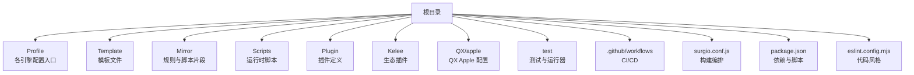
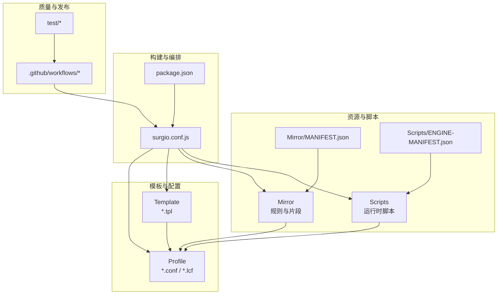
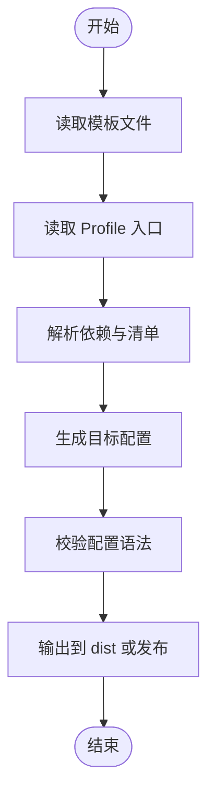
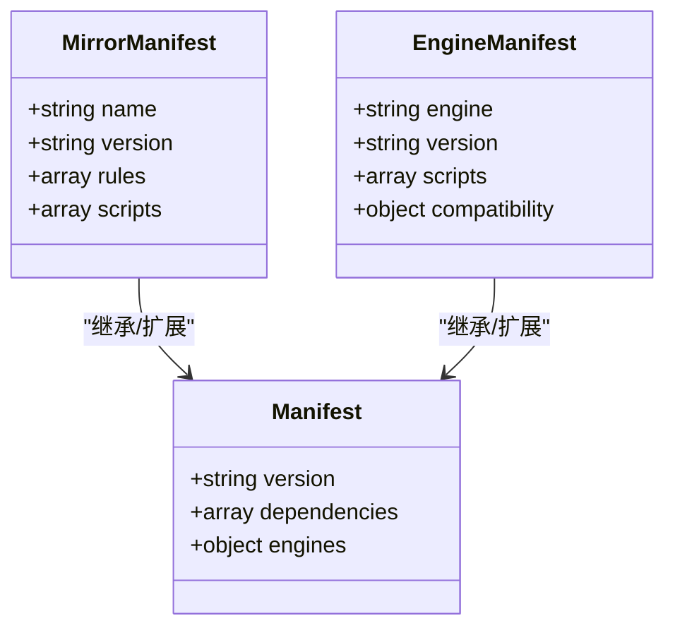
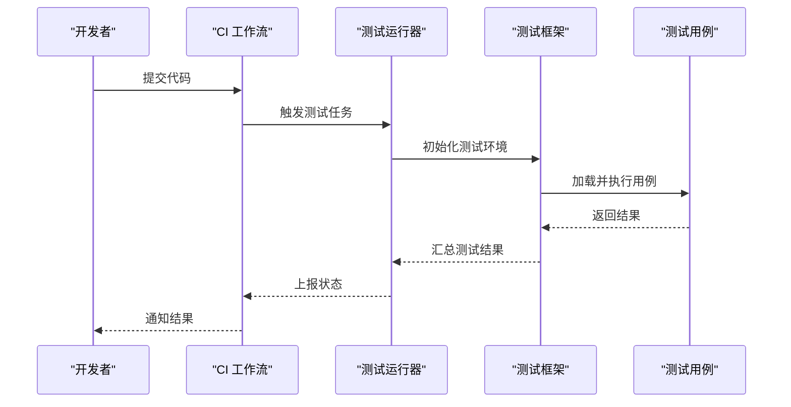
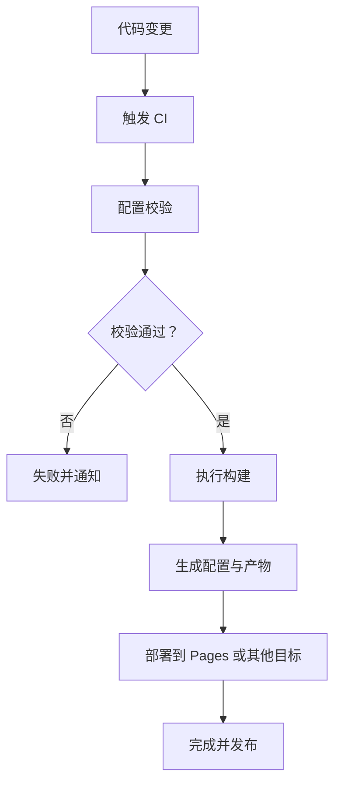
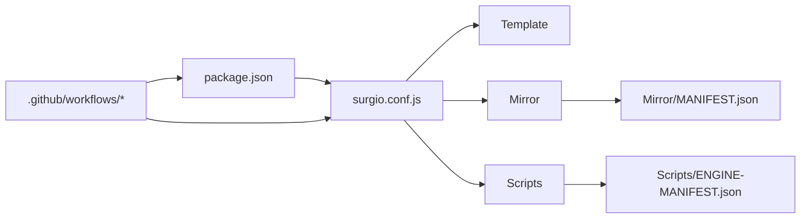

# 实现报告

<cite>
**本文引用的文件**   
- [README.md](file://README.md)
- [package.json](file://package.json)
- [surgio.conf.js](file://surgio.conf.js)
- [eslint.config.mjs](file://eslint.config.mjs)
- [.github/workflows/config-validate.yml](file://.github/workflows/config-validate.yml)
- [.github/workflows/pages-deploy.yml](file://.github/workflows/pages-deploy.yml)
- [.github/workflows/script-tests.yml](file://.github/workflows/script-tests.yml)
- [Mirror/MANIFEST.json](file://Mirror/MANIFEST.json)
- [Scripts/ENGINE-MANIFEST.json](file://Scripts/ENGINE-MANIFEST.json)
- [Profile/Loon.lcf](file://Profile/Loon.lcf)
- [Profile/QX.conf](file://Profile/QX.conf)
- [Profile/Surge.conf](file://Profile/Surge.conf)
- [template/loon.tpl](file://template/loon.tpl)
- [template/quantumultx.tpl](file://template/quantumultx.tpl)
- [template/surge.tpl](file://template/surge.tpl)
- [test/harness.js](file://test/harness.js)
- [test/run-tests.js](file://test/run-tests.js)
</cite>

## 目录
1. [简介](#简介)
2. [项目结构](#项目结构)
3. [核心组件](#核心组件)
4. [架构总览](#架构总览)
5. [详细组件分析](#详细组件分析)
6. [依赖分析](#依赖分析)
7. [性能考虑](#性能考虑)
8. [故障排查指南](#故障排查指南)
9. [结论](#结论)
10. [附录](#附录)

## 简介
本仓库是一个面向网络工具（如 Loon、Quantumult X、Surge）的配置与脚本工程，提供广告拦截、规则集、插件、模板以及自动化测试与部署流水线。其目标是通过统一的模板与清单管理，将多引擎配置与脚本进行集中化维护、校验与发布，确保跨平台一致性与可维护性。

## 项目结构
仓库采用按功能域划分的目录组织方式：
- Profile：各引擎的配置文件入口
- Template：模板文件，用于生成不同引擎的最终配置
- Mirror：镜像资源与规则集、脚本片段
- Scripts：运行时脚本（JS），供各引擎执行
- Plugin：插件定义
- Kelee：特定生态插件
- QX/apple：针对 Quantumult X 的 Apple 相关配置
- test：测试用例与测试运行器
- .github/workflows：CI/CD 工作流
- surgio.conf.js：构建编排配置
- package.json：依赖与脚本命令
- eslint.config.mjs：代码风格检查配置

**图表来源**
- [surgio.conf.js:1-200](file://surgio.conf.js#L1-L200)
- [package.json:1-200](file://package.json#L1-L200)

**章节来源**
- [README.md:1-200](file://README.md#L1-L200)
- [package.json:1-200](file://package.json#L1-L200)

## 核心组件
- 配置模板系统：通过 template 下的模板文件与 Profile 中的入口，结合 surgio 构建流程，生成多引擎最终配置。
- 规则与脚本管理：Mirror 与 Scripts 目录集中管理规则与脚本，并通过清单（MANIFEST）进行版本与依赖声明。
- 测试与质量保障：test 目录包含测试用例与运行器，配合 CI 工作流进行自动化校验。
- 构建与发布：surgio.conf.js 协调构建任务，GitHub Actions 负责验证、测试与部署。

**章节来源**
- [surgio.conf.js:1-200](file://surgio.conf.js#L1-L200)
- [Mirror/MANIFEST.json:1-200](file://Mirror/MANIFEST.json#L1-L200)
- [Scripts/ENGINE-MANIFEST.json:1-200](file://Scripts/ENGINE-MANIFEST.json#L1-L200)
- [test/harness.js:1-200](file://test/harness.js#L1-L200)
- [test/run-tests.js:1-200](file://test/run-tests.js#L1-L200)

## 架构总览
整体架构围绕“模板 + 清单 + 构建编排 + CI/CD”展开：
- 模板层：template/*.tpl 提供通用结构与占位符
- 配置层：Profile/* 作为各引擎的入口，引用模板与规则
- 资源层：Mirror/* 与 Scripts/* 提供规则与脚本，清单文件描述版本与依赖
- 构建层：surgio.conf.js 统一编排构建任务，输出各引擎可用配置
- 质量层：test/* 与 .github/workflows/* 保证变更质量与稳定发布

**图表来源**
- [surgio.conf.js:1-200](file://surgio.conf.js#L1-L200)
- [package.json:1-200](file://package.json#L1-L200)
- [Mirror/MANIFEST.json:1-200](file://Mirror/MANIFEST.json#L1-L200)
- [Scripts/ENGINE-MANIFEST.json:1-200](file://Scripts/ENGINE-MANIFEST.json#L1-L200)

## 详细组件分析

### 模板系统与多引擎配置
- 模板文件（template/*.tpl）定义通用结构、变量与条件块，便于在不同引擎间复用。
- Profile 目录下的入口文件（Loon.lcf、QX.conf、Surge.conf）引用模板与规则，形成最终配置。
- 构建编排（surgio.conf.js）根据模板与 Profile 生成目标配置，并处理依赖与版本。

**图表来源**
- [template/loon.tpl:1-200](file://template/loon.tpl#L1-L200)
- [template/quantumultx.tpl:1-200](file://template/quantumultx.tpl#L1-L200)
- [template/surge.tpl:1-200](file://template/surge.tpl#L1-L200)
- [Profile/Loon.lcf:1-200](file://Profile/Loon.lcf#L1-L200)
- [Profile/QX.conf:1-200](file://Profile/QX.conf#L1-L200)
- [Profile/Surge.conf:1-200](file://Profile/Surge.conf#L1-L200)
- [surgio.conf.js:1-200](file://surgio.conf.js#L1-L200)

**章节来源**
- [template/loon.tpl:1-200](file://template/loon.tpl#L1-L200)
- [template/quantumultx.tpl:1-200](file://template/quantumultx.tpl#L1-L200)
- [template/surge.tpl:1-200](file://template/surge.tpl#L1-L200)
- [Profile/Loon.lcf:1-200](file://Profile/Loon.lcf#L1-L200)
- [Profile/QX.conf:1-200](file://Profile/QX.conf#L1-L200)
- [Profile/Surge.conf:1-200](file://Profile/Surge.conf#L1-L200)
- [surgio.conf.js:1-200](file://surgio.conf.js#L1-L200)

### 规则与脚本管理
- Mirror 目录存放规则与脚本片段，通过 MANIFEST.json 声明版本与依赖关系。
- Scripts 目录存放运行时脚本，ENGINE-MANIFEST.json 描述引擎兼容性与依赖。
- 构建流程会合并规则与脚本，确保一致性。

**图表来源**
- [Mirror/MANIFEST.json:1-200](file://Mirror/MANIFEST.json#L1-L200)
- [Scripts/ENGINE-MANIFEST.json:1-200](file://Scripts/ENGINE-MANIFEST.json#L1-L200)

**章节来源**
- [Mirror/MANIFEST.json:1-200](file://Mirror/MANIFEST.json#L1-L200)
- [Scripts/ENGINE-MANIFEST.json:1-200](file://Scripts/ENGINE-MANIFEST.json#L1-L200)

### 测试与质量保障
- test/harness.js 提供测试框架基础能力。
- test/run-tests.js 编排测试用例执行。
- .github/workflows/script-tests.yml 在 CI 中运行测试，确保脚本质量。

**图表来源**
- [test/harness.js:1-200](file://test/harness.js#L1-L200)
- [test/run-tests.js:1-200](file://test/run-tests.js#L1-L200)
- [.github/workflows/script-tests.yml:1-200](file://.github/workflows/script-tests.yml#L1-L200)

**章节来源**
- [test/harness.js:1-200](file://test/harness.js#L1-L200)
- [test/run-tests.js:1-200](file://test/run-tests.js#L1-L200)
- [.github/workflows/script-tests.yml:1-200](file://.github/workflows/script-tests.yml#L1-L200)

### 构建与发布流水线
- surgio.conf.js 定义构建任务与依赖关系。
- package.json 提供脚本命令与依赖管理。
- .github/workflows/config-validate.yml 与 pages-deploy.yml 分别负责配置校验与页面部署。

**图表来源**
- [surgio.conf.js:1-200](file://surgio.conf.js#L1-L200)
- [package.json:1-200](file://package.json#L1-L200)
- [.github/workflows/config-validate.yml:1-200](file://.github/workflows/config-validate.yml#L1-L200)
- [.github/workflows/pages-deploy.yml:1-200](file://.github/workflows/pages-deploy.yml#L1-L200)

**章节来源**
- [surgio.conf.js:1-200](file://surgio.conf.js#L1-L200)
- [package.json:1-200](file://package.json#L1-L200)
- [.github/workflows/config-validate.yml:1-200](file://.github/workflows/config-validate.yml#L1-L200)
- [.github/workflows/pages-deploy.yml:1-200](file://.github/workflows/pages-deploy.yml#L1-L200)

## 依赖分析
- 构建依赖：surgio 构建工具与 Node.js 生态依赖由 package.json 管理。
- 规则与脚本依赖：通过 MANIFEST 文件声明版本与兼容性。
- CI 依赖：GitHub Actions 工作流依赖仓库内脚本与配置。

**图表来源**
- [package.json:1-200](file://package.json#L1-L200)
- [surgio.conf.js:1-200](file://surgio.conf.js#L1-L200)
- [Mirror/MANIFEST.json:1-200](file://Mirror/MANIFEST.json#L1-L200)
- [Scripts/ENGINE-MANIFEST.json:1-200](file://Scripts/ENGINE-MANIFEST.json#L1-L200)
- [.github/workflows/config-validate.yml:1-200](file://.github/workflows/config-validate.yml#L1-L200)

**章节来源**
- [package.json:1-200](file://package.json#L1-L200)
- [surgio.conf.js:1-200](file://surgio.conf.js#L1-L200)
- [Mirror/MANIFEST.json:1-200](file://Mirror/MANIFEST.json#L1-L200)
- [Scripts/ENGINE-MANIFEST.json:1-200](file://Scripts/ENGINE-MANIFEST.json#L1-L200)

## 性能考虑
- 模板复用：通过模板减少重复配置，提升构建效率。
- 清单驱动：使用 MANIFEST 管理依赖，避免不必要的下载与解析。
- 并行构建：在 CI 中并行执行校验与测试，缩短反馈时间。
- 增量更新：仅对变更部分进行重新构建与部署，降低资源消耗。

[本节为通用指导，不直接分析具体文件]

## 故障排查指南
- 配置校验失败：检查 Profile 与模板语法，确认依赖版本匹配。
- 脚本执行错误：查看 ENGINE-MANIFEST 兼容性声明，确保引擎版本支持。
- 测试失败：定位 test/cases 中的具体用例，检查输入与预期输出。
- 构建失败：核对 surgio.conf.js 任务定义与 package.json 脚本命令。

**章节来源**
- [eslint.config.mjs:1-200](file://eslint.config.mjs#L1-L200)
- [test/harness.js:1-200](file://test/harness.js#L1-L200)
- [test/run-tests.js:1-200](file://test/run-tests.js#L1-L200)

## 结论
本仓库通过模板化配置、清单化管理与自动化流水线，实现了多引擎配置的集中化维护与高质量交付。建议持续优化模板抽象、完善清单依赖声明，并加强测试覆盖率，以提升整体可维护性与稳定性。

[本节为总结性内容，不直接分析具体文件]

## 附录
- 快速开始：安装依赖后运行构建脚本，生成各引擎配置。
- 贡献指南：遵循代码风格与测试要求，提交前本地校验。
- 常见问题：参考故障排查指南与 CI 日志定位问题。

[本节为补充信息，不直接分析具体文件]